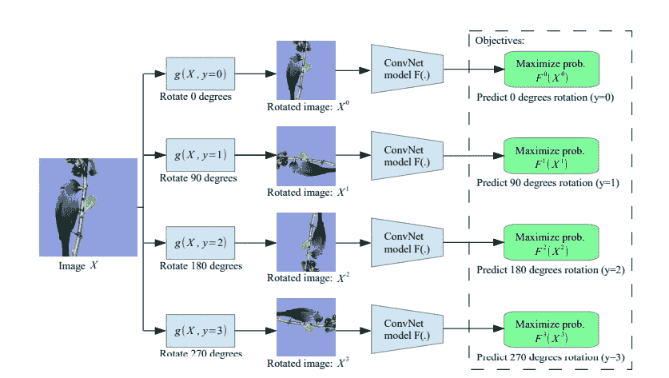
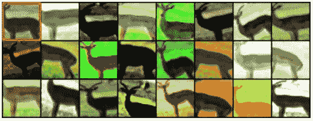
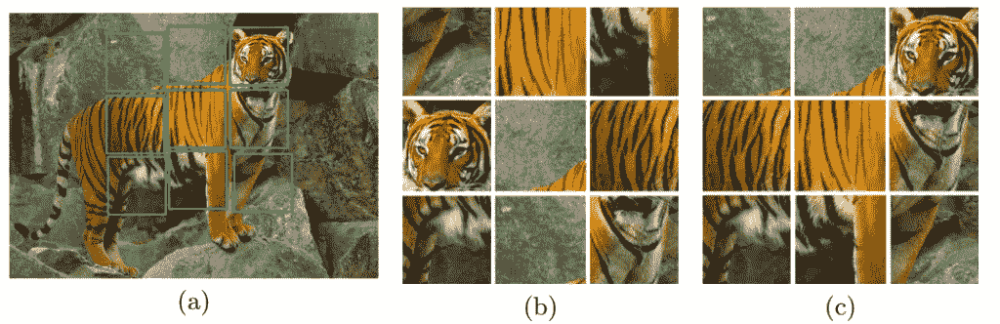
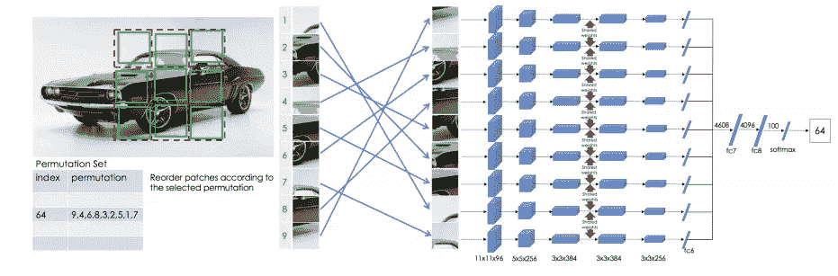
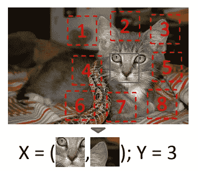

# 自我监督学习

> 原文：<https://medium.com/analytics-vidhya/self-supervised-learning-86b647c67d0a?source=collection_archive---------10----------------------->

我一直在探索自我监督学习，并通过论文和博客来理解它。自我监督学习被认为是深度学习中的下一件大事，为什么不呢！如果有一种方法可以在不提供标签的情况下学习，那么这使我们能够利用大量未标记的数据来完成我们的任务。我将提供我对自我监督学习的理解，并尝试解释一些关于它的论文。

我们已经熟悉了监督学习，其中我们提供特征和标签来训练模型，并且模型使用那些标签来从特征中学习。但是标记数据并不是一件容易的事情，因为它需要更多的时间和人力。每天都有大量的数据生成，并且是未标记的。生成的数据可以是文本、图像、音频或视频的形式。这些数据可以用于不同的目的。但是有一个问题。这些数据不包含标签，很难处理这些种类的数据。自我监督学习来拯救我们了。

# 那么什么是自我监督学习，为什么需要它？

自我监督学习是一种学习框架，它不使用人类标记的数据集来学习数据的视觉表示，也称为表示学习。我们已经熟悉了诸如分类、检测和分割之类的任务，在这些任务中，模型以受监督的方式被训练，该方式随后被用于看不见的数据。这些任务通常针对特定场景进行训练，例如，ImageNet 数据集包含 1000 个类别，并且只能识别这些类别。对于没有包含在 ImageNet 数据集中的类别，需要进行新的注释，这是一项昂贵的任务。自我监督使学习变得容易，因为它只需要未标记的数据来制定学习任务。对于使用未标记数据以自我监督的方式训练模型，需要构建一个监督学习任务(也称为**前文本任务*)。这些文本前任务稍后可用于** *下游*任务，如图像分类、对象检测等等。

**预文本任务:这些是用于预训练的任务
* *下游任务:这些是利用可用于执行诸如图像识别、分割等任务的预训练模型或组件的任务。*

自我监督学习的一般流程
[来源](https://arxiv.org/pdf/1902.06162.pdf)

# 图像的自我监督技术

对于图像的自我监督学习，已经提出了许多想法。更常见的方法或工作流程是使用未标记的数据在一个或多个借口任务中训练模型，并使用该模型执行下游任务。一些提出的图像自监督技术的想法总结如下:

## 旋转

为了通过预测图像旋转来学习表示， [Gidaris 等人](https://arxiv.org/abs/1803.07728)提出了一种架构，其中通过训练卷积网络来识别在馈送到网络之前应用于图像的旋转，从而学习特征。这组几何变换定义了模型必须学习的分类借口任务，该分类借口任务稍后可用于下游任务。进行几何变换，使图像旋转 4 个不同的角度(0°、90°、270°和 360°)。这样，我们的模型必须预测对图像进行的 4 种变换之一。为了预测任务，我们的模型必须理解对象的概念，比如它们的位置、类型和姿态。

为语义特征学习提出的自我监督任务的说明。
给定四种可能的几何变换，即 0 度、90 度、180 度和 270 度旋转，
训练一个 ConvNet 模型来识别应用于它作为输入获得的图像的旋转。
( [来源](https://arxiv.org/pdf/1803.07728.pdf))

更多细节见[通过预测图像旋转的无监督表示学习](https://arxiv.org/pdf/1803.07728.pdf)

## 模范

在 Exemplar-CNN ( [Dosovitskiy 等人，2015](https://arxiv.org/abs/1406.6909) )中，训练一个网络来区分一组代理类。每个代理类都是通过应用随机数据增强来形成的，例如平移、缩放、旋转、对比度和颜色偏移。创建代理培训数据时:

*   从不同位置的不同图像中随机采样 n 个大小为 32×32 像素的小块。由于我们感兴趣的是面片对象或对象的一部分，随机面片只从包含相当大梯度的区域采样。
*   每个面片都应用了各种图像变换。所有产生的变换面片都被认为是在相同的代理类中。

借口任务是区分代理类的集合。

几个随机变换应用于从 STL 未标记数据集中提取的一个
补丁。原来的
补丁在左上角
[来源](https://arxiv.org/pdf/1406.6909)

更多细节请参见[利用样本卷积神经网络进行判别无监督特征学习](https://arxiv.org/pdf/1406.6909.pdf)

## 七巧板

从未标记的数据集学习视觉表示的另一种方法是通过训练 ConvNet 模型来解决拼图游戏，作为以后可以用于下游任务的借口任务。在拼图游戏任务中，模型被训练将 9 个混洗的小块放回原来的位置。为了将混洗的补丁放置到原始位置， [Noroozi 等人](https://arxiv.org/pdf/1603.09246)提出了上下文无关网络(CFN ),它是使用共享权重的连体 CNN。这些面片组合在一个完全连接的层中。

通过解决拼图游戏学习图像表征。
(a)从中提取图块(用绿线标记)的图像。
(b)通过洗牌获得的拼图。
确定中央瓷砖和左起顶部两个瓷砖之间的相对位置非常具有挑战性
[来源](https://arxiv.org/pdf/1603.09246.pdf)

从一组定义的拼图排列中，随机选取一个排列来按照该排列排列这 9 个补丁。这导致 CFN 为每个索引返回一个带有概率值的向量。给定这 9 块瓷砖，将会有 9 块！= 362，880 种可能的排列。这给拼图游戏带来了困难。为了控制这一点，该论文提出根据一组预定义的排列来洗牌，并配置该模型来预测该组中所有索引的概率向量。

上下文无关网络架构
[来源](https://arxiv.org/pdf/1603.09246.pdf)

更多细节请参见[通过解决拼图游戏对视觉表征的无监督学习](https://arxiv.org/pdf/1603.09246.pdf)

## 相对补丁位置

由 [Doersch 等人](https://arxiv.org/pdf/1505.05192)提出的这种方法预测了图像的第二个补片相对于第一个补片的位置。对于这个托词任务，网络被馈入两个输入面片，并通过几个卷积层。网络对八个图像块中的每一个产生一个具有概率的输出。这可以被视为具有 8 个类别的分类问题，其中输入面片被分配给这 8 个类别中的一个，以被认为是输入面片的相对面片。

该算法接收这八个
可能空间排列之一的两个小块，没有任何上下文，然后必须
分类哪个配置被采样
[源](https://arxiv.org/pdf/1505.05192.pdf)

更多细节见[通过上下文预测的无监督视觉表示学习](https://arxiv.org/pdf/1505.05192.pdf)

参考资料:

*   [图文并茂的自我监督学习](https://amitness.com/2020/02/illustrated-self-supervised-learning/)
*   [自我监督学习](https://lilianweng.github.io/lil-log/2019/11/10/self-supervised-learning.html)
*   [深度神经网络自监督视觉特征学习:综述](https://arxiv.org/abs/1902.06162)

*原载于 2020 年 12 月 8 日 https://prabinnepal.com**的* [*。*](https://prabinnepal.com/self-supervised-learning/)