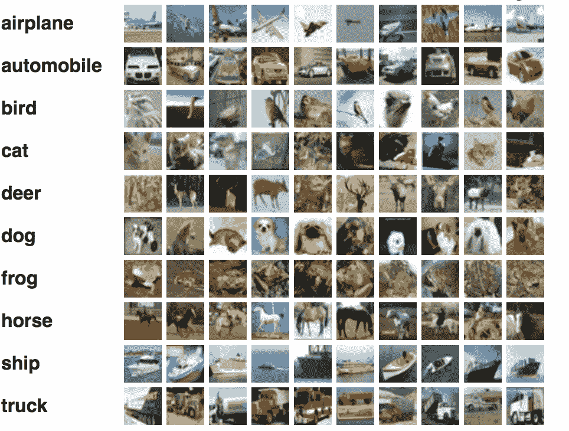

# 用于图像分类的自监督学习。

> 原文：<https://medium.com/analytics-vidhya/self-supervised-learning-for-image-classification-263e320fff07?source=collection_archive---------4----------------------->

Cifar10 示例数据

在这篇文章中，我们探索了将自我监督学习应用于计算机视觉中的图像分类问题的好处。

如果你对什么是自我监督学习没有一个清晰的概念， [**在这里看我对这个概念的简短介绍**](/@larsvagnes/what-is-self-supervised-learning-in-computer-vision-a-simple-introduction-def3302d883d?source=friends_link&sk=443cdeb9aec4bcacf5c6ec7851379eb2) **。**

如果你只是想访问(脏)代码， [**你可以在这里找到 jupyter 笔记本。**](https://github.com/larsh0103/SSL_Experiement/blob/master/SSL_Experiment_CIFAR10.ipynb)