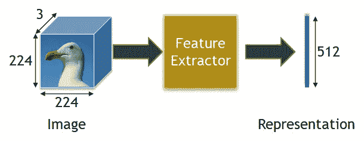
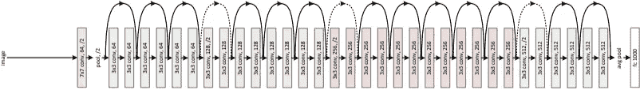
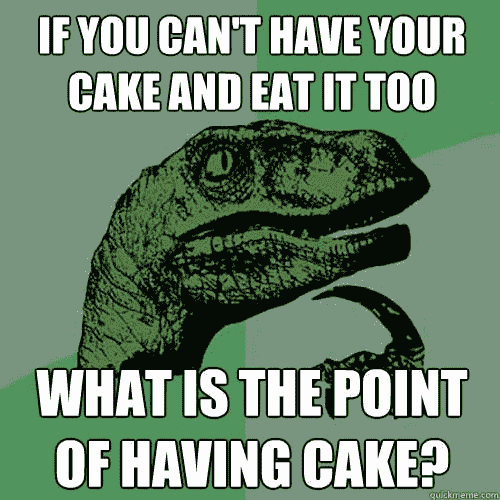
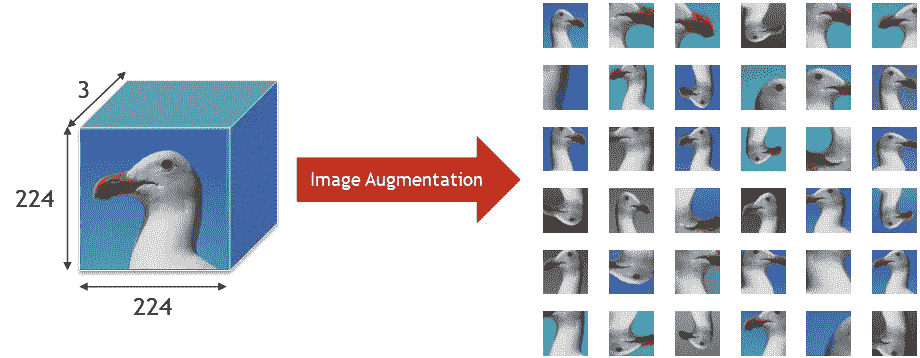

# 计算机视觉中的自我监督表示学习——第一部分

> 原文：<https://medium.com/analytics-vidhya/self-supervised-representation-learning-in-computer-vision-part-1-215af945d23a?source=collection_archive---------13----------------------->

计算机视觉领域(使用深度学习)的任何最新进展都源于半监督学习技术的兴起，这更典型地归因于自然语言处理。

如果你看看过去一年左右表征学习领域的最重要的发展，许多杰出的作品来自于在半监督环境下的表演(MoCo，西姆 CLR v1 & v2，BYOL)。

在这一系列文章中，我将讨论以下主题:

**第一部**

1.  什么是表征学习？
2.  走向自我监督学习

**第二部**

1.  动量对比(MoCo)
2.  视觉表征的对比学习

**第三部分**

1.  大型自我监督模型是强大的半监督学习器(SimCLR v2)
2.  引导你自己的潜能(BYOL)

第一篇文章将是自我监督表示学习的一般介绍，后续文章将集中在执行半监督学习的 SotA 方法上。

# **表象学习:**

**表示:**输入图像(224×224×3)通过特征提取器(通常是经过训练的 CNN 网络),该特征提取器将图像的空间特征非线性地变换到 512 维的向量空间。

**计算机视觉中的表示**是从原始数据中提取的特征。特征提取包括将原始数据(通常具有较大维度)处理到向量空间(具有较低维度)，捕获代表数据的潜在时空信息**。历史上，系统使用一系列手工设计的过滤器来提取这些信息。**

R 这通常包括训练一个卷积神经网络(CNN ),让*学习*,以发现符号化数据中隐藏表示的最佳方式。

表征学习的经典范式被归入迁移学习方法的一部分。**迁移学习**是一个过程，在这个过程中，一个模型在一个任务上被训练，然后通过一些额外的训练，被重新用于另一个任务。

假设我们想要在由 20 个不同类组成的特定数据集上执行图像分类(其中每个类代表一种不同的汽车)。迁移学习的经典方法包括:

1.  **预培训**

在包含大量标签和各种类的大型数据集上训练一个卷积神经网络(比如 ResNet-50)。ImageNet(由跨越 1000 个类别的 120 万幅图像组成)通常被用作执行预训练的标准。

这通常是表示学习发生的地方，因为 CNN 层学习理解将原始输入转换到低维向量空间的最佳方式。然后，学习到的表示被传递到(一个或多个)完全连接的层上，通常以 Softmax(预测类别标签)结束。梯度下降的魔力允许 CNN 学习分类这个大数据集的任务的最佳表示。

34 层剩余网络。[来源](https://arxiv.org/abs/1512.03385)

2.**微调**

这一阶段包括通过使用感兴趣的数据集重新训练 CNN，使用学习到的表示来执行*任务特定的适应*。在我们的特殊情况下，这将是包含 20 种不同类别汽车的数据集。

通过移除表示层之后的最终层(来自 CNN 的最后一层的输出)，将一组新的层附加到该基础网络，并在当前数据集上重新训练，对所学习的表示进行微调以适应特定任务。

自 [Krizhevsky，Alex 等人(2012)](https://papers.nips.cc/paper/4824-imagenet-classification-with-deep-convolutional-neural-networks.pdf) 以来，这种范式已被用于实现几乎所有计算机视觉任务的 SotA 结果。

# **自我监督学习:**

大多数基于 CNN 的计算机视觉目标(以及一般的深度学习)面临的一个主要问题是它们的数据效率极低。你经常需要大量的**标签数据**来获得好的结果。在许多情况下，大量的标记会很麻烦，因此迁移学习被用作克服这一点的解决方案。

强制性模因。

**但是，如果有一种更有效的方法来解决没有大型标签数据存储库的问题呢？**

如果有办法:

1.有大量的**未标记图像**可用于学习隐藏表示

2.然后可以在一个更小的带标签的数据集上进行微调。

这将**在很大程度上缓解数据低效**，因为没有为学习特定任务而标记大量数据的开销。

**自我监督学习**背后的想法来自 NLP 的世界，在那里一个**大型无标签语料库**被用来识别该语言所有标记的潜在表示(通过**表示学习**)。这就产生了所谓的“语言模型”。*任务特定的训练*然后用**标记的数据集完成(使用语言模型作为基本特征提取器)。**这通常比用于学习语言模型的语料库小得多，并且用于生成特定于任务的结果(如情感分析等)。).

> 我们是否可以为视觉数据创建“语言模型”的解决方案在于我们如何人为增加计算机视觉中迁移学习的经典范式的训练集— **图像增强**。

# **图像增强**

使用 PyTorch 转换器的一系列图像转换的输出给了我这些增强的图像。这通常是用于训练任何图像分类器的标准流水线的一部分。

通过执行一种或多种图像处理技术，例如随机移位、旋转、随机剪辑、移位、剪切、颜色抖动、高斯模糊等，图像增强通常被用作数据集增强的人工形式。

它主要有两个功能:

1.  增加训练数据集的大小，而无需收集和标记更多数据
2.  通过对同一图像执行一系列不同的变换以给出不同的“视角”,减少了训练偏差并增加了数据集中的可变性。

在自我监督学习中，我们利用图像增强引入数据集的“可变性”。基本思想是来自同一图像的两个增强应该具有相似的特征表示，来自两个不同图像的增强应该具有不相似的特征表示。

> 你几乎可以直观地认为，这是试图训练一个系统，其中来自同一图像的增强的特征表示相互“吸引”,来自不同图像的增强的特征表示相互“排斥”。

因此，你可以想象，这个问题定义的损失函数将包含某些相似性的最小化(也可能是其他相似性的最大化)。但是我们将把这方面的细节留给后续的文章。

本系列的下一部分将讨论允许我们执行自我监督学习的特定架构和设计。

希望这篇文章有所帮助！

如果你在这篇文章中注意到任何问题/错误，请随时在 Twitter 上联系我，我会做出必要的更正。欢迎大家提出建议！