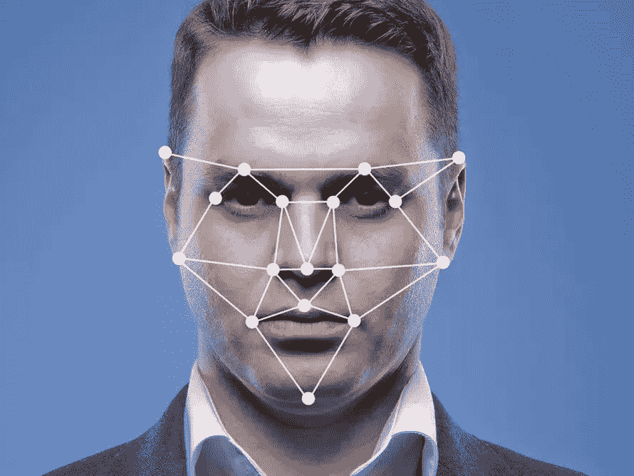

# 使用面部地标检测的自拍过滤器

> 原文：<https://medium.com/analytics-vidhya/selfie-filter-using-face-land-mark-detection-54dc43499c61?source=collection_archive---------12----------------------->



面部标志

本文的目的是通过检测人的面部痕迹，在网络摄像头馈送中显示一副太阳镜作为自拍滤镜。

对于面部陆地标记检测，我们将使用来自 *Kaggle* 站点的标记的面部陆地标记数据集([https://www . ka ggle . com/drgilermo/face-images-with-marked-landmark-points](https://www.kaggle.com/drgilermo/face-images-with-marked-landmark-points))。然后会训练一个卷积神经网络(CNN)来识别人脸陆标。当网络摄像机输入开始时，OpenCV 的 Haar 分类器将用于检测人脸。然后，对于所有的脸，我们将运行我们的 CNN 来检测这些脸的痕迹。检测后，我们将调整我们的过滤器，以适应我们的脸的大小。然后将人脸图像像素值替换为滤波图像像素值，得到最终结果。

让我们导入库。

```
%matplotlib inline
import numpy as np 
import pandas as pd
import matplotlib.pyplot as plt
```

数据都在*里。npz* 文件格式。NPZ 文件格式是一个类似字典的压缩存档对象。

```
data = np.load('face_images.npz')['face_images']
print(data.shape)## (96, 96, 7049)
```

应该改变数据的形状，以便可以用于训练神经网络。为此，我们移动轴。在 *np.moveaxis，*第一个参数是矩阵，第二个参数是源，最终轴(-1)和目的，第一个轴(0)。其他轴保持原来的顺序。

```
x = np.moveaxis(data, -1, 0)
print(x.shape)##(7049, 96, 96)
```

# 组织 X 和 Y 数据

照片的面部标志在'*face _ key points . CSV*'文件中。熊猫图书馆是用来打开 csv 文件。

```
ys = pd.read_csv('facial_keypoints.csv')
ys_cols = ys.columns.tolist()
print(ys_cols)##['left_eye_center_x', 'left_eye_center_y', 'right_eye_center_x', 'right_eye_center_y', 'left_eye_inner_corner_x', 'left_eye_inner_corner_y', 'left_eye_outer_corner_x', 'left_eye_outer_corner_y', 'right_eye_inner_corner_x', 'right_eye_inner_corner_y', 'right_eye_outer_corner_x', 'right_eye_outer_corner_y', 'left_eyebrow_inner_end_x', 'left_eyebrow_inner_end_y', 'left_eyebrow_outer_end_x', 'left_eyebrow_outer_end_y', 'right_eyebrow_inner_end_x', 'right_eyebrow_inner_end_y', 'right_eyebrow_outer_end_x', 'right_eyebrow_outer_end_y', 'nose_tip_x', 'nose_tip_y', 'mouth_left_corner_x', 'mouth_left_corner_y', 'mouth_right_corner_x', 'mouth_right_corner_y', 'mouth_center_top_lip_x', 'mouth_center_top_lip_y', 'mouth_center_bottom_lip_x', 'mouth_center_bottom_lip_y']
```

总共给出了 15 个标志点的 *x，y* 值。但是没有包括所有的点，这意味着存在一些 *NaN* 值。

```
print(ys.isnull().sum())##left_eye_center_x              10
left_eye_center_y              10
right_eye_center_x             13
right_eye_center_y             13
left_eye_inner_corner_x      4778
left_eye_inner_corner_y      4778
left_eye_outer_corner_x      4782
left_eye_outer_corner_y      4782
right_eye_inner_corner_x     4781
right_eye_inner_corner_y     4781
right_eye_outer_corner_x     4781
right_eye_outer_corner_y     4781
left_eyebrow_inner_end_x     4779
left_eyebrow_inner_end_y     4779
left_eyebrow_outer_end_x     4824
left_eyebrow_outer_end_y     4824
right_eyebrow_inner_end_x    4779
right_eyebrow_inner_end_y    4779
right_eyebrow_outer_end_x    4813
right_eyebrow_outer_end_y    4813
nose_tip_x                      0
nose_tip_y                      0
mouth_left_corner_x          4780
mouth_left_corner_y          4780
mouth_right_corner_x         4779
mouth_right_corner_y         4779
mouth_center_top_lip_x       4774
mouth_center_top_lip_y       4774
mouth_center_bottom_lip_x      33
mouth_center_bottom_lip_y      33
dtype: int64
```

但是对于我们的应用程序，我们只使用*左眼中心、右眼中心、鼻尖和嘴中心下唇*。因此，我们只从 csv 文件中提取那些没有这些特性的任何 *NaN* 值的列。

```
y_pro = np.nonzero(ys.left_eye_center_x.notna() &     ys.right_eye_center_x.notna() & ys.nose_tip_x.notna() & ys.mouth_center_bottom_lip_x.notna())[0]print(y_pro.shape)##(7000,)m = y_pro.shape[0]
size = x.shape[1]
print(m, size)##7000 96
```

*m* 表示图像的数量，*尺寸*表示图像一边的像素。

## x 和 Y

*X* 的形状应该是*(照片数量，照片大小，照片大小，1)* ，因为所有照片都是 1 通道图像。 *Y* 的形状应为*(照片数，特征数)*。因为我们选择了 4 个地标，所以我们有 8 个特征来描述图像的 *(x，y)* 位置。

```
X = np.zeros((m, size, size, 1))
Y = np.zeros((m, 8))
```

我们只是用 *ys* 中非零值的照片填充 *X* 。为了标准化，所有值都除以 255.0。 *Y* is 值除以图像的大小，这样每个值都将在 0 和 1 之间。

```
X[:,:,:,0] = x[y_pro, :, :] / 255.0Y[:, 0] = ys.left_eye_center_x[y_pro] / size
Y[:, 1] = ys.left_eye_center_y[y_pro] / size
Y[:, 2] = ys.right_eye_center_x[y_pro] / size
Y[:, 3] = ys.right_eye_center_y[y_pro] / size
Y[:, 4] = ys.nose_tip_x[y_pro] / size
Y[:, 5] = ys.nose_tip_y[y_pro] / size
Y[:, 6] = ys.mouth_center_bottom_lip_x[y_pro] / size
Y[:, 7] = ys.mouth_center_bottom_lip_y[y_pro] / size
```

## 分割数据集

为了模型验证的目的，x 和 Y 被分开以训练和测试数据集。使用训练集和测试集的精度值，我们可以确定欠拟合或过拟合问题。

```
from sklearn.model_selection import train_test_split
X_train, X_test, y_train, y_test = train_test_split(X, Y, test_size=0.2)
print(X_train.shape, X_test.shape, y_train.shape, y_test.shape)##(5600, 96, 96, 1) (1400, 96, 96, 1) (5600, 8) (1400, 8)
```

# 创建 CNN 模型和培训

对于模型构建和训练，我们可以使用 Keras。

```
from keras import layersfrom keras.layers import Input, Dense, Activation, ZeroPadding2D,  BatchNormalization, Flatten, Conv2Dfrom keras.layers import AveragePooling2D, MaxPooling2D, Dropout, GlobalMaxPooling2D, GlobalAveragePooling2Dfrom keras.models import Model
```

请参考以下 [*链接*](https://keras.io/layers/core/) 了解更多关于 keras 图层的信息

这是我们的 CNN 模型，下面列出了一些重要的事实。

*   使用 Keras functional API 建立模型，使用输入和输出张量。
*   脱落层被用来减少过度拟合的机会。
*   展平图层用于将矩阵转换为展平的特征集。
*   由于所有的 *(x，y)* 值都在 0 和 1 之间，所以使用 sigmoid 作为最后一层的激活函数。

```
def facemodel(input_shape): X_input = Input(input_shape)

    X = Conv2D(32, (3, 3), strides = (1, 1), name = 'conv0')(X_input)
    X = BatchNormalization(axis = 3, name = 'bn0')(X)
    X = Activation('relu')(X)

    X = MaxPooling2D((2, 2), name = 'max_pool')(X)
    X = Dropout(0.25)(X)

    X = Conv2D(32, (3, 3), strides = (1, 1), name = 'conv1')(X)
    X = BatchNormalization(axis = 3, name = 'bn1')(X)
    X = Activation('relu')(X)

    X = MaxPooling2D((2, 2), name = 'max_pool1')(X)
    X = Dropout(0.25)(X)

    X = Flatten()(X)
    X = Dense(256, activation = 'tanh', name = 'fc')(X)
    X = Dropout(0.5)(X)

    X = Dense(8, activation = 'sigmoid', name = 'fc1')(X)

    model = Model(inputs = X_input, outputs = X, name = 'facemodel')

    return model
```

对于模型，应提供合适的输入张量。

```
faceModel = facemodel((96, 96, 1))
```

使用 [*Adam*](https://keras.io/optimizers/) 优化器编译模型。 [*使用均方误差*](https://keras.io/losses/) 是因为我们在处理 *(x，y)* 的连续值。我们试图在每次迭代中减少预测值 *(x，y)* 和实际值 *(x，y)* 之间的差异。

```
faceModel.compile(optimizer = “adam”, loss = ‘mean_squared_error’, metrics = [‘accuracy’])
```

然后使用 *X_train* 和 *y_train* 对模型进行训练。Epochs 表示模型在整个数据集中训练的次数。批次大小表示在更新模型参数之前一次发送的图像数量。

```
faceModel.fit(x = X_train, y = y_train, epochs = 3, batch_size = 32)##WARNING:tensorflow:From D:\anaconda\lib\site-packages\tensorflow\python\ops\math_ops.py:3066: to_int32 (from tensorflow.python.ops.math_ops) is deprecated and will be removed in a future version.
Instructions for updating:
Use tf.cast instead.
Epoch 1/3
5600/5600 [==============================] - 101s 18ms/step - loss: 0.0581 - acc: 0.0805
Epoch 2/3
5600/5600 [==============================] - 97s 17ms/step - loss: 0.0254 - acc: 0.6721
Epoch 3/3
5600/5600 [==============================] - 93s 17ms/step - loss: 0.0086 - acc: 0.8377<keras.callbacks.History at 0x24c50562eb8>
```

由于精度不够，让我们再次训练模型。

```
faceModel.fit(x = X_train, y = y_train, epochs = 3, batch_size = 32)##Epoch 1/3
5600/5600 [==============================] - 89s 16ms/step - loss: 0.0029 - acc: 0.9746
Epoch 2/3
5600/5600 [==============================] - 92s 16ms/step - loss: 0.0021 - acc: 0.9921
Epoch 3/3
5600/5600 [==============================] - 90s 16ms/step - loss: 0.0020 - acc: 0.9923<keras.callbacks.History at 0x24c525cc358>
```

我们的训练集精度是 0.9923。但是实际的准确性是使用测试集图像获得的。

```
preds = faceModel.evaluate(x = X_test, y = y_test)print()
print("Loss = " + str(preds[0]))
print("Test Accuracy = " + str(preds[1]))##1400/1400 [==============================] - 14s 10ms/step

Loss = 0.0018785889100815568
Test Accuracy = 0.9928571425165449
```

我们的测试集精度是 0.9928。因为两者的精确度都很高，所以这种模式是合适的。由于测试集精度和训练集精度之间的差异非常小，因此该模型也不会过度拟合。

现在我们必须保存模型以备将来使用。

```
import osfaceModel.save_weights('weights.h5', overwrite = True)
open('architecture.json', 'w').write(faceModel.to_json())##5453
```

程序的第一部分已经完成。

# 添加自拍滤镜

让我们从加载保存的模型开始。

```
import os
%matplotlib inline
import numpy as np
import pandas as pd
import matplotlib.pyplot as plt
from keras.models import model_from_jsonmodel = model_from_json(open('architecture.json').read())
model.load_weights('weights.h5')
```

现在，我们必须检测网络摄像头馈送中的人脸。为此，我们可以使用 Haar Classifer。

> 它们就像我们的卷积核。每个特征是通过从黑色矩形下的像素总和中减去白色矩形下的像素总和而获得的单个值。

更多信息请访问链接。

在这里，我们使用*Haar scade _ frontal face _ default . XML*来检测人脸。 [*下载*](https://github.com/opencv/opencv/blob/master/data/haarcascades/haarcascade_frontalface_default.xml) 该文件并保存在*【Haar】*文件夹中。

```
face_cascade = cv2.CascadeClassifier('haar/haarcascade_frontalface_default.xml')
```

然后应该读取用于过滤器的 [*png*](https://github.com/bimsarapathiraja/Selfie-filter-using-face-landmark-detection/tree/master/images) 图像。cv2。IMREAD_UNCHANGED 用于读取 png 文件，因为 *png* 文件有四个通道，其中第四个通道用于透明。

```
sunglasses = cv2.imread(‘images/sunglasses.png’, cv2.IMREAD_UNCHANGED)
```

视频捕捉是通过创建*视频捕捉*对象来完成的。

```
camera = cv2.VideoCapture(0)
```

下面的代码块完成了添加过滤器的全部工作。

```
while True:

    (grabbed, frame) = camera.read()
    frame = cv2.flip(frame, 1)
    frame2 = np.copy(frame) gray = cv2.cvtColor(frame, cv2.COLOR_BGR2GRAY) faces = face_cascade.detectMultiScale(gray, 1.25, 6) for (x, y, w, h) in faces: gray_face = gray[y : y+h, x : x+w]
        color_face = frame[y : y+h, x : x+w] gray_norm = gray_face / 255 original_shape = gray_face.shape
        face_resized = cv2.resize(gray_norm, (96, 96), interpolation =               cv2.INTER_AREA)
        face_resized_copy = face_resized.copy()
        face_resized = face_resized.reshape(1, 96, 96, 1) keypoints = model.predict(face_resized)
        #print(keypoints) keypoints = keypoints * 96 face_resized_color = cv2.resize(color_face, (96, 96), interpolation = cv2.INTER_AREA)
        face_resized_color2 = np.copy(face_resized_color) points = keypoints[0] sunglass_width = int((points[0] - points[2]) * 1.9)
        sunglass_height = int((points[5] - points[1]) * 1.5) a = int(points[2]) - int(sunglass_height / 2)
        b = int(points[2]) + sunglass_height - int(sunglass_height / 2)
        c = int(points[2]) #+ int(sunglass_width / 5)
        d = int(points[2]) + sunglass_width #+ int(sunglass_width / 5) sunglass_resized = cv2.resize(sunglasses, (sunglass_width,     sunglass_height), interpolation = cv2.INTER_CUBIC)
        transparent_region = sunglass_resized[:,:,:3] != 0 face_resized_color[a : b, c : d, :][transparent_region] =  sunglass_resized[:,:,:3][transparent_region] frame[y:y+h, x:x+w] = cv2.resize(face_resized_color, original_shape, interpolation = cv2.INTER_CUBIC) for i in range(0, len(points), 2):
            cv2.circle(face_resized_color2, (points[i], points[i+1]), 1, (0, 255, 0), 1) frame2[y:y+h, x:x+w] = cv2.resize(face_resized_color2, original_shape, interpolation = cv2.INTER_CUBIC)

        cv2.imshow("Selfie filters", frame)
        cv2.imshow("keypoints", frame2)

    if cv2.waitKey(1) & 0xFF == ord('q'):
        break

camera.release()
cv2.destroyAllWindows()
```

让我们深入研究代码。

*   为了连续运行代码，使用`while True`
*   使用`camera.read()`线存储图像或帧。
*   网络摄像机图像不是镜像图像。为了让它像镜子一样，我们必须翻转框架

`frame = cv2.flip(frame, 1)`

*   由于我们所有的训练图像都是单通道图像，我们必须将帧转换为灰度图像。

`gray = cv2.cvtColor(frame, cv2.COLOR_BGR2GRAY)`

*   现在，我们可以使用之前加载的 haar 分类器进行人脸识别。detectMultiScale 用于检测不同大小的不同人脸。它以矩形坐标的形式返回结果。

`faces = face_cascade.detectMultiScale(gray, 1.25, 6)`

*   faces 的一个元素是显示包含面 *(x，y，w，h)* 的矩形的坐标。 *x* 和 *y* 是矩形左上角的 *(x，y)* 坐标。 *w* 是矩形的相对宽度。 *h* 是矩形的高度。现在我们可以从帧中只提取面部矩形。

```
gray_face = gray[y : y+h, x : x+w]
color_face = frame[y : y+h, x : x+w]
```

*   像在模型训练步骤中一样，图像像素值被归一化。

```
gray_norm = gray_face / 255
```

*   接下来，灰度图像被调整到训练图像的大小。之后，图像被转换为首选输入类型。

```
face_resized = cv2.resize(gray_norm, (96, 96), interpolation = cv2.INTER_AREA)
face_resized = face_resized.reshape(1, 96, 96, 1)
```

*   现在 *face_resized* 已经准备好输入到模型中。预测将被保存为*关键点*。

```
keypoints = model.predict(face_resized)
```

*   由于面部标志是在除以图像大小后给出的，现在我们必须乘以它才能得到图像的真实坐标值。

```
keypoints = keypoints * 96
```

*   对于应用程序，我们必须将滤镜添加到彩色图像中。因此，我们必须调整彩色图像的大小来处理给定的关键点。

```
face_resized_color = cv2.resize(color_face, (96, 96), interpolation = cv2.INTER_AREA)
```

*   因为关键点是一个列表中的一个列表，所以点被定义来获得面部标志的列表。`points = keypoints[0]`
*   最精彩的部分来了。现在，我们必须根据面部标志的大小来调整过滤器的大小。宽度为*(左眼中心到右眼中心的 x 距离)* 1.9* ，高度为*(左眼中心到鼻尖的 y 距离)* 1.5* 。无论如何，如果这些值没有超出帧边界，这些值和距离分配方法可以被改变。

```
sunglass_width = int((points[0] - points[2]) * 1.9)
sunglass_height = int((points[5] - points[1]) * 1.5)sunglass_resized = cv2.resize(sunglasses, (sunglass_width, sunglass_height), interpolation = cv2.INTER_CUBIC)
```

*   在调整大小的太阳镜图像中，我们必须忽略透明像素区域。

```
transparent_region = sunglass_resized[:,:,:3] != 0
```

*   现在，我们必须定义一个与调整后的太阳镜图像大小相同的区域来替换不透明区域的像素值。

```
a = int(points[2]) - int(sunglass_height / 2)
b = int(points[2]) + sunglass_height - int(sunglass_height / 2)
c = int(points[2]) 
d = int(points[2]) + sunglass_widthface_resized_color[a : b, c : d, :][transparent_region] =  sunglass_resized[:,:,:3][transparent_region]
```

*   现在我们可以调整框架的大小到它的原始形状

```
frame[y:y+h, x:x+w] = cv2.resize(face_resized_color, original_shape, interpolation = cv2.INTER_CUBIC)
```

*   下面的块用于在另一个窗口中圈出面部标志。

```
for i in range(0, len(points), 2):
            cv2.circle(face_resized_color2, (points[i], points[i+1]), 1,   (0, 255, 0), 1)
```

*   现在，我们可以使用过滤器添加的框架来替换原始网络摄像机框架的面部矩形。

```
frame2[y:y+h, x:x+w] = cv2.resize(face_resized_color2, original_shape, interpolation = cv2.INTER_CUBIC)
```

*   使用 cv2.imshow 函数显示窗口。

```
cv2.imshow("Selfie filters", frame)
cv2.imshow("keypoints", frame2)
```

*   要中断 while 循环，可按下 *q* 。

```
if cv2.waitKey(1) & 0xFF == ord('q'):
        break
```

*   最后，我们不得不释放摄像机并关闭所有窗口。释放相机是重新运行代码的必要条件。

```
camera.release()
cv2.destroyAllWindows()
```

您可以使用更多的界标，并使用这些界标来显示更多的过滤器。

致谢:

*   [https://www . ka ggle . com/richardarendsen/face-landmarks-with-CNN](https://www.kaggle.com/richardarendsen/face-landmarks-with-cnn)
*   [https://towards data science . com/face-key points-detection-deep-learning-737547 f 73515](https://towardsdatascience.com/facial-keypoints-detection-deep-learning-737547f73515)