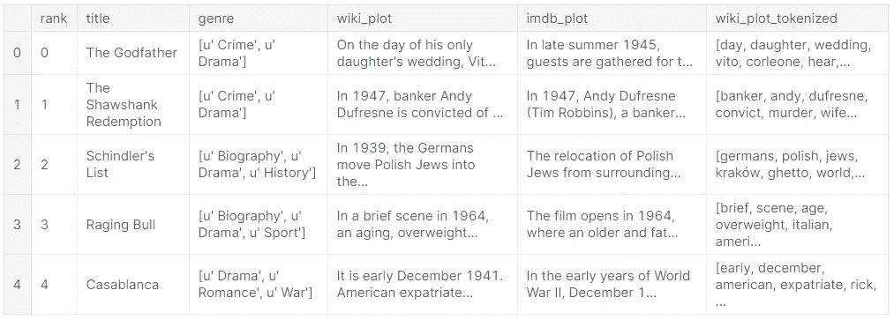

# 使用自然语言处理的语义搜索

> 原文：<https://medium.com/analytics-vidhya/semantic-search-engine-using-nlp-cec19e8cfa7e?source=collection_archive---------1----------------------->

## 使用搜索查询的语义理解构建智能搜索引擎的入门指南


# 介绍

搜索引擎已经伴随我们几十年了，成为我们数字生活不可或缺的一部分。我们随意搜索数十亿个网页，从各种资源中检索和分享信息。虽然人类非常擅长对话上下文和背景知识，这有助于他们处理单词的内在歧义，但在搜索引擎的情况下可能不是这样，特别是当涉及到*超出词汇表*的搜索时

这个问题的答案是 ***语义*** 搜索。使用来自 NLP 研究的最新见解，可以在大型文档语料库上训练语言模型。然后，该模型能够基于文档的"*语义"*内容来表示文档。特别是，这包括搜索具有语义相似内容的文档的可能性。

> 根据数据科学[的说法，语义搜索意味着理解查询背后的意图，并“以一种适合有意义检索的方式来表示知识”。](https://towardsdatascience.com/semantic-search-73fa1177548f)

在这项工作中，我们将使用基于自然语言处理(NLP)概念的语义搜索来检索相关的电影标题

对于那些想直接跳到代码的人，这里有我的 Kaggle 笔记本的链接。

[](https://www.kaggle.com/ajitrajput/semantic-search-engine-using-nlp) [## 使用自然语言处理的语义搜索引擎

### 使用 Kaggle 笔记本探索和运行机器学习代码|使用来自电影相似性的数据

www.kaggle.com](https://www.kaggle.com/ajitrajput/semantic-search-engine-using-nlp) 

## 关键词搜索与语义搜索

起初，搜索引擎是词汇性的:搜索引擎寻找查询词的文字匹配，不理解查询的含义，只返回包含精确查询的链接。通过使用常规关键字搜索，文档要么包含给定的单词，要么不包含，没有中间地带

另一方面，“语义搜索”可以简化查询构建，因为它由自动自然语言处理程序支持，即使用潜在语义索引，这是搜索引擎用来发现关键字和内容如何共同表示同一事物的概念。

> 根据维基百科，
> 
> LSA(潜在语义分析)也称为 LSI(潜在语义索引)LSA 是自然语言处理中的一种技术，通过产生一组与文档和术语相关的概念来分析一组文档和它们包含的术语之间的关系。LSI 是基于这样一个原则，即在相同的上下文中使用的单词往往有相似的意思。LSI 的一个关键特性是它能够通过在相似上下文中出现的术语之间建立关联来提取文本主体的概念内容。

LSI 为文档索引过程增加了重要的一步。LSI 检查一组文档，看哪些文档包含一些相同的单词。LSI 认为有许多共同单词的文档在语义上是接近的，而那些有较少共同单词的文档则不太接近。

简而言之，LSI 不需要精确匹配来返回有用的结果。如果没有精确匹配，简单的关键字搜索就会失败，LSI 通常会返回根本不包含关键字的相关文档。

## 加载数据

我们现在将电影数据 csv 加载到 dataframe 中，并快速查看所提供的列和数据


## 数据清理和预处理

数据预处理是文本分析中最重要的步骤之一。这样做的目的是删除任何不需要的单词或字符，这些单词或字符是为了便于阅读而编写的，但无论如何不会对主题建模有所贡献。

以下函数应用正则表达式来匹配不需要的文本模式，并删除/替换它们。

现在让我们将数据清理和预处理功能应用到我们的 movies“wiki _ plot”列，并将清理后的、标记化的数据存储到新列中



## 构建单词词典

在下一步中，我们将构建语料库的词汇，其中所有唯一的单词都被赋予 id，并且它们的频数也被存储。您可能会注意到，我们使用 gensim 库来构建字典。在 gensim 中，单词被称为“令牌”,字典中每个单词的索引被称为 ID

您可以看到，在创建字典之后还执行了 2 个额外的步骤。

1.  字典中出现在少于 4 篇文章中或者出现在多于 20%的文章中的所有单词都从字典中移除，因为这些单词不会对各种主题或话题有所贡献。
2.  从词典中删除内容中性词和附加停用词。

## 特征提取(单词袋)

一袋单词模型，简称 BoW，是一种从文本中提取特征用于建模的方法，例如使用机器学习算法。它是描述单词在文档中出现次数的 tet 的表示。它涉及两件事

1.  已知单词的词汇表
2.  已知单词存在的一种度量

dictionary 的 doc2bow 方法遍历文本中的所有单词，如果该单词已经存在于语料库中，则它递增频率计数，否则它将该单词插入到语料库中，并将其频率计数设置为 1

## 建立 Tf-Idf 和 LSI 模型

Tf-Idf 的意思是，词频-逆文档频率。它是一个常用的 NLP 模型，可以帮助您确定语料库中每个文档中最重要的单词。一旦构建了 Tf-Idf，就将其传递给 LSI 模型，并指定要构建的特性数量

## 语义搜索时间到了

现在有趣的部分来了。随着电影索引的初始化和加载，我们可以使用它来查找相似的电影

我们将输入一个搜索查询，模型将返回相关的电影标题与“相关性%”，这是相似性得分。相似性得分越高，查询与给定索引处的文档越相似

下面是搜索索引、排序和返回结果的帮助函数

```
*# search for movie tiles that are related to below search parameters*
search_similar_movies('crime and drugs ')
```


该模型返回具有“相关性%”的电影标题。毫无疑问，最受欢迎的电影与犯罪和毒品有关。

```
*# search for movie tiles that are related to below search parameters*
search_similar_movies('violence protest march')
```


这里最热门的电影名“甘地”肯定与非暴力抗议有关

## 结束语

一般来说，计算文本数据之间的语义关系能够推荐与给定查询相关的文章或产品，跟踪趋势，更详细地探索特定主题。

在本文中，我们看到了如何实现语义搜索的基本版本。有许多方法可以使用更新的深度学习模型来进一步增强它。

这只是试图展示我在 NLP 和机器学习领域的学习历程。欢迎您的宝贵反馈、意见和建议！

希望大家都喜欢，投上一票。