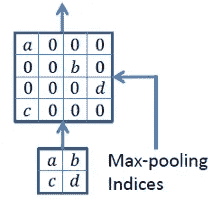

# 语义分割

> 原文：<https://medium.com/analytics-vidhya/semantic-segmentation-420b9671f28b?source=collection_archive---------10----------------------->

什么是语义切分？给图像中的每一个像素分配一个唯一的标签(或类别)的任务，这可以被认为是一个密集分类问题。

语义分割的应用:

-自动驾驶
-医学影像分析

# 通用深度学习架构

## AlexNet

> 建筑的亮点

1.  用 Relu 代替 Tanh 因为 ReLU 对所有正值都是线性的(恒等式)，对所有负值都是零。这意味着:

*   计算起来很便宜，因为没有复杂的数学。因此，该模型可以花费更少的时间来训练或运行。
*   它收敛得更快。线性意味着当 *x* 变大时，斜率不会趋于平稳或“饱和”。它没有像 sigmoid 或 tanh 那样的其他激活函数所遭受的消失梯度问题。

2.用辍学生代替传统的规训者，如 L1，L2

## 建筑

它有 5 个回旋层和 3 个全连接层。Relu 应用于每个卷积层和完全连接层之后。输入尺寸应为 227*227

## 雷斯内特

ResNet 的核心思想是引入所谓的“身份快捷连接”，跳过一层或多层，如下图所示:

正如您所看到的，ResNet 架构引入的新思想是允许来自先前步骤的信息的跳过连接，这与 LSTMs 在将先前状态信息添加到后面的层上的思想相同

## 雷尼特

网络背后的想法是使用 4 个 RNN 层，而不是卷积层+最大池层，这 4 个 rnn 最终将水平和垂直扫描输入图像，如图所示。

让我解释一下这种架构背后的直觉，我们将输入图像划分为不重叠的面片，例如 Pi，j 是第 I 行和第 j 列的面片，然后我们使用前两层 RNNs，让一层从上到下获取展平的面片(列表),另一层从下到上获取，因此我们现在有两层的两个输出，我们将它们称为隐藏状态 Vf 和 Vr，我们将它们连接起来，以获得第一个合成特征图。接下来，我们用来自垂直扫描的先前特征图的输入对水平扫描(左右)做同样的事情，产生我们的输入图像的输出特征图。

## 深度图

深度图是一种图像，它包含从给定视点看物体表面之间距离的信息。深度图是从源图像创建的，并且通常是灰度级格式。

当与源图像合并时，创建 3D 图像。看起来好像原始源图像有深度。

**遵循先前概念的数据集示例**

 [## 戴维斯:密集注释的视频分割

### @article{Caelles_arXiv_2019，author = { Sergi Caelles and Jordi Pont-Tuset and Federico Perazzi and Alberto Montes and…

davischallenge.org](https://davischallenge.org/index.html) 

## 语义分割方法综述

大多数方法使用网络进行分类，例如 VGG，并且只移除最终完全连接的层，并用卷积层替换它们，以输出低分辨率图像。问题在于学习解码或映射这些低分辨率图像到像素预测的分割。这部分称为解码器，通常是这类架构的分歧点。

## SegNet

查看这个有趣的教程！

 [## 复习:SegNet(语义分割)

### 编码器解码器架构使用最大池索引进行上采样，性能优于 FCN、DeepLabv1 和 DeconvNet

towardsdatascience.com](https://towardsdatascience.com/review-segnet-semantic-segmentation-e66f2e30fb96) 

SegNet 执行的上采样与其他全卷积架构之间存在差异，我觉得在继续之前指出这一点很有意思。

以下是 SegNet 如何通过用零填充空格来对特征图进行向上采样

虽然其他完全卷积架构的上采样方式略有不同，但我发现本文可以准确地解释这一点。

 [## 转置卷积上采样

### 如果你听说过转置卷积，并对它的实际含义感到困惑，这篇文章是为…

medium.com](/activating-robotic-minds/up-sampling-with-transposed-convolution-9ae4f2df52d0) 

如果你想建造你自己的 FCN，请跟随这个笔记本，

 [## Mohamed 209/深度学习 _ 笔记

### 此时您不能执行该操作。您已使用另一个标签页或窗口登录。您已在另一个选项卡中注销，或者…

github.com](https://github.com/Mohamed209/Deep_Learning_Notes/blob/master/FCN/%20Fully%20Convolutional%20Networks%20for%20Semantic%20Segmentation%20in%20Keras.ipynb) 

> 在达到最先进的模型之前的几个概念

# 条件随机场

生成模型与判别模型？

事实上，他们最终都预测了给定样本 P(类别|特征)的某个类别，但在简单的英语生成模式中，为他们看到的每个类别创建一个分布，然后查看哪个分布与给定的新样本最匹配！到目前为止，判别模型是类之间的决策边界，说到概率，这两个模型的区别是生成模型学习联合概率 p(x，y)让 x 是特征，y 是类，因此我们在这里计算事件 x 和 y 一起发生的概率，其中 x 和 y 彼此独立。判别模型学习条件概率 p(y/x ),其中这两个事件相互依赖，因此实际上我们是在已知事件 x 发生的情况下计算事件 y 的概率。

# 在数学方面，

‌Training 分类器包括估计 f: X -> Y，或 P(Y|X)

# 生成分类器

*   假设 **P(Y)，P(X|Y)** 的某种函数形式
*   直接从训练数据估计 **P(X|Y)，P(Y)** 的参数
*   使用贝叶斯规则计算 **P(Y |X)**

# 区别性分类器

*   假设 **P(Y|X)** 的某种函数形式
*   直接从训练数据估计 **P(Y|X)** 的参数

# 示例:

# 生成分类器

*   ‌naïve·贝叶斯
*   贝叶斯网络
*   马尔可夫随机场
*   ‌Hidden 马尔可夫模型(HMM)

# 区别性分类器

*   ‌Logistic 回归
*   标量向量机
*   ‌Traditional 神经网络
*   ‌Nearest 邻居
*   条件随机场

所以回到我们的主模型 **CRF。**

## 这是抽象的分布函数:

> crf = argmax(y) P(y/x)

如果我们深入这个等式背后的细节，x 特征、y 标签、λ是要被调整以实现 x 和 y 之间的最佳 corr 的权重。

p(x，y，lambda) = exp(对 **i** 的求和(lambda * f(x，y(i-1)，y(i)))

在 exp 之后，我们需要通过 Z(x)归一化值，其中

z(x) =对 **y** 的求和(λ* f(x，y(i-1)，y(i))

所以最终分布会是 p(x，y，lambda)/z(x)。

更新 lambda 的函数会是这样的。

# 扩张的回旋

膨胀卷积为卷积层引入了另一个参数，称为**膨胀率**。这定义了内核中值之间的间距。膨胀率为 2 的 3×3 内核将具有与 5×5 内核相同的视野，同时仅使用 9 个参数并用零填充其间的值。想象一下，取一个 5x5 的内核，每隔一行删除一列。

所以我们熟悉正常卷积右让点正常卷积和扩张卷积的函数之间的差异，

**标准卷积(左)，扩张卷积(右)**

f 这里是框架，k 代表核，l 代表每个核值之间的距离。这种方法用于上采样以及前面讨论的方法，这种方法相对于其他方法的优势在于，它不改变内核中的值或其位置，它只是在内核的非零值之间放置零。

# DeepLab v1

体系结构

如图所示，它使用 FCNs 进行下采样，然后使用阿特鲁卷积(扩张卷积)进行上采样，然后进行双线性插值，这是一种使用四个最近像元中心的加权平均值的采样。输入像元中心越靠近输出像元中心，其值对输出像元值的影响就越大。这意味着输出值可能不同于最接近的输入值，但始终在与输入值相同的范围内，建议使用连续值。最后一步是通过完全连接的 CRFs 层对结果像素进行分类。

## 这种模式应对的挑战

***挑战 1:降低特征分辨率***

由于 DCNN 中的多重池化和下采样(“步长”)，空间分辨率显著降低。它们从 DCNNs 的最后几个最大池层中移除了下采样算子，而是在后续卷积层中对滤波器(atrous)进行上采样，从而以更高的采样率计算特征图。

***挑战 2:由于 DCNN 不变性导致定位精度降低***

以便通过采用全连通条件随机场(CRF)来捕捉精细细节。CRF 势结合了平滑项，使相似像素之间的标签一致性最大化，并且可以集成更精细的项来模拟对象类之间的上下文关系。下图说明了在 CRF 的几次迭代后分割图的改进。

# 关于我们

我们是一个由 4 名精力充沛的机器学习工程师组成的研究团队，这项工作是我们 4 人的共同协作，你可以称我们为研究极客，瘸子？？哦，可能是因为是我选择了它(奥马尔)，无论如何，如果你发现这个博客有任何帮助，请按几次拍手按钮，:D，你也可以联系我们:

奥马尔/[https://www.linkedin.com/in/omar-ayman-6498529b/](https://www.linkedin.com/in/omar-ayman-6498529b/)

米（meter 的缩写））https://www.linkedin.com/in/mohamedmosad/莫萨德/

A.https://www.linkedin.com/in/ahmed-gamal97/贾马尔/

米（meter 的缩写））https://www.linkedin.com/in/mostafa-elmenbawy/

# 信用

*   [https://medium . com/@ m engineer/generative-and-discriminal-models-af 5637 a66a 3](/@mlengineer/generative-and-discriminative-models-af5637a66a3)
*   [https://towards data science . com/types-of-convolutions-in-deep-learning-717013397 f4d](https://towardsdatascience.com/types-of-convolutions-in-deep-learning-717013397f4d)
*   [https://medium . com/ml 2 vec/overview-of-conditional-random-fields-68 a2a 20 fa 541](/ml2vec/overview-of-conditional-random-fields-68a2a20fa541)
*   [https://towards data science . com/the-evolution-of-deep lab-for-semantic-segmentation-95082 b 025571](https://towardsdatascience.com/the-evolution-of-deeplab-for-semantic-segmentation-95082b025571)