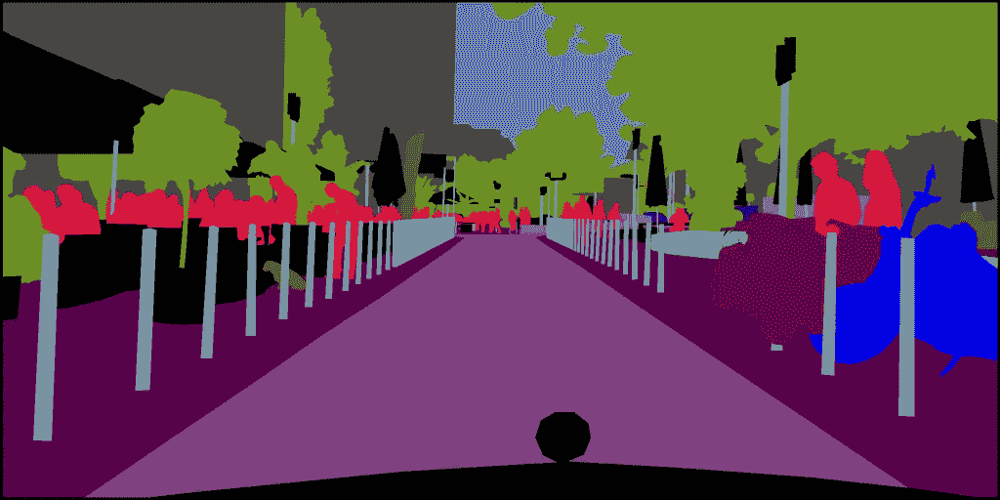
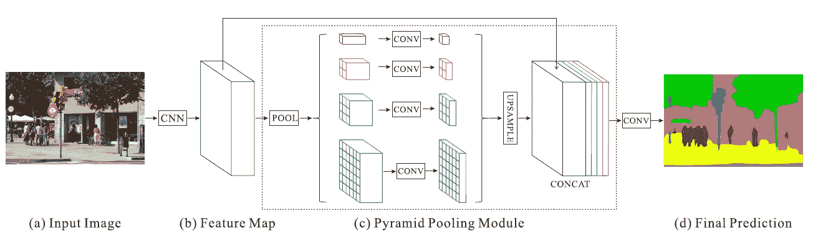
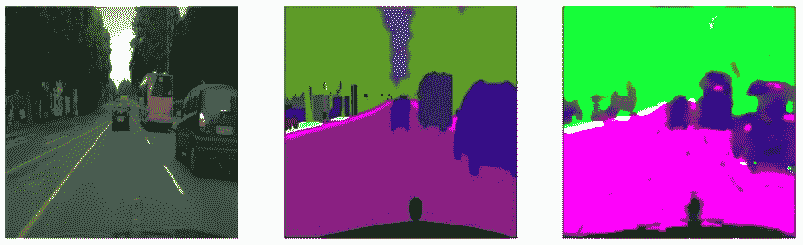

# PSPNet 中的语义分割及其在 Keras 中的实现

> 原文：<https://medium.com/analytics-vidhya/semantic-segmentation-in-pspnet-with-implementation-in-keras-4843d05fc025?source=collection_archive---------6----------------------->

对于图像场景语义分割，PSPNet 的性能优于其他语义分割网络，如 FCN，U-Net，Deeplab。

在本文中，我们将讨论 PSPNet 和在 Keras 中的实现。

# 金字塔场景解析网络

## a)输入图像

任何形状的输入图像通常维数大于(256，256)馈送到网络。

## b)特征图

获取输入图像并为图像构建特征映射。特征图是通过使用迁移学习或具有扩张卷积的刮擦网络馈送图像来提取的。由于大尺寸核比小尺寸核提取更多有用信息，但计算成本更高，膨胀卷积用小尺寸核收集大尺寸区域信息，以获得更高的**膨胀率**到**保持尺寸与**输入图像**相同**。通常使用具有**膨胀**的**剩余块**来构建特征地图。特征图的数量 **N** 是一个超参数，需要调整以获得良好的结果。

## c)金字塔池模块

图像包含不同区域中从小区域到大区域大小不等的对象。全卷积网络(FCN)、U-Net 和其他网络通过上采样和在不同级别上进行分割来构建特征图，用于分割所有区域中的所有对象。但是在 PSPNet 中，为了正确地分割所有大小的对象，特征地图被以不同的池大小平均汇集。

分区域平均汇总以不同的规模进行，如**全球平均汇总、(2*2)、(3*3)、(4*4)、(6*6)、(8*8)..**
将 **N** 个不同大小的 **n** 特征图平均汇集后，通过执行 **1*1** 卷积，将每一级的特征图缩减为 **N/n** 个特征图。

例如，如果 N=512 个特征地图，并且 n=4 个大小，如全局平均池，(2*2)、(4*4)、(8*8)，则在每个级别，512 个特征地图减少到 126 个特征地图。

每一级的 N/n 特征图**被上采样**以使**具有输入图像的相同尺寸。**对于上采样，使用双线性 _ 插值或卷积 _ 转置方法代替简单上采样。

金字塔池模块的输出是来自 **b** 的基本特征图和来自 **c** 的上采样平均池特征图的**连接**。

## d)最终预测

**2*N** 特征图被馈送到卷积层，并且根据输出层是如何构造的来生成类别的最终预测，例如不同对象的不同通道或单个通道。

# 在 Keras/Tensorflow 中实现

我们在 PSPNet 中应用语义分割的数据集是 Kaggle 的 [Cityscapes 图像对](https://www.kaggle.com/dansbecker/cityscapes-image-pairs)数据集，大小为 106 Mb。

## 资料组

数据集包含两个文件夹训练图像(train)文件夹和验证图像(val)文件夹。在每个文件夹中，每个图像的形状都是 **(512，256，3 )** 和**宽度=512，高度=256，通道=3** 。其中每个图像包含未分割的原始图像和分割的图像。将正常图像分成 **train_imgs，valid_imgs** ，将分割图像分成数组 **train_masks，valid_masks** 。

## 网络体系结构

一个简单 PSPNet 架构，具有以下参数:

**模块 b** 由 3 层带膨胀卷积的残差块构成，输出 **256 个特征图**。

**模块 C** 用**pool _ sizes globalaverageopooling，(2*2)，(4*4)，(8*8)** 定义，对于**上采样，使用双线性 _ 插值**。每个 **256 个汇集的特征地图**缩减为 **64 个特征地图**合并 **512 个特征地图共**。

**模块 D** 只是 512 个特征图输出 **(256，256，3)维特征图**的卷积层，这些特征图被**展平**成单个大小为(256*256*3)的数组。

 [## 城市景观图像分割

### Keras/Tensorflow 中 PSPNet 的城市景观图像分割…

www.kaggle.com](https://www.kaggle.com/santhalnr/cityscapes-image-segmentation-pspnet) 

## 预言

为了简单起见，用均方差(MSE)作为损失函数来预测图像的分割。

用 batch_size=10 和优化器 Adam、SGD、Nadam 以学习率[ 0.001，0.001，0.01]训练的模型。

1.正常图像，2。原始面具，3。预测掩码

我训练模型不到 3 小时。但是结果并不差。

## 如何才能提高？

我从(0–255)的小网络和损失函数 MSE 中提取裸像素值，这对于分割任务来说不是最佳的。通过这样做，以下将改善图像分割。

*   具有较高膨胀率的大型网络。
*   通过应用二进制掩码或仅为**单个**通道简单编号类别，为 **c** 类别构建尺寸为“c”的输出通道。
*   对**单个**通道的类别编号应用分类交叉熵，或任何其他损失函数，如骰子损失、加权交叉熵、用于 **c** 通道掩码的焦点损失。
*   调整参数 **N，N 和池大小。**

 [## 2020 年的图像分割:架构、损失、数据集和框架

### 在这篇文章中，我们将使用深度学习深入研究图像分割的世界。我们将讨论:什么…

海王星. ai](https://neptune.ai/blog/image-segmentation-in-2020)