# 地震图像中的语义分割

> 原文：<https://medium.com/analytics-vidhya/semantic-segmentation-in-seismic-images-70cde2175f01?source=collection_archive---------16----------------------->

使用 PyTorch 使用 [*TGS 盐鉴定挑战数据集*](https://www.kaggle.com/c/tgs-salt-identification-challenge) 进行语义分割

就像大多数人说的那样，最好的学习方法是把手弄脏，现在就开始，这就是我在 youtube 上看了斯坦福 [cs231n](https://www.youtube.com/watch?v=vT1JzLTH4G4&list=PL3FW7Lu3i5JvHM8ljYj-zLfQRF3EO8sYv) 后做的这个项目，并决定做这个第一个语义分割项目，我想分享一下。

## **简介**

***首先什么是语义切分？***

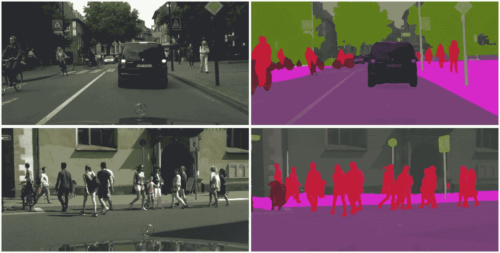

语义分割([来源](https://vladlen.info/publications/feature-space-optimization-for-semantic-video-segmentation/))

从上图来看，语义分割实际上是 ***将每个像素标记为类别*** 所以这是一种分类问题，但在像素级别。

> 更准确地说，[图像分割](https://en.wikipedia.org/wiki/Image_segmentation)是**给图像中的每个像素**分配一个标签的过程，使得具有相同标签的像素共享某些特征。

***盐的结构是什么？***

> 盐丘是向上侵入上覆沉积物的盐丘或盐柱。盐丘可以**在沉积盆地中形成，在沉积盆地中，厚盐层被厚度相当大的年轻沉积物覆盖**。在条件允许的地方，盐丘可以高出它们开始生长的盐层数千英尺

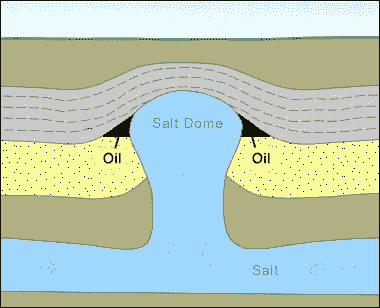

盐丘([来源](https://geology.com/stories/13/salt-domes/))

当压力大到足以侵入上覆地层时，它实际上是压力下的盐。

> 盐层在地震成像中可能是一个棘手的过程。为了更好地解释地震中盐体，需要整合地质信息，以便准确地对盐体成像。盐和沉积物的相互作用会导致储层圈闭和油气圈闭。

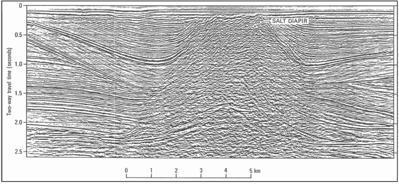

地震中的盐构造([震源](https://wiki.seg.org/wiki/Salt_kinematics#/media/File:Salt_diapir_with_disorderly_data.jpg)

## **数据集**

**输入数据**

数据集来自 [*TGS 盐识别挑战数据集*](https://www.kaggle.com/c/tgs-salt-identification-challenge) 包含 4000 个具有大小(101×101×3)和掩模大小(101×101×1)的标记图像以及每个图像的深度信息，其中可以有盐和无盐结构，然后我将该数据集分割用于训练(3420)、验证(380)和测试(200)。

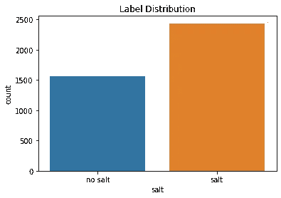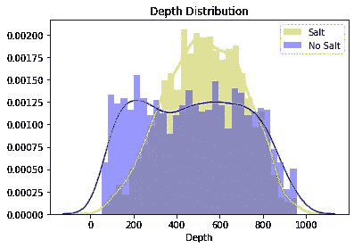

数据集

然后我从数据集中随机画出 20 张图像，看看数据看起来怎么样，白色的亮色是标记为盐体的蒙版。

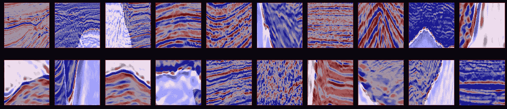

原始数据概述

**数据扩充**

这是我感到有点困惑的地方，因为 PyTorch 没有内置的图像和蒙版数据增强功能。如果你进行随机变换，图像和蒙版不可能相同，那么我发现[*albuminations*](https://github.com/albumentations-team/albumentations)库真的很好。我做了一些变换，包括水平翻转，垂直翻转，随机旋转 90 度，光学扭曲，转置(改变 X 和 Y 轴)。

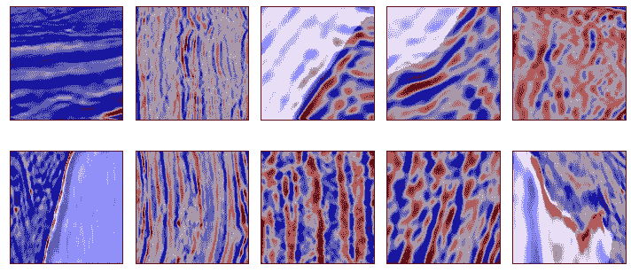

扩充数据

**数据加载器**

使用 PyTorch dataloader 批量向模型提供训练数据，我使用批量大小 32，并混洗数据(扩充数据)，如下所示

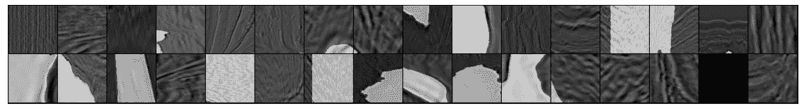

数据加载器

## **型号**

我用的是两个型号带[***U-Net***](https://arxiv.org/abs/1505.04597)***架构*** 其中编码器(承包路径)是 Imagenet 上预训练的网络，Resnet18 和 Resnet34。

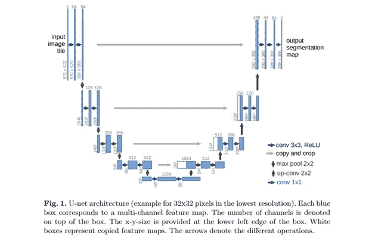

U-Net 架构([来源](https://arxiv.org/abs/1505.04597))

**带 Resnet18 的 U-Net**

我从 Resnet18 中提取 5 层作为编码器，转置卷积作为解码器，跳过编码器和解码器之间的连接，以保持上采样过程中的分辨率，代码如下所示

带 Resnet18 的 U-Net

**带 Resnet34 的 U-Net**

为简单起见，我使用 Resnet34 编码器的[*segmentation _ models . py torch*](https://github.com/qubvel/segmentation_models.pytorch)库。这是相同的，但有更多的卷积层。

使用库的 U-Net With Resnet34

## 损失和评估**指标**

**损失**

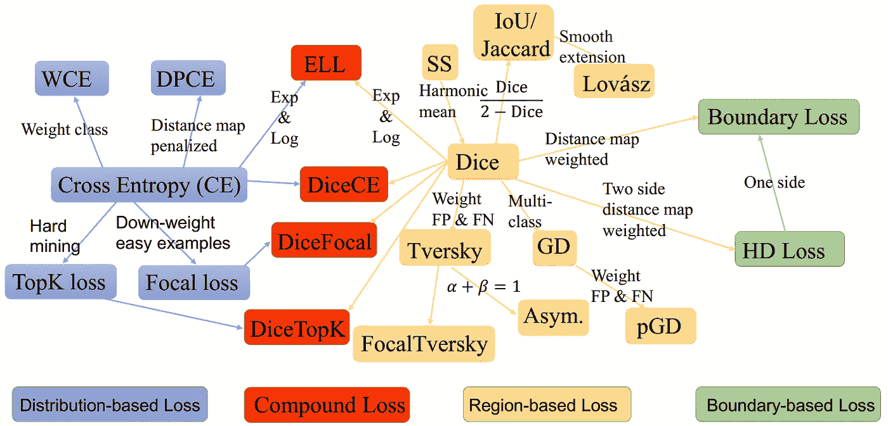

分割损失([信用](https://github.com/JunMa11/SegLoss))

**评估指标**

对于度量标准，我使用[](https://en.wikipedia.org/wiki/Jaccard_index)*和[***骰子(F1 分数)***](https://en.wikipedia.org/wiki/S%C3%B8rensen%E2%80%93Dice_coefficient)*这个 [***视频***](https://www.youtube.com/watch?v=AZr64OxshLo&t=32s) 帮助我更好地理解。**

> **Dice 系数在形式上与 Jaccard 指数没有太大的不同。事实上，给定一个索伦森-戴斯系数，两者是等价的。**

**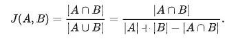**

**并集上的交集**

**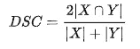**

**骰子系数**

## **培养**

**在训练过程中我使用*[***二元交叉熵***](https://pytorch.org/docs/master/generated/torch.nn.BCELoss.html) 损失在 PyTorch nn 中。前 20 个时期的 Module()和 ***继续使用 DiceLoss*** 进行 20 个时期(总共 40 个时期)，BCE 损失卡在 IoU 分数 0.77 左右，DiceLoss 提升分数(IoU)0.83 左右，这在两种模型中都发生。***

**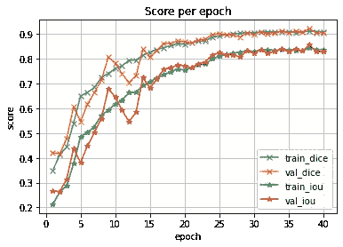****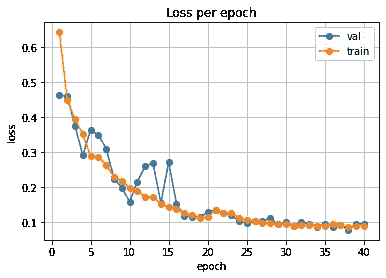

使用 Resnet18 的培训流程 U-Net** **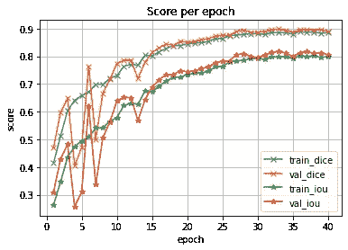****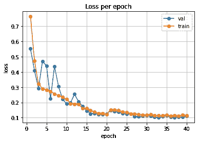

使用 Resnet34 的培训流程 U-Net** 

## **结论**

**因为它是二进制向量(0–1)，我想找到被认为是预测遮罩的阈值像素，我使用验证集来找到给出最佳分数的阈值。**

**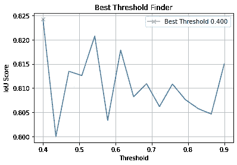**

**阈值发现**

**但是 0.4 太低了，不太有信心，所以我坚持用 0.5，然后用测试集来应用它。**

```
**IoU score over all test set Resnet18:  0.7714779843326482IoU score over all test set Resnet34:  0.780406071994881**
```

**Resnet34 给出了较高的分数，因此我使用该模型对测试集进行预测，并绘制其中的几个。**

**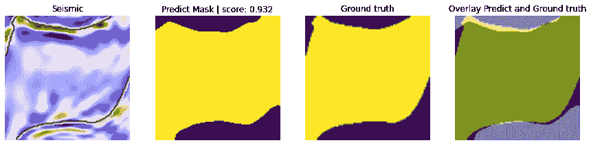****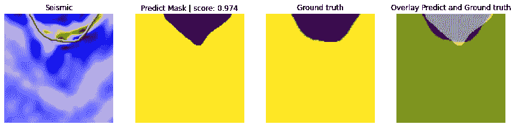****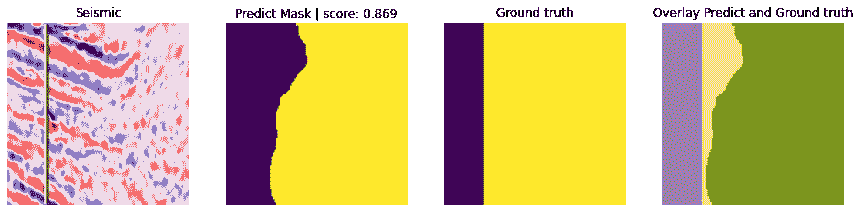****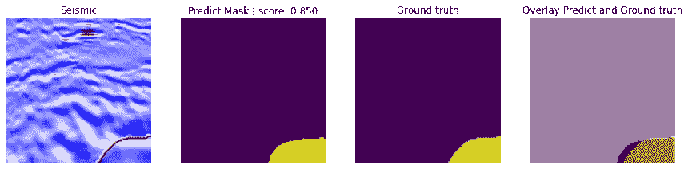**

## **结论**

***语义分割确实有助于*地震图像中的自动描绘，但仍然需要人工监督。分割也有助于医学图像和遥感领域，它也用于自动驾驶汽车的实时分割，这真的很有趣。更多关于我的项目请访问 [***我的 github***](https://github.com/said-rasidin)**

## **参考**

**[](https://www.kaggle.com/c/tgs-salt-identification-challenge) [## TGS 盐鉴定挑战

### 地球表面下的盐沉积

www.kaggle.com](https://www.kaggle.com/c/tgs-salt-identification-challenge) [](https://geology.com/stories/13/salt-domes/) [## 什么是盐丘？

### 首页“石油和天然气”盐穹盐柱侵入上覆沉积单位。盐丘是一个土丘…

geology.com](https://geology.com/stories/13/salt-domes/)  [## U-Net:生物医学图像分割的卷积网络

### 人们普遍认为，深度网络的成功训练需要成千上万个带注释的训练样本。在…

arxiv.org](https://arxiv.org/abs/1505.04597)**