# 语义分割:Google Pixel 的摄像头背后的深度学习技术介绍！

> 原文：<https://medium.com/analytics-vidhya/semantic-segmentation-introduction-to-the-deep-learning-technique-behind-google-pixels-camera-cae43f9dd844?source=collection_archive---------0----------------------->

# 介绍

我们人类极其擅长扫视任何图像并理解其中的内容。事实上，这是我们几乎察觉不到的反应。我们只需要几分之一秒的时间来分析。

对于机器来说，这是完全不同的游戏。在过去的几十年里，已经有无数次尝试让机器更智能地完成这项任务——多亏了深度学习(和[计算机视觉](https://courses.analyticsvidhya.com/courses/computer-vision-using-deep-learning?utm_source=blog&utm_medium=semanticsegmentationarticle))技术，我们可能最终解决了这个问题！

这些深度学习算法在我们的智能手机相机中尤其普遍。他们分析给定图像中的每个像素，以检测物体、模糊背景和一系列技巧。

这些智能手机大多使用多个摄像头来营造这种氛围。不过，谷歌自成一派。我很高兴在这篇文章中分享一种使用他们的 DeepLab V3+模型的方法，这种模型存在于 Google Pixel 手机中！

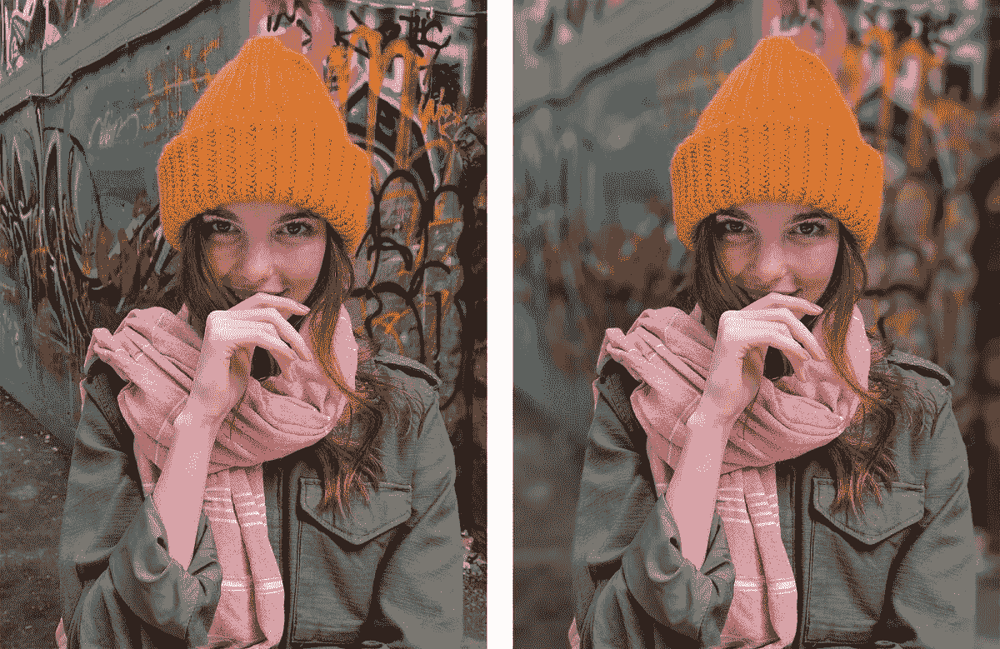

让我们一起建立你的第一个图像分割模型！

*本文要求对卷积神经网络(CNN)有很好的理解。阅读下面的文章来了解 CNN(或者快速复习一下):*

*   [*从头开始学习卷积神经网络的综合教程*](https://www.analyticsvidhya.com/blog/2018/12/guide-convolutional-neural-network-cnn/)

# 目录

*   图像分割简介
    语义分割
    实例分割
*   开始使用 Google 的 DeepLab
*   阿特鲁卷积导论
*   深度可分卷积是什么？
*   了解 DeepLab 模型架构
*   训练我们的语义分割模型
*   自定义数据集上的 DeepLabV3+

# 图像分割导论

图像分割是将图像分割成多个片段的任务。这使得分析给定的图像更加容易。从本质上说，这不正是我们在计算机视觉领域一直努力追求的吗？

这非常类似于基于特定特征将像素分组在一起。现在这些特征常常会导致不同类型的图像分割，我们可以将其分为以下几种:

*   语义分割
*   实例分割

让我们花点时间来理解这些概念。

# 1.语义分割

看看下面的图片:

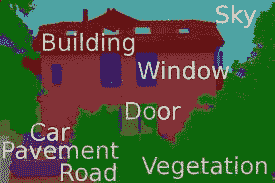

这是语义分段工作的一个经典例子。图像中的每个像素都属于一个特定的类别——汽车、建筑物、窗户等。并且属于特定类别的所有像素都被分配了单一颜色。太棒了，对吧？

为了给这个概念下一个正式的定义，

> 语义分割是给定图像中的每个像素分配一个类别的任务。

请注意，这与分类有显著的不同。**分类将单个类别分配给整个图像，而语义分割将图像的每个像素分类到其中一个类别。**

语义分段的两个流行应用包括:

*   **无人驾驶车辆:**这些车辆严重依赖这种分割图像来导航路线
*   **谷歌 Pixel 手机上的肖像模式:**这里，我们需要将每个像素分类为属于前景或背景，然后模糊图像的背景部分，而不是多个类别

# 2.实例分割

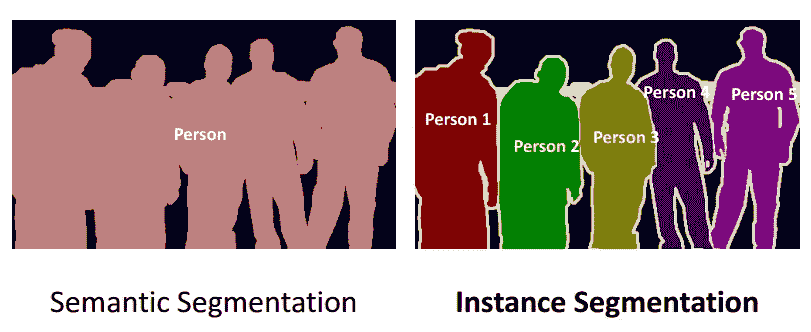

我喜欢上面的图片！它巧妙地展示了实例分割与语义分割的不同之处。在进一步阅读之前，先花点时间分析一下。

在实例分段中，同一类的不同实例被单独分段。换句话说，这些段是实例感知的。在上图中我们可以看到，同一个类(person)的不同实例被赋予了不同的标签。

# 图像分割算法

图像分割是一个长期存在的计算机视觉问题。已经设计了相当多的算法来解决这个任务，例如分水岭算法、图像阈值化、K-均值聚类、图划分方法等。

也有人提出了许多深度学习架构(如用于图像分割的全连接网络)，但谷歌的 DeepLab 模型迄今为止给出了最好的结果。这就是为什么我们将在本文中重点关注 DeepLab 的使用。

# 开始使用 Google 的 DeepLab

DeepLab 是谷歌在 2016 年设计并开源的最先进的语义分割模型。此后对该模型进行了多次改进，包括 DeepLab V2、DeepLab V3 和最新的 DeepLab V3+。

在本节中，我们将了解 DeepLab V3+背后的架构，并学习如何在我们的自定义数据集上使用它。

DeepLab 模型大致由两个步骤组成:

*   **编码阶段:**该阶段的目的是从图像中提取必要的信息。这是用一个预先训练好的卷积神经网络完成的，现在你可能想知道为什么 CNN？
    如果您之前曾使用 CNN 进行图像分类，那么您可能知道卷积层会在图像中寻找不同的特征，并将这些信息传递给后续层，现在对于分割任务，基本信息是什么，图像中存在的对象及其位置，由于 CNN 在执行分类方面表现出色，因此它们可以轻松找出存在的对象。
*   **解码阶段:**此处使用编码阶段提取的信息来重建适当维度的输出

这两个阶段都使用了什么样的技术？让我们来了解一下！

# 理解编码和解码阶段使用的技术

[DeepLab](https://github.com/tensorflow/models/tree/master/research/deeplab) 架构基于结合两种流行的神经网络架构:

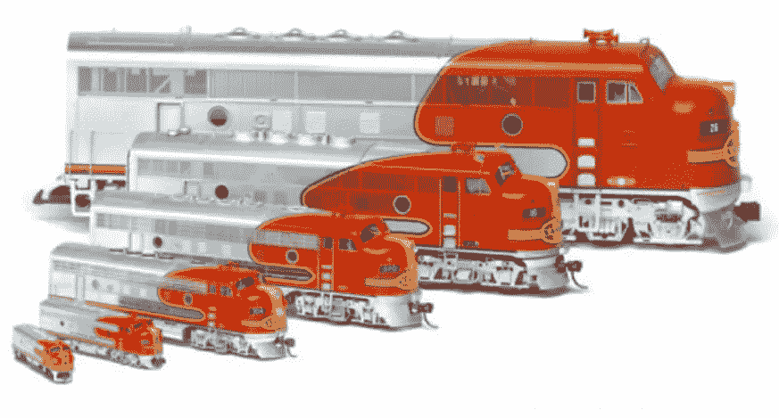

在使用 CNN 时，我们需要确保我们的模型对对象大小的变化具有鲁棒性。这是因为如果我们的模型只使用小物体的图像来训练，那么它可能不会很好地执行输入图像的缩放版本。

这个问题可以通过使用空间金字塔池网络来解决。这些使用输入的多尺度版本进行训练，因此捕获多尺度信息。

空间金字塔池网络能够编码多尺度上下文信息。这是通过以多种速率和有效视野探测输入特征或汇集操作来实现的。

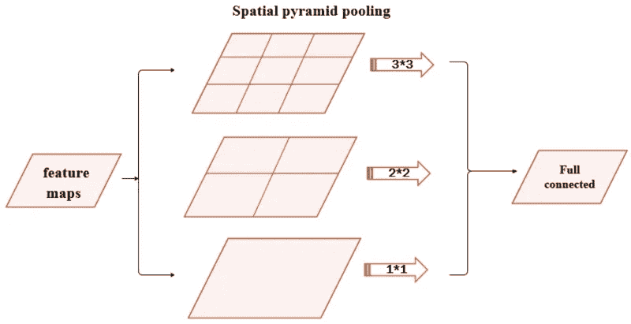

空间金字塔池网络通常使用同一基础网络的并行版本来训练不同比例的输入，并在后续步骤中组合这些要素。

并非输入中的所有内容都对我们的模型有用。我们希望只提取可以用来表示大部分信息的关键特征。一般来说，这只是一个很好的经验法则。

这是编码器-解码器网络表现良好的地方。他们学习将输入转换成可用于表示所有输入信息的密集形式(甚至重构输入)。

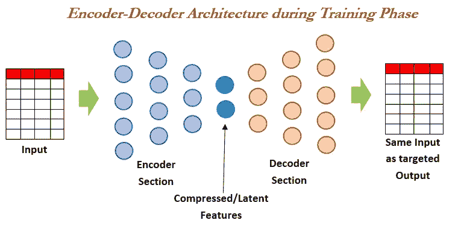

# 阿特鲁卷积导论

空间金字塔池使用同一架构的多个实例。这导致训练的计算复杂度和存储需求的增加。并非所有人都有自由运行的 GPU，那么我们如何着手减轻这一点呢？

像往常一样，谷歌有答案。

DeepLab 引入了 atrous 卷积的概念，这是卷积运算的一种推广形式。阿特鲁卷积需要一个称为速率的参数，用于明确控制卷积的有效视场。阿特鲁斯卷积的一般形式如下:

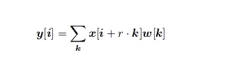

**正常卷积是 r = 1 的萎缩卷积的特例。**

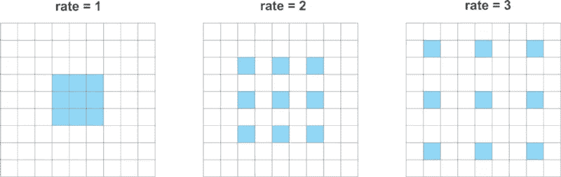

因此，atrous 卷积可以从更大的有效视场中捕获信息，同时使用相同数量的参数和计算复杂度。

> *DeepLab 使用速率为 6、12 和 18 的 atrous 卷积*

名字**阿特鲁空间金字塔池(ASPP)** 的诞生得益于 DeepLab 使用了带有 Atrous 卷积的空间金字塔池。这里，ASPP 使用 4 种并行运算，即 1×1 卷积和 3×3 atrous 卷积，速率为[6，12，18]。它还添加了具有全局平均池的映像级功能。双线性上采样用于将特征缩放到正确的尺寸。

# 深度可分卷积

深度方向卷积是一种用比标准卷积运算更少的计算次数来执行卷积的技术。这包括将卷积运算分解为两个步骤:

*   深度方向卷积
*   逐点卷积

让我们用一个例子来理解这一点。

假设我们有一个由 3 个通道组成的大小为 12 x 12 的图像。因此，输入的形状将是 12 x 12 x 3。我们希望对此输入应用 5 x 5 的卷积。

由于每个输入通道有 3 个 5×5 的内核，因此对这些内核应用卷积得到 8×8×1 的输出形状。我们需要使用更多的内核，并将输出堆叠在一起，以增加输出通道的数量。

我将使用图表来说明这两个概念，以便让您对我们正在讨论的内容有一个直观的理解。

# 深度方向卷积

在第一步中，我们对形状为 5 x 5 x 1 的单个内核应用卷积，得到大小为 8 x 8 x 3 的输出:

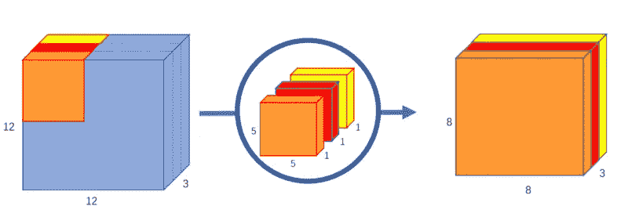

# 逐点卷积

现在，我们想增加频道的数量。我们将使用深度与输入图像的深度相匹配的 1 x 1 个内核(在我们的例子中是 3 个)。这个 1 x 1 x 3 卷积给出了形状为 8 x 8 x 1 的输出。我们可以根据需要使用尽可能多的 1 x 1 x 3 卷积来增加通道数量:

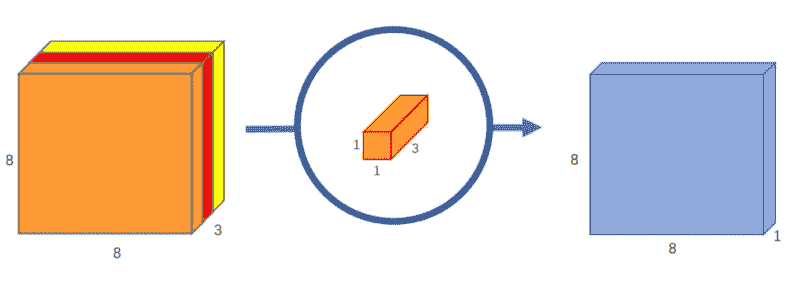

假设我们希望将通道数量增加到 256 个。我们做什么呢我希望你在看到解决方案之前好好想想。

我们可以在 8×8×3 的输入上使用 256 个 1×1×3，得到 8×8×256 的输出形状。

# 了解 DeepLab 模型架构

DeepLab V3 使用 ImageNet 的预训练 [Resnet-101](https://www.analyticsvidhya.com/blog/2017/08/10-advanced-deep-learning-architectures-data-scientists/) 和 atrous convolutions 作为其主要特征提取器。在改进的 ResNet 模型中，最后一个 ResNet 块使用具有不同膨胀率的各种卷积。它在修改的 ResNet 块的顶部为解码器模块使用阿特鲁空间金字塔池和双线性上采样。

DeepLab V3+使用对齐的[异常](https://www.analyticsvidhya.com/blog/2017/08/10-advanced-deep-learning-architectures-data-scientists/)作为其主要特征提取器，并做了以下修改:

1.  所有最大池操作都被具有步长的深度方向可分离卷积所取代
2.  额外的[批量标准化](https://www.analyticsvidhya.com/blog/2017/05/25-must-know-terms-concepts-for-beginners-in-deep-learning/)和 [ReLU](https://www.analyticsvidhya.com/blog/2017/10/fundamentals-deep-learning-activation-functions-when-to-use-them/) 激活在每个 3 x 3 深度方向卷积后添加
3.  在不改变入口流网络结构的情况下，增加了模型的深度

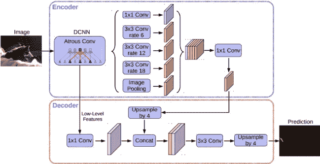

# DeepLab V3+解码器

编码器基于 16 的**输出步幅**(原始图像大小与最终编码特征大小的比率)。不是使用因子为 16 的双线性上采样，而是首先用因子 4 对编码特征进行上采样，并与来自具有相同空间维度的编码器模块的相应低级特征连接。

在连接之前，在低级特征上应用 1×1 卷积，以减少通道的数量。在连接之后，应用一些 3×3 卷积，并且特征以因子 4 被上采样。这给出了与输入图像相同大小的输出。

# 在自定义数据集上训练 DeepLabV3+

让我们用编码来弄脏我们的手吧！首先，克隆谷歌研究公司的 [Github repo](https://github.com/tensorflow/models/tree/master/research/deeplab) ，将所有代码下载到你的本地机器上。

**准备数据集**:为了在我们的定制数据集上训练 DeepLab 模型，我们需要将数据转换为 TFRecord 格式。将数据集移动到 model/research/deep lab/datasets。我们的数据集目录应该具有以下结构:

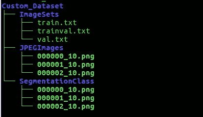

**TFRecord 是**[**tensor flow**](https://www.analyticsvidhya.com/blog/2017/03/tensorflow-understanding-tensors-and-graphs/)**的自定义二进制数据存储格式。**由于二进制数据占用的空间少得多，并且可以非常高效地读取，因此处理大型数据集变得更加容易。

当处理太大而无法存储在内存中的数据集时，TFRecords 格式非常方便。现在，只从磁盘中读取当时需要的数据。听起来像是双赢！

*   *JPEGImages* 文件夹包含原始图像
*   *SegmentationClass* 文件夹包含将类别标签作为像素值的图像(它需要一个单通道图像，其中每个像素的值都是 *classID* )
*   *train.txt* 和 *val.txt* 分别包含用于训练和验证的图像名称
*   *trainval.txt* 包含所有图像的名称

现在，运行 *build_voc2012_data.py* ，根据我们的目录结构改变标志的值。这会将您的数据转换为 TFRecord 格式，并将其保存到“ *— output_dir* ”所指的位置。

打开*segmentation _ dataset . py*，添加一个 *DatasetDescriptor* 对应您的自定义数据集。例如，我们使用 Pascal 数据集，其中 1464 幅图像用于训练，1449 幅图像用于验证。

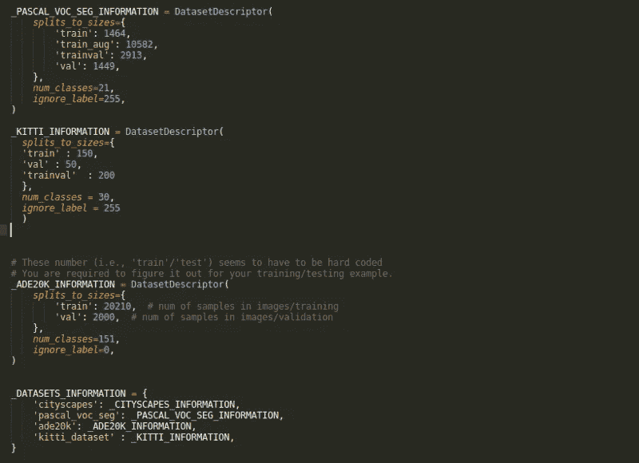

现在是时候训练我们自己的图像分割模型了！

# 训练我们的图像分割模型

我们需要运行 models/research/deeplab/文件夹中的 *train.py* 文件。根据您的要求更改标志。

```
# From tensorflow/models/research/ python deeplab/train.py \ --logtostderr \ --training_number_of_steps=90000 \ --train_split="train" \ --model_variant="xception_65" \ --atrous_rates=6 \ --atrous_rates=12 \ --atrous_rates=18 \ --output_stride=16 \ --decoder_output_stride=4 \ --train_crop_size=769 \ --train_crop_size=769 \ --train_batch_size=1 \ --dataset="cityscapes" \ --tf_initial_checkpoint=${PATH_TO_INITIAL_CHECKPOINT} \
```

这将在您的数据集上训练模型，并将检查点文件保存到 *train_logdir* 。

# 评估我们的图像分割模型

现在我们已经有了训练模型的检查点文件，我们可以使用它们来评估它的性能。使用更改后的标志运行 *eval.py* 脚本。这将在 *val.txt* 文件中提到的图像上评估模型。

```
python "${WORK_DIR}"/eval.py \ --logtostderr \ --eval_split="val" \ --model_variant="xception_65" \ --atrous_rates=6 \ --atrous_rates=12 \ --atrous_rates=18 \ --output_stride=16 \ --decoder_output_stride=4 \ --eval_crop_size=513 \ --eval_crop_size=513 \ --checkpoint_dir="${TRAIN_LOGDIR}" \ --eval_logdir="${EVAL_LOGDIR}" \ --dataset_dir="${PASCAL_DATASET}" \ --max_number_of_evaluations=1
```

> *我们运行了 1000 步的训练阶段，得到*mean intersection overunion*为 0.834894478*

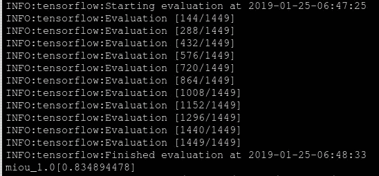

请记住，用于培训和评估的*型号 _ 变量*必须相同。

类似地，使用各自的标志运行 *vis.py* 来可视化我们的结果:

```
python "${WORK_DIR}"/vis.py \ --logtostderr \ --vis_split="val" \ --model_variant="xception_65" \ --atrous_rates=6 \ --atrous_rates=12 \ --atrous_rates=18 \ --output_stride=16 \ --decoder_output_stride=4 \ --vis_crop_size=513 \ --vis_crop_size=513 \ --checkpoint_dir="${TRAIN_LOGDIR}" \ --vis_logdir="${VIS_LOGDIR}" \ --dataset_dir="${PASCAL_DATASET}" \ --max_number_of_iterations=1
```

让我们看看我们的训练模型的一些结果。

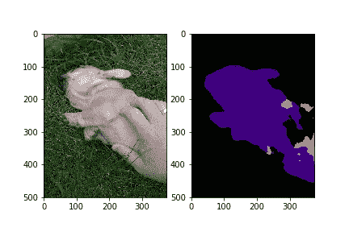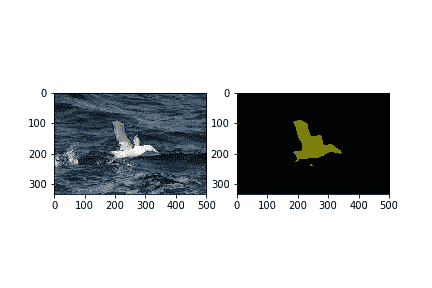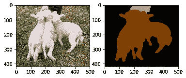

看起来不错！祝贺您训练并运行了您的第一个图像分割模型。

# 结束注释

那是相当多的学习消化！一旦您熟悉了这些概念，就可以尝试将它用于您的自定义数据集(Kitti 是一个很好的选择，因为它很小)，并找到更多很酷的实际用例。

我强烈建议你去看看关于这次发布的 DeepLab 论文和 Google AI 博客文章:

我期待着分享您的反馈、建议和使用 DeepLab 的经验。你可以在下面的评论区和我联系。

你也可以在分析 Vidhya 的 Android 应用上阅读这篇文章


*原载于 2019 年 2 月 26 日*[*https://www.analyticsvidhya.com*](https://www.analyticsvidhya.com/blog/2019/02/tutorial-semantic-segmentation-google-deeplab/)*。*