# 印度驾驶数据集上的语义分割

> 原文：<https://medium.com/analytics-vidhya/semantic-segmentation-on-indian-driving-dataset-aaf556a0f353?source=collection_archive---------9----------------------->

## UNet 和 PSPNet 的实施


印度驾驶环境(图片来源- [页面](https://www.edriving.com/three60/driver-training-programme-helps-make-indian-roads-safer/)

## 目录

1.  什么是图像语义分割？
2.  印度驾驶数据集介绍
3.  数据集概述
4.  绩效指标
5.  数据可视化
6.  数据准备
7.  模型结构
8.  结论
9.  进一步的改进
10.  参考

# 什么是语义切分？

**语义分割**是一项计算机视觉任务，将数字图像分割成多个部分。在一个相机和其他设备越来越需要看到和解释周围世界的时代，图像分割已经成为教授设备如何理解周围世界的一项不可或缺的技术。

它不同于图像识别，图像识别给整个图像分配一个或多个标签；以及对象检测，它通过在对象周围绘制边界框来定位图像中的对象。**语义分割**提供关于图像内容的更精细的信息。

我们可以把**图像语义分割**看作是像素级的图像分类。例如，在有许多汽车的图像中，分割会将所有对象标记为汽车对象。每张照片都由许多单独的像素组成，图像分割的目标是将这些像素中的每一个像素分配给它所属的对象。分割图像使我们能够将前景与背景分开，识别公共汽车或建筑物的精确位置，并清楚地标记出树木与天空的分界线。如需更清晰和详细的解释，请访问[源页面](https://www.fritz.ai/image-segmentation/)。


语义分割示例(图片来源— [页面](https://theaisummer.com/Semantic_Segmentation/)

# 印度驾驶数据集介绍

大多数自主导航数据集倾向于关注结构化驾驶环境。这通常对应于轮廓分明的基础设施，如车道、少量明确定义的交通参与者类别、物体或背景外观的低变化以及对交通规则的严格遵守。

来自包含 ***结构化驾驶环境*** 的 Cityscapes 数据集的图像:


来自 Cityscapes 数据集的示例图像

这就是典型的 ***印度驾驶环境*** 的样子:

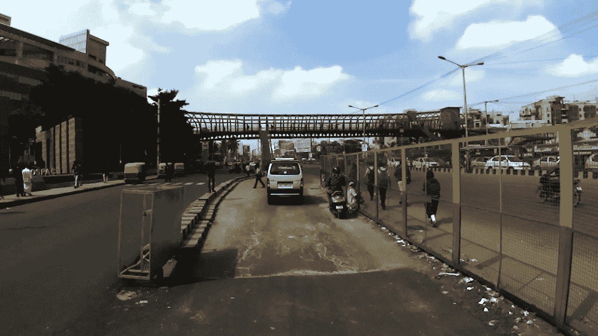

一条印度“路”

**印度驾驶数据集(IDD)** 是在印度道路上捕获的自动驾驶注释街道级图像的集合，并且被格式化以方便用于训练 AI 系统和神经网络的目的。它由来自非结构化环境的图像组成，在非结构化环境中，上述假设基本上不满足。它反映了与现有数据集显著不同的道路场景的标注分布，大多数类显示出更大的类内多样性。与实际驾驶行为一致，它还识别新的类别，例如道路以外的可驾驶区域。

很难完全避免某些标签之间的歧义。例如，由于所收集数据中场景和车辆的多样性，无法精确定义停车场、大篷车或拖车等标签。为了解决这个问题，数据集被设计为 4 级标签层次，具有 ***【第 1 级】*** 、16(第 2 级)、26(第 3 级)和 30(第 4 级)标签。idd20k_lite 数据集有 **7 个类**，包括 ***可驾驶、不可驾驶、生物、车辆、路边物体、远处物体和天空*** 。分割挑战是标签层次结构的第一级*的所有 ***7 类*** 的像素级预测。*

*这些图像是从安装在汽车上的前置摄像头获得的。这辆车在海德拉巴、班加罗尔城市及其郊区行驶。*

*(挑战来源— [页面](http://idd.insaan.iiit.ac.in/))*

# *数据集概述*

*   *有**1403**列车图像、**204**验证图像、**404**测试图像*
*   *输入图像和分割掩模的形状是**【227，320，3】。***
*   *期望的输出分段掩码的形状是**【256，128】。***
*   *对于每个训练和验证图像，我们有其对应的包含每个像素标签的注释图像。*

*数据集可以从这个[页面](http://idd.insaan.iiit.ac.in/dataset/download/)下载。*

# *绩效指标*

*性能指标是**联合平均交集(mIoU)** 。*

*mIoU 是语义图像分割的常用评估度量，它首先计算每个语义类别的 IoU，然后计算类别的平均值。*

*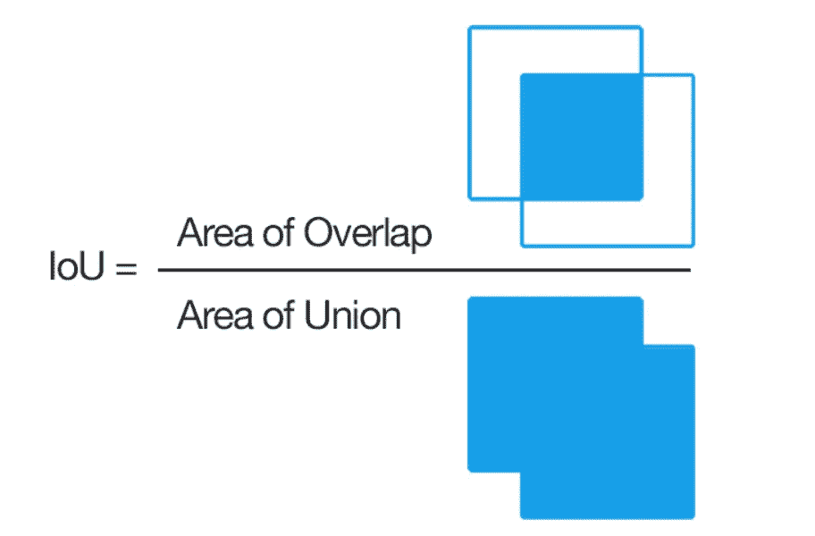*

*交集超过联合公式可视化(来源- [页面](https://www.pyimagesearch.com/2016/11/07/intersection-over-union-iou-for-object-detection/)*

*检查这个等式，你可以看到交集除以并集仅仅是一个比率。在分子中，我们计算预测边界框和地面真实边界框之间的重叠区域。分母是并集的面积，或者更简单地说，是由预测边界框和实际边界框包围的面积。*

*将重叠面积除以并集面积，得到我们的最终分数— **并集上的交集。**(来源- [页面](https://www.pyimagesearch.com/2016/11/07/intersection-over-union-iou-for-object-detection/))*

# *数据可视化*

*让我们取一个样本图像，并从数据集中分析它和它的带注释的图像。*

**这是图片:**

*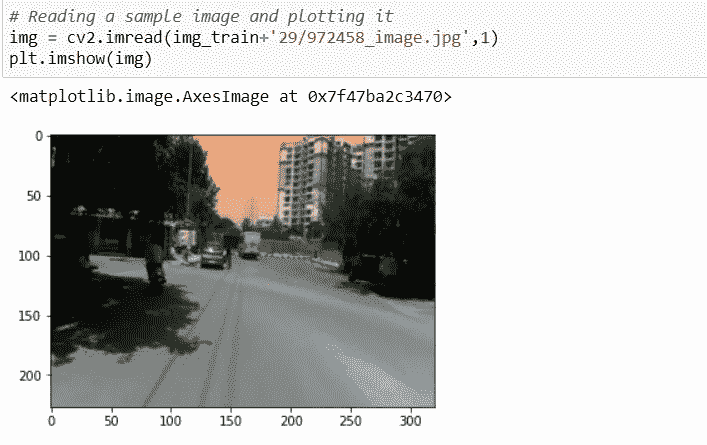*

*来自 idd20k _ lite 数据集的示例图像*

*现在，让我们绘制一个直方图来找出像素强度值的频率。*

*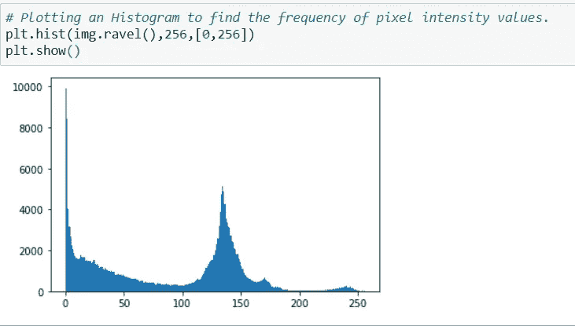*

*直方图找到上面的样本图像的像素强度值的频率*

*现在让我们绘制带注释的图像。*

*首先，**什么是图像标注？***

*它是一个标记数据(可用图像格式)的过程，通过计算机视觉技术使图像中的对象可被机器识别。基本上，它用于检测、分类和分组机器学习训练中的对象。在带注释的图像中，每个像素都被分配了类别标签。*

**下面是带注释的图片:**

*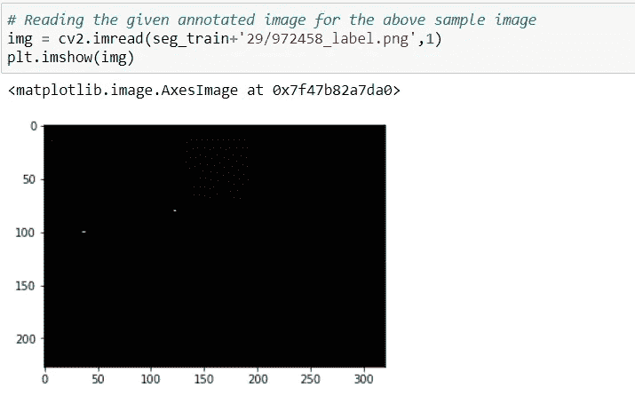*

*样本图像的注释图像*

****没有任何意义吧？****

*这是因为对于数据集中要预测的 7 个类，每个像素都有从 0 到 6 的标签。所以基本上，所有像素的亮度值都在范围[0，6]内。通常，0 强度值为黑色，255 为白色。因此，该图像看起来大部分是黑色的。中间的小白点像素值为 255。*

*现在，让我们绘制带注释的图像的直方图，以获得像素亮度值的分布。*

*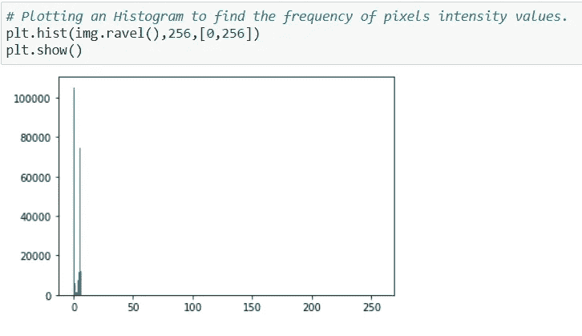*

*注释图像的直方图*

*我们可以看到所有的像素亮度值都在 0-6 的范围内。*

*为了更清楚地了解属于每个类标签的值，让我们统计属于每个类的值。*

*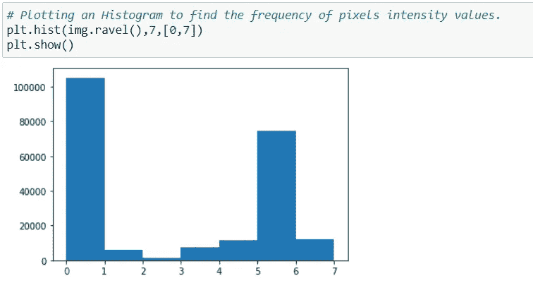*

*从 0 到 6 的值的放大直方图*

*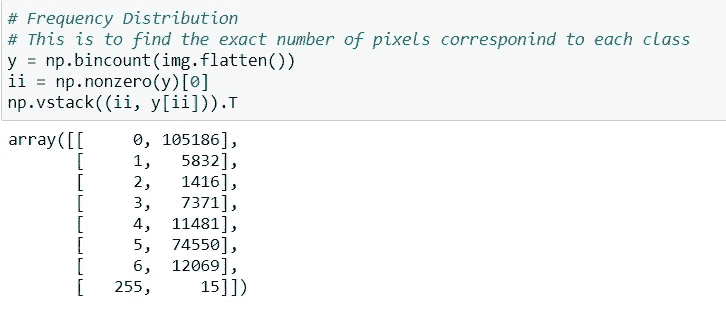*

*每个类别的像素亮度值的计数*

*我们可以观察到，类标签 0 具有最高的值计数，而类 2 具有最低的值计数。我们可以将值 255 视为类标签 7，因为它更容易预测。*

*为了可视化带注释的图像并获得更清晰的图片，我们可以使用以下方法。*

*因此，在给定的带注释的图像中，所有像素(不包括像素值 255)都来自范围 0–6(对于 7 个类)。我们可以增强这些像素以获得更清晰的注释，因为像素范围更大，颜色在更大范围内变化时更容易区分像素。我们将乘以每个像素，不包括 0 和 255 与 40，所以我们会得到不同的颜色，差异较大的值。*

*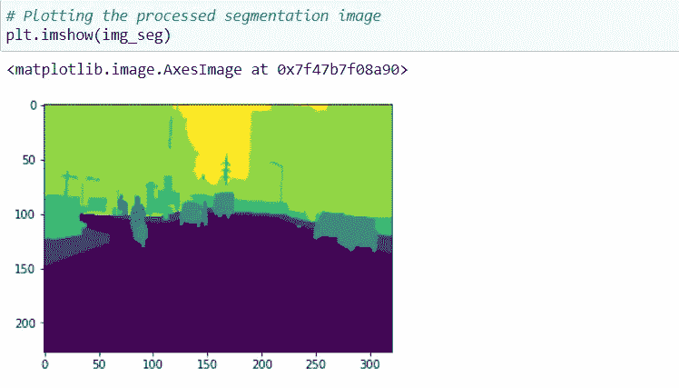*

*已处理的注释图像*

*我们可以看到，对像素进行强化后，很容易区分不同的类。*

# *数据准备*

*首先，让我们定义图像大小、通道数量和要预测的类别数量。*

*现在，我们将定义一个函数，该函数给定一个图像，将加载它，并且还加载其相应的注释图像并返回一个字典。*

*我们需要得到训练和验证图像的所有文件名。为此，我们可以使用*tensor flow . data . dataset . list _ files。*这个方法返回所有匹配一个或多个 glob 模式的文件的数据集。基本上，它返回一个字符串数据集，这些字符串对应于调用方法时定义的模式所对应的文件名。*

*我们现在需要加载训练和验证图像。但是，在加载火车图像之前，我们将应用一个简单的转换。它可以通过在数据集中引入变化来帮助增加相关数据的数量。*

*有关数据增强技术的详细解释，请访问[页面](https://nanonets.com/blog/data-augmentation-how-to-use-deep-learning-when-you-have-limited-data-part-2/)*

*在应用最终转换之前，让我们定义批处理大小、缓冲区大小和将要转换的最终数据集。最终的数据集将是一个字典，以“train”为键，以 *train_dataset* 为值，以“val”为键，以 *val_dataset* 为值。*

*我们将对数据集应用以下转换。*

1.  ***地图功能***

*跨数据集的所有元素映射 *map_func* 。*

*该转换将 *map_func* 应用于数据集的每个元素，并返回包含已转换元素的新数据集，其顺序与元素在输入中出现的顺序相同。 *map_func* 可用于改变数据集元素的值和结构。*

*在我们的例子中，我们将在训练数据集的每个元素上映射 *load_image_train* 函数，在验证数据集的每个元素上映射 *load_image_test* 函数。*

*2.**洗牌***

*随机打乱该数据集的元素。*

*这个数据集用 *buffer_size* 元素填充一个缓冲区，然后从这个缓冲区随机采样元素，用新元素替换所选元素。为了实现完美的混洗，缓冲区大小需要大于或等于数据集的完整大小。*

*我们将只在训练数据集上使用这种方法。*

*3.**重复***

*重复该数据集，以便每个原始值被查看*计数*次。默认行为(如果计数为 None 或-1)是数据集无限重复。*

*4.**批次***

*将此数据集的连续元素组合成批。*

*5.**预取***

*创建一个数据集，从该数据集中预取元素。*

*大多数数据集输入管道应该以调用预取结束。这允许在处理当前元素的同时准备后面的元素。这通常会改善延迟和吞吐量，但代价是使用额外的内存来存储预取的元素。*

*我们可以使用下面的代码在数据集上应用上述所有转换。*

*现在，我们已经完成了数据准备工作。*

*现在，让我们从数据集中提取一个样本图像并将其可视化。*

*可视化数据集中的样本图像*

*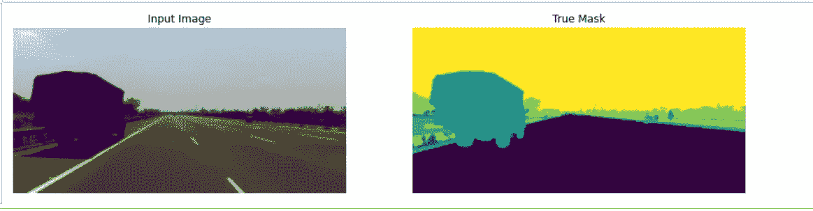*

*显示示例函数的输出*

*现在我们已经完成了数据准备，让我们继续建模。*

# *模型结构*

*大多数分割模型基本上由两部分组成。首先是编码器，其中我们对输入的空间分辨率进行下采样，开发分辨率较低的特征映射，据了解，这些映射在区分类别时非常高效。*

*然后，在解码器部分，我们将特征表示上采样为全分辨率分割图。*

*我在这个数据集上实现并训练了两个模型，UNet 和 PSPNet*

## *u 网模型*

*U-Net 是一种卷积网络架构，用于快速精确地分割图像。到目前为止，在电子显微镜堆栈中神经元结构分割的 ISBI 挑战中，它已经超过了先前的最佳方法(滑动窗口卷积网络)。*

*这种架构背后的主要思想是通过连续的层来补充通常的收缩网络，这些层提高了输出的分辨率。为了定位，来自收缩路径的高分辨率特征与上采样输出相结合。随后，后续卷积层可以学习基于该信息来组装更精确的输出。*

*在上采样部分，有大量的特征通道，这允许网络将上下文信息传播到更高分辨率的层。因此，扩展路径或多或少与收缩路径对称，并产生 u 形结构。该网络不具有任何完全连接的层，并且仅使用每个卷积的有效部分，即分割图仅包含像素，对于这些像素，在输入图像中可以获得完整的上下文。*

## *U-Net 架构*

*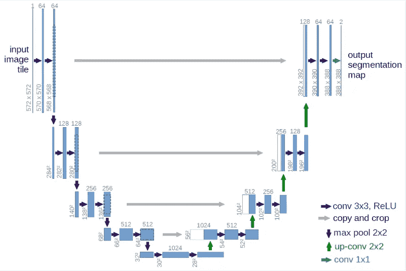*

*U-Net 架构*

***U-net 架构**是对称的，由两个主要部分组成——
第一部分称为收缩路径(编码器)，由通用卷积过程构成，第二部分是扩展路径(解码器)，由上采样技术构成。*

## *编码器*

*收缩路径遵循卷积网络的典型架构。它由两个 3×3 卷积(无填充卷积)的重复应用组成，每个卷积后跟一个整流线性单元(ReLU)和一个跨距为 2 的 2×2 最大池操作，用于下采样。在每个下采样步骤中，我们将特征通道的数量增加一倍。*

***编码器代码***

## *解码器*

*扩展路径中的每一步都包括特征图的上采样，随后是将特征通道数量减半的 2×2 卷积(“上卷积”)，与收缩路径中相应裁剪的特征图的连接，以及两个 3×3 卷积，每个卷积之后是 ReLU。由于每次卷积都会丢失边界像素，因此裁剪是必要的。*

***解码器代码***

*现在，我们将把不同滤波器尺寸的编码器和解码器模块堆叠在一个模型中。*

## *训练模型*

*为了训练模型，首先，我们需要定义一个损失对象、一个优化器和一些性能指标来监控模型的性能*

*现在，我们将使用 TensorFlow 的 GradientTape 函数创建自定义训练循环来训练模型。我们将讨论如何在急切执行中用 TensorFlow 计算梯度。*

*启用急切执行后，Tensorflow 将计算代码中出现的张量值。这意味着它不会预先计算通过占位符输入的静态图形。这意味着反向传播错误，我们必须跟踪计算的梯度，然后将这些梯度应用于优化器。*

*张量流提供了 tf。用于自动微分的梯度带 API(自动微分对于实现机器学习算法是有用的，例如用于训练神经网络的反向传播)也就是说，计算计算相对于其输入变量的梯度。TensorFlow“记录”了在 tf 上下文中执行的所有操作。将磁带渐变到“磁带”上。然后，它使用该磁带和与每个记录的操作相关联的梯度来计算使用反向模式微分的“记录的”计算的梯度。*

*梯度带使用内存来存储中间结果，包括输入和输出，供反向传递时使用。为了提高效率，一些运算(如 ReLU)不需要保存它们的中间结果，它们在向前传递的过程中被删除。但是，如果您在磁带上使用 persistent=True，则不会丢弃任何内容，并且您的峰值内存使用率会更高。*

*要了解更多关于 Tensorflow 2.0 中的 GradeintTape，您可以访问此[页面](https://www.pyimagesearch.com/2020/03/23/using-tensorflow-and-gradienttape-to-train-a-keras-model/)*

***训练代码***

*下面的代码将为给定数量的纪元定型模型。首先，我们调用 train_and_checkpoint 函数，它将首先检查一个检查点。如果先前的检查点存在，它将从该检查点继续向前训练。然后，它将遍历整个数据集并保存指标。我们使用 tf.summary.scalar 来保存损失和准确性指标，这些指标可用于 Tensorboard 可视化。然后，我们为验证数据检查模型的性能。如果精度提高，我们将模型权重保存到磁盘。最后，我们打印特定时期的指标，并重置丢失和指标对象。*

***代号***

## *印度驾驶数据集上的 U-Net 性能*

*我们可以使用 Tensorboard 跟踪和可视化损失和准确性等指标，以监控模型的性能。*

*在对模型进行 100 个时期的训练后，图表如下所示:*

*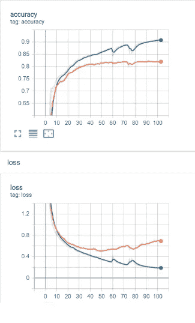*

*来自 IDD 的训练和验证数据的准确性和损失图*

*现在，让我们在加载最佳权重后预测单个图像，并分析预测。*

*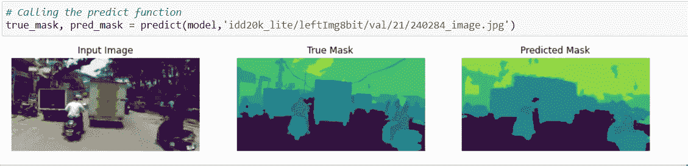*

*单个图像的预测*

*我们还可以获得预测图像中每个类别的真阳性、假阳性、假阴性和 IoU 值。*

*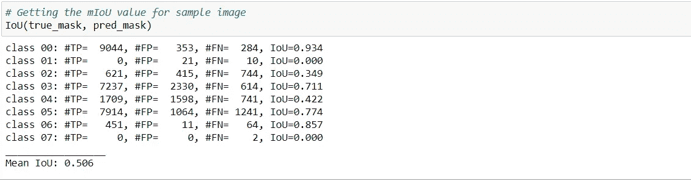*

*现在，我们可以计算所有验证图像的 mIoU，然后取其平均值。*

***U-Net 模型的输出:***

```
*Validation mIoU =  0.44561768240488786*
```

## *PSPNet 模型*

*PSPNet 架构考虑了图像的全局上下文来预测局部级别的预测，因此在 PASCAL VOC 2012 和 cityscapes 等基准数据集上提供了更好的性能。该模型是必要的，因为基于 FCN 的像素分类器不能捕捉整个图像的上下文。*

*在这个模型中，他们引入了金字塔池模块，经验证明这是一个有效的全局上下文先验。全局平均池作为全局上下文先验是一个很好的基线模型，常用于图像分类任务。*

*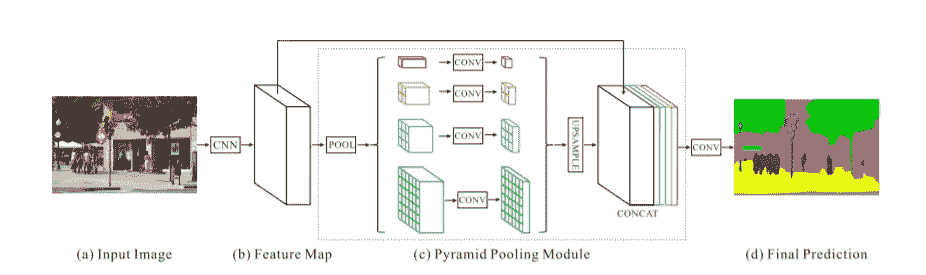*

*PSPNet 架构*

*金字塔池模块融合了四种不同金字塔等级下的要素。以红色突出显示的最粗略级别是全局池，用于生成单个容器输出。下面的金字塔等级将特征地图分成不同的子区域，并形成不同位置的汇集表示。金字塔池模块中不同级别的输出包含不同大小的要素地图。为了保持全局特征的权重，如果金字塔的级别大小为 N，则在每个金字塔级别后使用 1×1 卷积层将上下文表示的维度降低到原始维度的 1/N。然后通过双线性插值直接对低维特征图进行上采样，以获得与原始特征图相同大小的特征。最后，不同级别的要素被连接为最终的金字塔池全局要素。*

*可以修改金字塔等级的数量和每个等级的大小。它们与输入金字塔池图层的要素地图的大小有关。该结构通过在几个步骤中采用不同大小的池内核来抽象不同的子区域。因此，多级内核应该在表示中保持合理的间隙。*

*现在，我们可以使用我们在 U-Net 中使用的相同的编码器-解码器方法来实现 PSPNet。*

*编码器包含卷积块，这些卷积块将在 PSPNet 架构中生成特征映射，直到步骤(b)。*

***编码器代码***

*对于解码器块，我们需要两个辅助类，PyramidFeatureMap 和 PyramidPoolingModule，这是一个有效的全局上下文先验。
对 PyramidPoolingModule 中的每个特征地图进行子区域平均池化。*

***解码代码***

*现在，我们可以将所有块堆叠在一起，建立分段模型。*

***分割模型代码***

*培训阶段将与 U-Net 模型相同。*

***PSPNet 在印度驾驶数据集上的性能***

*经过 50 个时期的训练后，图表如下所示:*

*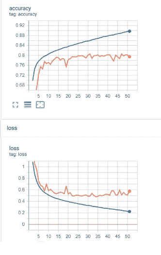*

*我们可以使用 PSPNet 模型预测相同的样本图像，并分析其性能。*

*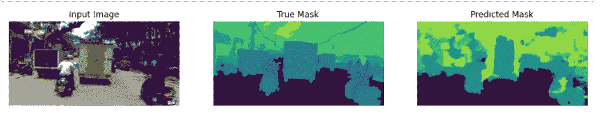*

*样本图像预测*

*我们还可以获得预测图像中每个类别的真阳性、假阳性、假阴性和 IoU 值。*

*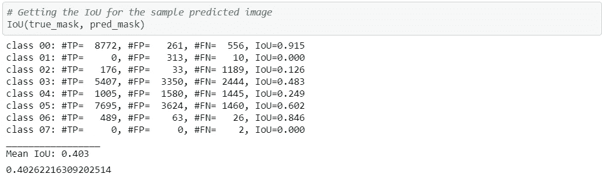*

*PSPNet 预测的所有验证图像的平均 mIoU 为:*

```
*Validation mIoU =  0.4333882146774802*
```

*因此，我们可以观察到 PSPNet 在这个数据集上的性能不如 U-Net 模型。*

# *结论*

*   *实施了两种不同的模型(UNet 和 PSPNet)。*
*   *这两个模型在过去对于语义分割挑战都表现得很好。*
*   *对于该数据集，UNet 给出的验证 mIoU 为 0.44561，而 PSPNet 给出的验证 mIoU 为 0.43338。*

*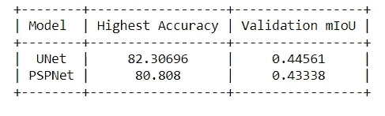*

# *进一步的改进*

*   *可以在这个数据集上尝试 U-Net 的变体。*
*   *我们可以在两个模型中增加或减少卷积块的数量，以查看性能是提高还是降低。*
*   *也可以尝试专门为分割模型定义的不同损失函数。*

*你可以在我的 [Github 知识库](https://github.com/yashmarathe21/Semantic-Segmentation-on-Indian-Driving-Dataset)中找到我的完整解决方案，如果你有任何建议，请评论或通过 [LinkedIn](https://www.linkedin.com/in/yash-marathe-a3658917b/) 联系我*

# *参考*

1.  *【https://arxiv.org/pdf/1505.04597.pdf *
2.  *[https://arxiv.org/pdf/1612.01105.pdf](https://arxiv.org/pdf/1612.01105.pdf)*
3.  *[https://yann-leguilly . git lab . io/post/2019-12-14-tensor flow-TF data-segmentation/](https://yann-leguilly.gitlab.io/post/2019-12-14-tensorflow-tfdata-segmentation/)*
4.  *[https://medium . com/analytics-vid hya/semantic-segmentation-in-PSP net-with-implementation-in-keras-4843d 05 fc 025](/analytics-vidhya/semantic-segmentation-in-pspnet-with-implementation-in-keras-4843d05fc025)*
5.  *[https://github.com/junhoning/machine_learning_tutorial/](https://github.com/junhoning/machine_learning_tutorial/)*

*感谢您的阅读！！*