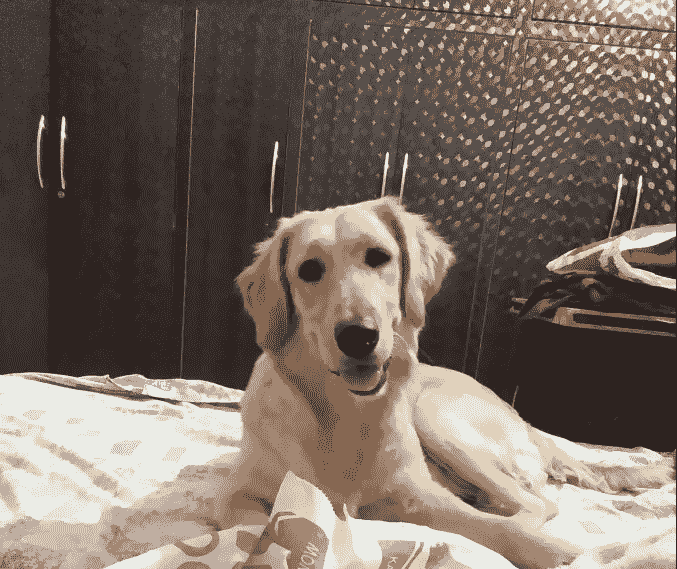
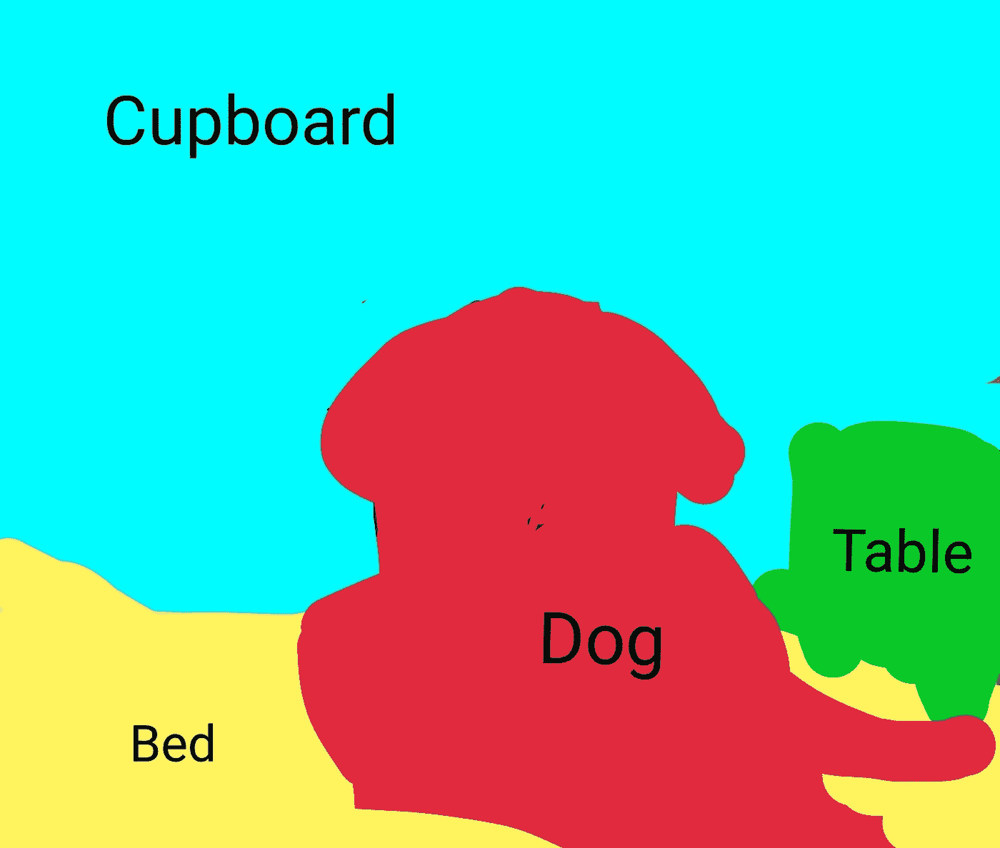
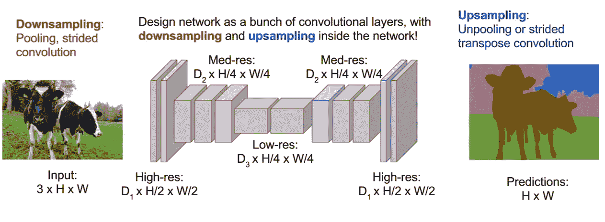
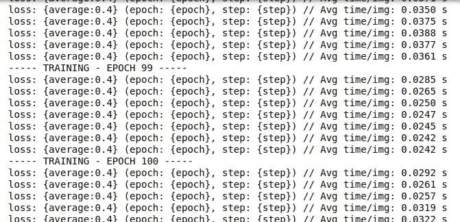
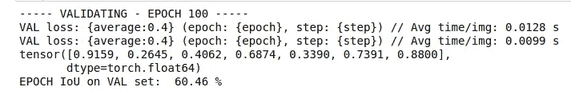
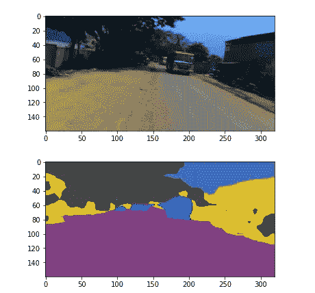

# 语义分段:代码中最简单的实现！

> 原文：<https://medium.com/analytics-vidhya/semantic-segmentation-the-easiest-possible-implementation-in-code-193bf27b86b8?source=collection_archive---------0----------------------->

分割对于图像解释任务是至关重要的。那就不要落后于潮流。让我们实施它，你很快就会成为专业人士！

什么是语义分割？

它描述了将一幅图像的每个像素与一个类别标签(如*花*、*人*、*路*、*天*、*海*或*车*)相关联的过程，也就是说，我们要输入一幅图像，然后输出该图像中每个像素的一个类别的决定，因此对于该图像中的每个像素，例如，该输入图像是一只坐在床上的狗。



因此，在输出中，我们希望为每个像素定义一组类别，即狗、床、后面的桌子和橱柜。语义分割后，图像看起来会像这样:



关于语义分割的一个有趣的事情是，它不区分实例，即，如果在这个图像中有两只狗，它们将被描述为只有一个标签，即，狗，而不是狗 1 和狗 2。

语义分割通常用于:

*   自动驾驶
*   工业检查
*   卫星图像中明显区域的分类
*   医学影像评论

语义分段实现:

1.  第一种方法是**滑动窗口**方法，我们将输入图像分解成许多小的局部图像，但我希望你已经猜到这在计算上会很昂贵。所以，我们实际上并不怎么用这个。
2.  另一种方法是**全卷积网络**，其中网络具有整个巨大的卷积层堆栈，没有完全连接的层，这保持了输入的空间大小。这在计算上也非常昂贵。
3.  第三个也是最好的一个是**上采样&下采样**图像。因此，我们不是对图像的全空间分辨率进行所有卷积，而是以原始分辨率遍历少量卷积层，然后对该特征图进行下采样，之后再进行上采样。这里，我们只是想在网络的后半部分提高我们预测的空间分辨率，这样我们的输出图像现在可以与输入图像具有相同的维度。它的计算效率更高。因为你可以把网络做得很深，以更便宜的空间分辨率来操作。



[图片提供:斯坦福大学](https://youtu.be/nDPWywWRIRo)

所以让我们用代码来实现它:

*   **导入处理**所需的必要库，即
    py torch 的重要功能，如数据加载器、变量、转换和优化器相关函数，
    导入 VOC12 和 cityscapes 的数据集类，从 transform.py 文件导入 Relabel、
    ToLabel 和 Colorize 类，
    从 iouEval.py 文件导入 iouEval 类。

```
#SSCV IIITH 2K19
import random
import time
import numpy as np
import torch
print(torch.__version__)
import math
from PIL import Image, ImageOps
from torch.optim import SGD, Adam, lr_scheduler
from torch.autograd import Variable
from torch.utils.data import DataLoader
from torchvision.transforms import  Resize
from torchvision.transforms import ToTensor, ToPILImage
from dataset import cityscapes
from dataset import idd_lite
import sys
print(sys.executable)
from transform import Relabel, ToLabel, Colorize
import matplotlib
from matplotlib import pyplot as plt
%matplotlib inline
import importlib
from iouEval import iouEval, getColorEntry #importing iouEval class from the iouEval.py file
from shutil import copyfile
```

*   **定义几个全局参数:**

```
NUM_CHANNELS = 3 #RGB Images
NUM_CLASSES = 8 #IDD Lite has 8 labels or Level1 hierarchy of labels
USE_CUDA = torch.cuda.is_available() 
IMAGE_HEIGHT = 160
DATA_ROOT = ‘/tmp/school/6-segmentation/user/1/6-segmentation/idd1_lite’
BATCH_SIZE = 2
NUM_WORKERS = 4
NUM_EPOCHS = 100
ENCODER_ONLY = True
device = torch.device(“cuda” )
#device = ‘cuda’
color_transform = Colorize(NUM_CLASSES)
image_transform = ToPILImage()
IOUTRAIN = False
IOUVAL = True
```

*   **增强，即**执行不同的功能，对图像和目标进行随机增强:

```
class MyCoTransform(object):
 def __init__(self, enc, augment=True, height=160):
 self.enc=enc
 self.augment = augment
 self.height = height
 pass
 def __call__(self, input, target):
 # Resizing data to required size
 input = Resize((self.height,320), Image.BILINEAR)(input)
 target = Resize((self.height,320), Image.NEAREST)(target)if(self.augment):
 # Random horizontal flip
 hflip = random.random()
 if (hflip < 0.5):
 input = input.transpose(Image.FLIP_LEFT_RIGHT)
 target = target.transpose(Image.FLIP_LEFT_RIGHT)

 #Random translation 0–2 pixels (fill rest with padding)
 transX = random.randint(0, 2) 
 transY = random.randint(0, 2)input = ImageOps.expand(input, border=(transX,transY,0,0), fill=0)
 target = ImageOps.expand(target, border=(transX,transY,0,0), fill=7) #pad label filling with 7
 input = input.crop((0, 0, input.size[0]-transX, input.size[1]-transY))
 target = target.crop((0, 0, target.size[0]-transX, target.size[1]-transY))input = ToTensor()(input)

 target = ToLabel()(target)

 target = Relabel(255,7)(target)
 return input, target
```

*   **加载数据**:我们将遵循 pytorch 推荐的语义，并使用 dataloader 来加载数据。

```
best_acc = 0co_transform = MyCoTransform(ENCODER_ONLY, augment=True, height=IMAGE_HEIGHT)
co_transform_val = MyCoTransform(ENCODER_ONLY, augment=False, height=IMAGE_HEIGHT)#train data
dataset_train = idd_lite(DATA_ROOT, co_transform, ‘train’)
print(len(dataset_train))
#test data
dataset_val = idd_lite(DATA_ROOT, co_transform_val, ‘val’)
print(len(dataset_val))loader_train = DataLoader(dataset_train, num_workers=NUM_WORKERS, batch_size=BATCH_SIZE, shuffle=True)
loader_val = DataLoader(dataset_val, num_workers=NUM_WORKERS, batch_size=BATCH_SIZE, shuffle=False)
```

*   **既然是分类问题，我们就用交叉熵损失，但是为什么呢？**

因此，答案是负对数似然在较小的值时变得不快乐，在那里它可以达到无限的不快乐(那太可悲了)，在较大的值时变得不那么不快乐。因为我们对所有正确类别的损失函数求和，所以实际发生的情况是，每当网络在正确类别分配高置信度时，不快乐就低，但是当网络在正确类别分配低置信度时，不快乐就高。

```
criterion = torch.nn.CrossEntropyLoss()
```

*   **现在让我们加载模型&优化它！**

```
model_file = importlib.import_module(‘erfnet’)
model = model_file.Net(NUM_CLASSES).to(device)
optimizer = Adam(model.parameters(), 5e-4, (0.9, 0.999), eps=1e-08, weight_decay=1e-4) 
start_epoch = 1
```

*   **所以，编码的最终本质就在这里，也就是训练！**

```
import os
steps_loss = 50
my_start_time = time.time()
for epoch in range(start_epoch, NUM_EPOCHS+1):
 print(“ — — — TRAINING — EPOCH”, epoch, “ — — -”)epoch_loss = []
 time_train = []doIouTrain = IOUTRAIN 
 doIouVal = IOUVALif (doIouTrain):
 iouEvalTrain = iouEval(NUM_CLASSES)model.train()
 for step, (images, labels) in enumerate(loader_train):start_time = time.time()
 inputs = images.to(device)
 targets = labels.to(device)

 outputs = model(inputs, only_encode=ENCODER_ONLY)# zero the parameter gradients
 optimizer.zero_grad()

 # forward + backward + optimize
 loss = criterion(outputs, targets[:, 0])
 loss.backward()
 optimizer.step()epoch_loss.append(loss.item())
 time_train.append(time.time() — start_time)if (doIouTrain):
 #start_time_iou = time.time()
 iouEvalTrain.addBatch(outputs.max(1)[1].unsqueeze(1).data, targets.data)
 #print (“Time to add confusion matrix: “, time.time() — start_time_iou)# print statistics
 if steps_loss > 0 and step % steps_loss == 0:
 average = sum(epoch_loss) / len(epoch_loss)
 print(‘loss: {average:0.4} (epoch: {epoch}, step: {step})’, “// Avg time/img: %.4f s” % (sum(time_train) / len(time_train) / BATCH_SIZE))average_epoch_loss_train = sum(epoch_loss) / len(epoch_loss)iouTrain = 0
 if (doIouTrain):
 iouTrain, iou_classes = iouEvalTrain.getIoU()
 iouStr = getColorEntry(iouTrain)+’{:0.2f}’.format(iouTrain*100) + ‘\033[0m’
 print (“EPOCH IoU on TRAIN set: “, iouStr, “%”) 
my_end_time = time.time()
print(my_end_time — my_start_time)
```

经过 100 个纪元的训练后，你会看到:



*   **验证:**

```
#Validate on val images after each epoch of training
print(“ — — — VALIDATING — EPOCH”, epoch, “ — — -”)
model.eval()
epoch_loss_val = []
time_val = []if (doIouVal):
 iouEvalVal = iouEval(NUM_CLASSES)for step, (images, labels) in enumerate(loader_val):
 start_time = time.time()inputs = images.to(device) 
 targets = labels.to(device)

 with torch.no_grad():
 outputs = model(inputs, only_encode=ENCODER_ONLY) 
 #outputs = model(inputs)
 loss = criterion(outputs, targets[:, 0])
 epoch_loss_val.append(loss.item())
 time_val.append(time.time() — start_time)#Add batch to calculate TP, FP and FN for iou estimation
 if (doIouVal):
 #start_time_iou = time.time()
 iouEvalVal.addBatch(outputs.max(1)[1].unsqueeze(1).data, targets.data)
 #print (“Time to add confusion matrix: “, time.time() — start_time_iou)

 if steps_loss > 0 and step % steps_loss == 0:
 average = sum(epoch_loss_val) / len(epoch_loss_val)
 print(‘VAL loss: {average:0.4} (epoch: {epoch}, step: {step})’, 
 “// Avg time/img: %.4f s” % (sum(time_val) / len(time_val) / BATCH_SIZE))average_epoch_loss_val = sum(epoch_loss_val) / len(epoch_loss_val)iouVal = 0
if (doIouVal):iouVal, iou_classes = iouEvalVal.getIoU()
 print(iou_classes)
 iouStr = getColorEntry(iouVal)+’{:0.2f}’.format(iouVal*100) + ‘\033[0m’
 print (“EPOCH IoU on VAL set: “, iouStr, “%”)
```



*   **可视化输出:**

```
# Qualitative Analysis
dataiter = iter(loader_val)
images, labels = dataiter.next()if USE_CUDA:
 images = images.to(device)inputs = images.to(device)with torch.no_grad():
 outputs = model(inputs, only_encode=ENCODER_ONLY)label = outputs[0].max(0)[1].byte().cpu().datalabel_color = Colorize()(label.unsqueeze(0))label_save = ToPILImage()(label_color)
plt.figure()
plt.imshow(ToPILImage()(images[0].cpu()))
plt.figure()
plt.imshow(label_save)
```



输出图像

很快你就可以准备好你的模型了！是不是很神奇？请随意玩你新设计的模型！尝试增加更多的纪元，看你的模型表现得更好！

因此，简而言之，现在您将能够轻松地将图像的每个像素与类别标签相关联。您现在可以调整超参数来检查出现的变化。这篇文章展示了语义分割的基础，为了对实例进行分类，你需要进行实例分割，这是语义分割的高级版本。

> **最后，要运行这个，你需要数据加载器文件，可以从这里下载:** [**语义分段**](https://github.com/Garima13a/Semantic-Segmentation)