# 基于 U-net 的语义分割细胞核检测

> 原文：<https://medium.com/analytics-vidhya/semantic-segmentation-using-u-net-data-science-bowl-2018-data-set-ed046c2004a5?source=collection_archive---------5----------------------->

## 使用 Tensorflow 和 Keras 对数据科学碗 2018 数据集进行预测

# 介绍

本文展示了 U-net 卷积神经网络在 [Data Science Bowl 2018 kaggle 数据集](https://www.kaggle.com/c/data-science-bowl-2018)的原子核检测中的应用。Tensorflow/Keras 框架用于模型、训练和预测程序的实施。这篇文章的完整代码可以在 [Github](https://github.com/Booritas/semantic-segmentation) 上获得。

# 数据集概述

[数据科学碗 2018 kaggle 数据集](https://www.kaggle.com/c/data-science-bowl-2018)包含大量分割的细胞核图像。这些图像是在各种条件下获得的，并且在细胞类型、放大倍数和成像模式(明视野对荧光)方面有所不同。

数据集由一组文件夹表示。每个文件夹包含两个子文件夹:“图像”和“蒙版”。

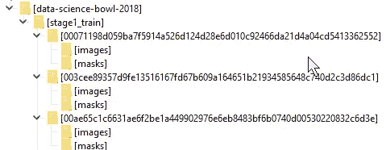

数据科学碗数据集结构

子文件夹“图像”包含一个组织扫描图像文件。子文件夹“masks”包含几个 png 文件—每个带注释的 nucleus 一个文件。掩模文件是具有原始组织扫描尺寸的黑白图片，其中白色像素描绘了细胞核的位置。下图显示了数据示例。原始图像在左上角，其余是遮罩图像(只显示了少数遮罩)。

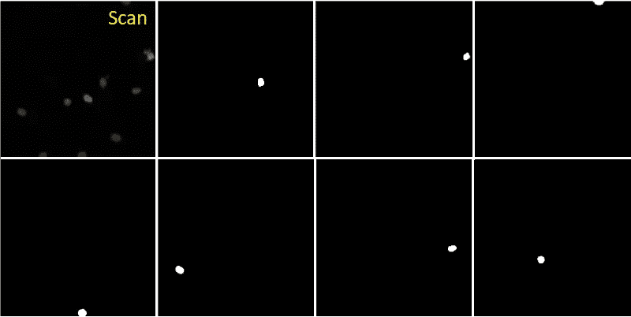

扫描图像的颜色、放大倍数和大小各不相同。以下是一些图像示例(图像被缩放以适合文档):

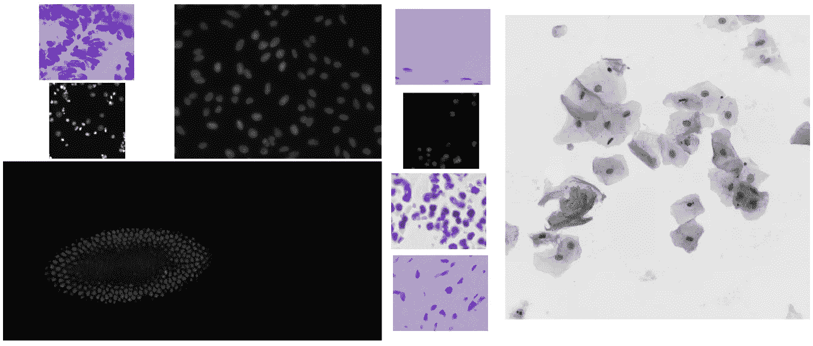

# 数据集准备

## 图像尺寸

卷积神经网络处理相同大小的图像。[数据科学碗 2018 kaggle 数据集](https://www.kaggle.com/c/data-science-bowl-2018)包含不同大小的图像。第一个挑战是将所有数据集图像调整到相同的大小。一种可能的方法是将图像的大小调整到某个标准大小。这将导致缩小规模时丢失一些信息，并通过扩大规模增加计算复杂性。因为图像具有不同的宽/高比，所以它甚至更有问题。沿 x 轴和 y 轴使用不同的缩放系数会使图像失真。

在本文中，我们使用另一种方法。图像的最小尺寸(256x256 像素)作为基础。所有图像都由具有基本尺寸的瓦片集合分解。原始的 256x256 图像由一个单幅图块表示。尺寸较大的图像由重叠的 256x256 拼贴分解。因此，大小为 320x320 的图像将由 6 个图块表示，如下图所示:

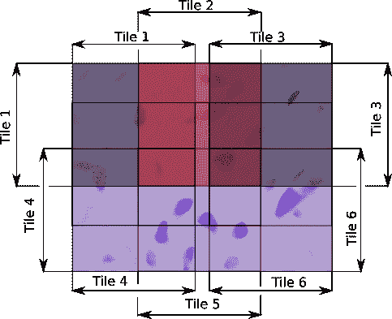

平铺重叠带来了另一个积极的效果:它增加了训练集的大小。

## 图像亮度

为了将所有图像置于同一色彩空间，彩色图像被转换为灰度图像。

另一个挑战是数据集包含不同亮度的图像。高亮度图像显示细胞核为暗点，低亮度图像显示细胞核为亮点。见下图:

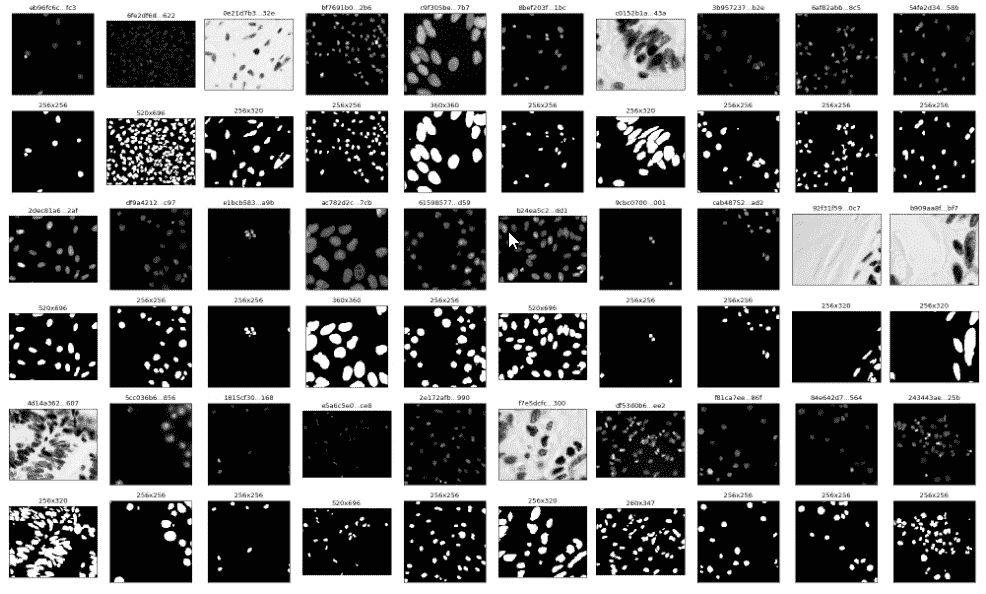

为了减少差异，我们将明亮的图像反转。

## 培训、验证和测试集

为了实现具有不同亮度水平和细胞核密度的图像的均匀分布，我们根据图像的光栅统计(像素值的最小值、最大值、平均值和标准偏差)将图像分成几个组。详情见 Github 上的[数据集笔记本](https://github.com/Booritas/semantic-segmentation/blob/master/data/data-science-bowl.ipynb)。训练、验证和测试数据集是用相同比例的不同聚类创建的。下图显示了几行图像。每一行代表一个集群。

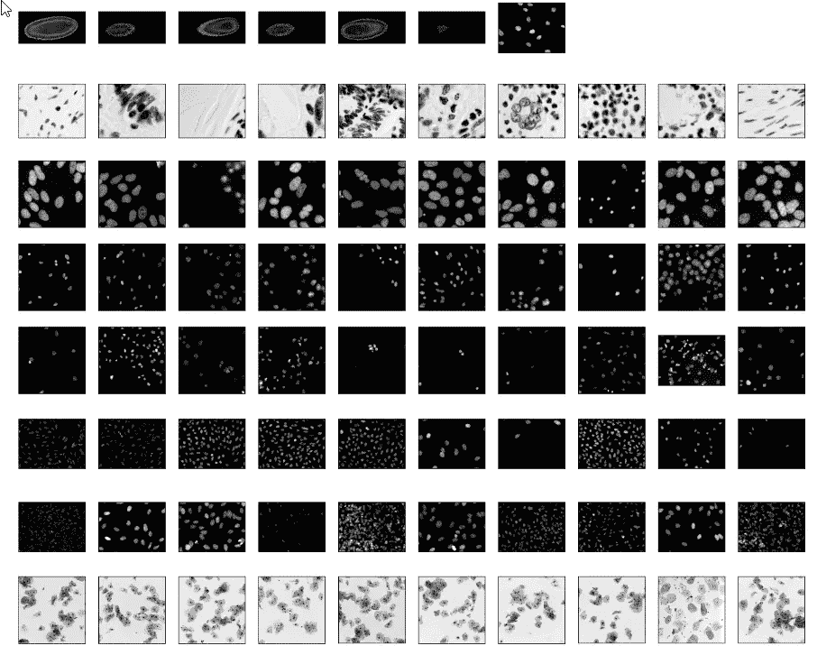

# U-net 架构

最初这里提出了 U-net 神经网络架构: [U-Net:用于生物医学图像分割的卷积网络](https://arxiv.org/pdf/1505.04597.pdf)。在原始版本的网络输入和输出图像有不同的大小。在本文中，我们使用对称架构(【https://github.com/zhixuhao/unet】[)。通过在原始模型中使用“相同”填充而不是“有效”来实现对称。](https://github.com/zhixuhao/unet)

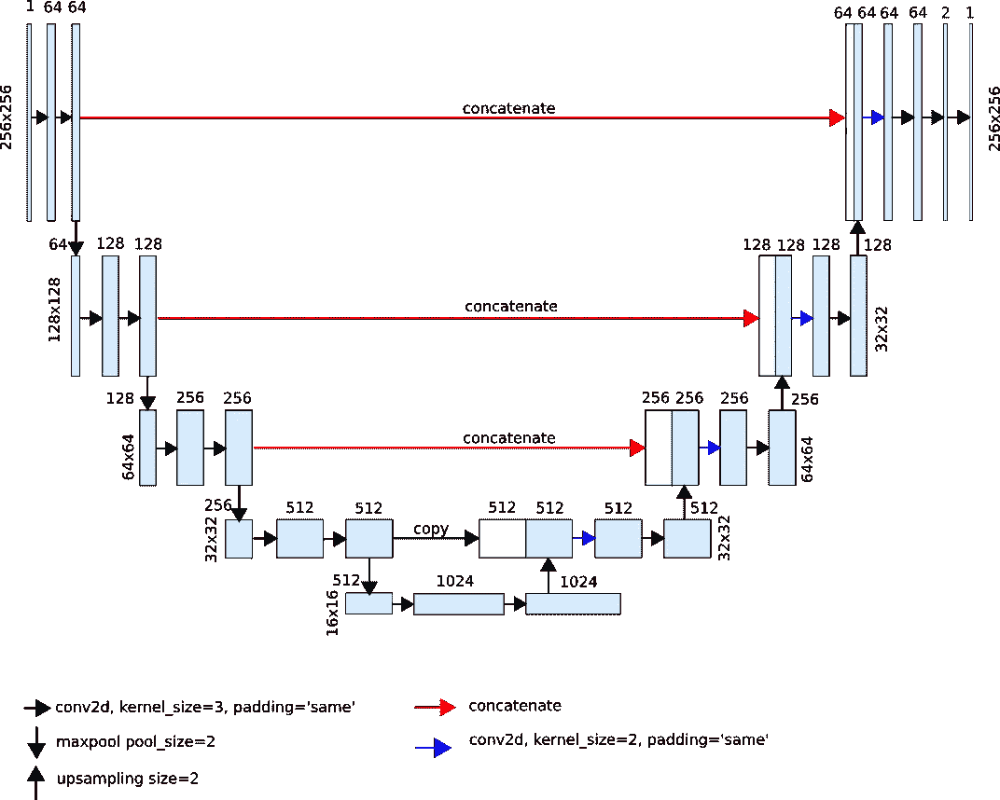

# 培养

使用 Adam optimizer 以 1.e-4 的学习率对模型进行训练。下图显示了在不同步骤的训练过程中生成的预测掩码的演变。最后一行显示手动注释。

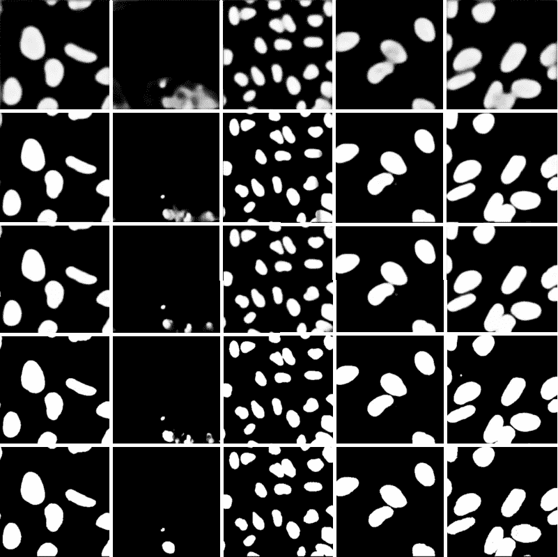

下面的图片显示了在模型训练过程中损失、精度和像素差异是如何变化的。

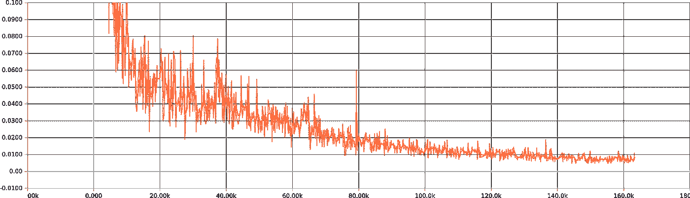

损失图

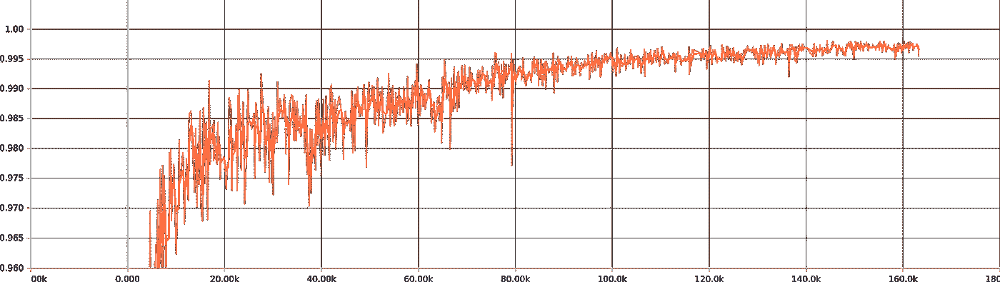

准确度图

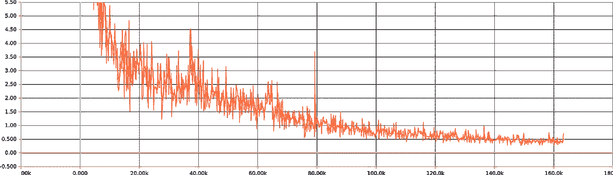

像素差异图

# 结果

在每个 4000 步的 3 个时期之后，训练损失下降到 0.006，验证损失下降到 0.14。训练数据集的精度达到 0.9975，验证数据集的精度达到 0.98。下图显示了来自测试数据集的几幅图像的预测结果(第一行是图像，第二行是预测，第三行是注释) :

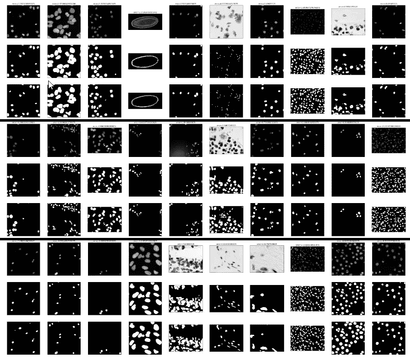

下图显示了误差最大的图像(超过 6%的错误分类像素)的结果与注释的偏差。第一行包含原始图像，第二行—预测结果，第三行—注释遮罩，第四行—预测图像和注释图像之间的像素差异:

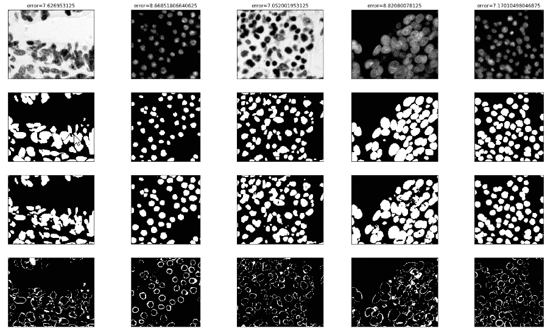

尽管相对大量的像素在注释和预测掩模上不同，但是生成的分割的质量并不太差。大多数差异出现在弥散核边界和重叠核上。然而，所有的细胞核都被检测到了。