# 使用 U-网的语义分割

> 原文：<https://medium.com/analytics-vidhya/semantic-segmentation-using-u-nets-79d677a6fd98?source=collection_archive---------18----------------------->

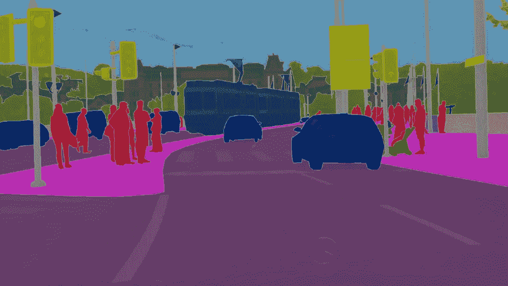

语义分割([来源](https://neurohive.io/wp-content/uploads/2018/11/u-net-segmentation-e1542978983391.png))

顾名思义，**图像分割**就是将一幅图像分割成多个片段的过程。又细分为两部分，分别是 ***实例切分*** 和 ***语义切分*** 。在实例分割中，图像中的每个实例被分配一个不同的标签。在语义分割中，属于同一对象类的实例被分配相同的标签。例如，在包含五个人和一张桌子的图片中，实例分割算法将对这五个人和桌子进行不同的标记。然而，语义分割算法会给所有五个人分配相同的标签，而只给桌子分配不同的标签。

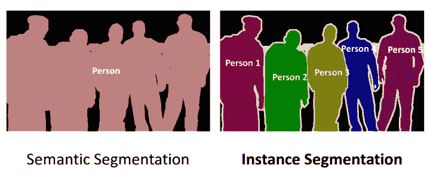

语义切分和实例切分的比较([来源](https://anolyticshome.files.wordpress.com/2019/11/nested-classifications-for-instance-segmentation-1-1.png?w=720)

在这篇博客中，我们将使用 U-NETs 深入研究语义分割。

# 语义分割和对象检测的区别。

语义分割不应该与对象检测混淆。对象检测是在感兴趣的对象周围创建边界框的过程，而语义分割颜色以不同的颜色对不同对象类别的每个像素进行编码。

让我们考虑一些例子。

考虑下面的图像:

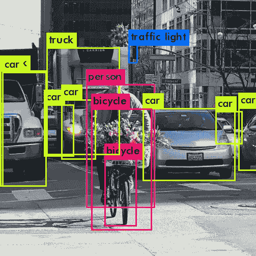

物体检测([来源](https://miro.medium.com/max/503/1*xWntyXM0W-SuDMgWMM6mCg.png))

上图是物体探测的一个例子。基本上就是物体定位和分类的结合。

现在考虑这张图片:

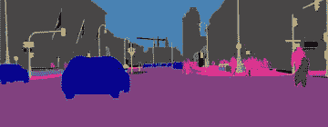

语义分割([来源](https://encrypted-tbn0.gstatic.com/images?q=tbn%3AANd9GcRp5tJKc1fuh5tHKiDQbrOuz3GSB8g0n-q47GYlp1Uc3E8zauOx&usqp=CAU))

这是语义分割的一个例子。如你所见，所有的车都用蓝色突出显示，人用红色突出显示，等等。属于同一对象类的对象以相同的颜色突出显示。

# 性能指标

在进入 U-NETs 的架构之前，让我们了解一些常用的用于评估语义分割算法的性能指标。

## 计算每个类的平均精度和召回率。

***这就是精度告诉我们的:*** 在模型宣称为正的所有点中，实际上有百分之多少是正的？

精度可通过以下公式计算:

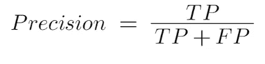

TP =真阳性

FP =假阳性

***这是回忆告诉我们的:*** 所有的实际阳性点中，有多少是预测阳性的？

可以使用以下公式计算召回率:

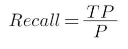

P =正点数的总数。

## 并集上的交集

这也被称为 *Jaccard 相似度*。顾名思义，地面真实值和预测输出值的交集面积除以两者面积的并集。它是地面真实值和预测值之间相似性的度量。

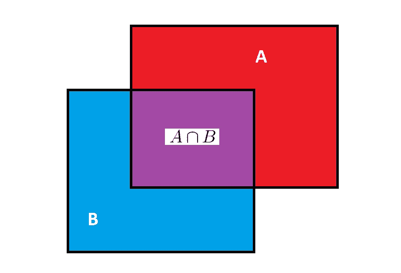

设区域 A =地面真实

区域 B =预测产量

IoU 值可通过以下公式计算:

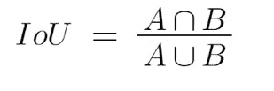

联合值可以通过以下公式计算:

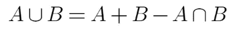

**IoU 的最佳值为 1，最差值为 0。**IoU 值越大，预测输出越符合地面实况。

出于语义分割的目的，可以在多个主要类别上取 IoU 值的平均值来测量算法的性能。

# u 型网

让我们深入 U-net 的架构。

U-NET 架构([来源](https://lmb.informatik.uni-freiburg.de/people/ronneber/u-net/u-net-architecture.png))

为了更好地理解整个架构，让我们把它分成几个步骤。

**步骤 1** :考虑一个 572x572x1 的输入图像。(灰度图像)

**第二步**:从上图看，下一步是 3x3 Conv，ReLU。

> 如果我们有一个大小为 NxN 的图像和一个大小为 KxK 的过滤器/内核，那么这个卷积层的输出将是(N-K+1)x(N-K+1)。

我们输入图像的大小是 572x572。因此这里 N=572。

我们的内核大小是 3x3。因此，K=3

输出图像的大小将为 570x570

> 输出图像的深度将等于内核的数量。

因为有 64 个内核，所以步骤 2 的输出图像的尺寸为 570x570x64。

**第三步** : 3x3 Conv，ReLU

如果我们遵循与步骤 2 相同的步骤，步骤 3 的输出图像的尺寸是 568×568×64。**将此输出命名为 a。**

**第四步**:最大池 2x2，步幅=2

> 如果输入大小为 NxN，过滤器大小为 KxK，则最大池输出的大小将为(N-K+2P+1)x(N-K+2P+1)。这里 P 指的是填充，通常被认为是 1(零填充)。

因此，最大池化后的输出大小为 569x569x64

> 如果输入大小为 NxN，过滤器大小为 KxK，步长为 s，则输出的大小将为(⌊(N-K)∕S⌋+1)x(⌊(N-K)∕S⌋+1 ),其中⌊ ⌋是底值函数。

步骤 4 的输出图像的尺寸是 284x284x64。

步骤 2、3 和 4 中的这三层将重复四次以上。如果您已经理解，那么您可以跳到步骤 16。否则，别担心！我已经完成了下面的所有步骤。

**第五步** : 3x3 Conv，ReLU，128 个内核

如果我们遵循与步骤 2 相同的步骤，步骤 5 的输出图像的尺寸是 282x282x128。

**第六步** : 3x3 Conv，ReLU，128 个内核

如果我们遵循与步骤 2 相同的步骤，步骤 6 的输出图像的尺寸是 280x280x128。**让这个输出被命名为 B.**

**第七步** : Maxpool 2x2，stride=2

如果我们遵循与步骤 4 相同的步骤，则步骤 7 之后的输出大小为 140x140x128

**第八步** : 3x3 Conv，ReLU，256 个内核

如果我们遵循与步骤 2 相同的步骤，步骤 8 的输出图像的尺寸是 138x138x256。

**第 9 步** : 3x3 Conv，ReLU，256 个内核

如果我们遵循与步骤 2 相同的步骤，步骤 9 的输出图像的尺寸是 136×136×256。**将此输出命名为 c。**

**第十步**:最大池 2x2，步幅=2

如果我们遵循与步骤 4 中相同的步骤，则步骤 10 之后的输出大小为 68x68x256

**第 11 步** : 3x3 Conv，ReLU，512 个内核

如果我们遵循与步骤 2 中相同的步骤，步骤 8 的输出图像的尺寸是 66×66×512。

**第 12 步** : 3x3 Conv，ReLU，512 个内核

如果我们遵循与步骤 2 相同的步骤，步骤 12 的输出图像的尺寸是 64x64x512。**将此输出命名为 d。**

**第十三步**:最大池 2x2，步幅=2

如果我们遵循与步骤 4 中相同的步骤，则步骤 13 之后的输出大小为 32x32x512

**第十四步** : 3x3 Conv，ReLU，1024 个内核

如果我们遵循与步骤 2 相同的步骤，步骤 14 的输出图像的尺寸是 30x30x1024。

**第十五步** : 3x3 Conv，ReLU，1024 个内核

如果我们遵循与步骤 2 相同的步骤，步骤 15 的输出图像的尺寸是 28x28x1024。**将此输出命名为 e。**

**步骤 16** :在“D”上复制并裁剪，在“E”上向上 conv 2x2

这就是有趣的地方。

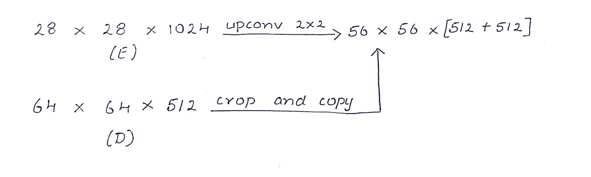

> 当我们使用上 conv 时，输入图像中的每一行和每一列都会被复制。深度减少一半。
> 
> 当我们使用裁剪和复制时，所有的中心像素(除了边界上的像素)都会被裁剪和复制。

因此，步骤 16 的输出大小为 56×56×1024

**第 17 步** : 3x3 Conv，ReLU，512 个内核

如果我们遵循与步骤 2 相同的步骤，步骤 17 的输出图像的尺寸是 54x54x512。

**第 18 步** : 3x3 Conv，ReLU，512 个内核

如果我们遵循与步骤 2 相同的步骤，步骤 18 的输出图像的尺寸是 52×52×512。**将此输出命名为 f。**

**第 19 步**:上-conv on‘F；在“C”上裁剪和复制

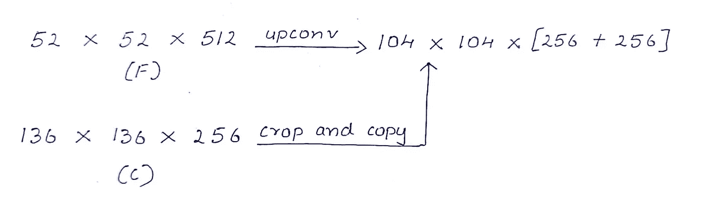

步骤 19 的输出尺寸为 104x104x512

**第 20 步** : 3x3 Conv，ReLU，256 个内核

如果我们遵循与步骤 2 相同的步骤，步骤 20 的输出图像的尺寸是 102x102x256。

**第 21 步** : 3x3 Conv，ReLU，256 内核

如果我们遵循与步骤 2 相同的步骤，步骤 21 的输出图像的尺寸是 100x100x256。**让这个输出被命名为 G.**

**步骤 22** :在“G”上向上 conv，在“B”上裁剪并复制

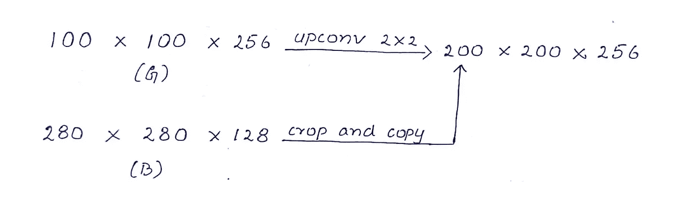

步骤 22 的输出尺寸为 200x200x256

**第 23 步** : 3x3 Conv，ReLU，128 个内核

如果我们遵循与步骤 2 相同的步骤，步骤 23 的输出图像的尺寸是 198x198x128。

**第 24 步** : 3x3 Conv，ReLU，128 个内核

如果我们遵循与步骤 2 相同的步骤，步骤 24 的输出图像的尺寸是 196×196×128。**将此输出命名为 h。**

**步骤 25** :在“H”上向上 conv，在“A”上裁剪并复制

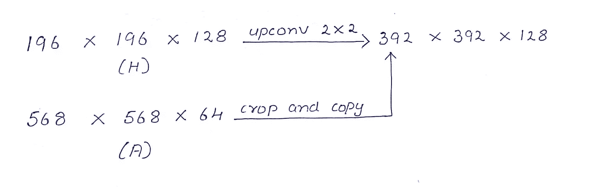

步骤 25 的输出尺寸为 392x392x128

**第 26 步** : 3x3 Conv，ReLU，64 个内核

如果我们遵循与步骤 2 相同的步骤，步骤 26 的输出图像的尺寸是 390x390x64。

**第 27 步** : 3x3 Conv，ReLU，64 个内核

如果我们遵循与步骤 2 中相同的步骤，步骤 27 的输出图像的尺寸是 388x388x64。

**第 28 步** : 1x1 个 Conv，2 个内核

步骤 28 的输出尺寸为 388×388×2

**这是输出图像。**

步骤 1-15 由图像尺寸缩小时的**收缩路径**组成。步骤 16–28 由图像尺寸逐渐增大时的**扩展路径**组成。

参考:[https://arxiv.org/abs/1505.04597](https://arxiv.org/abs/1505.04597)