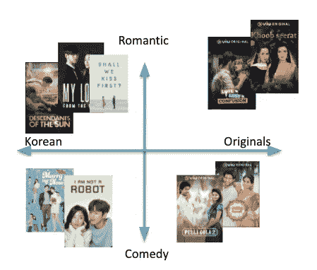

# 推荐系统中的语义相似度

> 原文：<https://medium.com/analytics-vidhya/semantic-similarity-for-recommender-system-d72c58dfe686?source=collection_archive---------6----------------------->

寻找相似的树叶对人类智能来说更容易，但对机器智能来说就没那么简单了。图片来源:Shutterstock

# **简介**

F 发现相似性是搜索、**推荐器**、检索、版权合规以及许多其他系统的核心方面之一。在 Viu，相似性最重要的用例之一是根据用户历史找到最相关的电影/电视剧/歌曲，以进行有效的推荐。设计一个有效的推荐系统有许多方面(事件检测、日志记录、用户数据、内容数据、显式信号、A/B 测试、布局等),在本文中，我们将重点介绍如何利用一些最新的先进的**语义相似度**机器学习模型，这些模型使用内容元数据来开发 Viu 的推荐系统。我们平台上的大多数项目(电影、电视节目、歌曲、新闻、文章等)都有元数据(概要、标签、字幕等)。)作为文本，我们用它来构建高效(性价比高 KPIs 更好)推荐系统的模型之一。

# 语义相似度

A 在许多用于查找文本相似性的[信息检索](https://en.wikipedia.org/wiki/Information_retrieval)方法中，一种常见的方法是提取关键字并基于关键字匹配文档，但是如果项目不使用相同的术语，这种方法会有很高的遗漏率，并且对我们来说，高遗漏率是由于嘈杂的元数据(例如:不正确的拼写、多语言、缺失数据等)。为了克服高缺失率的挑战，存在另一种流行的方法，即****，它依靠意义的相似性来找到相似的项目，并且在最近[表征学习](https://arxiv.org/abs/1206.5538)中的许多破坏性创新之后被广泛采用。语义相似性有助于发现词汇相似性所不能发现的条目之间的关系。****

****例如，在给定项目 1 和项目 2 的元数据的情况下，项目 1 和项目 2 之间的相似性不能通过传统的相似性来发现，但是语义相似性有助于解开否则会被遗漏的这种相似性。****

****Item1(剧情简介，标签):(伤心欲绝的大亨 Aditya 濒临自杀边缘，漫无目的地登上了一列火车。他遇到了 Geet，一个活泼的女孩，计划和她的情人私奔，并发现自己被拉进了她的疯狂生活，电影，浪漫。****

****第二项(剧情简介，标签):(是什么促使凡荣和贾古在他们的婚礼、电视剧、喜剧前几个小时私奔了)。****

## ****语义相似性有两个关键方面****

1.  ****语义表示****
2.  ****询问****

****S emantic 表示，通过将项目表示为**嵌入来实现，**是高维向量到低维空间的平移。这些嵌入是使用机器学习来学习的，或者使用 [word2Vec](https://arxiv.org/abs/1301.3781) 、 [Glove](https://nlp.stanford.edu/projects/glove/) 、 [ELMo](https://allennlp.org/elmo) 、 [Transformers](https://huggingface.co/transformers/) 文本模型，通过创建用于学习的合成任务。学习这些嵌入常用的合成任务有分类、[语言建模](https://en.wikipedia.org/wiki/Language_model)(单词预测)、[屏蔽语言建模](https://arxiv.org/pdf/1810.04805.pdf)等。****

********

****项目的 2D 向量表示法(TVShows @ Viu)****

****上图(仅为了便于表示，这些维度会有所不同，取决于数据，通常在 100 到 500 的范围内)显示了机器学习算法如何为每个项目学习这些向量值，而不知道它们是与浪漫与喜剧、韩国与原创等相关的因素。****

****其次，这些嵌入需要被保存，以便以后基于最近邻搜索进行查询。然而，为了实时找到相似的项目，[近似最近邻(ANN)](https://en.wikipedia.org/wiki/Nearest_neighbor_search) 相似性在实践中被广泛使用，其中项目被适当地存储用于查询之间的相似性，并且项目被使用(软)余弦/欧几里德距离来计算。近似相似性有两种主要方法:****

1.  ****基于树的方法****
2.  ****基于散列的方法。****

****基于树( [KD-Tree](https://en.wikipedia.org/wiki/K-d_tree) 、 [VP-Tree](https://en.wikipedia.org/wiki/Vantage-point_tree) 、…)的方法以分而治之的方式递归地划分数据，这使得相似的向量在树中彼此靠近，具有预期的 O(log(n))复杂度。****

****基于散列的方法将项目转换成代码，其中相似的项目将产生相同或相似的代码(散列冲突),具有 O(1 ),但是在 n 中可以是次线性的，其中 n 是项目(向量)的数量。****

****有几个开源库( [NMSLIB](https://github.com/nmslib/nmslib) ， [FAISS](https://github.com/facebookresearch/faiss) )实现了近似的相似性，在精度、查询延迟、内存效率、构建索引的时间和易用性之间进行了不同的权衡。****

****为了进一步提高相似性搜索的速度和准确性，最近在 [ICML 2020](https://icml.cc/Conferences/2020) 上，谷歌发表了一篇关于近似相似性的有趣论文，通过使用一种新颖的量化技术压缩向量。ScaNN 在来自[ann-benchmarks.com](http://ann-benchmarks.com/)的[glove-100-angular benchmark](http://ann-benchmarks.com/glove-100-angular_10_angular.html)上实现了最先进的结果，在给定精度下实现了 **~2x QPS** 作为下一个最快的库，我们正在根据我们的数据在速度-精度之间的权衡来进一步研究它。****

********

****比较 ScaNN 与其他库在速度-精度权衡的各个方面。https://arxiv.org/pdf/1908.10396.pdf****

****在 Viu，我们的内部推荐系统为我们的平台带来了很大一部分的参与度/留存率。我们在推荐系统中使用的许多模型之一是基于[doc 2 vec 模型](https://arxiv.org/abs/1405.4053)的，该模型使用概要、字幕、标签等来学习项目的语义表示。最近，我们还用 transformers 模型对我们的一个基于内容的推荐进行了实验，但是在 A/B 测试中结果并不像预期的那样。下面的架构图显示了唯一一代基于语义相似度的推荐(基于内容的模型)，还有许多其他架构方面(QPS、延迟、敏捷性、弹性、正常运行时间等)为不同的客户端实时提供推荐，我们将在未来的文章中介绍。****

****为了生成基于语义相似性的推荐，初始过程由 Jenkins scheduler 触发，它从 Google Big-query 获取内容元数据，并将其下载到相似性引擎进行预处理(标记化、词条化、停用词移除、过滤等)，然后使用自我监督学习(基于项目自相似性得分的超调优模型)进行嵌入生成，并使用 Faiss 查找前 N 个相似项目。生成的推荐上传到云存储，云功能触发数据流将生成的内容推荐存储到数据存储。推荐器服务最终通过将这些内容推荐与其他模型输出交错，然后进行后处理过滤(即缩略图、地理、许可证和许多其他检查)来消费这些内容推荐。****

********

****基于内容推荐的语义相似度体系结构****

****在 A/B 测试中，由内部推荐系统驱动的大多数主页行、用户通知实现了 2-5 倍的 KPI (点击率、视频分钟数、更好的用户保持率)。此外，在最初的产品可行性期间，我们整合了来自领先的人工智能解决方案提供商的一些外部解决方案，以获得满足我们需求的最佳解决方案，并与他们一起运行 A/B，发现我们的内部解决方案工作得更好，因为机器学习模型的强大的**域适应**和**情境化**。****

****目前，我们在 Viu 的推荐系统团队正专注于通过添加更多明确的信号、探索不同的模型架构([序列模型](https://arxiv.org/pdf/1904.06690.pdf)、 [xDeepFM](https://arxiv.org/abs/1803.05170) 、…)、改进冷启动推荐以及为我们的用户添加更多不同的推荐，来进一步改进模型的离线指标( [precision @ K](https://en.wikipedia.org/wiki/Precision_and_recall) 、 [mean reciprocal ran](https://en.wikipedia.org/wiki/Mean_reciprocal_rank) k、[归一化分布累积增益](https://en.wikipedia.org/wiki/Discounted_cumulative_gain))。****

****Viu 的推荐系统是各个团队(机器学习、架构、App、产品、QA 和项目管理)跨职能合作的结果。我们将在未来更多地介绍推荐系统的不同模型，如基于用户消费数据的[协作模型](https://en.wikipedia.org/wiki/Learning_to_rank)、使用显式信号的[因子分解机模型](https://arxiv.org/abs/1803.05170)、显式信号的数据丰富模型、[多目标推荐系统](http://yongfeng.me/attach/lin-recsys2019.pdf)以及 A/B 测试。****

# ******参考文献******

1.  ****[https://cloud . Google . com/solutions/machine-learning/building-real-time-embedding-similarity-matching-system](https://cloud.google.com/solutions/machine-learning/building-real-time-embeddings-similarity-matching-system)****
2.  ****[https://cloud . Google . com/solutions/machine-learning/overview-extracting-and-serving-feature-embedding-for-machine-learning](https://cloud.google.com/solutions/machine-learning/overview-extracting-and-serving-feature-embeddings-for-machine-learning)****
3.  ****[https://engineering . FB . com/data-infra structure/faiss-a-library-for-efficient-similarity-search/](https://engineering.fb.com/data-infrastructure/faiss-a-library-for-efficient-similarity-search/)****
4.  ****[https://ai . Google blog . com/2020/07/announcing-scann-efficient-vector . html](https://ai.googleblog.com/2020/07/announcing-scann-efficient-vector.html)****