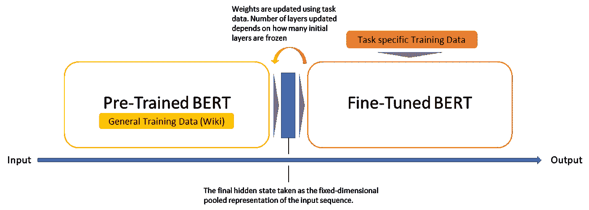
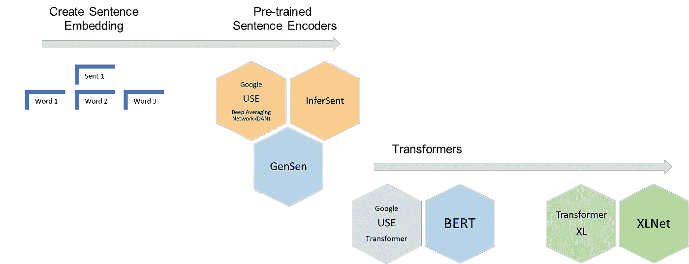
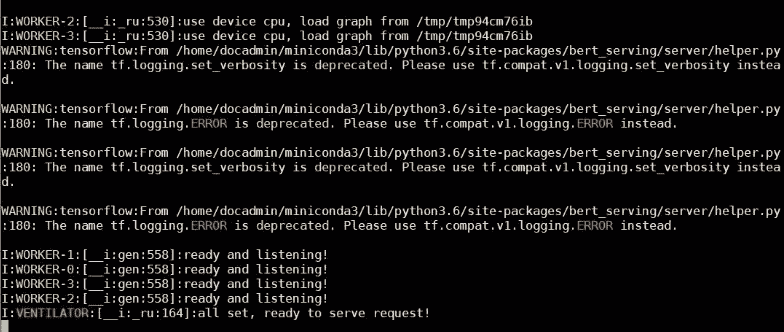
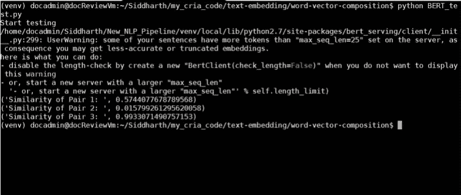

# 句子和 BERT 中的语义相似性

> 原文：<https://medium.com/analytics-vidhya/semantic-similarity-in-sentences-and-bert-e8d34f5a4677?source=collection_archive---------1----------------------->

自谷歌在 2018 年开源以来，来自变压器或 BERT 的双向编码器表示一直是 NLP 中的一种流行技术。使用最小的特定任务微调工作，研究人员已经能够通过利用预先训练的模型来超越多个基准，这些模型可以很容易地实施以产生最先进的结果。本文巩固了关于句子相似性的流行知识，并涵盖了在这种情况下 BERT 的突出方面及其对以前技术的改进。

# 数据问题

自然语言处理(NLP)面临的最大挑战之一仍然是训练数据的短缺。从零开始构建的 NLP 模型通常需要非常大的数据集来训练底层神经网络，以获得合理的准确性。这并不总是可行的，因为数据集的创建过程会耗费大量的时间和精力，更不用说缺乏特定应用程序的可用数据了。

鉴于这种数据的稀缺性和语言应用的多样性，大多数特定任务数据集包含相对较小的(10^3 - 10^5 记录)人类标记的训练样本集。然而，深度学习模型需要大量带注释的训练样本(10^6 - 10^9 记录)才能达到有用的准确性水平。

为了弥补这一数据缺口，使用大量未标注文本(在 BERT 的情况下是 Wiki 语料库)设计了用于预训练通用语言表示模型的技术。然后，预训练的模型可以针对特定的 NLP 任务进行微调，如问题回答、情感分析和序列相似性。

# 迁移学习和微调

与特定语料库的 CNN 或 BiLSTM 模型相比，这些模型表现如何？通过利用迁移学习，微调的 BERT 模型已经被证明对于有时可能依赖于模糊架构的特定任务来说至少与定制的实现一样好(甚至更好)。

2018 年深度预训练语言模型的推出(ELMO、伯特、乌尔姆菲特、开放 GPT 等。)标志着以前在计算机视觉中发生的 NLP 中转移学习的相同转变，在计算机视觉中，研究人员正在处理数百万个参数&计算上昂贵的训练任务，以创建精确的深度学习网络。

他们发现，深度网络学习分层特征表示(简单的特征，如最低层的边缘，在较高层逐渐变得更复杂的特征)。不是每次都从零开始训练新的网络，而是可以复制并转移具有一般化图像特征的已训练网络的较低层，以用于具有不同任务的另一个网络。很快，下载一个预先训练好的深度网络，并快速对其进行重新训练，或者在新任务的基础上添加额外的层，就成为了一种常见的做法。



伯特微调

在 BERT 的例子中，已经在维基语料库上训练过，预训练的模型权重已经编码了关于我们语言的大量信息。因此，训练微调模型所需的时间要少得多。作者建议在特定的 NLP 任务上只需要 2-4 个时期的训练来微调 BERT(相比之下，训练原始 BERT 模型或从头开始训练 LSTM 需要数百个 GPU 小时)。这比从零开始训练网络的昂贵过程要好得多。

如前所述，一个同样重要的考虑因素是数据的可用性。微调过程所需的数据集比从头构建模型所需的数据集小得多，尽管训练数据量较少，但仍能产生良好的性能。

因为预先训练的 BERT 层已经编码了大量的语言信息，所以训练分类器的成本相对较低。我们可以专注于训练顶层，因为底层现在只需要一些调整来适应我们的任务。当微调时，我们甚至可以选择冻结某些层，或者应用不同的学习速率、递减的学习速率等。以保持网络已经编码的高质量学习权重并加速训练。

最近对 BERT 的研究表明，冻结大部分重量只会导致精确度的微小下降。然而，迁移学习也有例外和更广泛的规则需要考虑，例如要完成的任务的相似性、微调数据与训练数据。即，如果任务和微调数据集与用于训练迁移学习模型的任务/数据集非常不同，则冻结权重可能不是最佳方法。

# 手头的任务:句子之间的语义相似度

许多自然语言处理应用需要计算两个短文本之间的相似度。现代搜索引擎计算文档与查询的相关性，而不仅仅是两者之间单词的简单重叠。流行的问答网站需要计算一个提问的问题与之前提问的问题(甚至答案)的相似度。这是通过从短文本中创建有用的嵌入并计算它们之间的余弦相似度，使用文本相似度来实现的。

Word2vec 和 GloVe 以类似的方式使用单词嵌入，并且已经成为寻找两个单词之间语义相似性的流行模型。然而，句子固有地包含更多关于多个单词之间关系的信息，并且计算句子嵌入的单一方法尚未出现。

估计一对句子之间的基线语义相似度的最常见方法是对两个句子中所有单词的单词嵌入进行平均，并计算所得嵌入之间的余弦。这个简单的基线可以通过忽略停用词和计算加权平均值等方法来改进。或者，也可以采用字移动器距离(WMD)和平滑逆频率(SIF)等技术来代替基线方法，以获得更高的精度。然而，所有这些方法都有两个重要的共同特征:

1.  他们没有考虑词序，因为他们是基于单词袋的方法。这是一个主要的缺点，因为词序的不同经常会完全改变句子的意思，而句子嵌入必须捕捉这些变化。捕捉句子中的引用、关系和单词序列对于机器理解自然语言至关重要。
2.  他们的单词嵌入是在无人监督的情况下学习的。虽然这本身不是一个重要的问题，但据观察，监督训练可以帮助句子嵌入更直接地学习句子的意思。



句子相似度模型的演变

# 预先训练的句子编码器

预先训练的句子编码器旨在扮演与 word2vec 和 GloVe play 相同的角色。他们接受了一系列监督和非监督任务的训练，以尽可能多地捕捉通用语义信息。它们的嵌入可以用于各种应用，例如文本分类、复述检测等。谷歌的通用句子编码器就是一个很好的例子，它有一个更简单的版本，使用深度平均网络(DAN)，其中单词和二元模型的输入嵌入被平均在一起，并通过前馈深度神经网络传递。

基于递归神经网络(RNN)的序列到序列模型也已经流行并广泛应用，因为大量真实世界数据以序列(数字序列、文本序列、视频帧序列、音频序列等)的形式存在。).随着注意机制的引入，他们的表现得到了进一步的提高。

然而，尽管取得了这些进展，一些挑战仍然存在。其中，处理长期依赖关系和为并行化调整模型架构的顺序性质是最值得注意的。转换器概念的引入是为了通过轻松实现并行化来解决这些问题。

# 伯特

**双向表示:** BERT 建立在预训练上下文表示的近期工作基础上，包括半监督序列学习、生成式预训练、ELMo 和 ULMFit。然而，与这些以前的模型不同，BERT 是第一个深度双向、无监督的语言表示，仅使用纯文本语料库(在这种情况下，是维基百科)进行预训练。

为什么这很重要？预先训练的表示可以是上下文无关的或上下文相关的，并且上下文表示还可以是单向的或双向的。诸如 word2vec 或 GloVe 之类的上下文无关模型为词汇表中的每个单词生成单个单词嵌入表示，并且不捕获多义性。

例如，单词“火车”在“货物火车”和“火车模型”中具有相同的上下文无关的表示。相反，上下文模型根据句子中的其他单词生成每个单词的表示。例如，在句子“我们将训练模型”中，单向上下文模型将基于“我们将”,而不是“模型”来表示“训练”。然而，BERT 使用它的上一个和下一个上下文来表示“训练”——“我们将……模型”——从深度神经网络的最底层开始，使其具有深度双向。

**Transformer Encoder:**NLP 中的 Transformer 是一种新颖的架构，旨在解决序列到序列的任务，同时轻松处理长范围的依赖关系。自我注意的概念允许模型查看输入序列中的其他单词，以更好地理解序列中的某个单词。此外，在 transformer 的体系结构中，自我关注不是一次而是多次计算，并行且独立。因此被称为多头注意力。

这里需要注意的是，BERT 不像通用句子编码器或推断模型那样直接针对语义句子相似性进行训练。因此，BERT 嵌入不能直接用于应用余弦距离来度量相似性。然而，有一些简单的包装服务和实现，比如流行的 bert-as-a-service，可以用来达到这种效果。

## 简单的实现:伯特即服务

这是流行的[伯特即服务](https://github.com/hanxiao/bert-as-service)的一个简单例子。 [BERT_test.py](https://github.com/siddharthnarayanan/BERT-test) 文件是对 [example8.py](https://github.com/hanxiao/bert-as-service/blob/master/example/example8.py) 的简单修改。

1.安装所需的服务器和客户端

```
pip install bert-serving-server  # server
pip install bert-serving-client  # client, independent of `bert-serving-server`
```

2.在新的控制台窗口中，启动 BERT 服务。请注意，您必须为 BERT 选择正确的路径和[预训练模型](https://github.com/google-research/bert#pre-trained-models)名称

```
bert-serving-start -model_dir /tmp/english_L-12_H-768_A-12/ -num_worker=4
```



3.切换回另一个控制台窗口并运行您的测试脚本

```
python BERT_test.py
```



# 变压器-XL

虽然 transformer 体系结构由于其学习长期依赖性的能力而相对于现有的基于 NN 的 seq2seq 模型是一个巨大的改进，但它也带来了自己的挑战。由于使用了固定长度的上下文(输入文本段)，转换不能超出某个级别。Attention 只能处理固定长度的文本字符串，并要求在作为输入提供之前将文本分割成一定数量的片段。当在不考虑句子或任何其他语义边界的情况下分割文本时，这种文本分块会导致上下文碎片。也就是说，如果一个句子从中间分开，那么大量的上下文可能会丢失。

提出了新的 Transformer-XL 架构来克服这一缺点，该架构使用在先前段中获得的隐藏状态，并将它们重新用作当前段的信息源。由于信息可以从一个部分流向下一个部分，这使得能够对长期依赖性进行建模。最新的模型，如 XLNet，通过使用变压器 XL 作为其基础架构，建立在当前最先进的方法上。

# 警告

与单词相似性相比，句子相似性是一种相对复杂的现象，因为句子的意义不仅取决于其中的单词，还取决于它们的组合方式。语义相似度可以有几个维度，句子可能在一个维度上相似，但在另一个维度上相反。

像所有模型一样，BERT 并不是适合所有问题领域的完美解决方案，根据任务的不同，可能需要评估多个模型的性能。例如，如果某个特定领域中有一群词显著改变或驱动了文本中的整体意义，那么与 BERT 相比，GloVe 等基于词的模型可能更好地捕捉到这些细微差别。

类似地，专门为句子嵌入和相似性设计的模型，如 Google 的 USE(通用句子编码器),在某些情况下可能比 BERT 给出更好的结果。因此，建议对样本数据进行一些初步测试，并根据经验测试模型性能，以确定所需实现的方向和类型。

# 参考

[1][https://mccormickml.com/2019/07/22/BERT-fine-tuning/](https://mccormickml.com/2019/07/22/BERT-fine-tuning/)

[2]https://yashuseth.blog/author/yashuseth/

[3]http://nlp.town/blog/sentence-similarity/

[https://github.com/hanxiao/bert-as-service](https://github.com/hanxiao/bert-as-service)