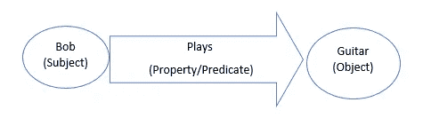
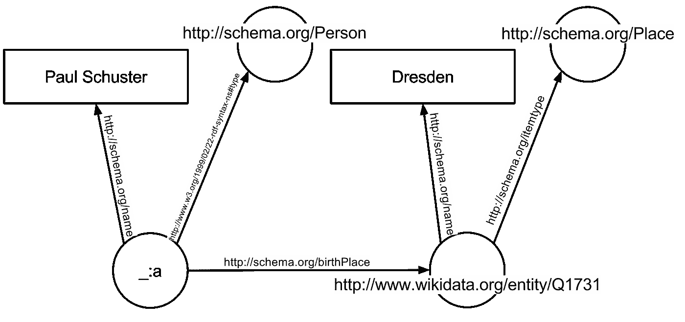
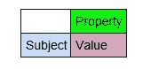

# 语义网及其在数据科学中的作用

> 原文：<https://medium.com/analytics-vidhya/semantic-web-and-its-role-in-data-science-600d6387aef0?source=collection_archive---------12----------------------->

语义网技术在促进机器快速理解网络数据方面有很大潜力。有了原始数据和语义三元组数据库，就可以将数据转化为有用的知识。NLP 和语义网技术如果结合起来，可以提供处理结构化数据和大量非结构化数据的能力。

以下是我收集的一些术语定义:

什么是语义网？

语义网**是通过万维网联盟(W3C)制定的标准对万维网的扩展。语义网的目标是使互联网数据机器可读，以供机器使用。**加入网页的元数据**可以让现有的万维网机器可读。**

Schema.org 是一个协作性的社区活动，其任务是创建、维护和推广互联网、网页、电子邮件等中的结构化数据模式。超过 1000 万个网站使用 Schema.org 来标记他们的网页和电子邮件

OWL:W3C Web 本体语言(OWL)是一种语义 Web 语言，旨在表示关于事物、事物组以及事物间关系的丰富而复杂的知识。

**本体**:本体包括概念、数据和实体之间的类别、属性和关系的表示、正式命名和定义，这些概念、数据和实体证实了一个、多个或所有话语领域。本体是通过定义一组代表主题的概念和类别来显示主题领域的属性以及它们之间的关系的一种方式。例如，本体可以描述概念、实体之间的关系以及事物的类别。

**三元组:**三元组是主语、谓语和宾语(SPO)。例如，在鲍勃弹吉他中，主语是鲍勃，谓语是演奏，宾语是吉他。这和图中的边是一样的。

RDF:资源描述框架(RDF)是万维网数据交换和表达图形数据的标准模型。RDF 扩展了 Web 的链接结构，使用 URIs 来命名事物之间的关系以及链接的两端(“三元”)。使用这个简单的模型，它允许在不同的应用程序之间混合、公开和共享结构化和半结构化数据。

RDFa 生成的图形如下所示(图片取自[https://en . Wikipedia . org/wiki/Semantic _ Web #/media/File:RDF _ example . SVG](https://en.wikipedia.org/wiki/Semantic_Web#/media/File:RDF_example.svg))

RDF 模式 (RDFS): RDF 模式为 RDF 数据提供了一个数据建模词汇表。RDF 模式是基本 RDF 词汇表的扩展。

RDF 三元组存储:RDF 三元组存储是一种存储语义事实的图形数据库。

**语义推理机**:一个**语义推理机**、**推理引擎**、**规则引擎**，或者简称为**推理机**，是一个能够从一组断言的事实或公理中推断出逻辑结果的软件。语义推理机的概念概括了推理机的概念，提供了更丰富的工作机制。推理规则通常由本体语言指定，并且通常由描述逻辑语言指定。

**RDF 三重存储数据库比关系数据库更适合存储语义 Web 数据？**

在 RDF 三元组存储中，所有的实体将被设计为主题属性值或主题谓词对象(SPO)的三元组

RDF 三元组存储只关注存储 RDF 三元组的行。在关系数据库中，它类似于

如果我们将同一个 Subject 属性建模到一个关系数据库中，我们将得到许多只有两列的表。它会有大量的桌子。我们可以有一个超级稀疏的 150 列的表，其中有 3 个条目。我们从多个来源获取许多不断变化的实体类型，在 SQL 中，您最终会得到一个非常宽、非常稀疏的表或太多的表。此外，您最终会得到动态 DDL/模式。这就是为什么三重存储更适合存储和查询这类数据的原因。Apache Rya 是一个基于云的 RDF 三元组存储，支持 SPARQL 查询。

**三重存储与图形数据库有何不同？**

图遍历似乎很容易，但超级节点会扼杀一切。

> “超节点”是具有不成比例的大量关联边的顶点。虽然超节点在自然图形中很少见，但它们在图形分析中经常出现。原因是超级节点连接到如此多的其他顶点，以至于它们存在于图中的许多路径上。因此，任意遍历都有可能触及超节点。在图形计算中，超节点会导致系统性能问题。

属性图没有解决这个问题。

Triple stores 和 W3C 标准 OWL 被设计成‘互联网规模’。

在 RDF 中你可以有另一个关系。你不能做的事情是增加一个属性——你只能在 RDF 中设置它们。这使得一些事情变得困难，但这也是为什么它的伸缩性更好。在属性数据库中，边和节点可以内置属性。在 RDF 中，你可以说人有年龄作为另一个关系。内置属性和边缘是性能的痛点。如果你想更新一个图中的边，你必须找到它，通常是通过 id，然后更新它。如果您想更新 RDF 图中的一条边，您只需在其中添加一条新边。对于插入来说也是一样，你必须有一种分配新 id 的方法，这种方法在一台机器上有效，但是在你分布的时候就不那么好了。

**链接开放数据:**链接开放数据基于语义网的 RDF 标准定义了互联网上全球可访问和链接数据的愿景。RDF 三重存储数据库被成功地用于管理链接的开放数据数据集，如 [DBPedia](http://dbpedia.org/) 和 [GeoNames](http://www.geonames.org/) ，它们被发布为 RDF 并相互连接。链接开放数据允许更快地查询和回答查询，并获得高度相关的搜索结果。

感谢奈杰尔·布朗的见解。

# 我在语义网上找到的一些不错的教程

*   播放列表语义网教程:[https://www.youtube.com/playlist?list = plea 0 wjq 13 cn DDE 8 V7 evlreiaonfztoeaq](https://www.youtube.com/playlist?list=PLea0WJq13cnDDe8V7eVLReIaOnFztOEAq)
*   Coursera 课程“数据网络”:[https://www.coursera.org/learn/web-data/home/welcome](https://www.coursera.org/learn/web-data/home/welcome)
*   RDF 快速介绍:[https://www.youtube.com/watch?v=zeYfT1cNKQg](https://www.youtube.com/watch?v=zeYfT1cNKQg)

# 参考

*   语义推理机[https://en.wikipedia.org/wiki/Semantic_reasoner](https://en.wikipedia.org/wiki/Semantic_reasoner)
*   https://www.youtube.com/watch?v=0OWSpFaDR_M:支持实时的优化
*   图形数据库和 RDF 的区别[https://next web . gnoss . com/en/resource/what-the-differences-between-a-graph-database/ced 22960-845d-410 f-9e3c-5616 c 603993 e \](https://nextweb.gnoss.com/en/resource/what-are-the-differences-between-a-graph-database/ced22960-845d-410f-9e3c-5616c603993e/)
*   [https://en.wikipedia.org/wiki/Semantic_Web](https://en.wikipedia.org/wiki/Semantic_Web)
*   [https://www . Cambridge semantics . com/blog/semantic-university/comparing-semantic-technologies/NLP-semantic-web/](https://www.cambridgesemantics.com/blog/semantic-university/comparing-semantic-technologies/nlp-semantic-web/)
*   [https://www . onto text . com/knowledge hub/fundamentals/what-is-rdf-triplestore](https://www.ontotext.com/knowledgehub/fundamentals/what-is-rdf-triplestore)
*   [https://www.w3.org/egov/wiki/Linked_Open_Data](https://www.w3.org/egov/wiki/Linked_Open_Data)
*   [https://computer.howstuffworks.com/semantic-web.htm](https://computer.howstuffworks.com/semantic-web.htm)
*   [https://dzone . com/articles/solution-super node-problem #:~:text = in % 20 graph % 20 theory % 20 and % 20 network，up % 20 frequency % 20 during % 20 graph % 20 analysis](https://dzone.com/articles/solution-supernode-problem#:~:text=in%20graph%20theory%20and%20network,up%20frequently%20during%20graph%20analysis)。