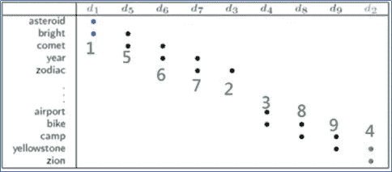
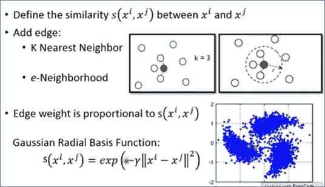

# 半监督学习(洪-李易的 ML 类笔记)

> 原文：<https://medium.com/analytics-vidhya/semi-supervised-learning-note-of-ml-class-of-hung-yi-lee-3aed0a7207f1?source=collection_archive---------12----------------------->

讲座视频:[https://www.youtube.com/watch?v=fX_guE7JNnY&list = PLJV _ El 3 uvtspy 9 ocry 30 obpnlc 89 Yu 49&index = 21](https://www.youtube.com/watch?v=fX_guE7JNnY&list=PLJV_el3uVTsPy9oCRY30oBPNLCo89yu49&index=21)

是半监督学习中大家很好的辅导讲座。如果你懂中文，这个讲座会是个不错的选择。
本帖所有数字均来自本次讲座。

半监督学习的第一点是，我们必须知道'*直推式*和'*归纳式*'学习之间的区别。
—直推式学习:使用测试集作为无标签数据，但不使用测试集的标签。
—归纳学习:找到更多的数据作为未标记数据。

生成模型中的半监督学习

半监督学习在生成模型中是如何实现的？

1.  通过随机初始化或通过预训练模型初始化模型的参数。
2.  步骤 1:计算未标记数据的后验概率
3.  步骤 2:更新未标记数据的先验概率和均值
4.  使用新的先验和均值回到步骤 1 来更新后验概率

整个过程看起来像 EM(期望最大化)算法，第一步是‘E’，第二步是‘M’。

2 半监督学习实现中经常用到的假设是低密度分离和光滑假设。

# **低密度分色(黑白世界)**

半监督学习中低密度分离最典型的例子是自训练

虽然自训练看起来很像生成模型中的半监督学习，但是我们经常在自训练中使用硬标签，在生成模型中使用软标签。为什么？如果我们在 NN 模型中使用软标签，例如，对新目标使用[0.7±0.3]，我们将无法更新模型，因为新目标与原始标签相同。

未标记的数据如何能够更新模型

如何让‘未标记数据→标记数据’影响模型训练？修改损失函数！我们计算计算输出(新标签)的熵，并将其作为正则项添加到损失函数中。我们都知道神经网络训练的重点是最小化损失，因此新标签的熵也在最小化过程中。

为什么有效？看一下上图的左边部分。在进行分类时，我们总是希望输出结果是“简单的”。如果所有类别的概率非常接近，我们将认为模型仍然需要更多的时间来训练。这很糟糕。根据这个概念，我们知道输出熵越小，输出越好。此外，它满足低密度分离的假设。

# 平滑度假设

平滑假设的概念

光滑性假设的概念是，如果点在同一个高密度簇中，那么成为标签的概率就高。换句话说，如果我们发现接近的点属于同一个标签，这个模型(函数)就是光滑的。

我们将用两个例子来解释这个概念。

示例 1

示例 2

在例 1 中，如果 NN 一开始看到图片 1、2 和 3，它可能认为图片 2 和 3 属于同一个标签。随着我们收集更多的数据(图 4~7)，我们会发现图 1、2 和 4~7 可能“在同一高密度区域”，因此它们应该是同一类。

例 2 是文档分类。开始时，数据集中只有文档 1、2、3 和 4，其中文档 1 是类 1，文档 4 是类 2，文档 3 是未标记的数据。模型很难对文档 2 和 3 进行正确的分类。在我们收集更多的文件之后，我们将能够做正确的分类。

我们也可以将集群扩展到图中。

如果节点在同一个连通图中，它们属于同一个类的概率就越高。麻烦的是数据集的数量。

数据不足的例子

将点制成图形方法

我们使用 deep autoencoder 提取数据(标记和未标记数据)特征，并进行聚类。然后把邻居连起来形成一个图。我们也可以计算高斯 RBF 的倒数作为边的权重。

图构造完成后，如何将图的概念和半监督学习结合起来？

1

2

3

(图 1)我们定义了图的光滑度。图中图形实例的节点嵌入是标量，而现实世界中的节点嵌入通常是矩阵。

(图 2)矩阵形式的图的光滑度函数。

(图 3)将平滑度作为正则项添加到损失函数中。然后更新模型参数。然后再次计算平滑度…