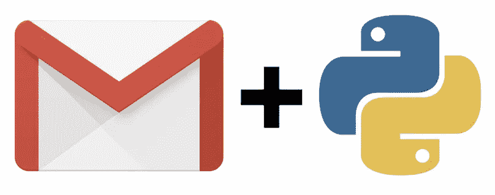
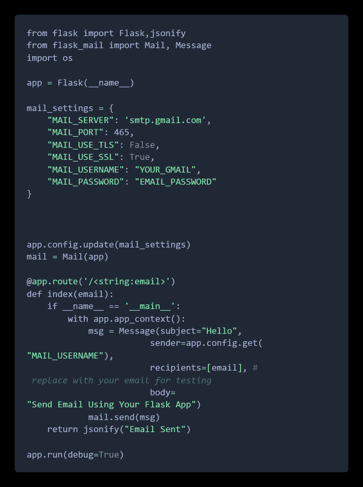

# 使用 Gmail、Python 和 Flask 发送电子邮件

> 原文：<https://medium.com/analytics-vidhya/send-email-with-gmail-python-and-flask-1810c25cf5f5?source=collection_archive---------11----------------------->



你需要什么？

*   Python(我用的是 Python 3.6.4)
*   [Pip](https://pypi.python.org/pypi/pip) 用于安装依赖项
*   [Virtualenv](https://virtualenv.pypa.io/en/stable/)
*   [一个 Gmail 账户](https://accounts.google.com/SignUp)(没有两步验证，允许不安全的应用)

首先进入你的项目文件夹，打开终端，输入 ***virtualenv venv*** ，这将为我们的项目创建一个虚拟环境。然后我们需要激活 virtualenv，如果你使用的是 Mac 或者 Linux 你可以在终端输入***source env/bin/activate***来激活。如果你使用的是 windows 类型***source env/scripts/activate。***

然后我们需要安装 ***烧瓶邮件。***

为此，在终端类型 ***pip 中安装 Flask-Mail。*** 之后，我们就可以开始编码了。

```
from flask import Flask, jsonify
from flask_mail import Mail, Message

app = Flask(__name__)

mail_settings = {
    "MAIL_SERVER": 'smtp.gmail.com',
    "MAIL_PORT": 465,
    "MAIL_USE_TLS": False,
    "MAIL_USE_SSL": True,
    "MAIL_USERNAME": 'YOUR_GMAIL',
    "MAIL_PASSWORD": 'YOUR_PASSWORD'
}

app.config.update(mail_settings)
mail = Mail(app)app.config.update(mail_settings)mail = Mail(app)
```

这些是配置。现在我要做的是，当用户请求 Get request "/ <string: email="">"时，我们将向用户发送请求电子邮件。这是代码，</string:>

首先，创建一个 app.py 文件，粘贴这段代码，输入你的 Gmail 和密码。



然后需要在终端使用 ***python app.py*** 运行 app。

可以用 postman 做 Http 请求，测试 app。

就是这样。享受 Python。

谢谢大家！