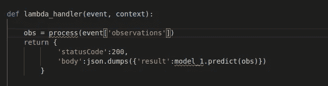

# 使用无服务器应用程序模型(SAM)将您的 ML 模型发送到“九霄云外”

> 原文：<https://medium.com/analytics-vidhya/send-your-ml-model-to-the-cloud-nine-using-the-serverless-application-model-sam-d0feaa988cbc?source=collection_archive---------19----------------------->


财产:spacenews.com

你开发了你整个职业生涯中最令人兴奋的 ML 模型，你期待着在现实世界中测试它，以评估它的性能，并含蓄地评估你的性能。由于您的公司缺少开发人员，您的经理认为，由于您是一名数据科学家，您也能够部署您的模型并制作一个 REST API 供最终客户端调用。在这种情况下，由您选择:

*   “再见经理！”
*   使用 AWS 的无服务器应用程序模型(SAM)。

这篇文章给出了第二种方法的简单解释，因为第一种方法需要太多的单词。


**先决条件:**了解 AWS Lambda、API Gateway、S3 和 CLI。

**什么是山姆:**

SAM 是一个很棒的工具，它允许您在本地构建一个完整的无服务器架构，该架构主要基于一些资源生成的事件，如 API REST 调用和在 S3 上创建的对象，并通过 Lambda 函数处理这些事件。SAM 不仅允许您在自己的机器上测试所有的东西，而且只需一个简短的命令，您就可以将所有东西部署到云中，以创建一个正常运行的无服务器应用程序。SAM 让这个过程变得快速而简单。更多信息请点击[。](https://docs.aws.amazon.com/serverless-application-model/latest/developerguide/what-is-sam.html)

**第一步:**

在您的计算机上下载并安装 SAM cli。根据你的 OS 我留下[参考](https://docs.aws.amazon.com/serverless-application-model/latest/developerguide/serverless-sam-cli-install.html)

**第二步:**

设置好 SAM 后，在 cli 中输入 *sam init。*CLI 引导您创建项目*。下图不言自明。*


在目录结构下面:


目录结构

*   events 文件夹包含带有模拟事件的 JSON 文件，用于在本地测试您的 Lambda。你应该去创造你期望得到的东西。
*   hello_word 文件夹(可以随意更改)包含 Lambda 的 python 文件代码。requirement.txt 应该包含您想要包含在最终包中的库的名称。
*   template.yaml 是构建您想要的无服务器架构的配置文件。
*   测试是针对单元测试的。

**第三步:**

假设我用 sklearn 做模型，用 joblib 腌制。然后，我把我的模型上传到 S3 桶。

您想要浏览您的代码文件夹，并用代码编辑 app.py 文件，以加载您的酸洗模型/管道和预测方法。


确保在 *lambda_handler()* 函数之外调用 *load_model()* 函数，以便利用[热启动](https://blog.octo.com/cold-start-warm-start-with-aws-lambda/)。我避免了输入观察的预处理，这只是一些代码逻辑的问题，但想法是将这些观察输入到您的模型中，这将为您提供预测，您可以根据自己的喜好将其返回。Lambda 响应必须与下图类似。注意将函数的任何输出放在函数*内部的*主体*字段中。*



**第四步:**

现在你需要配置 *template.yaml* 文件如下:


正如你可能看到的，这个想法是声明你想要使用的资源，在我们的例子中是一个函数和一个 Api。每个资源都有其配置参数，您可以在它们的[特定文档](https://docs.aws.amazon.com/serverless-application-model/latest/developerguide/sam-specification-resources-and-properties.html)中找到。

Outputs 部分的目的是在创建资源的过程中显示一些数据和变量，在我们的例子中是要调用的 Api 地址和 Lambda 函数的 Arn。这些信息可以在 Aws CloudFormation 中看到。

第五步:

将您用于此功能的所有库添加到您的 *requirements.txt* 文件中，记住最终的包不得大于 250 MB。

运行 *sam build，*它将输出:


正如您看到的，它创建了包含所有库的包，builder 还扫描了您的需求文件，并将这些 dep 添加到包中。

**第六步:**

用`sam local invoke -e events/event.json`测试你的 lambda

还记得事件文件夹吗？这是一个模拟事件，将作为输入提供给你的处理函数，它应该是你期望的调用形式。它所做的是按需创建一个 Docker 容器，用你的代码模拟一个 Lambda 函数，然后测试你的事件，看它如何响应。下面你可以找到一个例子。


*Sam local invoke-e events/event . JSON*

注意，这个方法只测试你的 Lambda 代码，如果你想测试架构 API Gateway + Lambda 你需要调用: *sam local start-api，*这也会创建一个 Docker 容器，你需要向它提交一个 REST 调用，这个调用会被传递给 Lambda。


sam 本地启动-api

**第七步:**

既然你对自己的结果感到满意，那就去做吧:

`sam package — s3-bucket yourbucket — output-template-file packaged.yaml`

这将把您的构建文件夹加载到您指定的 S3 桶中，并将创建 *packaged.yaml* 文件，它是您的 *template.yaml.* 的 CloudFormation 模板的转换，您不需要担心它。

**第八步:**

```
sam deploy — template-file packaged.yaml — region eu-west-1 — capabilities CAPABILITY_IAM — stack-name my-stack
```

这将最终启动你所有的工作到 AWS。它会自动实例化你所有的资源并将它们绑定在一起。您可以检查 CloudFormation 服务，查看堆栈现在是否已创建。

您现在能够调用您的 API 并获得您的模型预测了！