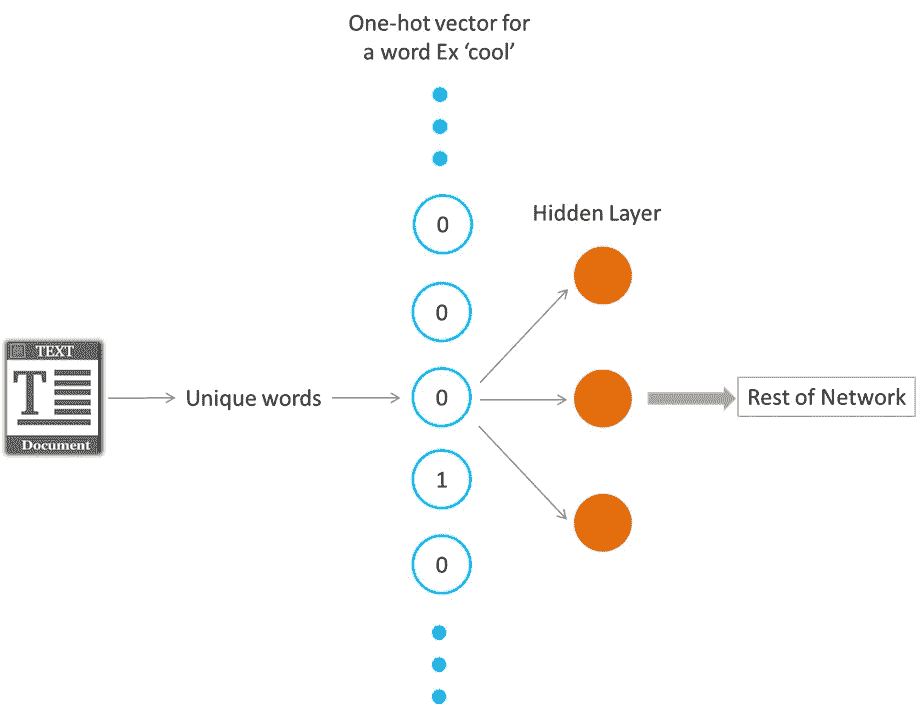
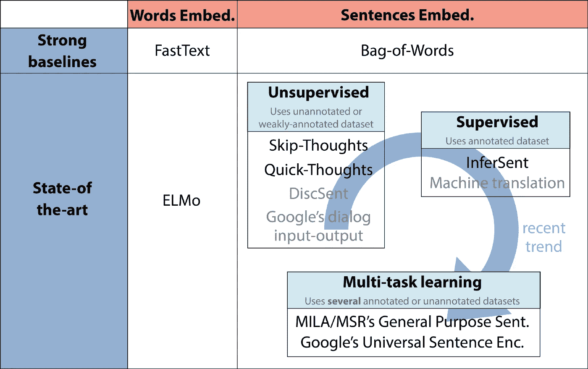
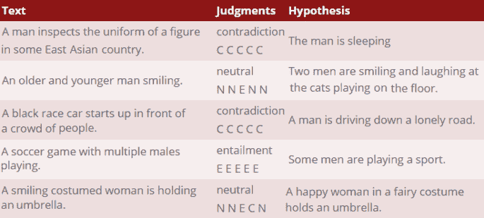
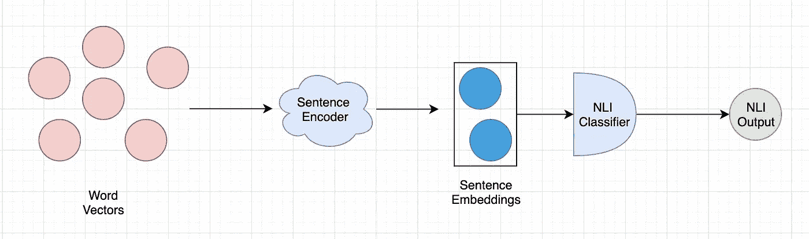
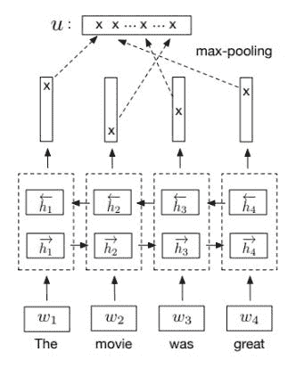
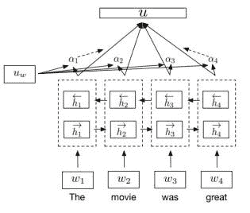
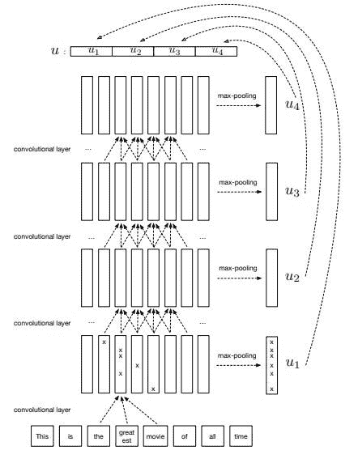
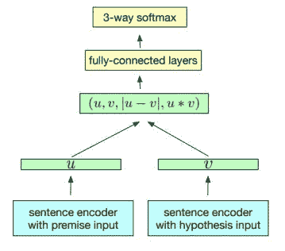
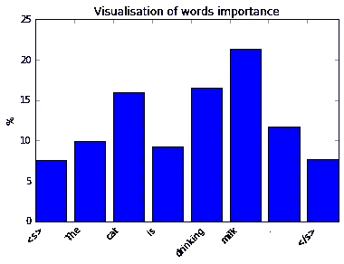

# 用脸书推理理解句子嵌入

> 原文：<https://medium.com/analytics-vidhya/sentence-embeddings-facebooks-infersent-6ac4a9fc2001?source=collection_archive---------2----------------------->


自从 Word2Vec(以及其他单词向量模型)及其丰富的单词表示出现以来，自然语言处理模型在一些任务上表现出色，如情感分析、语言模型、机器翻译等。这篇文章谈到了一个叫做 [**句子嵌入**](https://en.wikipedia.org/wiki/Sentence_embedding) 的类似概念，它在几个自然语言处理任务中导致了显著的性能提升，它归结为使用整个句子而不仅仅是单词来编码。首先，让我们快速粗略地看一下单词嵌入。

# 单词嵌入

一个集合术语，指学习将词汇表中的一组单词映射到数值向量的模型。单词嵌入的核心概念是，语言中使用的每个单词都可以用一组实数(一个向量)来表示。单词嵌入是 N 维向量，试图在其值中捕捉词义和上下文。任何一组数字都是有效的单词向量，但是为了有用，词汇表的一组单词向量应该捕获单词的含义、单词之间的关系以及不同单词在自然使用时的上下文。



这样做的副产品非常有趣。一旦词汇表中的所有单词都被映射到向量，对于每个单词，嵌入就捕获了该单词的“含义”。相似的单词最终具有相似的嵌入值，因此，它们最终在潜在空间中彼此接近。


# 句子嵌入

句子嵌入是一个类似的概念。它将一个完整的句子嵌入到一个向量空间中。这些句子嵌入保留了一些好的特性，因为它们继承了潜在单词嵌入的特性。

最近有一个巨大的趋势是寻求 [**通用嵌入**](https://research.google.com/pubs/archive/46808.pdf) **:** 嵌入，这些嵌入在大型语料库上预先训练，可以插入各种下游任务模型(情感分析、分类、翻译……)中，通过合并在更大数据集上学习的一些通用单词/句子表示来自动提高它们的性能。

虽然无监督的句子表示学习已经成为常态有一段时间了，但去年已经出现了向监督和多任务学习计划的转变，在 2017 年底/2018 年初提出了许多非常有趣的建议。



**通用单词/句子嵌入的最新趋势。**在本帖中，我们描述了用黑色表示的型号。所有标明型号的参考文件都列在文章末尾。

虽然有许多学习句子嵌入的竞争方法，但在这篇文章中，我们主要关注 Infersent，这是一种由脸书设计的提供语义句子表示的句子嵌入方法。

# **推断**

[脸书研究院](https://research.fb.com/downloads/infersent/)的人在 2018 年 7 月发布了一篇论文，谈到了“[从自然语言推理数据中监督学习通用句子表示](https://arxiv.org/abs/1705.02364v5)”，它采用了一种监督方法来学习句子嵌入。

他们讨论了在 NLI 任务中学习的模型比在无监督条件下或在其他监督任务中训练的模型表现更好。通过探索各种架构，他们表明，具有 max-pooling 的 BiLSTM 网络是当前最好的通用句子编码方法，优于现有的方法，如 [SkipThought](https://arxiv.org/abs/1506.06726) vectors。下面详细讨论一下 Infersent 是如何工作的。

# **挖苦 NLI 的任务**

**自然语言推理**，也称为**识别文本蕴涵**的目的是找到文本片段之间的方向关系。在这个框架中，包含和**的**和包含**的**文本(t)** 和**假设(h)** 分别被称为。并且，**“t 需要 h”(t =>h)**如果，典型地，一个阅读 ***t*** 的人会推断 ***h*** 最有可能是真的。**



[***SNLI***](https://nlp.stanford.edu/projects/snli/)

对于这个任务，使用的数据集是 [**SNLI(斯坦福自然语言推理)数据集**](https://nlp.stanford.edu/projects/snli/) 。它由 570，000 个人工生成的英语句子对组成，人工标记有三个类别之一— **蕴涵、矛盾**和**中性**。

# Infersent 的工作原理:

该架构由两部分组成:

1.  一个是句子编码器，它获取单词向量并将句子编码成向量
2.  二是 NLI 分类器，其接收编码向量并输出**蕴涵、矛盾**和**中性**中的类别。



逆流

# 句子编码器

本文讨论了句子编码的多种体系结构。让我们从论文中陈述的最好的一个开始看它们。

**具有最大/平均池的 BiLSTM**

这是一个双向 LSTM 网络，它为 n 个单词计算 n 个向量，每个向量是一个正向 LSTM 和一个反向 LSTM 的串联输出，它们以相反的方向阅读句子。然后，将最大/平均池应用于每个连接的向量，以形成固定长度的最终向量。



具有最大池的 BiLSTM

**LSTM 和 GRU**

这些是普通版本，其中网络输出 n 个单词序列的 n 个隐藏向量，最后一个隐藏向量被认为是最终的固定长度向量。

它的另一个变体是 BiGRU-last，其中使用两个 GRU，一个用于前向，另一个用于后向，并且两个 GRU 的最后隐藏状态被连接用于最终向量。

**自我关注网**

这使用对 BiLSTM 的隐藏状态的注意机制来生成输入句子的表示 u。

注意机制的本质是它们是对人类视觉机制的模仿。当人类视觉机制检测到一个项目时，它通常不会端到端地扫描整个场景；更确切地说，它总是根据人的需要，专注于特定的部分。当一个人注意到他们想要关注的物体通常出现在场景的特定部分时，他们将会知道在未来，该物体将会看向该部分，并且倾向于将他们的注意力集中在该区域。

在论文中，他们使用了一个具有输入句子多视图的自我注意网络，以便该模型可以学习句子的哪个部分对于给定的任务来说是重要的。具体地，它们具有 4 个上下文向量 u1、u2、u3、u4，这些向量生成 4 个表示，然后这些表示被连接以获得单句表示。



自我注意网络

**分级通信网**

目前在分类任务上表现最好的模型之一是称为 *AdaSent、*的卷积架构，它在不同的抽象级别上连接句子的不同表示。本文介绍的分层卷积网络受此启发，由 4 个卷积层组成。在每一层，最大化特征地图池以获得表示。最终的句子嵌入由 4 个最大汇集表示的串联来表示。



# 自然语言推理分类器

本节讨论推理分类器网络，它采用这些句子嵌入并预测输出标签。



NLI 分类器

在将句子向量作为该模型的输入之后，应用 3 种匹配方法来提取文本、 **u** 和假设、 **v** 之间的关系

*   两个表示的串联 **(u，v)**
*   基于元素的乘积 **u * v**
*   并且，绝对元素差异**| u-v |**

产生的向量从文本 u 和假设 v 中捕获信息，并被馈送到 3 类分类器(**蕴涵、矛盾**和**中性**)中，该分类器由多个完全连接的层和随后的 softmax 层组成。

希望这能让你清楚地了解 Infersent 是如何工作的。我策划了一个单独的[jupyter notebook](https://github.com/gotorehanahmad/Natural-Language-Processing/tree/master/NLI)infer sent 的实现以及如何使用它。

# 先决条件

1.  首先，下载最先进的快速文本嵌入

```
#### to download Glove
curl -Lo glove.840B.300d.zip [http://nlp.stanford.edu/data/glove.840B.300d.zip](http://nlp.stanford.edu/data/glove.840B.300d.zip) #### To download Fasttext 
curl -Lo crawl-300d-2M.vec.zip https://s3-us-west-1.amazonaws.com/fasttext-vectors/crawl-300d-2M.vec.zip
```

2.要获得推断模型并重现我们的结果，请下载预训练模型。

```
#### Glove based model
curl -Lo examples/infersent1.pkl https://dl.fbaipublicfiles.com/senteval/infersent/infersent1.pkl#### Fasttext based model
curl -Lo examples/infersent2.pkl https://dl.fbaipublicfiles.com/senteval/infersent/infersent2.pkl
```

3.确保您有 NLTK 和 Punkt tokenizer。

```
import nltk
nltk.download('punkt')
```

4.您可以使用 sample.txt 文件输入句子，也可以用自己的句子替换。

5.推断还可以显示单词在句子中的重要性，这可以用来构建意图提取器。从笔记本中找到如何使用它。



> *关于我*

我是 [Wavelabs.ai](https://wavelabs.ai/?source=post_page---------------------------) 的资深 AI 专家。我们 Wavelabs 帮助您利用人工智能(AI)来彻底改变用户体验并降低成本。我们使用人工智能独特地增强您的产品，以达到您的全部市场潜力。我们试图将尖端研究引入您的应用中。

欢迎访问 [Wavelabs.ai](https://wavelabs.ai/?source=post_page---------------------------) 了解更多信息。

嗯，这些都在这个博客里。感谢阅读:)

保持好奇！

你可以在 [LinkedIn](https://www.linkedin.com/in/rehan-a-18675296?source=post_page---------------------------) 上联系我。