# 情感分析

> 原文：<https://medium.com/analytics-vidhya/sentiment-analysis-a360c915ff7a?source=collection_archive---------14----------------------->

情感分析是对一段文本中表达的观点进行计算识别和分类的过程，尤其是为了确定作者对特定主题、产品等的态度。是正的、负的或中性的。基本上就是对情绪的解读和分类。

情感分析旨在检测快乐、悲伤、愤怒等情绪。许多这样的分析使用词典或复杂的机器学习算法。

情绪分析对社交媒体监控特别有用，因为它通过提供定性的见解，超越了赞或转发的数量。

## **如何分析推特数据:**

对 twitter 数据执行情感分析包括以下步骤:

1.  收集 twitter 数据:下载的 Twitter 数据代表我们试图发现的东西，这一点非常重要。因此，我们将提取推文进行分析。这种提取是在不同 Twitter APIs 的帮助下完成的。这里，我们将使用 *GetOldTweets3* 来提取数据。
2.  清理收集的数据:提取的 tweets 可能包含不相关的标点符号，可能对分析没有帮助；需要在分析前清理干净。
3.  分析数据:分析数据会让你更清楚地了解数据(推文)试图传达什么，也就是说，它将有助于理解推文背后的情绪。这种分析还可以确定人们对特定主题、问题或产品的看法。
4.  可视化分析:可视化有助于以简单有效的方式理解数据。

## **让我们开始:**

如上所述，我们将使用 *GetOldTweets3* 库来提取推文。

*GetOldTweets 3:*GetOldTweets 3 是原杰弗逊·恩里克 [GetOldTweets-python](https://github.com/Jefferson-Henrique/GetOldTweets-python) 的改进分叉。它修复了已知的问题，并增加了一些功能，如计算转发次数，搜索多个用户的帐户等。GetOldTweets3 只支持 Python 3。 *GetOldTweets3* 让您可以使用各种搜索参数(如开始/结束日期、用户名、文本查询搜索和参考位置区域)自由地抓取数据。此外，您可以指定想要包含哪些 tweet 属性。

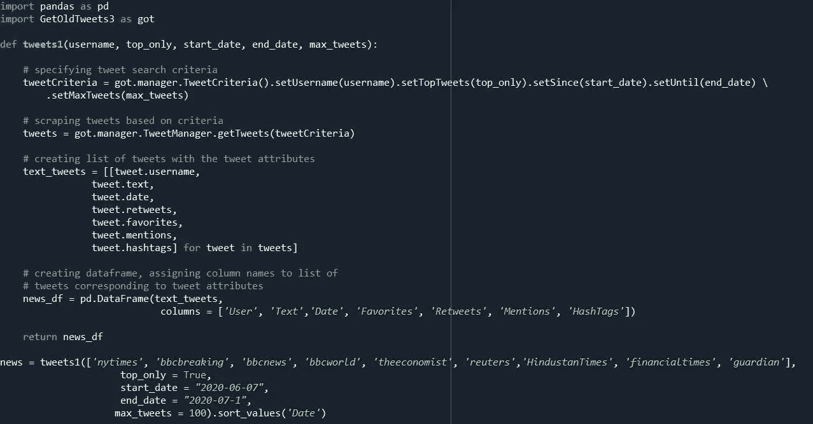

例子

## **输出:**

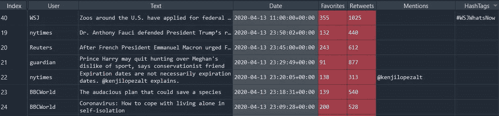

为了执行情感分析，我们将进行类似的查询搜索来提取推文。为了进行分析，我们将随机选取一个主题，比如说“拉胡尔·甘地”😉并且会尝试分析与他相关的推文。

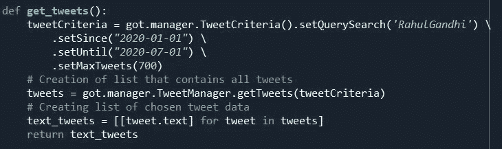

## **阅读推文:**

以下代码将有助于阅读下载的推文，也有助于清理推文。

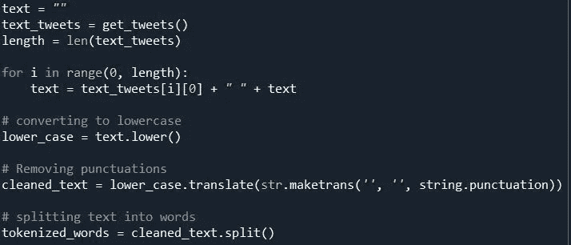

## 输出:

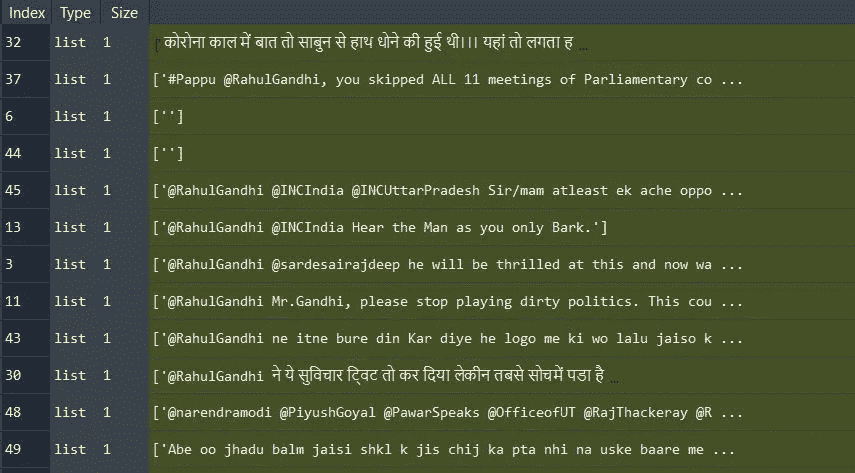

为了简化我们的工作，我们可以使用 NLTK(自然语言工具包)。NLTK 旨在支持 NLP 或密切相关领域的研究和教学，包括经验语言学、认知科学、人工智能、信息检索和机器学习。NLTK 已经被成功地用作教学工具、个人学习工具以及原型和构建研究系统的平台。NLTK 支持分类、标记化、词干化、标记、解析和语义推理功能。

但是，有两种方法可以解决这个问题:

1.使用 NLTK

2.不使用 NLTK

此外，我将以两种方式解释分析，即使用 NLTK 和不使用 NLTK。

## **无 NLTK:**

停用词(Stop Word):停用词是一个常用词(如“the”、“A”、“an”、“in”)，搜索引擎在为搜索条目编制索引时以及在作为搜索查询的结果检索它们时都会将其忽略。

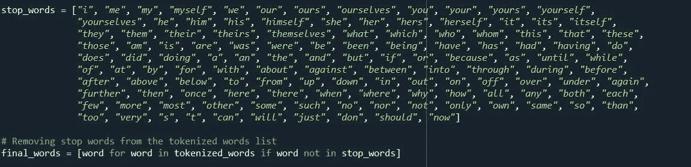

这段代码将帮助我们从文本中删除停用词。这些用过的停用词都可以在网上找到。

## **与 NLTK:**

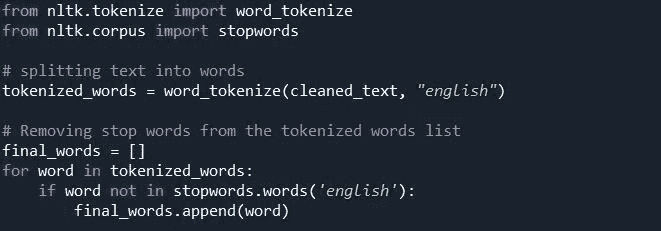

与前面的代码不同，我们使用 word_tokenize 进行标记化。NLTK 包支持多种语言。此外，这个软件包有不同语言的停用词。

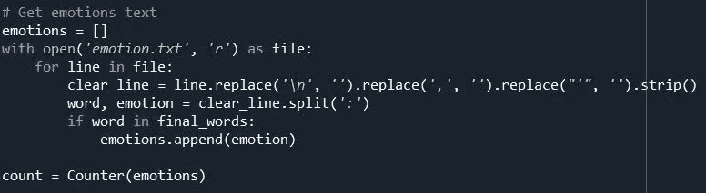

为了分析推文的情绪，我们将使用 emotion.txt 文件。该文件包含推文中使用的每个词的预定义情绪。这里，我们检查 final_word 列表中的单词是否出现在 emotion.txt 中。

计数变量对分析中出现的情绪数量进行计数。这个计数变量将帮助我们可视化推文。

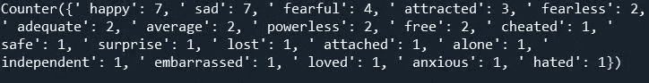

## **可视化:**

数据可视化是信息和数据的图形化表示。通过使用图表、图形和地图等视觉元素。这些可视化提供了一种便捷的方式来查看和理解与“RahulGandhi”相关的推文中的趋势和情绪模式。

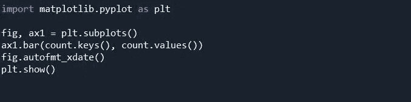

## 输出:

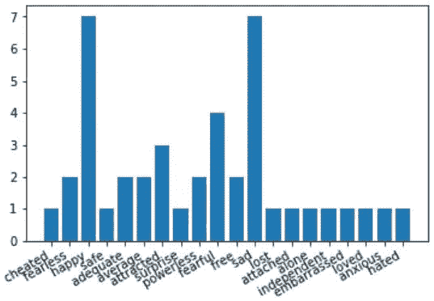

这个条形图解释了与“RahulGandhi”相关的推文的情绪类型。从这个图表中，我们可以清楚地看到，大多数与其相关的推文要么是快乐的，要么是悲伤的，其次是恐惧的，被吸引的和无所畏惧的。(注意:这一分析可能会有所不同，因为它仅针对 700 条推文)

## **极性:**

情感分析中的极性是指识别情感取向(积极、中性和消极)。为了计算极性，我们将从*nltk . sensitivity . Vader .*导入*SentimentIntensityAnalyzer*，这将给出负极性、正极性、中性和复合极性的分数。

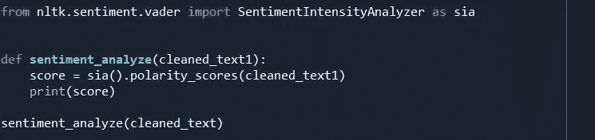

## 输出:

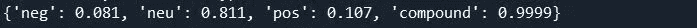

从输出来看，很明显，对其进行分析的 700 条推文大多是正面的，因为正面得分大于负面得分。我们还可以使用“if-else”来自动生成结果。

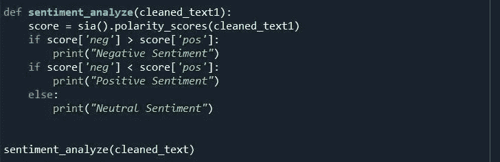

**结论:**

如今，情感分析或观点挖掘是机器学习中的一个热门话题。由于英语语言的复杂性，并且如果我们考虑诸如汉语、印地语、德语等其他语言，甚至更复杂，所以我们仍然很难非常准确地检测文本语料库的情感。

我的 [GitHub](https://github.com/adityadhapola/SentimentAnalysisTwitter) 上有这个代码。