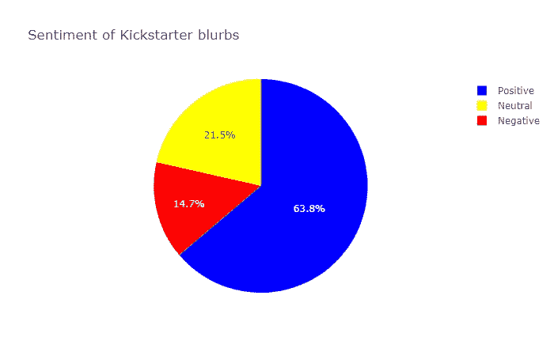
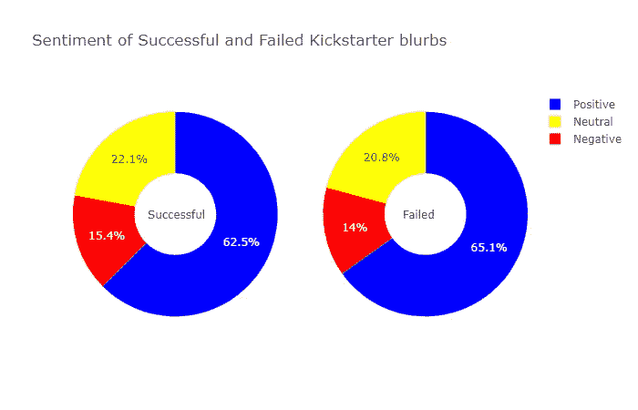
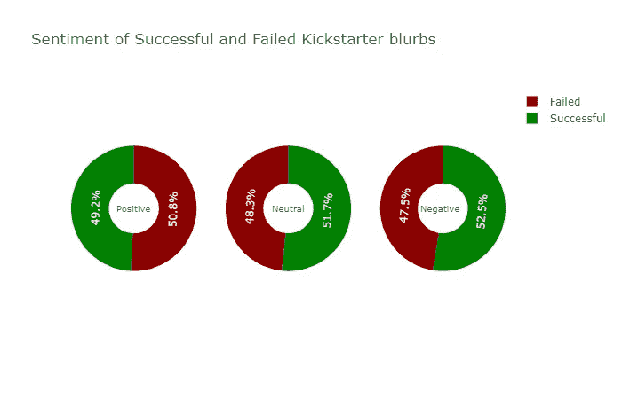
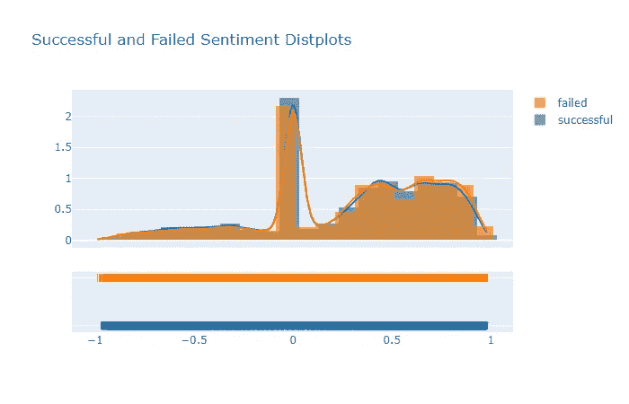
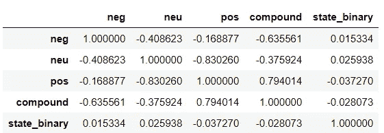
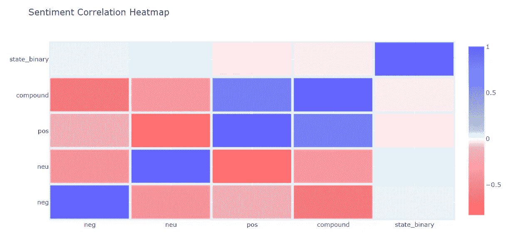
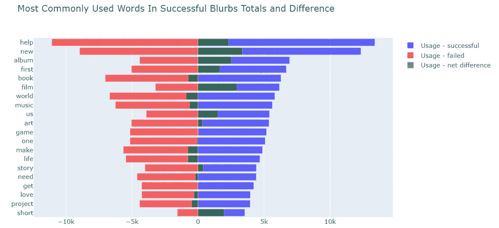
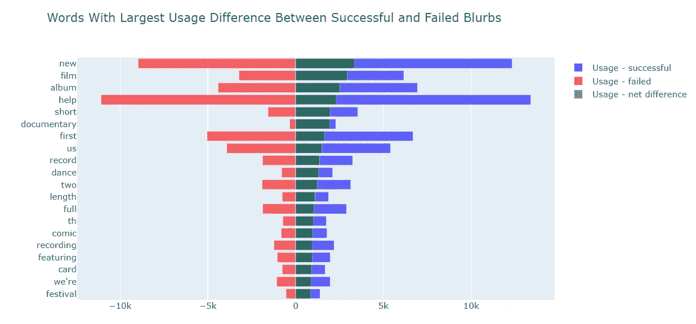
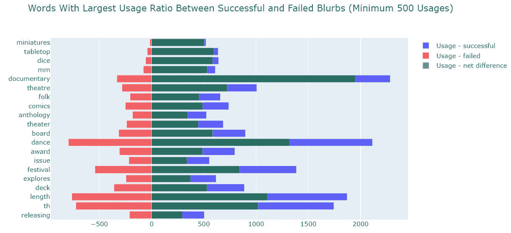

# KickStarter 广告的情感分析和用词

> 原文：<https://medium.com/analytics-vidhya/sentiment-analysis-and-word-usage-for-kickstarter-blurbs-or-help-us-to-film-a-new-short-c89f04a696a0?source=collection_archive---------11----------------------->

## 或者:帮助我们拍摄一部新的、简短的、关于桌面微型节日的纪录片(对此我有点不高兴)

这个项目的目标是对成功和失败的导语进行情感和词语使用分析，以可视化结果并确定导语写作的趋势，这可能对未来的 Kickstarter 导语作者有用。

这个项目的数据集包含 215513 KickStarter 在 2017 年的项目的英文简介或描述；108310 成功，107203 失败。所有这些数据都是由执行网页抓取的 [webrobots.io](http://webrobots.io) 收集的。他们清理并整理了刮掉的数据，只保留了两列英文简介和最终状态“成功”或“失败”。我的分析建立在这种干净的状态上。

使用 [Plotly](https://plot.ly/) 执行数据可视化

# 情感分析

[NLTK 的 Vader 情绪分析器](https://www.nltk.org/_modules/nltk/sentiment/vader.html)用于对正面、中性或负面情绪进行评分，并对整体情绪进行综合评分。

Kickstarter 的广告倾向于使用积极的语言，即使语言不是明显积极的，也更可能是中性的而不是消极的。Kickstarter 的广告是要钱的，所以乐观一点“值得”吗？

差别很小，但成功的 KickStarter 广告实际上比失败的广告有更高比例的负面和中性广告

虽然这些圆环图代表了总数据集的不同比例，但成功的 KickStarter 广告从积极到中性的比例有所增加，从中性到消极的比例进一步增加。

上面显示了成功和失败的导语的情感分布，0 处的峰值反映了中性复合评分的导语，其中没有发现正面或负面的情感。无论是成功的还是失败的 KickStarter 广告都是正面/负面的。

相关矩阵

相关矩阵和热图表明，复合情感和成功的广告之间有轻微的负相关，而负面和中性情感和成功的广告之间有轻微的正相关。

# 词汇用法分析

情感分析当然不是决定性的。为了继续对 KickStarter 广告进行调查，我们使用 NLTK 的 Tokenizer 工具对广告文本进行了标记化。停用字词、标点符号和数字都被删除。确定并比较成功和失败的广告词的词频。

成功的导语中最常用的词和失败的导语中最常用的词有很多交叉。

我们感兴趣的词是成功的导语比失败的导语使用更频繁的词。下面是这方面的两个衡量标准。成功的广告减去失败的广告后的净使用率最高的词，以及成功的广告与失败的广告的使用率最高的词(最低使用率为 500)。

*词义注释:*
“th”最像是去掉数字后剩下的东西，比如“4th”就变成了“th”。从上面的图表可以看出，这将表明连续的活动，即那些值得第四次活动的活动之前有 3 次成功的活动，因此很可能有回头客。“mm”可能与微缩模型和桌面游戏有关，它们具有非常高的成败差异和比率。

# 结论

KickStarter 广告的情绪大多是积极的，这可能是*轻微的*有害的，因为与成功的相关性是相反的方向。
有趣的是,“新的”和“第一次”的事情有很高的正成功差异，与以前的 KickStarters 相关的连续项目也是如此，即值得“th”的事情。新颖和重复都是积极的属性！
“桌面”、“微缩”、“骰子”和“电影”，尤其是“纪录片”，以及“舞蹈”项目一样，都有极高的成功率。
“我们”和“我们”都有显著的正面差异和比率，表明支持者支持团队努力。
措辞似乎确实有些重要——“音乐”项目大多不成功，但“专辑”大多成功。

如果你想要我的推荐:请求**“帮助我们拍摄一部关于桌面微型节日的新的、简短的纪录片”**一定会成功！

点击此处查看 github 笔记本:

 [## ktzioumis/Kickstarter-NLP

### 此时您不能执行该操作。您已使用另一个标签页或窗口登录。您已在另一个选项卡中注销，或者…

github.com](https://github.com/ktzioumis/Kickstarter-NLP/blob/master/sentiment1.ipynb) 

加分！
所有数据可视化均在 Plotly 中进行。叉或克隆笔记本和所有上述图形是互动的！