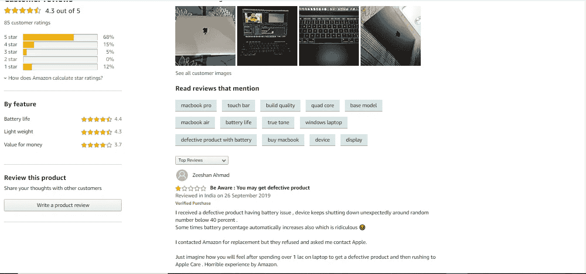

# 机器学习中使用 NLP 的情感分析和基线算法。

> 原文：<https://medium.com/analytics-vidhya/sentiment-analysis-baseline-algorithm-using-nlp-in-machine-learning-7f9b3e52f8a?source=collection_archive---------14----------------------->

内森·杜姆劳在 [Unsplash](https://unsplash.com/s/photos/joker?utm_source=unsplash&utm_medium=referral&utm_content=creditCopyText) 上的照片

> **机器学习中的情感分析是什么意思？**

正如我在之前关于语言建模的博客中所讨论的，我展示了如何对电影评论进行分类(好的或坏的)是文本分类的一部分，因此决定一部电影是好的、坏的还是中性的是情感分析的一部分。这些类型的情感也可以用来对产品类型进行分类(好的或坏的)，例如，让我们说一个像亚马逊或卡丁车这样的电子商务网站中的产品评论可以自动提取关于产品的事实(方面或属性)，如**【易于使用】****【物有所值】****【糟糕的客户服务】**等，可以给你一个关于它们的简介，并且显然可以帮助你根据你的需要选择最好的。

亚马逊的 macbook Pro 评论

在给定的图片中，可以非常清楚地看到客户使用了与“电池续航时间长”、“重量轻”和“物有所值”相关的属性或方面。评论中使用的相似方面或这些方面的同义词越多，自动生成的正面或负面反馈就越多。在这里，电池续航时间功能获得了 4.4 的高票，这意味着许多评论可能包含“良好的电池续航时间”或“电池续航时间如预期一样长”等方面，最终提供了积极的回应，而有些人可能使用了“非常昂贵”或“物有所值”等功能，或者他们没有提到这些功能，这就是为什么“物有所值”功能仅获得 3.7 的高票，当然，我们可以从所有评论中计算出总的情感，给出总的结果(正面或负面)，而无需要求用户对其进行评级。

情感也可以应用于产品中的事物，例如衡量客户对他们喜欢该产品的程度或不喜欢该产品的地方的信心，从而给他们的产品一个良好的开端，并最终提高销售额。这些情绪可以很容易地从不同的媒介中提取出来，如推特、研讨会、公众集会等。如今，twitter 已经成为收集情感的最受欢迎和最强大的来源之一。事实上，twitter 情绪已经被用来预测股市。

Twitter 情绪是如此强大，以至于它们很容易导致一个组织、个人或产品的兴衰。

情绪分析还有很多其他的名字，比如

1.  意见提取
2.  观点挖掘
3.  情感挖掘
4.  主观性挖掘

情感分析可用于各种不同的任务，如

1.  电影:这个评论是正面的还是负面的？
2.  产品:人们对新 iPhone 有什么看法？
3.  公众情绪:消费者信心如何？绝望在增加吗？
4.  政治:人们对这个候选人或问题有什么看法？
5.  预测:根据情绪预测选举结果或市场趋势

简而言之，情感分析是对态度“持久的、带有情感色彩的信念、对物体或人的倾向”的检测，因此我们可以很容易地进行分类

1.  态度的持有者(来源)
2.  态度的目标(方面)
3.  态度类型:

*   从一系列类型中，如爱、恨、价值等
*   或者更常见的简单加权极性，如正极、负极、中性和强度

4.包含态度的文本

*   句子或整个文档

> **情感分析的基线算法**

像以前一样，这次我也在电影评论中使用情感分类。

比方说我们有两个 IMDb 影评([【睡博士】](https://www.imdb.com/title/tt5606664/) & [**怪医**](https://www.imdb.com/title/tt6673612/?ref_=tt_urv) )

“在这部电影中，每个人都表现得非常出色。我认为伊万·麦格雷戈塑造了一个非常好的角色。如果我想象过丹尼在第一部电影结束后会变成什么样，我想我不会有太大的不同。有几个反派角色(主要是罗丝戴帽子和蛇咬安迪)的紧张时刻让我非常讨厌他们(这是件好事)。我认为他们在电影中做的事情会让任何人想让他们看到可怕的命运。”

“糟糕的镜头破坏了本可以是一次有趣的冒险。电影结束时，除了主角之外，我无法说出任何一个角色的名字。任何地方都没有角色发展，所以我感觉不到和任何角色的联系。大部分时间我都分不清是谁在说话，因为所有的声音听起来都像是来自摄影棚。剪辑显示有重拍和有问题的选择。开头的十分钟太刺耳了，我可以把这部电影列为第一部让我晕车的电影。在所有问题的背后，本可以是一个伟大的故事，但我甚至无法让我 7 岁的女儿对这部平淡无奇的电影感兴趣。我甚至一度不得不离开房间，因为这让我头疼”

希望你决定第一个是积极的评价，第二个是消极的评价，你这样做的方式是通过检查第一个评价中的词语“精彩，不错”和第二个评价中的词语“糟糕的场景，不和谐”

像其他算法一样，基线算法有许多步骤

1.  标记化
2.  提取特征
3.  用不同的分类器进行分类:

*   朴素贝叶斯
*   SVM
*   MaxEnt 或任何其他分类器

> **情感标记化&提取特征问题**

1.  **否定**

在“我不喜欢那部电影”和“我真的很喜欢那部电影”这样的句子中，发现像“没有”这样的词是非常重要的。为了处理否定，我们通常在否定和后面的标点符号之间的每个单词上加一个 NOT_ 例如，让我们考虑这样一个短语

"不喜欢这部电影，但是我"我们把它变成了

"不是不喜欢这部电影，而是我. "

这使得我们的词汇量增加了一倍，并且让我们知道这些单词会引起负面情绪

2) **标记化**

进行令牌化时，您可能会面临多个问题，例如

*   处理 HTML 和 XML 标记
*   Twitter 标记(名称、散列标签)
*   大写通常用来表示情感
*   表情符号

> **二值化(布尔特征)多项朴素贝叶斯**

对于情感和其他文本分类任务，我们经常使用朴素贝叶斯算法的一个微小变体，称为二进制多项式朴素贝叶斯。

这种算法的一个直觉是**我们更关心一个单词是否出现，而不是关注它的出现频率**例如，一个单词“amazing”出现一次比一个“amazing”出现 5 次给人相同的正面感觉。因此，我们将使用仅出现一次的频率，而不是使用完整的频率。

我们将遵循与前面的[贝叶斯](https://en.wikipedia.org/wiki/Naive_Bayes_classifier)完全相同的步骤，增加一个新的额外步骤，即在我们将所有文档连接成一个大文档之前，我们将删除重复的单词。我通常更喜欢创建一个地图来删除重复的单词，然后继续其他步骤，如添加一个平滑，从而根据情况修改单词计数。

> **情感总结**

1.  情感通常被建模为一种分类任务极性，通常带有二元标签，较少带有某种顺序标签。
2.  否定是一个非常常用的特征。
3.  对于许多任务，使用朴素贝叶斯中的所有单词效果很好。
4.  对于其他任务，使用单词子集可能有所帮助，如手工制作词典或通过使用来自一些手工构建种子的半监督学习来归纳词典。

华金凤凰小丑