# 情感分析:从头开始构建

> 原文：<https://medium.com/analytics-vidhya/sentiment-analysis-building-from-the-ground-up-e12e9195fac4?source=collection_archive---------19----------------------->


情感分析是使用文本分析技术对文本数据中的情感(积极的、消极的和中性的)进行解释和分类。情感分析允许企业在在线对话和反馈中识别客户对产品、品牌或服务的情感。

嗯，听起来不错。但是我们到底打算怎么做呢？答案就在相当长一段时间以来引起我们注意的某件事情上。**机器学习。**

老实说，作为一名全栈开发人员，我总是能找到不开始学习 ML 的理由。用“我怎么会有时间去做这件事”这样的保证来说服自己，或者“我最了解软件工程，我们坚持下去吧。”我把这位美丽的女主人拒之门外。

但老实说，那些只是我给自己的一堆借口，让自己不去面对事实。我被它吓倒的事实。然而，我决定一劳永逸地解决这个问题，令我惊讶的是，ML 既有趣又吸引人。

所以我决定写这篇博客，在构建一个**情绪分析**模型的同时，描绘出我进入 ML 的技术之旅。我将映射出所有的步骤，代码片段，所需的数据操作。所以让我们开始吧。

# 概观

我们的目标是建立一个情绪分析模型，一旦准备好，将预测用户对所给出的声明的情绪。在我工作的领域中，客户不断给我们的页面提供大量的评论和反馈。因此，我的目标是建立一个模型，将这些输入的情绪映射出来。我自己最近开始使用 ML，我会认为这是一个巨大的成就。

处理文本分类和分析的 ML 和语言学的子领域被称为**自然语言处理。但稍后会详细介绍。**

# 问题陈述

构建情感分析模型，将输入文本分类为正面**或负面**或**负面**。输入将是用户的评论或反馈，但也可以扩展到其他类型的文本消息，如社交媒体帖子或推文。这是通过在已经标记的亚马逊产品评论的数据集上训练我们的模型来实现的。

# 公制的

模型的有效性将在文章的最后基于包括**精确度、召回率、F1 分数、**和**精确度**在内的参数进行评估。我们也会明白这些到底意味着什么。

# 一切开始的地方

我们打算开始研究每一个 ML 项目的基础。**数据。**我们将使用亚马逊产品评论的数据集。这些数据是从[张翔的 Google Drive d](https://drive.google.com/drive/folders/0Bz8a_Dbh9Qhbfll6bVpmNUtUcFdjYmF2SEpmZUZUcVNiMUw1TWN6RDV3a0JHT3kxLVhVR2M) ir 中提取的。它包含大约 300 万条评论，这些评论已经被评为 1 到 5 级。我们的模型将从中学习。数据集是 CSV 格式的。

# 数据加载和清理

我正在为这个项目使用 python。这个名为 Pandas 的令人敬畏的库使加载和读取数据变得超级容易。

```
import pandas as pddf = pd.read_csv('../input/amazon/train.csv')
df_test = pd.read_csv('../input/amazontest/test.csv')
```

df 是一只熊猫[的数据帧](https://pandas.pydata.org/pandas-docs/stable/reference/api/pandas.DataFrame.html)。就这样，我们在 CSV 中读到了。

我们应该经常熟悉我们正在处理的数据类型。我指的是数据集的结构。所以让我们检查行数和列数。

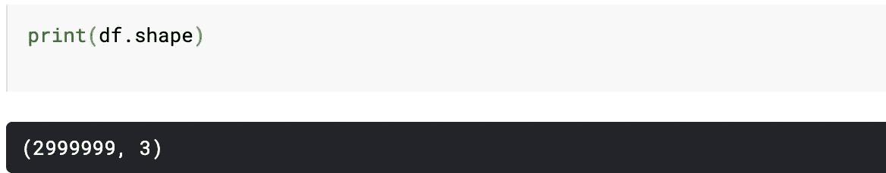

有不到 3M 的行和 3 列。

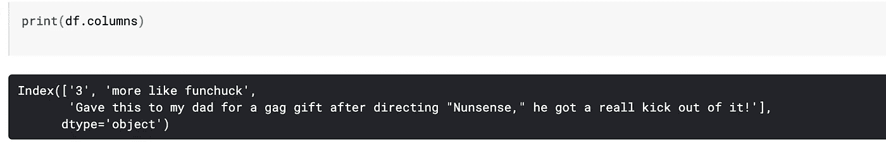

如您所见，这些列的名称有点混乱。让我们解决这个问题。此外，让我们最初用 60，000 条记录而不是 3 百万条记录来训练我们的模型。因此我们需要取样。

```
#Taking 60000 random samples from the data
df_sam = df.sample(n=60000, random_state=1)df_sam.columns = ['rating', 'title', 'text']df_test_sam = df_test.sample(n=12000, random_state=1)df_test_sam.columns = ['rating', 'title', 'text']
```

就这样，我们对 60k 行进行了采样，并将这些列重命名为“评级”、“标题”和“文本”。“评级”包含相应评论的评级,“文本”包含实际评论。

如果你想提高模型的准确性，数据清理是非常重要的。你不希望你的模型现在从错误的数据中学习，是吗？

我们首先检查数据集中是否有空值。

```
print(df_sam.isnull().sum())
```

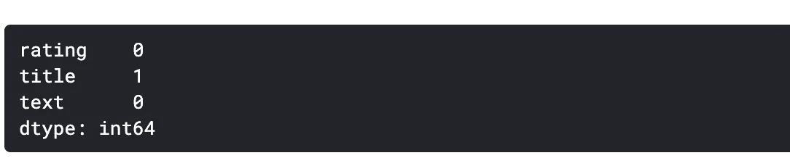

有一条记录的标题为空。我们有多种选择来处理空值，比如删除那一行，用模式或方法替换空记录。但是由于 rating 和 text 列中没有空记录，所以我们认为数据是干净的，因为我们只需要那些 to 列。

让我们看看我们的数据是什么样子的。

```
print(df_sam.head())
```

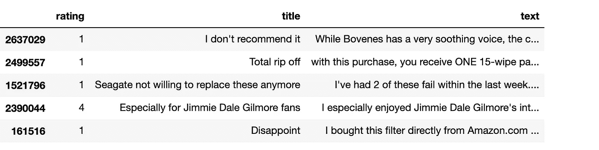

在我们开始从数据集中提取特征之前，让我们先谈一下 NLP。计算机不像人类那样解释文本。因此，我们需要找到一种方法，将文本转换为模型可以理解的数字或向量。

现在我们有了干净的数据，让我们来谈谈类。目前，我们的评分值从 1 到 5 不等。从模型预测文本到这样的粒度可能是困难的，因此我们自己给它加标签。1–2 被认为是负的，4–5 被认为是正的。3 是中性的，因此我们现在将删除所有带有 3 的行。它可用于分类为**中性**但让我们保持简单。

```
def convertToLabel(rating) :
    if rating > 3 :
        return 'Positive'
    else :
        return 'Negative'#Converting ratings to positive and negativedf_new = df_sam.drop(df_sam[df_sam.rating == 3].index, axis=0)
df_new.rating = df_new.rating.apply(convertToLabel)df_new_test = df_test_sam.drop(df_test_sam[df_test_sam.rating == 3].index, axis=0)
df_new_test.rating = df_new_test.rating.apply(convertToLabel)
```

我们需要注意的另一件事是数据中的偏差。有偏见的数据会导致扭曲的预测。因此，我们想要数量几乎相等的**阴性**和**阳性**。让我们用一个图形表示来验证一下。

```
df_new.rating.value_counts().reset_index().plot(kind = 'bar' ,x='index', y='rating', figsize=(8,8))
```

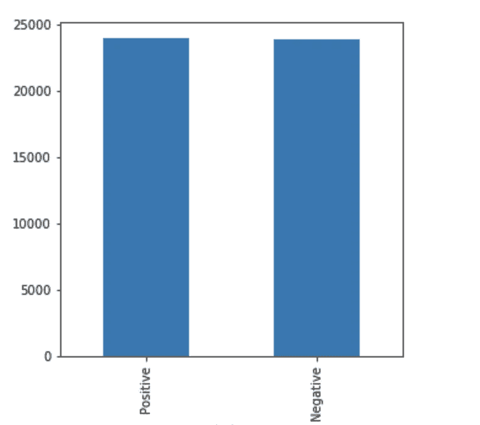

正如我们所看到的，数据没有偏差，因此不需要执行任何删除操作。

现在，我们需要对文本执行操作，去掉数据中没有意义的单词。这些包括网址，HTML 标签，甚至在某些情况下是数字。我们还需要删除那些不会改变句子意思的单词。这些包括冠词，如“a”、“the”，但不限于此。这些被称为停用词。

**记号化**是将大量文本分割成称为记号的较小部分的过程。NLTK 是一个了不起的库，它帮助我们实现了这一点，甚至更多。

```
import nltk
nltk.download('punkt')
nltk.download('stopwords')
nltk.download('wordnet')
from nltk.tokenize import word_tokenize
from nltk.stem.wordnet import WordNetLemmatizer
from nltk.corpus import stopwords#tokenizer function will be passed to CountVectorizer at a later stagedef tokenize(text) :
    text = text.lower()
    #Remove punctuations
    text_normalized = re.sub(r"[^a-zA-Z0-9]", " ", text)

    tokens = word_tokenize(text_normalized)
    lemmatizer = WordNetLemmatizer()
    clean_tokens = [lemmatizer.lemmatize(w).strip() for w in tokens if w not in stopwords.words('english')]
    return clean_tokens#Create X and yX_train = df_new['text']
y_train = df_new['rating']X_test = df_new_test['text']
y_test = df_new_test['rating']
```

我们本可以使用 sklearn 提供的 train_test_split 这个强大的功能，但是我导入了一个完全不同的测试数据集。

# 特征提取和 ML 流水线

如前所述，计算机不像我们一样理解文本。因此，需要将其转换为令牌计数矩阵。它只是一个矩阵，保存文档中每个标记的出现次数。这可以通过 sklearn 提供的 CountVectorizer 来实现。

我在这里使用了一个管道，它有助于链接训练模型所需的步骤。在本文中，我不会深入讨论管道的细节。

仅仅统计单词出现的次数有时是不够的。因此，我们使用另一个称为术语频率逆文档频率的转换器，它基本上也考虑了一个词在整个语料库中的常见程度，因此建立了它的重要性或权重。

最后，我们将为模型选择一个分类器。我们在这里有多种选择。我们可以使用多项式朴素贝叶斯、支持向量机、随机森林或其他方法。他们实现不同的算法来训练和预测模型。我们用不同的模型获得不同的精度。我已经用多项式 NB、SVC 和 RandomForestClassifier 运行了我的代码。

现在让我们看一下代码。

```
from sklearn.feature_extraction.text import CountVectorizer, TfidfTransformer
from sklearn.ensemble import RandomForestClassifier
from sklearn.metrics import classification_report
from sklearn.pipeline import Pipeline, FeatureUnion
from sklearn.naive_bayes import MultinomialNB
from sklearn.svm import SVCpipeline = Pipeline([

    ('vect', CountVectorizer(tokenizer=tokenize, ngram_range=(1, 2))),
    ('tfidf', TfidfTransformer()),
    ('clf', RandomForestClassifier(n_estimators=100, n_jobs=-1))])start_time = time.time()
pipeline.fit(X_train, y_train)
print("time taken to fit {}s".format(time.time() - start_time))
```

这里，我们简单地将文本转换成令牌，然后转换成 TFIDF 矩阵，并将其传递给 RandomForestClassifier 模型。我们通过调用模型的' **fit'** 函数来拟合模型(在本例中是管道)。

一旦模型被训练，我们就对测试数据调用预测函数。鉴于我们已经有了当前的成果，请将此视为我们为我们的模型设定了一个基准。然后，我们将预测结果与预期结果或 y 检验进行比较。这告诉我们我们的模型在看不见的数据上表现得有多好。请注意，准确度实际上并不是分类器性能的最佳衡量标准。但这是事实，我还在学习。

```
y_pred = pipeline.predict(X_test)
print("Accuracy is {}".format((y_test.values == y_pred).mean()))
```

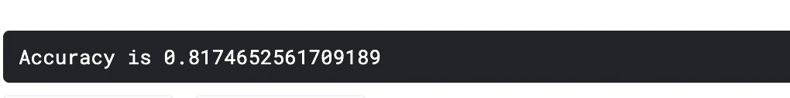

我们用 RandomForestClassifier 得到了 81.74%的准确率。我们很快就会将它与其他分类器进行比较。

定义模型性能的其他参数有:

**精度**定义为真阳性的数量除以真阳性的数量加上假阳性的数量。真阳性是模型预测为真的结果，并且在预期结果中也是真的。假阳性是模型预测为真但实际上是假的结果。

**召回**定义为真阳性的数量除以真阳性的数量加上假阴性的数量。

**F1 得分**是准确率和召回率的加权平均值。

让我们看看我们的模型在这些类别中表现如何。

```
from sklearn.metrics import classification_reportres = classification_report(y_test, y_pred)
print(res)
```

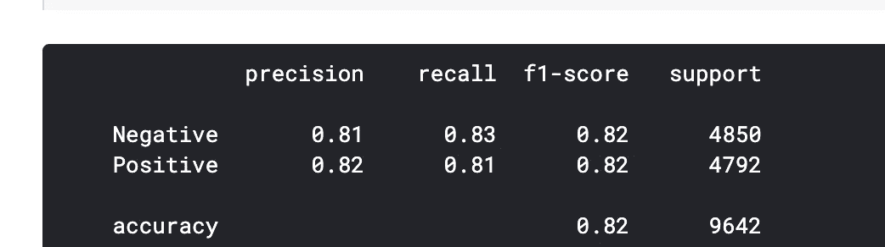

是时候检验我们的模型了。我将通过两个用户对我从事的产品的两个评论。我会把评估留给你。

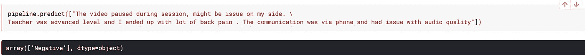

这被预测为负面的

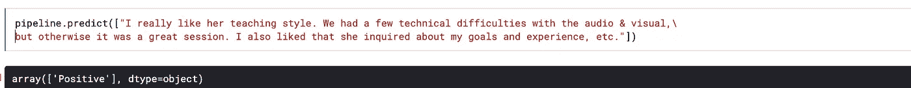

这被预测为积极的

以下是多项朴素贝叶斯分类器的分类报告。

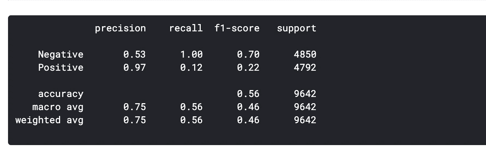

多项式 NB 获得的准确度是 56%，这比 RandomForestClassifier 低得多。

# 增加班级数量

让我们在数据集中再添加一个类。让我们将 3 定为中性，看看它如何影响我们的参数。

下面是函数 convertToLabel 的修改代码。

```
def convertToLabel(rating) :
    if rating == 3 :
        return 'Neutral'
    elif rating < 3 :
        return 'Negative'
    else:
        return 'Positive'
```

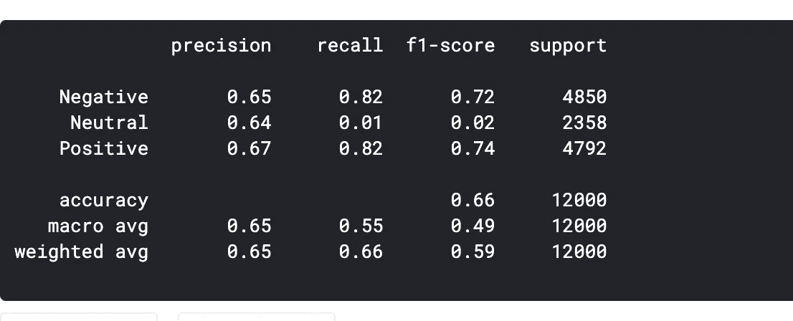

可以注意到，增加类的数量减少了参数。直观地

我还调整了正面和负面的分布，使它们不平衡。以下是我为我的模型得到的参数值。

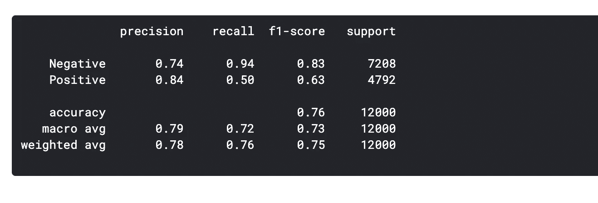

# **好玩的部分**

我还围绕这个模型建立了一个网站，从用户那里获取输入，并将其分为积极或消极。不幸的是，它没有部署在任何地方，但是可以从我的 GitHub 仓库中克隆这个项目，并在本地运行它。

请阅读 GitHub 上该项目的自述文件，了解关于运行该项目的详细信息。


行动中的项目

# **结论**

从我们进行的实验中可以得出以下关键结论:

1.  我们在数据清理后获得的许多东西都取决于数据清理的程度。因此，它被认为是任何 ML 模型的关键部分。当我第一次开始处理数据中不均匀分布的类时，我获得了接近 76%的准确率。但是一旦数据被清理，我的模型的准确率就上升到了 82%。
2.  数据的适当标记化非常重要。去掉所有的停用词减少了词汇频率矩阵所基于的记号的大小。
3.  在仅仅使用术语频率矩阵还是超越并构建术语频率逆文档矩阵之间进行选择是至关重要的。因为某些单词将具有较高的术语频率，但是它们可能在语料库中非常频繁地出现。
4.  选择正确的分类器当然可以增加模型的性能度量值。

# **改进**

这种模式远非完美。有很多事情我可以用不同的方式来进一步提高它的性能。

1.  调整分类器的超参数。
2.  下面是我添加到我的管道中的一个转换器的代码，它计算句子的长度，并把它作为一个特性。

```
class TextCountExtractor(BaseEstimator, TransformerMixin):def getlength(self, text):
        return len(text)def fit(self, X, y=None):
        return selfdef transform(self, X):
        X_tagged = pd.Series(X).apply(self.getlength)
        return pd.DataFrame(X_tagged)
```

下面是管道的样子，包括这个转换器。

```
pipeline = Pipeline([

    ('features', FeatureUnion([
        ('text_pipeline', Pipeline([
            ('vect', CountVectorizer(tokenizer=tokenize, ngram_range=(1, 2))),
            ('tfidf', TfidfTransformer())
        ])),
        ('text-length', TextCountExtractor())

    ])),

    ('clf', RandomForestClassifier())])
```

我将转述 N.H .克莱因鲍姆的一段话来结束我的演讲。**“在你之前已经有过数据科学家，如果你仔细听，你可以听到他们向你耳语他们的遗产。及时行乐，只争朝夕，让您以数据为中心的生活与众不同。”**