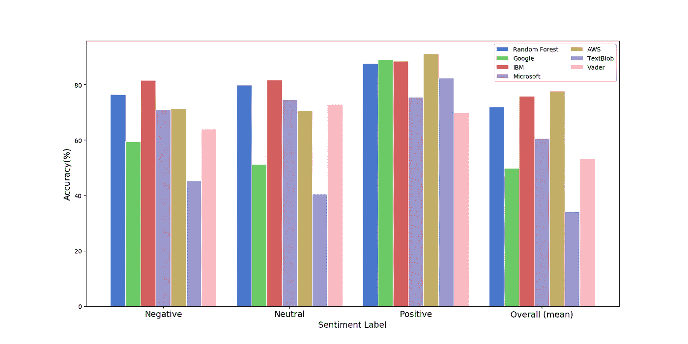
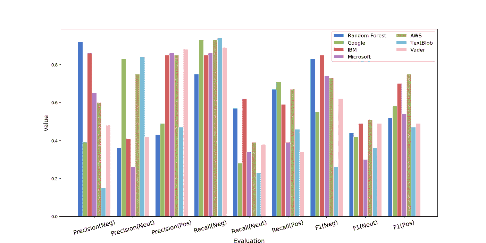

# 情感分析:探索预训练和领域相关模型

> 原文：<https://medium.com/analytics-vidhya/sentiment-analysis-exploring-pre-trained-and-domain-dependent-models-9604b4f48561?source=collection_archive---------6----------------------->


在 [Unsplash](https://unsplash.com?utm_source=medium&utm_medium=referral) 上由 [Franck V.](https://unsplash.com/@franckinjapan?utm_source=medium&utm_medium=referral) 拍摄的照片

组织和研究人员正在实施机器学习(ML)模型来帮助识别无数的见解。对于许多组织来说，这包括监控关键性能指标(KPI)、量化用户满意度以及识别安全威胁。在我的[上一篇文章](/@alexandre3k/understanding-customer-needs-with-machine-learning-de19afeebc08)中，我演示了如何建立一个模型来分析客户评论，并将情绪分为*积极、消极、*或*中性*。事实上，并不是所有的研究团队或组织都有资源来建立他们自己的模型。相反，许多团队在执行自然语言处理(NLP)等 ML 任务时，更喜欢使用**预训练模型**。

**本文旨在为组织和研究者提供进行情感分析的决策资源；帮助确定是使用现有预训练模型还是开发新模型的工具。**本文将从迁移学习的概念开始；然后，它将评估六个流行的预训练情感分析模型和一个领域相关模型，并以每种方法的成本比较作为结论。

# 迁移学习

开发一个模型需要**大型训练数据集、清理和标记数据的劳动力以及开发的技术资源**。对于寻求部署解决方案和更快获得洞察力的团队来说，一种 ***转移学习*方法是更可行的**。迁移学习模型不是在特定领域的数据集(如您组织的客户评论或调查回复)上训练模型，而是在**包含数百万个数据条目的**非常大的通用语料库(如维基百科文章或公开的电影评论)上训练模型。这些经过预先培训的解决方案可以通过本地库或云 API 轻松实施和访问。然而，**用户必须以怀疑的态度对待预先训练的解决方案，验证模型并优化他们的投资。**本文通过评估和比较领域相关模型与以下流行的预训练情感分析模型来提供见解:

*   谷歌自然语言
*   IBM 沃森自然语言理解
*   Microsoft Azure 文本分析
*   亚马逊理解
*   简化的文本处理
*   VADER 情感分析

# 模型评估

获得了 15，000 份航空公司的顾客评论，这些评论被标记为*正面、*或*中立、*。12，000 条评论的子集用于训练[领域相关模型](/@alexandre3k/understanding-customer-needs-with-machine-learning-de19afeebc08)，剩余的 3，000 条评论用于评估所有模型的性能。计算每个情感标签和模型的准确度、精确度、召回率和 F1 分数，并绘制在下面的图 1 和图 2**中。**



**图 1** |将顾客评论情绪标注为负面、中性、正面的模型准确度对比。



**图 2** |将顾客评论的情绪标记为负面、中性和正面的模型的精确度、召回率和 F1-得分的比较。

计算每个指标的平均值，如下面的**表 1** 所示。**表现最好的模型是 IBM 和 AWS，其次是特定领域模型。**这证明了在来自不同领域的大型数据集上训练的模型可以优于在特定领域数据上训练的模型。

```
**Table 1 |** Mean Accuracy, Precision, Recall, and F1-Score of sentiment analysis models. Model         Accuracy Precision Recall F1-Score
           ------------- -------- --------- ------ --------
           Word2Vec + RF 0.72     0.57      0.66   0.60
           Google        0.50     0.57      0.64   0.52
           IBM          0.76     0.71      **0.69   0.68**
           MSFT          0.61     0.59      0.53   0.52
           AWS           **0.77     0.73**      0.66   0.66
           TextBlob      0.34     0.49      0.54   0.36
           VADER         0.53     0.59      0.54   0.53
```

# 成本和资源

部署预训练模型时，成本由用户分析的文档数量决定。如表 2 中的结果所示，情感分析解决方案的成本各不相同。

```
**Table 2 |** Cost per 100,000 Sentiment Analysis API requests. Model      Cost($)
                        ---------  -------
                        Google     100
                        IBM        300
                        Microsoft  250
                        AWS        10
                        TextBlob   0
                        VADER      0
```

对于构建基于特定领域数据的模型的团队来说，一个好处是**运行模型是免费的，没有任何经常性成本。**然而，**培训模型**需要资源，包括准备、清理和标记数据的劳动力，以及构建、调整和评估模型的技术专长。像亚马逊土耳其机器人这样的资源是一种经济有效的方式，可以外包标记、训练和测试数据集的繁琐和耗时的任务。例如，标记 15，000 条客户评论的情绪花费 750 美元，这足以实现上面显示的结果。此外，ML 算法的性能随着训练数据集大小的增加而提高。因此，在依赖于领域的数据上训练模型的额外好处是，它将随着摄取更多的数据而改进，并且潜在地优于预训练的解决方案。

# 结论

大型数字化文本语料库和最大似然算法的进步极大地改善了自然语言处理的迁移学习。这些发展使得团队能够从预先训练的模型提供的实现便利中受益，并且更快地部署 ML 解决方案。这些解决方案对于数据集规模有限的团队特别有用，否则不足以训练一个健壮的模型。正如上面所强调的，团队在采用预先训练的模型之前，必须评估来自不同供应商的解决方案，因为性能会有所不同。

对于能够访问大型训练数据集的团队来说，在特定领域数据上训练模型的传统方法仍然是优先考虑的。例如，一个只有 12，000 条训练记录的简单模型的表现优于六个预训练模型中的四个。通过利用 MTurk 等资源，团队可以加快标注数据集的繁琐任务，转而将精力集中在开发健壮的模型和更快地部署解决方案上。开发内容相关模型的另一个好处是数据集可以重复用于执行其他 NLP 任务。组织可以重用调查结果来执行其他 NLP 任务，如命名实体识别，以确定与特定产品相关的客户痛点。对于此任务，预训练模型可能不是最佳的，因为它们不包含与组织相关的特定产品名称。

我希望这篇文章对与情绪分析或任何迁移学习方法相关的组织或个人决策过程有所帮助。一如既往，感谢您抽出时间阅读材料。请在下面分享任何评论和想法；感谢对本文的所有反馈。此外，请随时通过 LinkedIn 联系。

[](https://www.linkedin.com/in/ianovski/) [## Alex Ianovski -自动化工程师-罗杰斯通信| LinkedIn

### Alex 目前受雇于 Rogers Communication，为 Ignite TV 和智能家居开发自动化测试框架…

www.linkedin.com](https://www.linkedin.com/in/ianovski/) 

# 资源

[](https://github.com/ianovski/customer-review-sentiment) [## ianovski/客户评论-观点

### 此时您不能执行该操作。您已使用另一个标签页或窗口登录。您已在另一个选项卡中注销，或者…

github.com](https://github.com/ianovski/customer-review-sentiment) 

# 参考

[](/@alexandre3k/understanding-customer-needs-with-machine-learning-de19afeebc08) [## 通过机器学习了解客户需求

### 在我最喜欢的一个播客的最近一集中，嘉宾 Ellen Loeshelle 讨论了分析顾客评论…

medium.com](/@alexandre3k/understanding-customer-needs-with-machine-learning-de19afeebc08) [](https://towardsdatascience.com/cost-comparisons-for-cloud-sentiment-analysis-at-amazon-google-ibm-and-microsoft-bbe92cb620d7) [## 亚马逊、谷歌、IBM 和微软的云情感分析成本比较

### 我们生活在一个激动人心的时代，尤其是对于负责快速分析大量文本的数据科学家来说…

towardsdatascience.com](https://towardsdatascience.com/cost-comparisons-for-cloud-sentiment-analysis-at-amazon-google-ibm-and-microsoft-bbe92cb620d7) [](https://www.mturk.com/) [## 亚马逊土耳其机械公司

### 获得全球化、按需、24x7 的劳动力亚马逊土耳其机器人是一个众包市场，它使…

www.mturk.com](https://www.mturk.com/) [](https://cloud.google.com/products/ai/) [## 云人工智能|谷歌云

### 翻译速度快，动态翻译为您量身定制的内容与翻译，您可以快速翻译之间…

cloud.google.com](https://cloud.google.com/products/ai/) [](https://www.ibm.com/watson/services/natural-language-understanding/) [## 自然语言理解

### 分析文本，从概念、实体、关键字等内容中提取元数据。

www.ibm.com](https://www.ibm.com/watson/services/natural-language-understanding/) [](https://azure.microsoft.com/en-ca/services/cognitive-services/text-analytics/) [## 文本分析 API | Microsoft Azure

### 使用 Azure 文本分析 API 将非结构化文本转化为有意义的见解。获取情感分析，关键词…

azure.microsoft.com](https://azure.microsoft.com/en-ca/services/cognitive-services/text-analytics/) [](https://docs.aws.amazon.com/comprehend/latest/dg/API_DetectSentiment.html) [## 检测情绪

### 检查文本并返回主流情绪的推断(正面、中性、混合或负面)。

docs.aws.amazon.com](https://docs.aws.amazon.com/comprehend/latest/dg/API_DetectSentiment.html) [](https://textblob.readthedocs.io/en/dev/) [## TextBlob:简化的文本处理- TextBlob 0.15.2 文档

### 版本 0.15.2\. () TextBlob 是一个用于处理文本数据的 Python (2 和 3)库。它为…提供了一个简单的 API

textblob.readthedocs.io](https://textblob.readthedocs.io/en/dev/) [](https://github.com/cjhutto/vaderSentiment) [## cjhutto/Vader 情操

### VADER 情绪分析。VADER(价感知词典和情感推理机)是一个词典和基于规则的情感…

github.com](https://github.com/cjhutto/vaderSentiment)