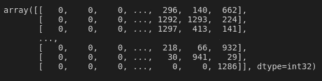

# 基于 LSTM 的孟加拉语新闻文本情感分析

> 原文：<https://medium.com/analytics-vidhya/sentiment-analysis-for-bengali-news-text-using-lstm-cbed3f66f3bb?source=collection_archive---------10----------------------->


情感分析是管理决策和反应的部分，就像情感一样，它产生于文字，广泛应用于数据挖掘、网络挖掘和基于互联网的生活调查等领域，因为假设是对人类行为做出判断的最基本的品质。这个特殊的领域正在研究和机械的社会秩序中膨胀。评估可以是正面的、负面的或中性的，或者它可以包含一个表达评估充分性的算术分数。

由情绪组成的新闻标题-好的，坏的，中性的。情感分析被用来调查文本信息中存在的人类情感。在这里，我将展示一个基于深度学习的新闻标题情感分析的实现。在孟加拉语新闻标题数据集上的实验表明了该方法的适用性和有效性。

## 加载数据集

**pandas** 是一个快速、强大、灵活且易于使用的开源数据分析库，专为 python 打造。数据集已保存在 excel 表格中。所以，需要使用 pandas 库来读取 excel。在 python 3 中不需要转换编码。re 用于替换孟加拉文本中的正则表达式。

```
import pandas as pdimport redf=pd.read_excel("Bengali_News_Headline_Sentiment.xlsx")
```

数据集中有三个属性。但是我们需要标题和情感属性来进行情感分析。

```
df.head()
```


**drop()** 用来放下不想要的列和 axis=1 的指示列。

```
df=df.drop('News Type',axis=1)
```

## 移除表达式

孟加拉文字有一些最常用的表达，如।，:，，？等。在转换标记和序列之前，需要从文本中删除这些表达式。应用一个**λ**函数来替换标题的那些表达式。

```
df['Headline'] = df['Headline'].apply((lambda x: re.sub('[,?'']','',x)))
```

## 深度学习库

为了将文本转换成令牌，使用了 Keras **令牌化器**。之后，使用将令牌转换为序列 Keras 填充序列。Keras **序列**模型被导入以构建适用于层的简单堆叠的模型，其中每层恰好有 ***一个输入张量*** 和 ***一个输出张量。***

一个 **LSTM** 网络是一种递归神经网络。递归神经网络是试图模拟时间或序列相关行为的神经网络。为了保持文本序列**，导入长短期记忆**。在这里，我们将建立一个维护文本序列的 LSTM 网络。LSTM 细胞块代替了我们的标准神经网络层。这些单元有不同的组件，称为输入门、遗忘门和输出门。

**密集**层是规则的深度连接神经网络层。这是最常见和最常用的层。

Keras **嵌入**层，可用于文本数据上的神经网络。它要求输入数据是整数编码的，因此每个字都由一个唯一的整数表示。

**SpartialDropout1D** 它会删除整个 1D 特征地图，而不是单个元素。

Keras **utils** 将类向量(整数)转换为二进制类矩阵。

Sklearn 模型选择用于将数据集分为训练和测试部分。

```
import numpy as npfrom keras.preprocessing.text import Tokenizerfrom keras.preprocessing.sequence import pad_sequencesfrom keras.models import Sequentialfrom keras.layers import LSTM,Dense,Embedding,SpatialDropout1Dfrom keras.utils.np_utils import to_categoricalfrom sklearn.model_selection import train_test_split
```

## 将文本转换为序列

对于特征提取，使用 2500 个最大特征。Tokenizer 根据最大特征数对文本进行标记。和记号赋予器适合标题文本，用于将文本转换成序列。转换后的序列被添加填充序列。

```
max_fatures = 2500tokenizer = Tokenizer(num_words=max_fatures, split=' ')tokenizer.fit_on_texts(df['Headline'].values)X = tokenizer.texts_to_sequences(df['Headline'].values)X = pad_sequences(X)
```

x 包含 32 位整数数据类型的文本序列数组。

```
X
```



```
np.shape(X)
```


## 设置模型

设置嵌入尺寸 64。在嵌入层中，最大特征被用作具有嵌入维度的输入，并且输入长度等于填充序列形状。在空间漏失层中，使用 0.4 的比率。LSTM 牢房增加了 64 个隐藏单元，0.2 人辍学，0.2 人经常辍学。在输出图层组中，使用“Softmax”激活功能，密度大小为 2。Softmax 将实数向量转换为分类概率向量。输出向量的元素在范围(0，1)内，总和为 1。对于损失计算，使用“分类交叉熵”和“adam”进行优化。

```
embed_dim = 64model = Sequential()model.add(Embedding(max_fatures, embed_dim,input_length = X.shape[1]))model.add(SpatialDropout1D(0.4))model.add(LSTM(64, dropout=0.2, recurrent_dropout=0.2))model.add(Dense(2,activation='softmax'))model.compile(loss = 'categorical_crossentropy', optimizer='adam',metrics = ['acc'])model.summary()
```


## 列车测试划分

标题文本是模型的输入，情感是输出。变量 X 包含模型输入，Y 是输出。为了从数据集获得情感值，使用熊猫假人函数。

对于测试，20%的总数据与 42 个随机状态值一起使用。

```
Y = pd.get_dummies(df['Sentiment']).valuesX_train, X_test, Y_train, Y_test = train_test_split(X,Y, test_size = 0.20,random_state = 42)print(X_train.shape,Y_train.shape)print(X_test.shape,Y_test.shape)
```


## 火车模型

保存模型性能历史变量的每一步被使用。对于迭代，设置 10 个历元，32 个批次大小。验证数据 10%的数据用于验证分割。

```
history=model.fit(X_train, Y_train, epochs = 10, batch_size=32, verbose = 2,validation_split=0.1)
```


在训练模型实现了训练数据的 97%的准确度和评估数据的 64%的准确度之后。模型也按 64 批次大小进行评估。

```
score = model.evaluate(X_train, Y_train,batch_size=64, verbose=2)print('Train loss:', score[0])print('Train accuracy:', score[1])
```


```
score = model.evaluate(X_test, Y_test,batch_size=64, verbose=2)print('Test loss:', score[0])print('Test accuracy:', score[1])
```


## 情感预测

用户给出一个标题作为输入句子，然后它将文本转换成用于情感预测的序列。如果模型预测 0 表示包含负面消息，否则预测正面消息。

```
text = input()text = tokenizer.texts_to_sequences(text)text = pad_sequences(text,maxlen=14,dtype='int32',value=0)predict=model.predict(text,batch_size=1,verbose=2)[0]if(np.argmax(predict)==0):print("Negative News")else:print("Positive News")
```

github:[https://github . com/abukaisar 24/Machine-Learning-Algorithms-Performance-Measurement-for-Bengali-News-sensition-Classification/blob/master/Headline % 20 sensition % 20 using % 20 lstm . ipynb](https://github.com/AbuKaisar24/Machine-Learning-Algorithms-Performance-Measurement-for-Bengali-News-Sentiment-Classification/blob/master/Headline%20Sentiment%20using%20LSTM.ipynb)