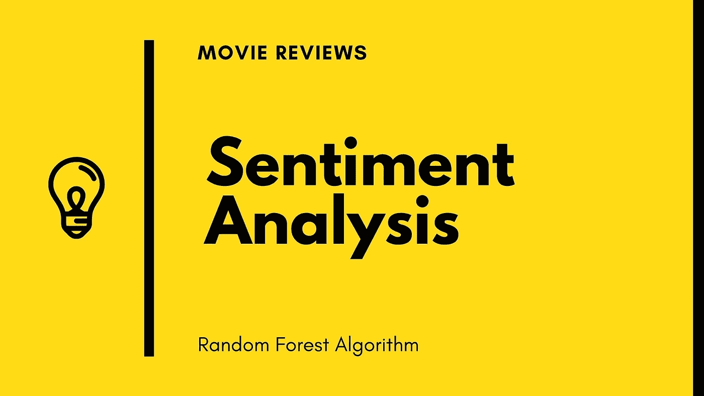
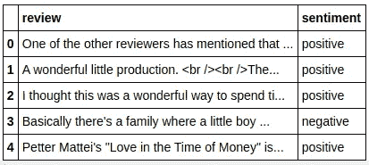
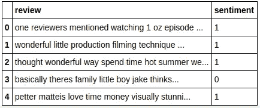

# 电影评论的情感分析

> 原文：<https://medium.com/analytics-vidhya/sentiment-analysis-for-movie-reviews-791be2a58297?source=collection_archive---------4----------------------->



注意:所有的代码文件都可以在:[https://github.com/ashwinhprasad/SentimentAnalysis](https://github.com/ashwinhprasad/SentimentAnalysis)获得

# 什么是情感分析？

简而言之，情感分析基本上是从用户的活动(如评论、推文等)中分析用户对某个项目或任何其他事物的感受。

# 跳到代码

1.  **导入库**

```
**import** **numpy** **as** **np**
**import** **pandas** **as** **pd**
**import** **matplotlib.pyplot** **as** **plt
import nltk**
```

**2。下载 NLTK**

使用 nltk shell 下载英语停用词。

**3。导入数据集**

```
df = pd.read_csv('IMDB Dataset.csv')
df.head()
```

**输出:**



*如你所见，评论中有一些 html 标签*

**4。美丽的汤**

```
*#remove html tags*
**from** **bs4** **import** BeautifulSoup
**for** i **in** range(df.shape[0]):
    df['review'][i] = BeautifulSoup(df['review'][i], "lxml").text
```

Beautiful soup 是一个 web 废弃库，可以用来从数据集中删除 html 标签

**5。删除标点符号**

用函数去掉标点符号。包含所有的标点符号。

```
*#remove punctuations*
**import** **string**
**def** punctuation(sentence):
    review = [letters.lower() **for** letters **in** sentence **if** letters **not** **in** string.punctuation ]
    review = ''.join(review)
    **return** review

df['review'] = df['review'].apply(punctuation)
```

**6。编码文本变量并删除停用词**

```
df['sentiment'].replace(['positive','negative'],[1,0],inplace=**True**)
```

用 1，0 代替正，负。

```
*#removing stopwords*
**def** stopwords(sentence):
    review = [words **for** words **in** sentence.split() **if** words **not** **in** nltk.corpus.stopwords.words('english')]
    review = ' '.join(review)
    **return** review

df['review'] = df['review'].apply(stopwords)
```

停用词是可以从数据集中删除的常用词。一般来说，这些词没有太大的意义

**7。词干**

```
*#stemming* **from** **nltk** **import** PorterStemmer 
ps = PorterStemmer() 
df['review'] = df['review'].apply(ps.stem)
df.head()
```

**输出:**



转换为 tf-idf 是一项计算量很大的任务。我们希望在不丢失数据信息的情况下，尽可能减少不同单词的数量。
我们的数据集包含像**跑、跑者、跑、跑**这样的词。我们的模型不会丢失任何信息，即使所有这些词被概括为**运行**。这就是词干的作用。

8。Tf-Idf 矢量器

```
*#tf-Idf vectorizer* **from** **sklearn.feature_extraction.text** **import** TfidfVectorizer vectorizer = TfidfVectorizer() 
x = vectorizer.fit_transform(df['review']) 
y =  df['sentiment']
```

TF-IDF 是一种统计度量，用于评估单词与文档集合中的文档的相关程度。这是通过将两个度量相乘来实现的:一个单词在一个文档中出现的次数，以及该单词在一组文档中的逆文档频率。
现在，我们已经使用 tf-idf 矢量器将文本转换为数字数据。

**9。列车测试分割**

```
*#train test split* 
**from** **sklearn.model_selection** **import** train_test_split x_train,x_test,y_train,y_test = train_test_split(x,y,test_size=0.2)
```

我们需要将数据集分成训练集和测试集

**10。随机森林分类器**

```
**from** **sklearn.ensemble** **import** RandomForestClassifier
classifier = RandomForestClassifier(n_estimators=100,)
classifier.fit(x_train,y_train)
```

现在，我们已经将模型拟合到我们的数据集。这个模型现在可以测试了。

**11。模型分析**

```
*#making predictions*
y_pred = classifier.predict(x_test)*#model accuracy*
print("Model Accuracy : **{}**%".format((y_pred == y_test).mean()))*#confusion matrix* **from** **sklearn.metrics** **import** confusion_matrix print(confusion_matrix(y_test,y_pred))**output:**Model Accuracy : 0.8434%confusion matrix: 
[[4256  770]
 [ 796 4178]]
```

该模型的准确率为:84.34%
关于混淆矩阵的更多细节，请查看:C [混淆矩阵](/analytics-vidhya/pytorch-for-deep-learning-confusion-matrix-e73163277c95)

# 结论

这就是 Python 中随机森林算法对电影评论的情感分析。各种公司使用情感分析来获得客户反馈。

## 谢谢你