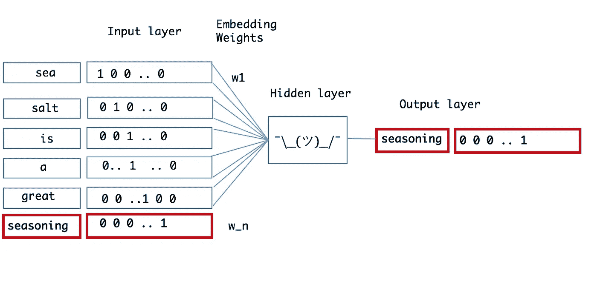
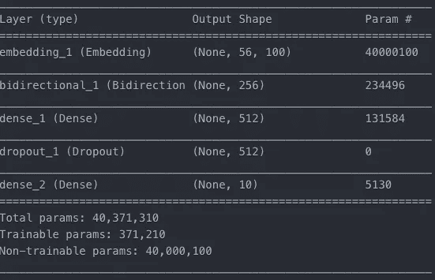
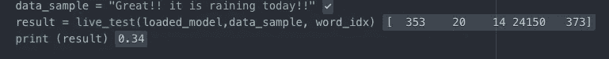
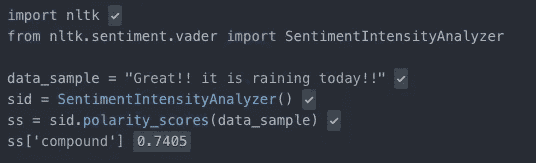

# 基于深度学习的文本情感分析

> 原文：<https://medium.com/analytics-vidhya/sentiment-analysis-for-text-with-deep-learning-2f0a0c6472b5?source=collection_archive---------0----------------------->


我开始用 twitter 数据做一个 NLP 相关的项目，项目目标之一是对每条推文进行情感分类。然而，当我探索可用的资源，如 NLTK 情感分类器和 python 中的其他可用资源时，我对这些模型的性能感到失望。在二元分类(即只有正面或负面类别)任务中，我最多只能获得 60%到 70%的准确率。

因此，我开始研究如何提高我的模型性能。一个显而易见的选择是建立一个基于深度学习的情感分类模型。

我写这篇博客是为了分享我关于建立情感分类深度学习模型的步骤的经验，希望你会觉得有用。代码库的链接可以在[这里](https://gitlab.com/praj88/deepsentiment)找到。

我设计的模型提供了一个 0 到 1 之间的情绪得分，0 表示非常消极，1 表示非常积极。这是通过建立一个多类分类模型来完成的，即 10 个类，每个十分位数一个类。

建立情感分类的深度学习模型有 **5 个主要步骤**:

**第一步:**获取数据。

**第二步:**生成嵌入

**第三步**:架构建模

**第四步**:模型参数

**第五步:**训练并测试模型

**步骤 6:** 运行模型

我将在下面详细介绍上述每个步骤。

## 第一步:获取数据

获取用于训练深度学习模型的标记数据是建立模型最困难的部分之一。幸运的是，我们可以使用斯坦福情感树库数据来达到我们的目的。

数据集“dictionary.txt”由 239，233 行句子组成，每行有一个索引。该索引用于将每个句子与文件“labels.txt”中的情感分数进行匹配。分数范围从 0 到 1，0 表示非常负面，1 表示非常正面。

下面的代码读取 dictionary.txt 和 labels.txt 文件，将分数组合到每个句子中。该代码位于***train/utility _ function . py***中

```
def read_data(path):# read dictionary into dfdf_data_sentence = pd.read_table(path + ‘dictionary.txt’)df_data_sentence_processed = df_data_sentence[‘Phrase|Index’].str.split(‘|’, expand=True)df_data_sentence_processed = df_data_sentence_processed.rename(columns={0: ‘Phrase’, 1: ‘phrase_ids’})# read sentiment labels into dfdf_data_sentiment = pd.read_table(path + ‘sentiment_labels.txt’)df_data_sentiment_processed = df_data_sentiment[‘phrase ids|sentiment values’].str.split(‘|’, expand=True)df_data_sentiment_processed = df_data_sentiment_processed.rename(columns={0: ‘phrase_ids’, 1: ‘sentiment_values’})#combine data frames containing sentence and sentimentdf_processed_all = df_data_sentence_processed.merge(df_data_sentiment_processed, how=’inner’, on=’phrase_ids’return df_processed_all
```

数据分为 3 部分:

*   train.csv:这是用于训练模型的主要数据。这是整体数据的 50%。
*   val.csv:这是一个验证数据集，用于确保模型不会过度拟合。这是整体数据的 25%。
*   test.csv:用于测试模型后期训练的准确性。这是整体数据的 25%。

## 步骤 2:生成嵌入

在训练这个模型之前，我们将把每个单词转换成单词嵌入。您可以将单词嵌入视为单词的数字表示，以使我们的模型能够学习。关于单词嵌入的更多细节，请阅读这个[博客](https://www.datascience.com/resources/notebooks/word-embeddings-in-python)。

*什么是单词嵌入？*

它们是向量表示，捕捉句子中潜在单词相对于其他单词的上下文。这种变换导致具有相似含义的单词在超平面中更紧密地聚集在一起，而不同的单词在超平面中位于更远处。

*我们如何将每个单词转换成单词嵌入体？*

我们将使用一个预先训练好的单词嵌入模型，称为[手套](https://nlp.stanford.edu/projects/glove/)。对于我们的模型，我们将使用 100 维嵌入来表示每个单词。用于将数据转换为单词嵌入的详细代码在***train/utility _ function . py .***中。该函数通过从手套预训练向量中执行查找，基本上将每个单词替换为其各自的嵌入。下图显示了这个过程，其中每个单词都被转换成一个嵌入，并输入到一个神经网络中。



将句子转换为神经网络的嵌入([来源](https://www.datascience.com/resources/notebooks/word-embeddings-in-python)

以下代码用于将数据分为训练集、val 集和测试集。数据的相应嵌入也存储在 weight_matrix 变量中。

```
def load_data_all(data_dir, all_data_path,pred_path, gloveFile, first_run, load_all): numClasses = 10# Load embeddings for the filtered glove list
    if load_all == True:
        weight_matrix, word_idx = uf.load_embeddings(gloveFile)
    else:
        weight_matrix, word_idx = uf.load_embeddings(filtered_glove_path) # create test, validation and trainng data
    all_data = uf.read_data(all_data_path)
    train_data, test_data, dev_data = uf.training_data_split(all_data, 0.8, data_dir)train_data = train_data.reset_index()
    dev_data = dev_data.reset_index()
    test_data = test_data.reset_index() maxSeqLength, avg_words, sequence_length = uf.maxSeqLen(all_data) # load Training data matrix
    train_x = uf.tf_data_pipeline_nltk(train_data, word_idx, weight_matrix, maxSeqLength)
    test_x = uf.tf_data_pipeline_nltk(test_data, word_idx, weight_matrix, maxSeqLength)
    val_x = uf.tf_data_pipeline_nltk(dev_data, word_idx, weight_matrix, maxSeqLength) # load labels data matrix
    train_y = uf.labels_matrix(train_data)
    val_y = uf.labels_matrix(dev_data)
    test_y = uf.labels_matrix(test_data)return train_x, train_y, test_x, test_y, val_x, val_y, weight_matrix
```

## 步骤 3:模型架构

为了训练模型，我们将使用一种称为 LSTM(长短期记忆)的递归神经网络。这个网络的主要优点是，它能够记住过去的数据序列，即在我们的情况下的单词，以便对单词的情感做出决定。


一个 RNN 网络([来源](http://colah.github.io/posts/2015-08-Understanding-LSTMs/))

如上图所示，它基本上是细胞的一系列拷贝，每个细胞的输出都作为输入传递给下一个细胞。LSTM 网络本质上是相同的，但是每个小区的架构稍微复杂一些。如下图所示，这种复杂性允许每个细胞决定哪些过去的信息要记住，哪些要忘记，如果你想了解更多关于 LSTM 内部运作的信息，请访问这个令人惊叹的[博客](http://colah.github.io/posts/2015-08-Understanding-LSTMs/) *(插图来源于这个博客)。*


一个 LSTM 细胞([来源](http://colah.github.io/posts/2015-08-Understanding-LSTMs/)

我们将使用 Keras 创建网络。Keras 基于 tensorflow 构建，可用于构建大多数类型的深度学习模型。我们将指定模型的层如下。为了估计诸如漏失、单元数量等参数，我使用不同的参数值进行了网格搜索，并选择了具有最佳性能的参数。

**层数:**



模型架构

**层 1:** 矢量大小为 100 并且每个句子的最大长度被设置为 56 的嵌入层。

**第 2 层:** 128 个单元双向 LSTM 层，其中嵌入数据被馈送到网络。我们增加了一个 0.2 的压差，这是用来防止过度拟合。

**第 3 层:**一个 512 层的密集网络，接收来自 LSTM 层的输入。这里增加了 0.5 的漏失。

**第 4 层:**激活 softmax 的 10 层稠密网络，每个类用于表示一个情感类别，类 1 表示 0.0 到 0.1 之间的情感得分，类 10 表示 0.9 到 1 之间的情感得分。

在 Keras 中创建 LSTM 模型的代码:

```
import os
import numpy as np
import keras
from keras.models import Sequential
from keras.layers import Dense
from keras.layers import Flatten
from keras.layers import LSTM
from keras.layers.embeddings import Embedding
from keras.layers import Bidirectional
from keras.preprocessing import sequence
from keras.layers import Dropout
from keras.models import model_from_json
from keras.models import load_model def create_model_rnn(weight_matrix, max_words, EMBEDDING_DIM):# create the modelmodel = Sequential()
model.add(Embedding(len(weight_matrix), EMBEDDING_DIM, weights=[weight_matrix], input_length=max_words, trainable=False))
model.add(Bidirectional(LSTM(128, dropout=0.2, recurrent_dropout=0.2)))
model.add(Dense(512, activation='relu'))
model.add(Dropout(0.50))
model.add(Dense(10, activation='softmax'))# Adam Optimiser
model.compile(loss='categorical_crossentropy',optimizer='adam', metrics=['accuracy'])return model
```

## **第四步:模型参数:**

**激活功能:**我已经用 ReLU 作为激活功能了。ReLU 是一个非线性激活函数，有助于模型捕获数据中的复杂关系。

**优化器:**我们使用 adam 优化器，它是一个自适应学习率优化器。

**损失函数:**我们将使用**交叉熵损失**，也称为 Softmax 损失，训练网络输出 10 个类别的概率。对于多类分类非常有用。

## 步骤 5:训练和测试模型

我们通过将训练、验证和测试数据集传递到下面的函数中来开始模型的训练:

```
def train_model(model,train_x, train_y, test_x, test_y, val_x, val_y, batch_size):# save the best model and early stopping
saveBestModel = keras.callbacks.ModelCheckpoint('../best_weight_glove_bi_100d.hdf5', monitor='val_acc', verbose=0, save_best_only=True, save_weights_only=False, mode='auto', period=1)earlyStopping = keras.callbacks.EarlyStopping(monitor='val_loss', min_delta=0, patience=3, verbose=0, mode='auto')# Fit the model
model.fit(train_x, train_y, batch_size=batch_size, epochs=25,validation_data=(val_x, val_y), callbacks=[saveBestModel, earlyStopping])# Final evaluation of the model
score, acc = model.evaluate(test_x, test_y, batch_size=batch_size)
return model
```

我已经对一次 **500** 个项目的**批次进行了培训。随着批量的增加，训练的时间会减少，但需要额外的计算能力。因此，这是计算能力和训练时间之间的折衷。**

培训将持续 25 个时期。一个时期意味着网络已经看到了整个训练数据一次。随着时代数量的增加，模型可能会过度适应训练数据。因此，为了防止模型过度拟合，我启用了早期停止。

早期停止是一种方法，它允许我们指定任意大量的训练时期，并且一旦模型性能在支持/验证数据集上停止改善，就停止训练。

该模型在 10 类情感分类测试集上提供了 48.6%的准确率。在 2 类二进制(正或负)数据集上，精度会高得多。

## 步骤 6:运行模型

一旦模型被训练，你可以使用下面的代码在 keras 中保存模型。

```
model.save_weights("/model/best_model.h5")
```

下一步是实时使用训练好的模型对新数据进行预测。为了做到这一点，您需要将输入数据转换为嵌入数据，类似于我们处理训练数据的方式。下面的函数 *live_test* 执行所需的数据预处理，并返回训练模型的结果。

在这里，为了确保模型结果的稳健性，我从模型中选取了平均前 3 个情绪带。这为模型结果提供了更好的校准。

```
def live_test(trained_model, data, word_idx):live_list = []
live_list_np = np.zeros((56,1))# split the sentence into its words and remove any punctuations.tokenizer = RegexpTokenizer(r'\w+')
data_sample_list = tokenizer.tokenize(data)
labels = np.array(['1','2','3','4','5','6','7','8','9','10'], dtype = "int")# get index for the live stage
data_index = np.array([word_idx[word.lower()] if word.lower() in word_idx else 0 for word in data_sample_list])
data_index_np = np.array(data_index)# padded with zeros of length 56 i.e maximum length
padded_array = np.zeros(56)
padded_array[:data_index_np.shape[0]] = data_index_np
data_index_np_pad = padded_array.astype(int)
live_list.append(data_index_np_pad)
live_list_np = np.asarray(live_list)# get score from the model
score = trained_model.predict(live_list_np, batch_size=1, verbose=0)
single_score = np.round(np.argmax(score)/10, decimals=2) # maximum of the array i.e single band# weighted score of top 3 bands
top_3_index = np.argsort(score)[0][-3:]
top_3_scores = score[0][top_3_index]
top_3_weights = top_3_scores/np.sum(top_3_scores)
single_score_dot = np.round(np.dot(top_3_index, top_3_weights)/10, decimals = 2)return single_score_dot, single_score
```

如下面的代码所示，您可以指定模型路径、样本数据和 live_test 函数的相应嵌入。它将返回样本数据的情感。

```
# Load the best model that is saved in previous step
weight_path = '/model/best_model.hdf5'
loaded_model = load_model(weight_path)# sample sentence
data_sample = "This blog is really interesting."
result = live_test(loaded_model,data_sample, word_idx)
```

## 结果

让我们通过取样来比较我们的深度学习模型和 NLTK 模型的结果。

LSTM 模式:这句话*“太棒了！！今天下雨了！!"*包含负面内容，我们的模型能够预测这一点，如下所示。它的得分是 0.34。



LSTM 模型

NLTK 模型:当用双词 NLTK 模型分析同一个句子时，该句子的得分为 0.74，是肯定的。



NLTK 模型

万岁！！为文本数据创建深度学习情感分类模型的教程到此结束。

您可以从 [gitlab](https://gitlab.com/praj88/deepsentiment) 下载源代码，并根据您自己的数据对网络进行训练。我将在另一篇博客中讨论如何使用 dockers 和 api 服务大规模部署这个模型。