# 使用 Reddit 文本数据进行交易的情感分析

> 原文：<https://medium.com/analytics-vidhya/sentiment-analysis-for-trading-with-reddit-text-data-73729c931d01?source=collection_archive---------3----------------------->

在这篇文章中，我探索了使用 Reddit 情绪数据为交易策略提供信息。我通过两种方式利用华尔街下注子编辑得出市场情绪:

1.  从每日提交的讨论中收集意见，然后运行 **VADER 情绪模型**来评估总体每日**积极/消极**情绪。
2.  每天收集所有提交的标题，然后使用**关键词分析**评估每日**看涨/看跌**情绪。

在特征化阶段，我应用傅立叶变换来平滑两个非常嘈杂的时间序列数据集。最后，在策略开发阶段，我探索了两种可能的策略。第一种是利用 SPY (SPDR 标准普尔 500 信托 ETF)价格和每日积极/消极情绪之间的价差。第二种策略包括训练 LSTM(长短期记忆)模型，根据看涨/看跌情绪预测第二天的间谍价格。

让我们开始代码演练吧！

首先，我导入所有相关的库。

在下面的单元格中，我导入了 TensorFlow，这是本文后面的策略开发所必需的。最后一行代码检查以确保 TensorFlow 连接到图形卡，但是，如果不适用于您，这是不必要的。

# **使用 VADER 进行正面/负面情绪分析**

首先，我准备好积极/消极情绪数据集。

**数据来源-**The wall street bets subreddit 是一个由股市爱好者组成的社区，拥有 130 万会员。我使用 [pushshift.io](http://pushshift.io/) 和 PRAW(Reddit API)收集相关数据。

下面的代码收集了每日的讨论线程提交标题(感谢 Rare Loot 关于使用 pushshift 提取 reddit 提交内容的文章-[https://medium . com/@ Rare Loot/using-pushshift-API-to-extract-Reddit-submissions-FB 517 b 286563](/@RareLoot/using-pushshifts-api-to-extract-reddit-submissions-fb517b286563))。

接下来，我使用 PRAW 和下面的代码从每日讨论主题提交中收集评论。参见下面这篇关于如何设置 PRAW 的文章-[https://towards data science . com/scraping-Reddit-data-1c 0af 3040768](https://towardsdatascience.com/scraping-reddit-data-1c0af3040768)。我还在我的 GitHub 上提供了准备好的积极/消极情绪数据集，因为下面的摄取代码需要非常长的时间来运行([https://GitHub . com/awrd 2019/Reddit-perspection-NLP-for-Trading](https://github.com/awrd2019/Reddit-Sentiment-NLP-for-Trading))。

在这里，我对每天的评论运行 VADER(用于情感推理的效价感知词典)情感分析器。VADER 是一个简约的基于规则的模型，由佐治亚理工学院的一组研究人员开发，用于社交媒体文本的情感分析。详见他们的优秀论文([http://comp . social . gatech . edu/papers/icwsm 14 . Vader . hutto . pdf](http://comp.social.gatech.edu/papers/icwsm14.vader.hutto.pdf))。然后，将每天所有评论的情绪得分相加，以创建每天的情绪得分。

接下来，我将正面/负面情绪数据与相应的间谍价格合并。我还只选择相关的列，将日期列设置为索引，并删除任何空行。然后，在应用傅立叶变换之前，我保存数据帧。

在这里，我绘制了情绪得分与间谍价格的关系图。

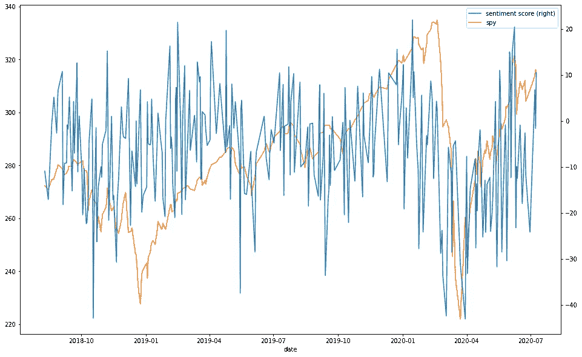

接下来，我应用傅立叶变换来平滑情感数据。傅立叶变换使用一系列正弦波来逼近函数。我绘制了情感数据和傅立叶变换。

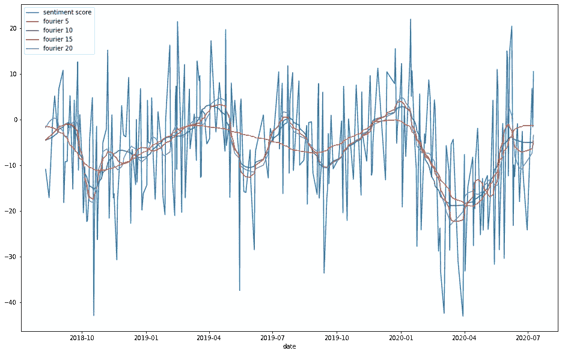

下面，我用 20 个成分和间谍价格绘制情感数据的傅立叶变换。

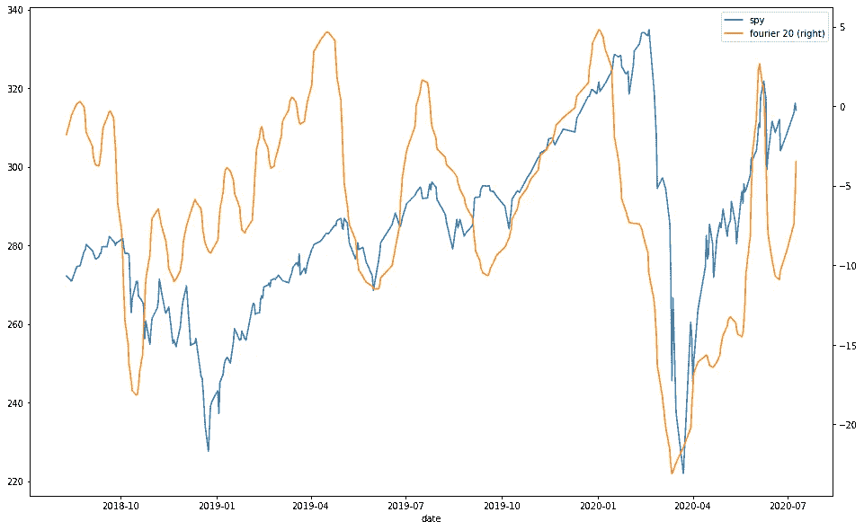

接下来，我将数据标准化。该图描绘了标准化的间谍价格、标准化的情感得分和情感数据的标准化的傅立叶变换。

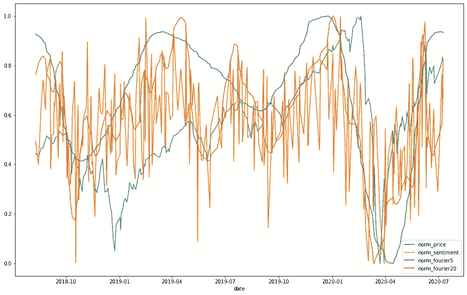

我已经准备好了正面/负面情绪数据。让我们继续准备看涨/看跌情绪数据。

# **使用关键词的看涨/看跌情绪分析**

同样，我使用 pushshift 收集提交标题。然而，我不需要像以前那样使用 PRAW。所有我需要收集的是提交标题进行关键字分析。我再次在我的 github 上提供了准备好的数据集，因为摄取代码需要很长时间才能运行([https://github . com/awrd 2019/Reddit-情操-NLP-for-Trading](https://github.com/awrd2019/Reddit-Sentiment-NLP-for-Trading) )。

在这里，我使用一个小的关键词集合将提交的标题分为看涨、看跌或中性。我还使用 regex 来检测提交标题中的位置，例如 AAPL 350c(这是一个执行价格为 350 的苹果看涨期权)。包含看涨头寸的标题被归类为看涨，而包含看跌头寸的标题被归类为看跌。

接下来，我删除所有不属于以下 Fla 的提交标题；DD(尽职调查)、讨论、YOLO、基本面或股票。

在这里，我将每天所有提交标题的看涨和看跌情绪得分相加。然后，我将这个数字除以每天的提交总数。

现在，我将看涨/看跌情绪数据与间谍价格数据合并，就像我之前处理正面/负面情绪数据一样。我也再次保存数据帧。

在这里，我绘制了过去一年牛市和熊市的得分对比。

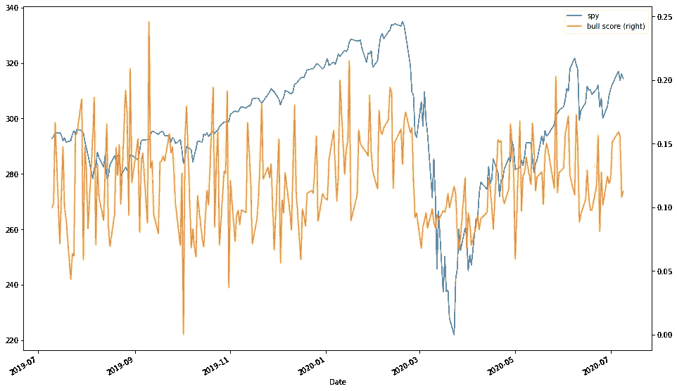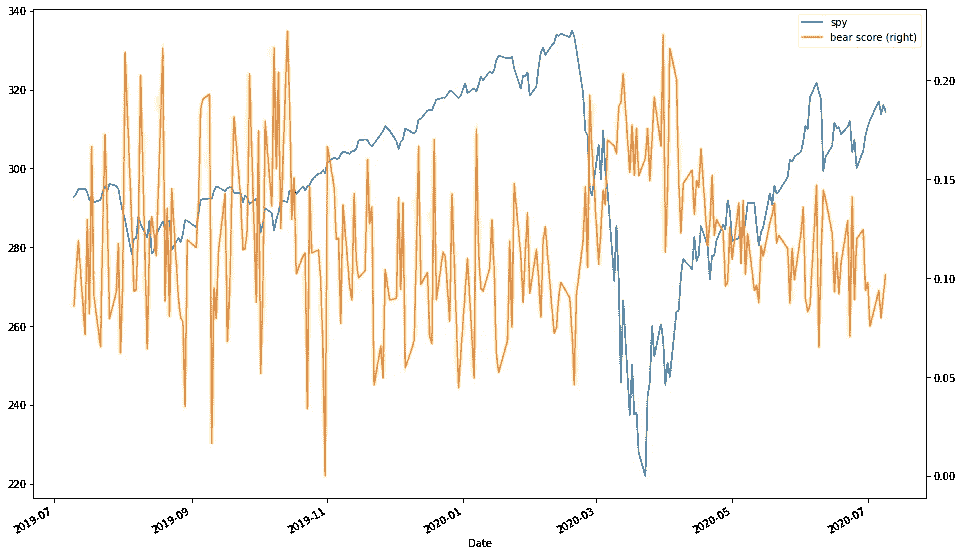

现在，我将傅立叶变换应用于牛市和熊市的分数。

在这里，我画出了牛市和熊市的分数以及它们的傅立叶变换。很明显，在数据的早期，分数波动更大。这很可能是因为华尔街赌注子编辑中的成员较少。因此，提交的文件较少。随着子漩涡的增长，分数波动开始变小，这是可以理解的。

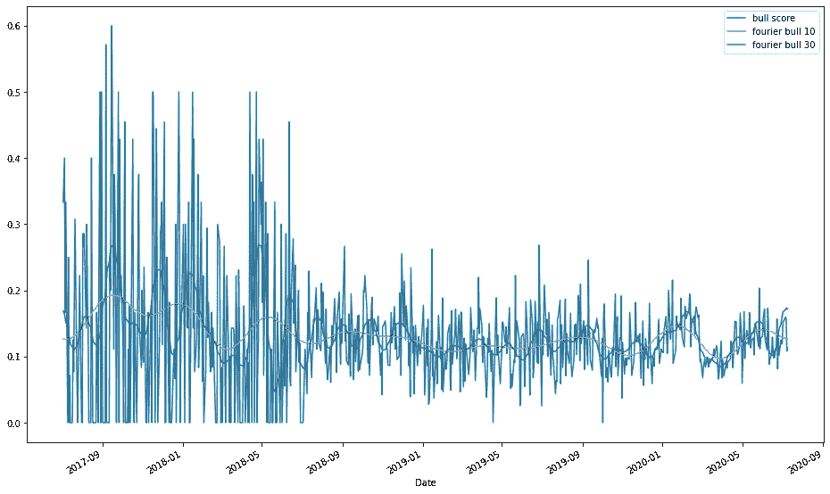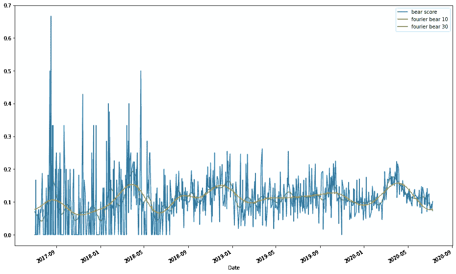

我再次归一化数据帧的每一列。

下面，我绘制了标准化的间谍价格和看涨和看跌情绪分数的傅立叶变换。

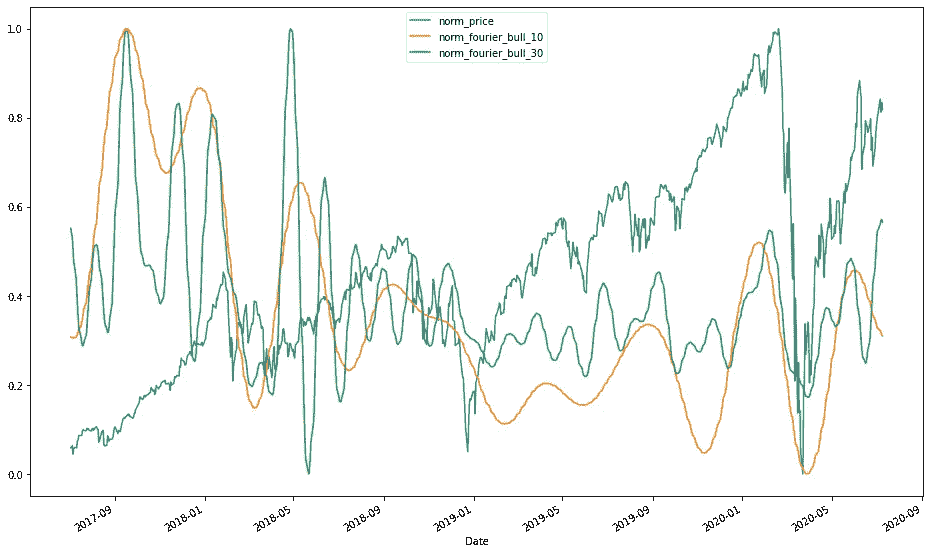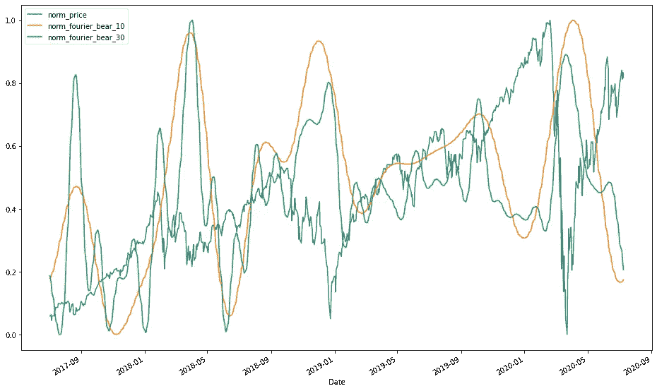

看涨/看跌情绪数据已经准备好。让我们进入战略发展阶段。

# **策略一:利用间谍价格和积极/消极情绪之间的价差**

第一种策略包括利用正面/负面情绪数据之间的差异。例如，如果积极/消极情绪急剧下降(更加消极)，但 SPY 继续上升，那么这可能是建立空头头寸的良好迹象。如果你观察早期的情节，这种模式出现过几次，最突出的是在新冠肺炎崩盘之前。为了实现这个策略，我使用了积极/消极情绪和间谍价格之间的滚动相关性。我没有使用原始的情感数据，而是使用具有 20 个分量的低噪声傅立叶变换。我首先检查标准化间谍价格和情绪数据的标准化 20 分量傅立叶变换之间的相关性。

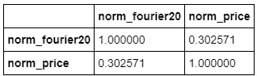

接下来，我使用 14 天的窗口创建一个滚动相关性数据框架。我还将实际相关性、滚动相关性的均值和滚动相关性的标准差保存为变量。

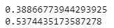

我在实际相关值处用红色轴线绘制滚动相关。

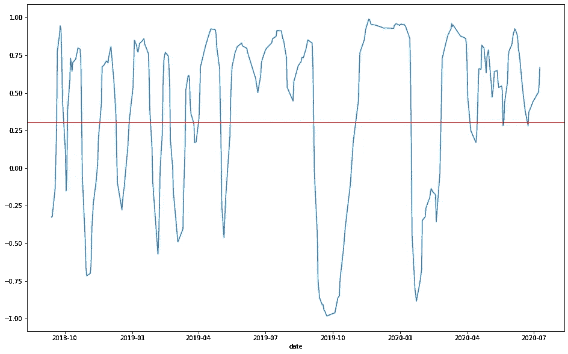

最后，我用红色和黑色轴线在滚动相关性的平均值和平均值减标准差处绘制了标准化间谍价格的滚动相关性。

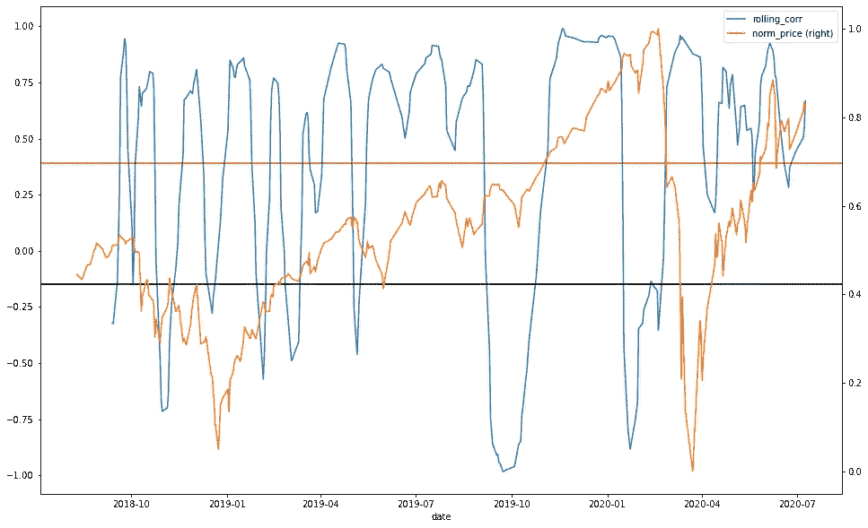

# **策略二:训练 LSTM 根据看涨/看跌情绪预测第二天的间谍价格**

第二种策略涉及训练 LSTM 神经网络模型，根据前 14 天的看涨和看跌情绪得分预测第二天的间谍价格。首先，我定义了一个函数，该函数将一个 2d numpy 数组作为输入，并返回从数组中的每个数组中删除了第一个元素的数组。该函数对于后续单元格中的预处理是必需的。

这里，我从看涨/看跌情绪数据框架中选择相关的列，并转换成一个数字数组。然后，我创建一个 15 天的数据窗口数组。这个数组有 3 个维度:第一个是窗口的数量，第二个是每个窗口的天数(15)，第三个是特性的数量(7)。然后，我将数组分成训练集和测试集，并对测试集进行洗牌。接下来，我将训练和测试集分为 X 训练和 y 训练，以及 X 测试和 y 测试，以将输入(原始看涨/看跌情绪数据和傅立叶变换)映射到输出(价格)。

在这个细胞中，我构建并训练 LSTM 神经网络。

最后，我绘制了模型对真实间谍价格的预测，并计算了模型的测试 MEA(平均绝对误差)。

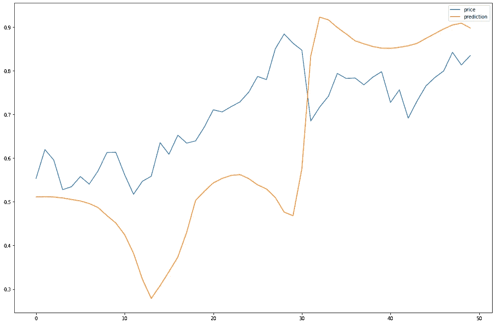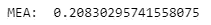

# **结论**

我对 Reddit 上的文本数据进行情感分析，为交易策略提供信息。

感谢您的阅读！我希望你喜欢这篇文章，并欢迎任何意见和建议。

# 链接

1.  [https://github . com/awrd 2019/Reddit-opinion-NLP-for-Trading](https://github.com/awrd2019/Reddit-Sentiment-NLP-for-Trading)
2.  [http://comp . social . gatech . edu/papers/icwsm 14 . Vader . hutto . pdf](http://comp.social.gatech.edu/papers/icwsm14.vader.hutto.pdf)

*免责声明:本文并不构成对实施任何投资或交易策略的建议。证券和衍生品交易存在巨大的损失风险。*