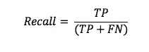

# 情感分析—电影评论

> 原文：<https://medium.com/analytics-vidhya/sentiment-analysis-movies-reviews-b299de4bb1aa?source=collection_archive---------2----------------------->

使用 sklearn 进行情感分析— 89%的准确率


图片来源:[https://Shi chaoji . com/2017/04/17/情操-分析-部署/](https://shichaoji.com/2017/04/17/sentiment-analysis-deployed/)

数据分析不再关注数字数据，但声音、图像和文本也是提供有价值见解的重要信息。随着本文的分析，这是文本数据的重点。文本数据可以从多个来源收集，包括产品评论、评论、问答、社交网络帖子。在下一篇文章中，我们将抓取这些文本数据。

情感分析怎么样？它是什么，如何用机器学习来分析它们？情感分析是自然语言中重要的文本分析应用之一，在商业和研究领域都有应用。这种分析是一种二元监督分类(我们可以考虑正面或负面的结果)，其中训练模型将学习正确的类别标签，然后使用这种学习来预测测试数据。

以下是一些情感分析的真实例子:
-品牌监测使用情感分析来监测消费者对其品牌和产品的看法。
-研究人员收集这些分析，以了解人们对特定事物的看法。
-产品改进收集信息以确定消费者不满意或满意的地方。

# **这篇文章的大纲如下:**

1.数据概述(分类问题)
2。文本预处理(http，小写等…)
3。单词嵌入技术(Bag of word，TF-IDF，Hashing)
4。分析技术(岭分类器和多项式分类器)5。选择模型并运行准确性测试(F1，精确度与召回率，混淆矩阵)

# 1.数据概述

在此分析中，我们将使用 50K IMBD 电影评论数据集，其中有 25K 正面评论和 25K 负面评论。数据可以在[这里](https://www.kaggle.com/lakshmi25npathi/imdb-dataset-of-50k-movie-reviews)找到！

```
import pandas as pd
import numpy as npdf = pd.read_csv('.../IMDB Dataset.csv')df['sentiment'].value_counts()
df.head(5)
```

接下来，我们来看看在正面评论和负面评论中出现了什么词。


正面评价


负面评论

有了这些数据，我们将通过使用 sklearn 的 train_test_split 来拆分成训练集和测试集。

```
from sklearn.model_selection import train_test_split
train, test = train_test_split(df)
```

# 2.文本处理

为什么我们需要对文本进行预处理？

当人们写评论时，它可以是非正式的语言，例如，yours 和 urs。如果我们不教机器，它们会把它理解成不同单词。这只是文本分析面临的一个示例问题。其他问题可能包括拼写错误、大写字母等..我们需要通过进行文本预处理来处理这些问题，或者在将文本数据输入模型之前准备好文本数据。让我们看看如何一步一步地做到这些。

**2.1 将情感转化为类别值** 在处理类别数据时，我们可以将这些文本类别转化为数字。例如，是和否类别可以变成 1 和 0。在这些情况下，我们有消极和积极的情绪。我们要把它们变成 0 和 1 的值。

**2.2 删除无文本和特殊字符
根据我们现有的审查数据，我们有< br >在上下文中不被视为文本。它没有任何意义，不会为模型提供任何有用的信息，因此必须将其删除。在其他文本分析场景中，文本数据可能包括网站链接、标签等。这些东西最好在我们运行模型之前从文本中删除。**

**2.3 将所有文本转换为小写** 为了避免在培训过程中出现错误，例如“我们”和“我们”可能会以不同的方式学习，我们将所有大写字母的单词转换为小写字母。

**2.4 去除换行符** 在很多编码语言中，当我们想拆分一行时，我们就写成“\n”。这有时可以在上下文中检测到，但是，它对我们的模型没有意义。因此，这需要被移除。

**2.5 标记化**

一个句子由许多单词组成，但并不是所有的单词都很重要。为了分析每个单词，我们需要为每个句子将单词拆分成单个单词。

**2.6 删除停用词** 停用词是指“我”、“我们”、“我的”、“你”、“自己的”、“唯一的”等词。这些词不太可能代表特定的意思。模型可能认为这是噪声，因此我们将其移除以降低噪声水平。

**2.7 词汇化 vs 词干化** 我们知道‘studies’和‘study’之类的词是一回事，但机器不知道这一点。因此，我们应用词汇化来管理这些词。我们为什么不用词干？这是因为词干截断了字母表，只留下了单词的一部分，例如,“studies”会变成我们不想要的“studi”。

最后，从第 2.5 步开始，我们把句子中的单词分割成单个单词，我们要把它恢复成原来的格式。

```
**# 2.1 Turn sentiment into categorical value**from sklearn.preprocessing import LabelEncoderlabelencoder = LabelEncoder()train['sentiment'] = labelencoder.fit_transform(train['sentiment'])
test['sentiment'] = labelencoder.fit_transform(test['sentiment']) **# 2.2 Remove none text and special character**import re
import stringpattern = re.compile(r'<br\s*/><br\s*/>>*|(\-)|(\\)|(\/)')def preprocess_reviews(reviews):
    reviews = [pattern.sub(" ",item) for item in reviews]
    return reviewstrain_clean = preprocess_reviews(train['review'])
test_clean = preprocess_reviews(test['review'])train['review'] = train_clean
test['review'] = test_cleandef remove_punctuation(input):
    table = str.maketrans('','',string.punctuation)
    return input.translate(table)train['review'] = train['review'].apply(remove_punctuation)
test['review'] = test['review'].apply(remove_punctuation)**# 2.3 Convert all text to lowercase**train['review'] = train['review'].str.lower()
test['review'] = test['review'].str.lower()**# 2.4** **Remove line breaks**def remove_linebreaks(input):
    text = re.compile(r'\n')
    return text.sub(r' ',input)train['review'] = train['review'].apply(remove_linebreaks)
test['review'] = test['review'].apply(remove_linebreaks)**# 2.5 Tokenization**from nltk.tokenize import word_tokenizetrain['review'] = train['review'].apply(word_tokenize)
test['review'] = test['review'].apply(word_tokenize)**# 2.6 Remove stopword**from nltk.corpus import stopwordsdef remove_stopwords(input1):
    words = []
    for word in input1:
        if word not in stopwords.words('english'):
            words.append(word)
    return wordstrain['review'] = train['review'].apply(remove_stopwords)
test['review'] = test['review'].apply(remove_stopwords)# **2.7 Lemmatization**from nltk.stem import WordNetLemmatizer
lem = WordNetLemmatizer()def lemma_wordnet(input):
    return [lem.lemmatize(w) for w in input]train['review'] = train['review'].apply(lemma_wordnet)
test['review'] = test['review'].apply(lemma_wordnet)# **2.8 Combine individual words**def combine_text(input):
    combined = ' '.join(input)
    return combinedtrain['review'] = train['review'].apply(combine_text)
test['review'] = test['review'].apply(combine_text)
```

# 3.单词嵌入技术

现在，在我们使用机器学习来进一步实施情感分析之前，我们需要将这些文本转化为数值，这被称为单词的向量代表。要做到这一点，有很多技巧。让我们来看看其中的一些。

**3.1 单词袋** 这是最广为人知的将文本转化为数字的技术之一。这种技术考虑句子中的单词，忽略它们的顺序，因为它关注每个单词的频率。要应用这种技术，我们可以使用 sklearn 的 CountVectorizer。


图片来源:[https://www.programmersought.com/article/4304366575/](https://www.programmersought.com/article/4304366575/)

**3.2 TF-IDF** 该技术计算单词在文档中的重要性。TF，术语频率，测量术语在每个文档中的频率。IDF(逆文档频率)衡量该术语在所有文档中的重要性。然后两个值相乘，TF*IDF，我们发现每个单词在文档中有多重要。要应用这种技术，我们可以使用 sklearn 的 TdidfVectorizer。


图片来源:[https://medium . com/shallow-thoughts-about-deep-learning/can-tfi df-be-applied-to-scene-interpretation-140 be 2879 B1 b](/shallow-thoughts-about-deep-learning/can-tfidf-be-applied-to-scene-interpretation-140be2879b1b)

**3.3 哈希** 使用哈希，文本上下文将被转换为类似位大小值的哈希值，其中每个上下文将被计算并分配一个唯一值。这些算法是为防冲突而设计的，这意味着对同一文本产生不同值的可能性很低。为了应用这种技术，我们可以使用 sklearn 的 HashingVectorizer。


图片来源:[http://xeushack.com/on-hashes](http://xeushack.com/on-hashes)

```
**# 3.1 Bag of words**
from sklearn.feature_extraction.text import CountVectorizercv = CountVectorizer(binary=True)
cv.fit(train)
X_train_bow = cv.fit_transform(train['review'])
X_test_bow = train['sentiment']
Y_train_bow = cv.transform(test['review'])
Y_test = test['sentiment']**# 3.2 TF-IDF**from sklearn.feature_extraction.text import TfidfVectorizervectorizer = feature_extraction.text.TfidfVectorizer(norm = None)vectorizer.fit(train)
X_train_tfidf = vectorizer.fit_transform(train['review'])
X_test_tfidf = train['sentiment']
Y_train_tdidf =vectorizer.transform(test['review']) **# 3.3 Hashing**from sklearn.feature_extraction.text import HashingVectorizerhv = HashingVectorizer()hv.fit(train)
X_train_hash = hv.fit_transform(train['review'])
X_test_hash = train['sentiment']
Y_train_hash = hv.transform(test['review'])
```

# 4.分析模型

对于我们将要实现的不同模型，我们选择 F1 分数来决定一个模型如何优于另一个模型。F1 分数如下计算精确度和召回率的调和平均值。


我们还对每种技术应用 5 倍交叉验证，并确定每倍的 F1 分数，平均这 5 倍的 F1 分数，并为我们的测试集选择平均 F1 分数最高的模型。


图片来源:[https://www . datascience central . com/profiles/blogs/cross-validation-in-one-picture](https://www.datasciencecentral.com/profiles/blogs/cross-validation-in-one-picture)

**4.1 岭分类器**
岭分类器是基于岭回归方法的计算，其中目标变量将变成-1 和 1 值。

**4.2 多项贝叶斯**
多项朴素贝叶斯或多项贝叶斯是朴素贝叶斯的一种模型，朴素贝叶斯是一种概率分类器。该模型需要整数特征计数，适合离散特征的分类问题。

```
**# Rigde with bag of word**from sklearn import linear_modelalpha = [80.0, 90.0, 100.0, 110.0, 120.0]for a in alpha:
    ridge = linear_model.RidgeClassifier(a)
    scores = model_selection.cross_val_score(ridge, X_train_bow, X_test_bow, cv=5, scoring='f1')
    print("alpha: ",a)
    print(scores)
    print(np.mean(scores))
    print('\n')
```


f1-单词袋的 5 倍交叉验证的分数

```
**# MultinomialNB with bag of word**from sklearn.naive_bayes import MultinomialNBalpha = [1e-10, 1e-5, 0.1, 1.0, 2.0, 5.0]for a in alpha:
    mnb = MultinomialNB(a)
    scores = model_selection.cross_val_score(mnb, X_train_bow, X_test_bow, cv=5, scoring='f1')
    print('alpha: ', a)
    print(scores)
    print(np.mean(scores))
    print('\n')
```


f1-对单词袋进行 5 倍交叉验证的得分

```
**# Rigde with TF-IDF**alpha = [500.0, 1500.0, 2500.0, 3000.0]for a in alpha:
    ridge = linear_model.RidgeClassifier(a)
    scores = model_selection.cross_val_score(ridge, X_train_tfidf, X_test_tfidf, cv=5, scoring='f1')
    print("alpha: ",a)
    print(scores)
    print(np.mean(scores))
    print('\n')
```


f1-TF-IDF 5 倍交叉验证的分数

```
**# MultinomialNB with TF-IDF**alpha = [175.0, 200.0, 225.0, 250.0, 300.0]for a in alpha:
    mnb = MultinomialNB(a)
    scores = model_selection.cross_val_score(mnb, X_train, X_test, cv=5, scoring='f1')
    print('alpha: ', a)
    print(scores)
    print(np.mean(scores))
    print('\n')
```


f1-TF-IDF 五重交叉验证的得分

```
**# Rigde with Hash**alpha = [1.1, 1.2, 1.3, 1.4, 1.5, 2.0]for a in alpha:
    ridge = linear_model.RidgeClassifier(a)
    scores = model_selection.cross_val_score(ridge, X_train_hash, X_test_hash, cv=5, scoring='f1')
    print("alpha: ",a)
    print(scores)
    print(np.mean(scores))
    print('\n')
```


f1-5 倍交叉验证的分数，用岭进行散列

通过所有这些训练，我们可以看到，通过使用具有 alpha 1.4 脊的散列，我们获得了最高的 F1 分数。因此，我们将选择这个 alpha 来预测测试集中的情感。

# 5.选择模型并运行精度测试

为了测量预测的准确性，最简单的技术之一是准确性测试。这样，我们可以看到，例如，在模型需要预测的 100 次预测中，它正确预测了多少次。

我们可以使用的另一种技术是精确和回忆。让我们看看这些值是如何计算的。首先，参考混淆矩阵。我们需要理解以下术语及其计算。

**真阳性(TP)** :当实际阳性被正确分类为阳性时。
**【真否定】**:实际否定被正确归类为否定时。
**【假阳性(FP)** :实际阴性被错误归类为阳性时。
**【假阴性(FN)** :实际阳性被错误归类为阴性时。

接下来，一旦我们知道了这些值，我们就可以计算精度和召回率，如下所示:


精度，或正预测值，指的是在正预测总数中正确正预测的数量。



回忆或敏感度指的是预测的正确阳性的数量与实际的真实阳性的数量之比。现在，让我们看看我们的模型是如何预测测试数据的。

```
from sklearn.metrics import accuracy_scoreridge = linear_model.RidgeClassifier(1.4)
ridge.fit(X_train_hash, X_test_hash)
test['sentiment_pred'] = ridge.predict(Y_train_hash)y_true = test['sentiment']
y_pred = test['sentiment_pred']accuracy_score(y_true, y_pred)
```

使用这个模型，我们获得了 0.89256 的预测精度！


实际情绪与预测情绪的示例

```
from sklearn.metrics import classification_report,confusion_matrix print(classification_report(y_true, y_pred, target_names = ['Bad Reviews','Good Reviews']))
```


精确度、召回率、F1 分数报告

```
import seaborn as sns
import matplotlib.pyplot as pltcm = confusion_matrix(y_true, y_pred)plt.figure(figsize = (5,5))
sns.heatmap(cm,cmap= "Blues", 
            linecolor = 'black', 
            linewidth = 1, 
            annot = True, 
            fmt='', 
            xticklabels = ['Bad Reviews','Good Reviews'], 
            yticklabels = ['Bad Reviews','Good Reviews'])
plt.xlabel("Predicted")
plt.ylabel("Actual")
```


混淆矩阵

# **结论**

利用 IMDB 电影评论数据，用两个主要模型 ridge 和 multinomialNB 对模型进行了训练，并使用 F1 评分对精度进行了比较。通过哈希嵌入技术和脊分类器，我获得了 89%的情感预测准确率。