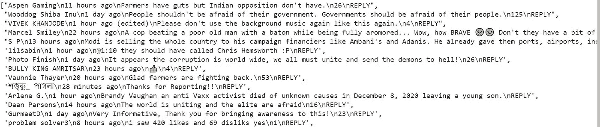
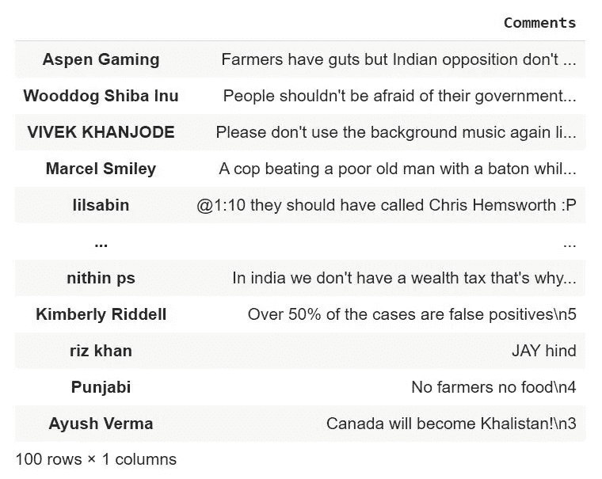
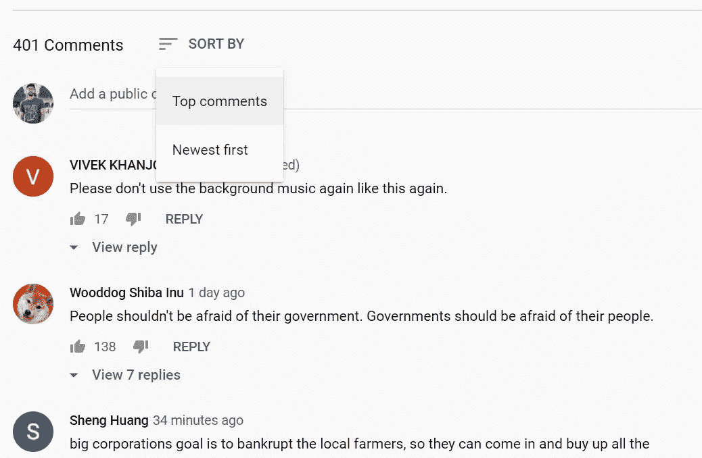
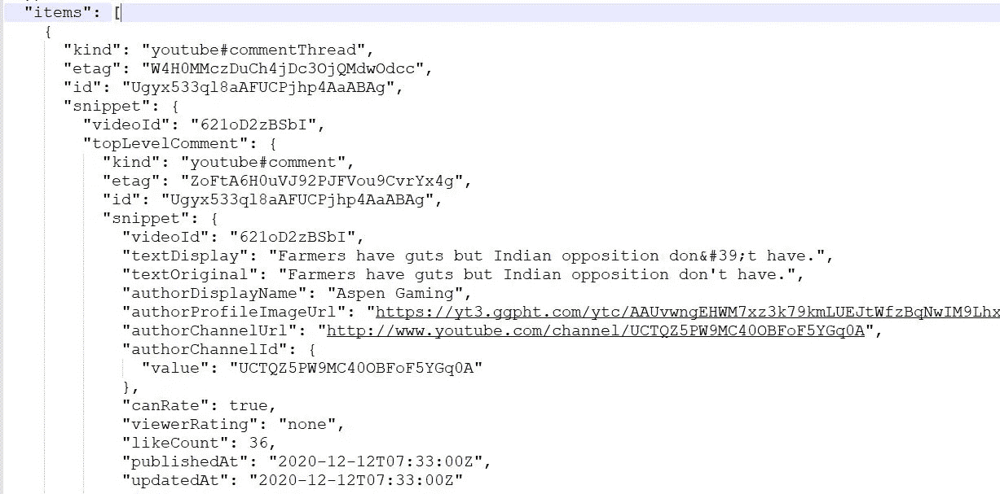
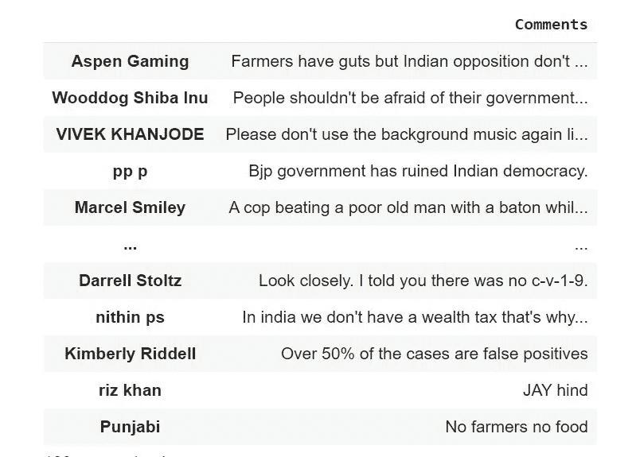

# Youtube 视频的情感分析

> 原文：<https://medium.com/analytics-vidhya/sentiment-analysis-of-a-youtube-video-63ced6b7b1c4?source=collection_archive---------2----------------------->

来源:[https://www . kdnugges . com/2020/06/5-essential-papers-情操-分析. html](https://www.kdnuggets.com/2020/06/5-essential-papers-sentiment-analysis.html)

## *这是情感分析系列实现的第 1 部分。*

## 快速回顾

在我上一篇关于[自然语言处理](https://amitalable.medium.com/natural-language-processing-c01b6610cfa4)的文章中，我提到了情感分析是一些常用的 NLP 技术。让我们深入探讨一下。

> ***情感分析*** 情感分析(或观点挖掘)是一种自然语言处理技术，用于对主观数据中的情感进行解释和分类。情感分析通常在文本数据上执行，以检测电子邮件、调查响应、社交媒体数据等中的情感。

现在我们知道了什么是情感分析，让我们看看如何在社交媒体数据上进行情感分析(在我们的例子中是 Youtube 评论)。

## 情感分析的实现

我们将在下面的 youtube 视频上一部分一部分地实现情感分析。我们正在拍摄视频“*印度农民的起义:抗议背后是什么？*《环球新闻》出版。

这段视频是关于*“印度农民已经集会数月，反对总理纳伦德拉·莫迪政府于 9 月 20 日颁布的三项农业法律。印度政府辩称，这些变化将给予农民更多自由，但农民担心新法律将压低他们的产品价格，没有保护他们免受企业收购和剥削的保障措施。但印度农业部门的危机并不新鲜，因为该行业已经遭受了几十年。”*

来源:https://www.youtube.com/channel/UChLtXXpo4Ge1ReTEboVvTDg

## 第 1 部分:作为数据清理的一部分获取数据

在本文中，我们将从上述 youtube 视频中收集所有关于印度当前问题的实时评论。

为此，我们必须废弃网站，以获得有意义的数据。我们可以通过多种方式来实现。我使用了两种方法来收集数据:

1.  硒
2.  谷歌应用编程接口

## 硒

**第一步:安装必要的库**

对于 selenium，我们需要首先在 Google Colab 中安装它。以下是安装代码。

根据你的网速，安装需要一些时间。

**第二步:导入必要的库**

安装 selenium 后，我们需要导入所有的库来废弃网站。

**第三步:安装 ChromeDriver 并删除注释**

我们采用了一个作者列表来存储 youtube 用户的所有评论。

然后，我们配置 ChromeDriver 进行报废。

如果你去 youtube 的评论区，你会发现当你向下滚动时，youtube 评论区会动态加载。为了收集至少 100 条评论，我对循环进行了 6 次迭代。此外，我已经采取了计时器停止 5 秒钟来加载页面。如果你的网络连接很慢，请确保增加时间，这样页面就可以成功加载，而不会出现异常。

现在最精彩的部分来了。我们开始废弃所有的评论和他们的作者细节。

我们得到了未清理的数据，我们必须清理它，因为它包含一些额外的细节，如用户何时发表评论以及最后有多少回复。

在第一条注释中，用户名(Aspen Gaming)后的“\n11 小时前\n”和注释末尾的“\ n26 \回复”。

我们希望我们的数据是这样的，

我们有一个用户和他的评论。

为了删除那些额外的细节，我们需要清理它，然后将它放入数据框。

**第四步:清理并将数据放入数据帧**

在第 7 行中，我们删除了用户名后面的注释时间，如\n11 小时前。

在第 8 行，我们删除了注释末尾的 REPLY。

在第 9 行中，我们删除了后面跟有回复数量的评论。

当用户编辑他们的评论时，youtube 会显示用户名和(已编辑的)。这是我们必须从用户名中删除的。这就是 10- 12 号线在做的事情！

最后，我们将作者姓名作为行名，将他们的评论放在数据框的列中。

通过 selenium 废弃网站后，我们的最终数据如下:

报废后的最终数据帧

> **我们在这里发现了什么问题？** 在存储到数据框之前，我们必须做一些清理工作。
> 如果 youtube 改变网页设计，这些方法可能就行不通了。

这也是我转用 Google API 的原因。

## 谷歌应用编程接口

第一步:为 youtube 数据创建一个谷歌开发者账户和你的 API 密匙。

别担心，这是免费的！！跟随由 [Stevesie Data](https://www.youtube.com/channel/UCArmutk8nAbYQdaYzgqKOwA) 提供的*上的精彩视频教程“抓取 YouTube 评论&回复任何公共视频或频道】*。看这个视频到 9 分钟，你就可以走了。你需要知道如何创建你的 API 密匙。一旦你做了，你就可以开始了。

**第二步:使用 Youtube API 获取所有评论数据**

您必须将您在步骤 1 中创建的 API 密钥代替*“Your _ API _ KEY”作为 DEVELOPER_KEY。*

如果您想增加结果的数量，您可以根据需要在第 19 行增加 maxResults。

如果你在评论区看到，你可以看到你可以通过*“热门评论*”和*“最新的优先”来排序评论。*

在第 20 行使用“相关性”和“时间”作为排序。

在这一步之后，Youtube API 将以 JSON 的形式返回数据。

以 JSON 格式返回的数据。

如果你第一次看到你可能不理解的数据！我来简化一下。

转到条目->代码片段->topLevelComment ->代码片段-> authorDisplayName 查找放置评论的作者。

转到项目->代码片段->topLevelComment ->代码片段-> textOriginal 获取原始注释。

**第三步:将数据放入数据帧**

像 Selenium 一样，我们不必清理 API 获取的数据。我们只要进入它。

我们放入数据帧后的最终数据看起来会像这样，

伙计们，这就是了！您可以使用任何一种方法来收集数据。我更喜欢使用 API，而不是通过 Selenium 报废和清理数据。嘿，这也是个好办法。只是我更喜欢 API。

从下一部分开始，我们将使用我们用 API 创建的数据帧。如果你喜欢使用 Selenium，可以使用*“作者评论”*作为下一部分的数据框架。否则，像我一样，如果你更喜欢 Youtube API，可以使用“ *df_1* ”作为数据帧。

敬请期待！！

*参考文献:*

1.  [https://monkeylearn.com/sentiment-analysis/](https://monkeylearn.com/sentiment-analysis/)
2.  [https://towards data science . com/how-to-scrape-YouTube-comments-with-python-61ff 197115d 4](https://towardsdatascience.com/how-to-scrape-youtube-comments-with-python-61ff197115d4)
3.  [https://medium . com/better-programming/Twitter-情操-分析-15d8892c0082](/better-programming/twitter-sentiment-analysis-15d8892c0082)
4.  [https://regex101.com/](https://regex101.com/)