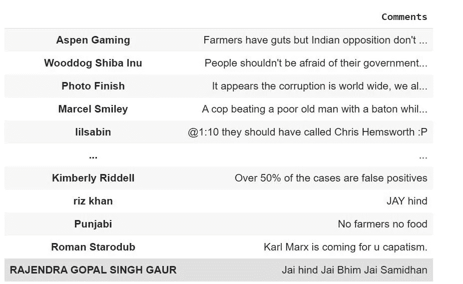
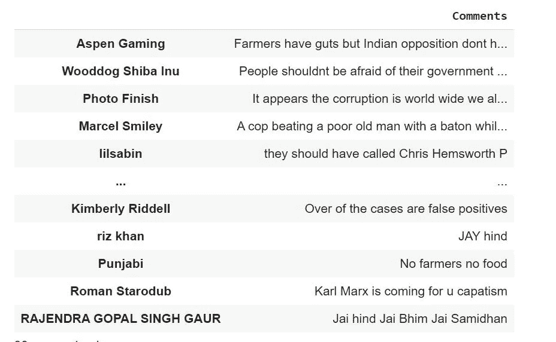
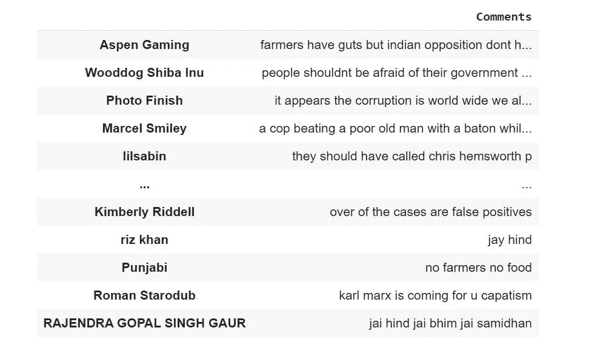

# Youtube 视频的情感分析(下)

> 原文：<https://medium.com/analytics-vidhya/sentiment-analysis-of-a-youtube-video-part-2-9621b8f77e12?source=collection_archive---------14----------------------->

来源:[https://www . kdnugges . com/2020/06/5-essential-papers-情操-分析. html](https://www.kdnuggets.com/2020/06/5-essential-papers-sentiment-analysis.html)

*这是情感分析系列实现的第 2 部分。如果你还没有看过第一部分，我建议你看一下“* [*一个 Youtube 视频的情绪分析*](/analytics-vidhya/sentiment-analysis-of-a-youtube-video-63ced6b7b1c4) *”。在这一部分，我们将清理我们的文本数据，以获得有意义的见解。*

## 快速回顾

我们正在一部分一部分地对下面的 youtube 视频进行情感分析。我们正在拍摄“*印度农民的起义:抗议的背后是什么？*《环球新闻》出版。

这段视频是关于*“印度农民已经集会数月，反对总理纳伦德拉·莫迪政府于 9 月 20 日颁布的三项农业法律。印度政府辩称，这些变化将给予农民更多自由，但农民担心新法律将压低他们的产品价格，没有保护他们免受企业收购和剥削的保障措施。但印度农业部门的危机并不新鲜，因为该行业已经遭受了几十年。”*

资料来源:https://www.youtube.com/channel/UChLtXXpo4Ge1ReTEboVvTDg

## 第 2 部分:清理数据

清理文本数据非常重要，因为它可能包含许多不需要的字符。这种清理可以永远进行下去，因为它不像数字数据，数据清理通常涉及删除空值和重复数据，处理异常值等。

文本数据中有一些常见的数据清洗技术，也称为文本预处理技术。

**所有文本的通用数据清理步骤:**

*   使文本全部小写
*   删除标点符号
*   删除数值
*   删除常见的无意义文本(/n)
*   移除表情符号

在[上一篇文章](https://amitalable.medium.com/sentiment-analysis-of-a-youtube-video-63ced6b7b1c4)中我们已经通过 youtube API 成功废弃了上述 Youtube 视频的所有评论。在这一部分，我们将清理我们的数据，从中获得有意义的见解。

**第一步:从*【response . JSON】*文件**中导入数据

我们得到了 json 格式的响应。我把它保存在一个名为*“response . JSON”的文件中。*

我们已经将 json 数据导入到*【响应】*变量*中。*这一步不是强制性的。我这样做是因为我刚刚保存了数据，这样我就可以处理我在上一篇文章中获得的相同数据。如果我再次运行 API，它将获取最新的注释。**你可以直接去第三步。**

**步骤 2:将*响应*数据放入数据帧**

**记住:**这是我们在第 1 部分文章的 Google API 第 3 步中使用的代码。

我们将得到如下所示的数据帧"*df:*

**第三步:清洁—第一轮**

在我们的“评论”栏中，有几个评论作者使用的表情符号需要删除。在第 3 行，我们已经删除了这些表情符号。

评论中还有一些不必要的数字。所以我们在第 4 行中删除了它。

需要删除一些特殊字符，如，
:，@，*，)，句号(。), $ , !, ?，逗号(，，%，"

我们在第 5 行中删除了这些字符。

第一轮

在执行了第 1 轮中的所有清理后，我们看到了仍然具有一些特殊字符的数据。因此，我们需要执行第二轮清洁过程。

**步骤 4:清洁—第二轮**

第一轮清洁后，还有一些表情符号。那些是💁🌾 😎 ♥ 🤷‍♂.所以我们在下面的代码中删除了第 2 行中的内容。

还有一些特殊字符需要删除。这已在第 3 行中删除。

第二轮

在执行第二轮之后，我们发现在注释中出现了一些新的行字符和一些剩余的特殊字符。这是我们在第三轮移除的。

**第五步:清洁—第三轮**

第 2 行删除了一些注释中出现的换行符。

' , 🇵🇰 , ;, !两轮中留下的特殊字符最终在第 3 行被删除。

第三轮

我们得到了如下所示的数据框架。

但是我们忘记了我们清理的第一步，那就是让文本变成小写。我们再来一轮吧。

**第六步:清洁——第四轮**

到目前为止，我们已经通过删除不必要的评论、特殊字符、数字和表情符号清理了我们的数据。

唯一剩下的就是用小写字母写所有的注释。

答对了。现在我们已经为下一部分准备好了数据框。

让我们将第 1 部分和本文中的所有代码组装在一起。

这就完成了数据的清理部分。我只使用了每个人都做的最普通的清洁步骤。您可以应用其他清理步骤，如删除停用字词等。为了获得更好的结果，你应该尽可能地清理你的数据。它会增强你的分析。

在下一部分，我们将看到主观性、极性的概念以及它们是如何被使用的。我们还将形成词云，以可视化不同用户评论中的常用词。

敬请关注下一部分！！

*参考文献:*

1.  [https://medium . com/analytics-vid hya/sensation-analysis-of-a-YouTube-video-63 ced 6b 7 B1 C4](/analytics-vidhya/sentiment-analysis-of-a-youtube-video-63ced6b7b1c4)
2.  【https://regex101.com/ 
3.  [https://github.com/adashofdata/nlp-in-python-tutorial](https://github.com/adashofdata/nlp-in-python-tutorial)