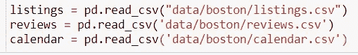
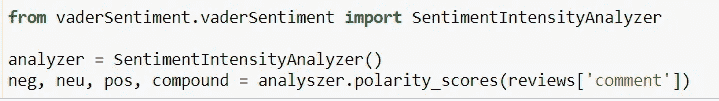
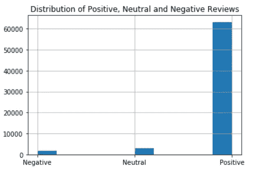
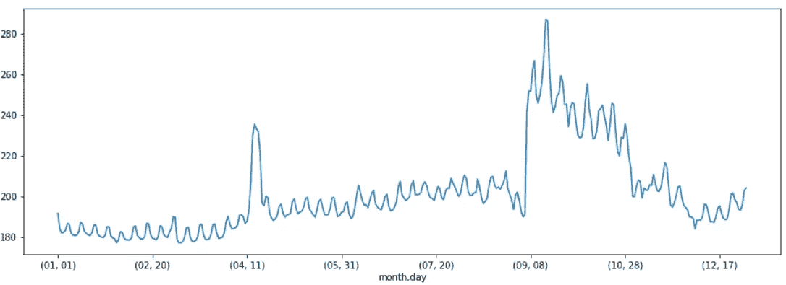
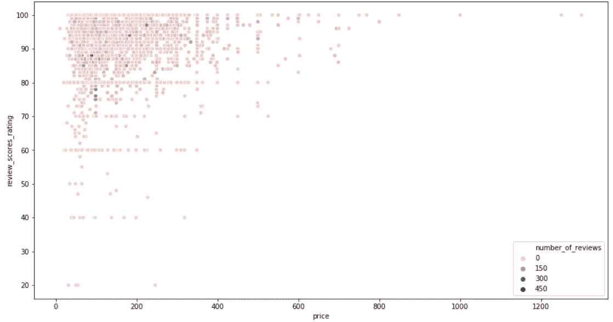

# Airbnb 波士顿房源评论的情感分析

> 原文：<https://medium.com/analytics-vidhya/sentiment-analysis-of-airbnb-boston-listing-reviews-2278cda320d4?source=collection_archive---------30----------------------->

在本帖中，我们将对 Airbnb 波士顿房源的评论进行情感分析，看看评论如何影响价格以及一年来房源价格的整体趋势。

接下来，你可以从[这里](https://github.com/Anujsaraswat/Airbnb-Boston-Dataset-Analysis)下载 jupyter 笔记本

我们有三个数据集:

1.  包含关于列表的信息
2.  reviews.csv:包括评论和时间戳
3.  calendar.csv:包含价格和可用性信息

让我们首先将 CSV 文件加载到数据框中

# 第 1 部分:评论的情感分析

对于评论的情感分析，我们将使用一个叫做 VADER 的工具。它返回一个字典，其中包含“*正”、“中性”和“负”*分数，以及一个复合分数。

让我们看看我们对波士顿 Airbnb 房源的评论类型。

大多数评论表达了积极的情绪，称赞 Airbnb。

# 第二部分:价格如何随时间波动？

我们加载 calendar.csv 并根据日期对数据进行分组，然后绘制一个线图来可视化这些变化。

x 轴代表一年中的某一天，y 轴代表价格。

似乎价格在年初很低，然后随着时间的推移逐渐上涨，偶尔会出现一些高峰，这可能是由于假期或类似时间发生的一些重大事件。

# 第 3 部分:价格和评级是如何关联的？

到目前为止，我们已经分别看到了价格和评级的趋势，让我们更深入地挖掘，看看它们是否有某种联系，如果有，那么是如何联系的？

我们看到，与价格较高的评论相比，许多列表评论的价格较低。评论大多是正面的。价格较高的物品没有任何负面评价，这可能是由于他们提供的服务质量。

调查结果:

1.  较低的评分意味着较低的价格:我们只在定价较低的列表中看到较低的分数。
2.  更高的价格并不意味着更高的评级

**结论:**波士顿 Airbnb 房源的价格随着时间的推移逐渐上涨，偶尔会有一些上涨。正面评价多，负面很少，这是一个很好的指标。最后，我们看到价格较低的列表通常会获得更多的正面评价，但是只有这些列表会获得负面评价。