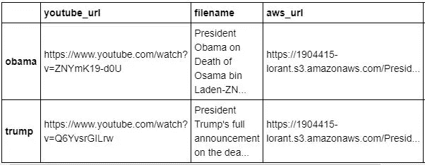
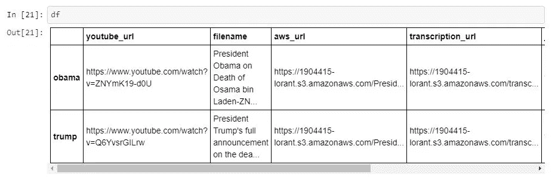
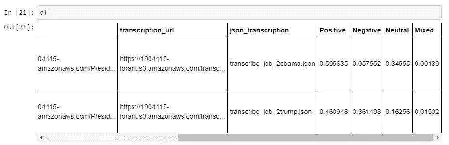
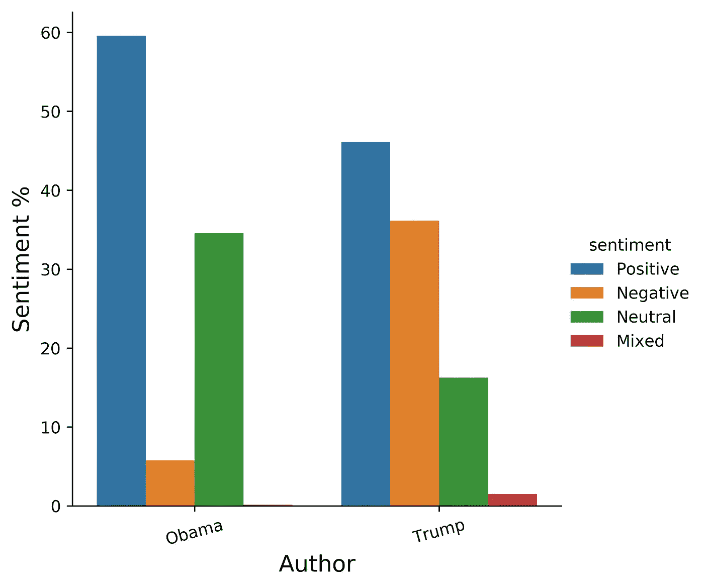
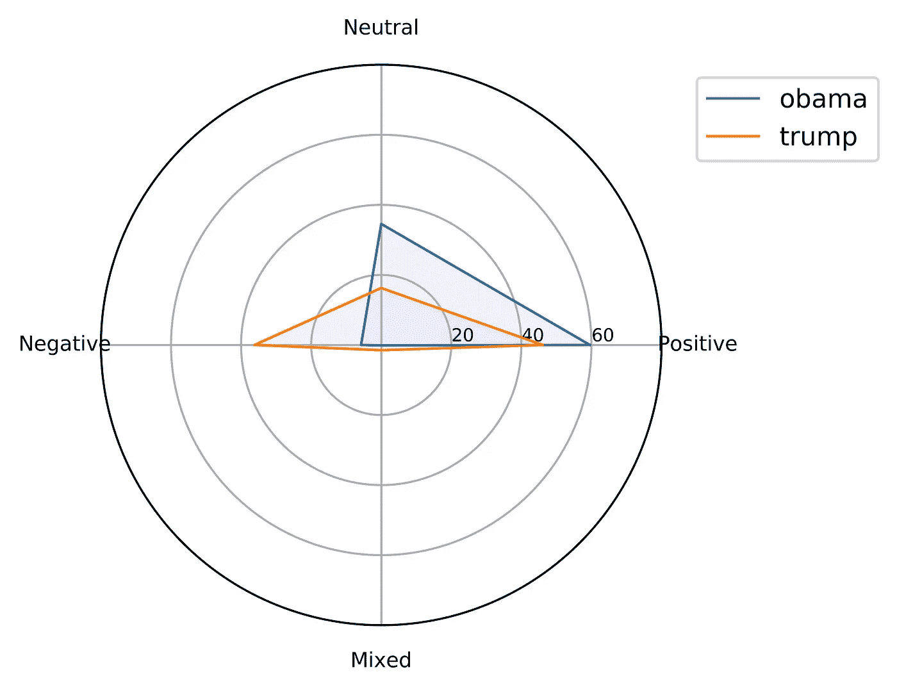

# 基于 AWS 云 NLP 服务的奥巴马和特朗普演讲情感分析

> 原文：<https://medium.com/analytics-vidhya/sentiment-analysis-of-obamas-and-trump-s-speech-based-on-aws-cloud-nlp-services-a1d839ee3e69?source=collection_archive---------14----------------------->


丹尼尔·山特维克在 [Unsplash](https://unsplash.com?utm_source=medium&utm_medium=referral) 上的照片

不久前，ISIS 领导人巴格达迪在一次有计划的袭击中被美国特种部队击毙。特朗普马上就此案发表了讲话，就像奥巴马在奥萨马·本·拉登被击毙时一样。

所以我想为什么不对两个演讲做一个非常基本的情绪分析。首先，我必须得出结论，这些是非常不同的演讲，例如，特朗普的演讲持续了大约。49 分钟，而奥巴马的演讲大约是。10 分钟长。

我必须强调，这是迄今为止不完整的、端到端的情感分析。我更想尝试一些基于 AWS 云的 NLP 工具。

记住这一点，让我们直接进入主题。

为了进行分析，我使用了 Jupyter notebook，代码是用 Python 编写的。

为了能够运行该项目，您将需要以下库:
pandas(创建数据帧)
matplotlib(绘图)
numpy (python 统计包)
boto3(用于 python 的 AWS SDK)
AWS CLI(AWS 的命令行接口)
youtube-dl(下载 youtube 视频)
boto3(用于 python 的 AWS SDK)
AWS CLI(用于 AWS 的命令行接口)
youtube-dl(用于

您还需要一个有效的 AWS 帐户。

带有源代码的 Jupyter 笔记本在这里[分享](https://github.com/hunsnowboarder/sentiment_analyis_aws_cloud)。

## **攻击计划**

所以基本上我的计划是:

1.在 youtube 上搜索关于杀害恐怖分子的总统演讲。

2.下载这次演讲的音频

3.将这些文件上传到我的 aws S3 帐户

4.对演讲运行 AWS 转录(语音到文本)

5.使用亚马逊理解对演讲进行情感分析

6.想象我的发现

## **1。搜索视频**

这部分真的很简单。不到一分钟，我就找到了两个演讲的链接，并把它们放进了字典。

## **2。下载视频**

我也可以用 youtube-dl 下载这些文件。

```
**for** url **in** list(dict_url_youtube.values()):
    print(f'Downloading audio file from the youtube: **{url}**')
    os.system(f'youtube-dl -x --audio-format mp3 **{url}**')
```

但是，请注意，下载的文件将是一个 webm 格式，这不是由 AWS 转录处理，因此您需要将其更改为 mp3。

我用在线转换器来改变它。

**3。将文件上传到 S3 自动气象站**

在这一步之前，我已经创建了我的熊猫数据帧，并将音频文件的位置和名称链接到数据帧中的 youtube 链接。详情请看我的 [github 页面](https://github.com/hunsnowboarder/sentiment_analyis_aws_cloud/blob/master/AWS_NLP.ipynb)。



在上传之前，我们需要登录到我们的 AWS 帐户。

上传非常容易，我们需要指定

**4。AWS 转录**

对于 AWS 转录，我定义了一个自己的函数(不是强制的)。你会看到很多打印声明，这是因为我花了几分钟才意识到上传不成功，因为 youtube-dl 下载了 webm 格式的文件，而转录无法处理它。

在这个阶段，我的数据框架看起来像这样:



请注意，json 转录文件名在上表中是不可见的。

**5。AWS 领悟**

在这个阶段，我已经为运行 AWS 的理解工具做好了一切准备。这是一个预训练的情绪分析模型，其输出为 4 种不同的情绪提供 4 个不同的百分比:积极、消极、混合和中立。我们需要输入到这个模型中的只是文本(作为字符串)和文本的语言。请注意，AWS 理解支持的语言有限(英语、德语、意大利语、日语、阿拉伯语、葡萄牙语、韩语、中文/简体和繁体/、西班牙语、法语、印地语),但 AWS 正在努力扩展这些语言。

AWS understand 对文本的大小也有限制。最大大小设置为 5000 字节(相当于文本中的 5000 个字符)，因此我创建了一个 start _ intensive _ job 函数，该函数将我的文本分割成更小的块，然后将它们聚集起来并作为字典返回。

然后，通过在 json 转录文件中迭代这个函数，我得到了数据帧中所有 4 种类型的情感。



**6。可视化**

在对数据框架做了一些修改后，我能够想象出两次演讲中的 4 种不同情绪。



条形图显示，奥巴马在演讲中比特朗普有更多的积极情绪，而负面情绪则少得多。

在这种可视化中，使用蜘蛛图有时非常有用:



**结论**

正如我在这篇文章开始时所说的，这不是一个完全的演讲情感分析，而只是一个关于 AWS 如何转录和理解作品的简短工作。

我该如何继续？

嗯，肯定不止这些:

*   比如下载原始的语音转录，并与 AWS 的理解进行比较(spacy，wmd 包可以用于此)
*   AWS 理解演讲的主题模型
*   AWS 理解分析演讲的语法
*   演讲的文字云