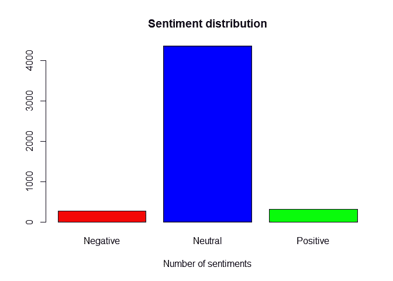
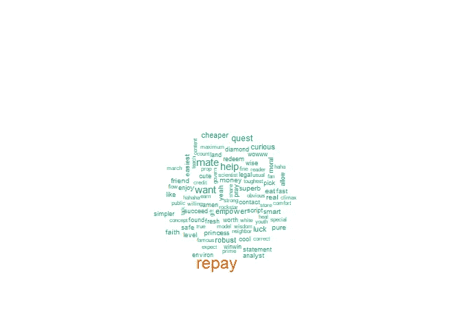
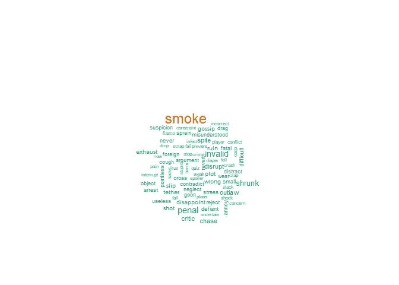
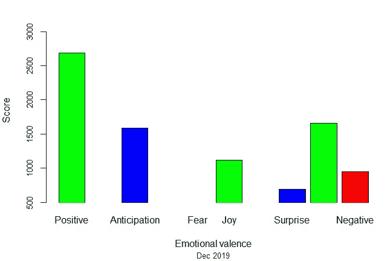

# WhatsApp 聊天的情感分析

> 原文：<https://medium.com/analytics-vidhya/sentiment-analysis-of-whatsapp-chat-a906105917f4?source=collection_archive---------8----------------------->

从挖掘推文到脸书帖子和取消在线评论，情感分析正日益影响更多满足客户需求的产品和服务的设计和交付。由于领先的编程语言中的高级包，现在做起来相对更容易。

有两种常见的文本挖掘方法，一些采用单词袋模型，而另一些则考虑单词的结构和语法。在本文中，我们将使用 r 并排查看这两种方法。

文本挖掘的主要方面是数据清洗。处理松散结构的数据需要大量的预处理来准备数据进行分析。通常，这一步会占用项目时间的 60%或更多。在我之前的一篇名为[**WhatsApp 聊天统计分析**](/whatsapp-sentiment-analysis/statistical-analysis-of-whatsapp-chats-a0c0d3c4fb53) 的文章中，我谈到了清理过程的第一阶段，这或多或少是概括的。在本文中，我将更多地讨论特定于每种分析方法的数据清理。如果你没有读过 WhatsApp 聊天的统计分析，点击 [**这里**](/whatsapp-sentiment-analysis/statistical-analysis-of-whatsapp-chats-a0c0d3c4fb53) 快速了解一下。

挖掘 WhatsApp 聊天记录的第一步是将所需的聊天记录从设备导出到文本文件中。在这种情况下，聊天是从一个由 39 名成员组成的高度参与的 WhatsApp 小组导出的。目标是使用 r 来衡量群体的情绪。将文本文件导入 RStudio 后，从数据帧中提取文本内容(目标特征)进行分析。让我们逐一考虑不同的模型。

1.词汇袋模型

这种方法考虑单词在文档中的使用频率。可以说，这里最重要的一步是数据清理。

一开始要记住的重要一点是，当您导出聊天时，它们可能包含文本、照片和视频(如果通过媒体导出),但您只需要文本正文中的单词来进行分析，因此在其他任何事情之前，需要删除以照片和视频形式发布的消息。在这种情况下，聊天是在没有媒体的情况下导出的，因此，图片和视频的帖子显示为“图像省略”或“视频省略”。因此使用下面的代码来删除这两者。

*新 _ 聊天<-聊天[！endsWith(chat$text，“略”)，]*

*我的 _text < -new_chat$text*

下一步是删除不增加意义的东西，如标点符号、空格、数字和停用词，然后将所有单词转换为小写，以避免将不同大小写的同一个单词视为不同的单词。如果您选择将所有内容都转换为大写，那也可以。在一些特殊的情况下，标点符号会被保留以保持内容的完整性，如网址，因此它们的删除应该总是针对特定的目标。例如，在这种情况下，不需要它们。停用词从内置的英语词典中映射出来(因为聊天是用英语进行的)并被删除。然后对剩余的单词进行词干分析(将具有不同结尾的相似单词转换为相同的单词，例如，loving、loved、lovers 转换为“lov”)，最后创建文档术语矩阵( [**参见完整代码**](https://frex1.github.io/Sentiments/Sentiment-Analysis.html) )。

使用内置函数来计算情绪，并将输出转换为数据帧。

*计算 _ 情感< -计算 _ 情感(人名(最终 _ 单词))*

*cal _ voices<-cbind(cal _ voices，as.data.frame(final_words))*

情感的分布可以被可视化如下:

积极的情绪

上图展示了该群体成员使用频率最高的正面词汇，其中“偿还”出现频率最高。

消极情绪

最常用的否定词集合如上图所示。“烟”显然比其他词被提及的频率更高，而且显得更醒目。

2.Syuzhet 模型

另一种分析情绪的方法是使用 Syuzhet 的算法来提取和绘制情绪轨迹。在这里，每个聊天被视为一个句子，并根据其中所有单词的总得分分配一个积极或消极的分数，称为情绪效价。有许多字典可供选择，但在这里，基于简单词典的 NRC 方法是首选。像往常一样，我们将从一些清理开始，删除 html 链接，标点符号和非字母数字字符，如表情符号。

使用这种模型，单词在包含它们的句子的上下文中被处理，并且没有必要采用我们上面看到的单词袋方法所需的一些清理技术。下面是情绪效价图的示意图。

Syuzhet 模型的支持者认为，像单词袋模型那样，孤立地、脱离作者最初使用的句子或短语的上下文来处理单词，并不能完全表达作者的情感。在这个练习中，我们可以得出结论，两个模型都表现出积极情绪多于消极情绪。在我看来，选择哪种方法应该基于你的目标。

我希望你能从这篇文章中学到一些东西。保持联系，在我下一篇关于 Twitter 情绪分析的文章中再见。

https://www.linkedin.com/in/freemangoja