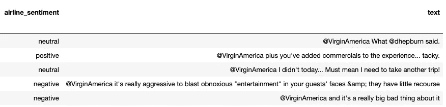
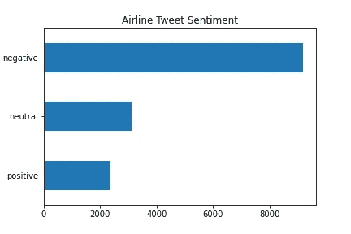
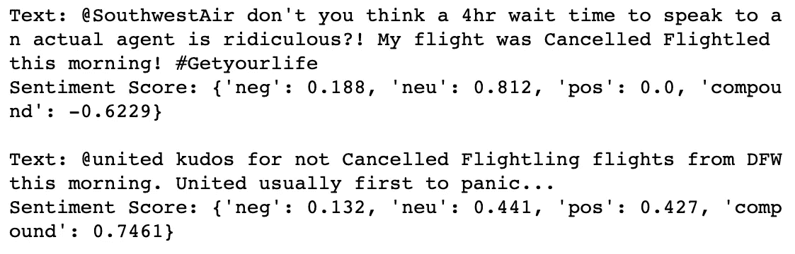
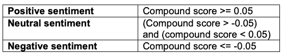
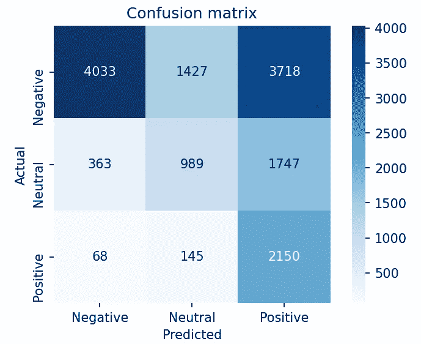
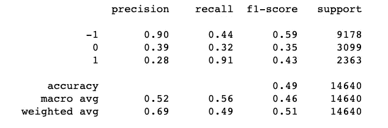
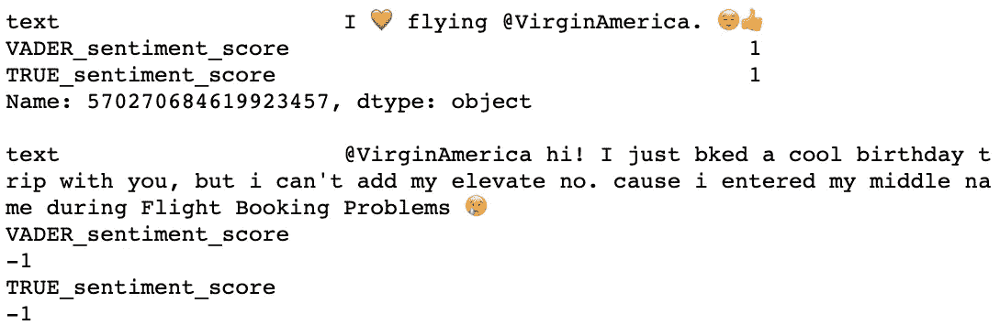
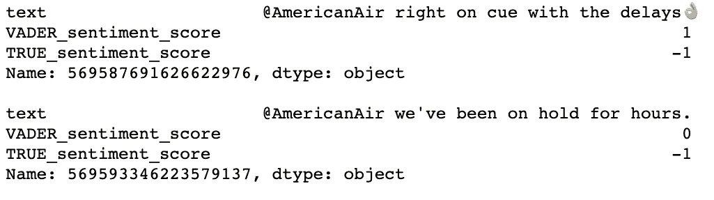

# 社交媒体和航空公司

> 原文：<https://medium.com/analytics-vidhya/sentiment-analysis-on-airline-tweets-3c2ddb97640a?source=collection_archive---------11----------------------->


*对航空公司推文的情感分析*

**简介**

截至 2019 年，Twitter 约有[1.26 亿日活用户，对于寻求接触和联系世界各地客户的企业来说，Twitter 现在是并将继续是一个有价值的平台。更具体地说，虽然 Twitter 让企业有机会直接与客户沟通以推广产品或服务，但它(更重要的是)让企业更好地了解他们的客户。Twitter 不是通过在线调查或客户投诉表格等正式渠道向企业提供反馈，而是允许用户快速表达自己的意见，通常只需几秒钟！有了这些知识，企业就可以采取具体的行动，例如继续提供受欢迎的产品和服务，解决客户的棘手问题，或调整他们的总体战略，所有这些都是为了给客户提供更大的价值和增加市场份额。](https://www.washingtonpost.com/technology/2019/02/07/twitter-reveals-its-daily-active-user-numbers-first-time/)

在这篇博文中，我将介绍航空公司如何使用 Python 和 VADER (Valence Aware 字典和情感推理器)对推文进行情感分析，以分析推文提及的态度、观点和情感。然后对分析结果进行评估(使用回忆分数),以确定 VADER 的整体表现。

# **数据集**

该项目使用的数据集名为“ [Twitter 美国航空公司情绪](https://www.kaggle.com/crowdflower/twitter-airline-sentiment)”，其中包括 Twitter 上提到的六家主要美国航空公司(联合航空、美国航空、西南航空、达美航空、全美航空和捷蓝航空)。原始数据是 2015 年 2 月从 Twitter 上刮下来的；总共有 14，640 行和 15 列数据。对于这个项目的目的，相关的功能是'推文文本'和'航空公司情绪'(由贡献者标记)。



Twitter 美国航空公司情绪数据集的前五行

在下面的图中，我们可以看到情绪的分布。负面推文 9178 条，中性推文 3099 条，正面推文 2363 条。



# **VADER——情绪分析工具**

VADER 是一个“基于词汇和规则的情绪分析工具，专门针对社交媒体中表达的情绪”。词典中的单词被评定为积极或消极，以及*它们如何*积极或消极(极性和强度)。该词典由超过 9000 个表征特征组成，每个特征的等级从“[4]非常负面”到“[4]非常正面”，允许“[0]中性”VADER 也是一个强大的工具，因为它可以识别以下内容:

*   情感符(= Smiley)
*   与情感相关的首字母缩略词(如 LOL、WTF、smh 等。)
*   具有情感价值的常用俚语(例如，nah、meh、giggly)
*   大写，增加积极和消极词汇的强度(例如，可怕的，可爱的，等等。)
*   在情感术语前修饰词语(如**真的**好、**极**糟糕等。)
*   感叹号

# 履行

***导入并初始化*** *:* 首先，我初始化了 SentimentIntensityAnalyzer 对象。

```
#test Vader Sentiment Analysis
from vaderSentiment.vaderSentiment import SentimentIntensityAnalyzeranalyser = SentimentIntensityAnalyzer()
```

***测试情感评分并检查结果:*** 接下来，我创建了一个使用 polarity_scores() 方法的函数，当应用该函数时，它会返回一组指标来帮助我们确定文本的情感。

```
def sentiment_test(text):
    test_score = analyser.polarity_scores(text)
    print('Text: ' + text)
    print('Sentiment Score: ' + str(test_score))sentiment_test(neg_test)
print()
sentiment_test(pos_test)
```



情绪测试函数的输出

调用该函数后，我们可以如下解释这些值:

*   **neg** '、 **neu** '和 **pos** ':这些标签后面的值表示属于各自类别的文本的比例，并且总和为 1(或 100%)。以上面的第一个文本(关于西南航空公司)为例，18.8%的文本被评为负面，81.2%为中性，0%为正面。
*   **复合词** ' **得分**:这个得分是词典中每个词的配价得分之和，归一化到-1(最极端的否定)和+1(最极端的肯定)之间。例如，第二个文本的复合得分 0.7461 表示非常高的正面情绪。下表显示了将文本情感分类为正面、中性或负面的标准化阈值。



文本情感分类的标准化阈值

***将函数应用于整个数据帧:*** 确认函数工作正常后，我将函数应用于数据帧中每一行的文本。

```
#Apply get_sentiment function to every row of the text columndf['VADER_sentiment_score'] = df['text'].apply(get_sentiment)
```

***评估 VADER 结果:*** 为了评估 VADER 在数据集上的整体性能，我创建了一个混淆矩阵，并使用召回作为衡量性能的指标。如下图所示，矩阵向我们展示了 VADER 对推文进行正确或错误分类的频率。在这种特殊情况下，我选择召回作为我的衡量标准，因为航空公司最有可能关心的是正确识别“负面”推文，以便他们可以解决客户问题；提醒一下，Recall 计算模型正确识别的实际值的百分比(真正值)。



困惑矩阵——VADER 情感分析



分类报告

从上面的混淆矩阵和分类报告中可以看出，尽管 VADER 在确定实际的“正面”推文(召回分数:0.91)方面表现非常好，但它在识别“负面”(召回分数:0.44)或“中性”推文(召回分数:0.32)方面做得不太好。

现在让我们来看几个例子，看看 VADER 在哪些方面表现出色，在哪些方面表现不佳！



正确的分类示例

在上面展示的两个例子中，VADER 准确地对情感进行了分类！我们还可以看到，VADER 能够使用表情符号来帮助分类。



错误分类示例

在这里，我们可以看到 VADER 错误地将“负面”推文归类为正面或中性。从观察第一个例子来看，虽然人类读者很可能会认为它们都是“负面的”，但 VADER 似乎很难识别文本的讽刺语气。在第二个例子中，也许是因为不了解整体背景/语境，VADER 不能意识到文本事实上表达的是“负面”情绪。

# 结论和下一步措施

在这篇博文中，我们看到了 VADER 是如何成为进行情感分析的强大工具的。特别是对于这个数据集，我们看到它能够识别和处理表情符号，并识别超过 90%的所有“积极”推文！然而，当涉及到正确识别“中性”和“负面”推文时，VADER 表现得并不那么好；更具体地说，我们看到它很难识别包含讽刺的负面推文，以及了解航空业的背景/背景会有所帮助的情况。

展望未来，我们可以尝试用于情感分析的其他工具包括 TextBlob 和 Stanford CoreNLP，或者基于特征的方法，如逻辑回归或支持向量机(SVM)。

*我希望你对这篇文章感兴趣，欢迎在评论中提出任何反馈或问题！*

*你也可以在这里* *找到这个项目的代码* [*。*](https://github.com/etrang/Sentiment_Analysis_Airline_Tweets/tree/master)