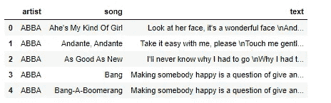
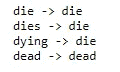
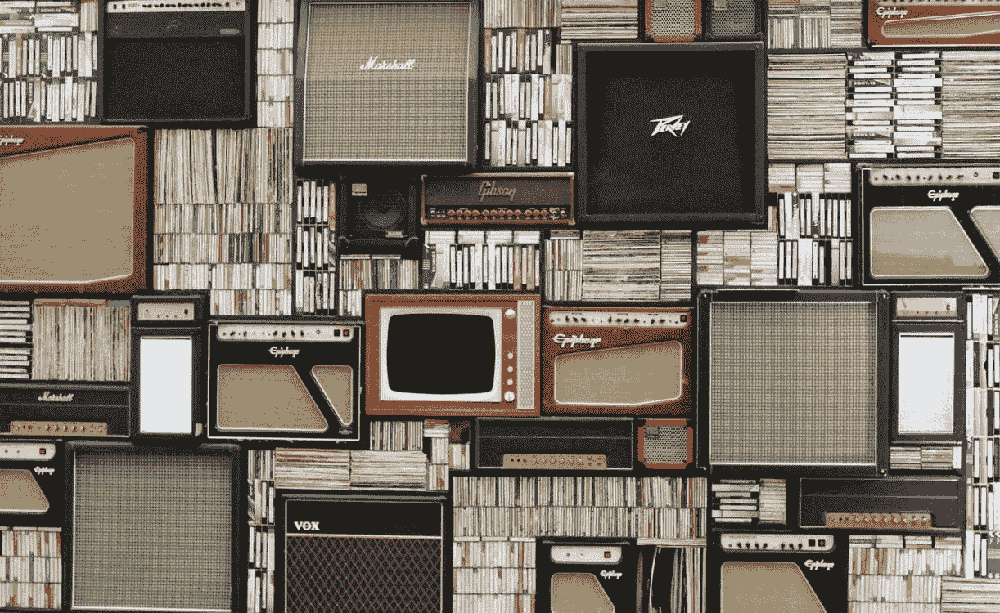
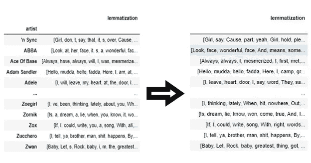
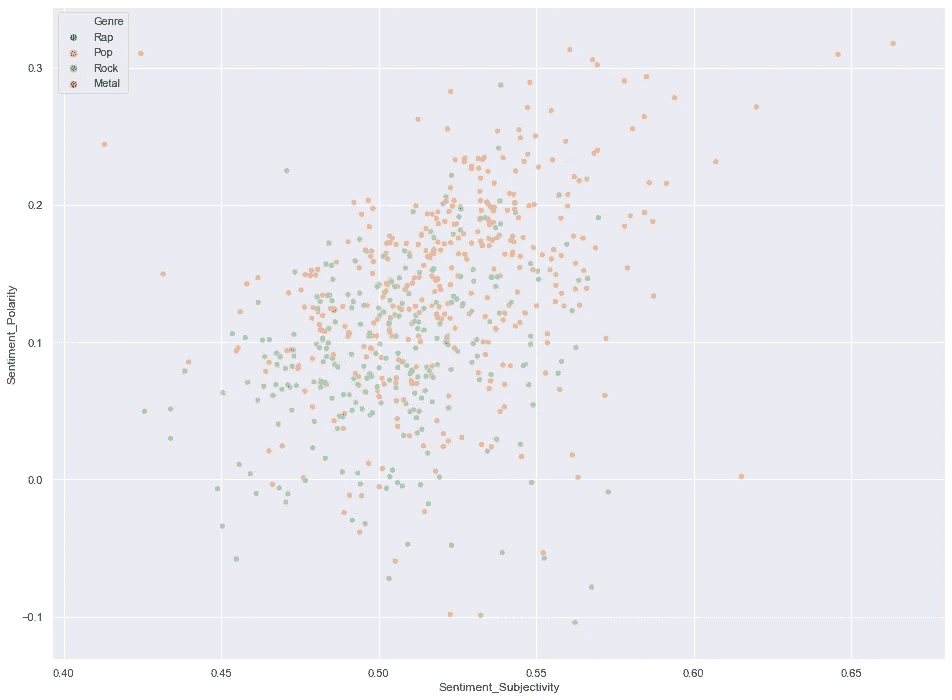

# 艺术家作品的情感分析

> 原文：<https://medium.com/analytics-vidhya/sentiment-analysis-on-artists-discographies-962c7d30a8d7?source=collection_archive---------29----------------------->

让我们从歌词中创建不同的情感得分，并查看不同聚类算法的结果。


# 目标是什么？

情感分析在过去几年里取得了令人难以置信的进步，并被业界广泛使用。在本文中，我将展示一个更基本、更有趣的情感分析，并说明对于更简单的任务，简单的模型就可以了。这个项目的想法是根据情感分析分数对艺术家的唱片集进行聚类。唱片目录是每首歌的总字数。

我们将使用一个包含大约 55，000 首歌曲的歌词数据库。数据是通过抓取从 LyricsFreak 获得的，离群值(过长或过短的歌词)已被事先移除。



图 1:初始数据集

进一步的数据清理是必要的。我删除了特殊字符，并删除了非英语歌曲。

数据准备好之后，我通过添加歌词将一位艺术家的所有歌词分组。由于艺术家的整个唱片目录歌词可能需要很长时间来执行，我从每个艺术家的唱片目录中创建了最频繁的单词列表。这样做情感分析会更快，可能更好。

这个项目和大多数 NLP 项目的一个重要部分是词干化和词汇化。词干化和词尾化的目标都是将一个词的屈折形式，有时还有派生相关形式简化为一个共同的基本形式。这里可以看到一个堵塞效应的例子:



图 2:词干



另一个重点是停用词的处理。因为我们正在做基本的情感分析，我认为去除停用词会更好地为情感评分。如果您正在使用 TF-IDF(术语频率和逆文档频率)这样的基本 NLP 技术，那么删除停用词是一个好主意，因为停用词对于这些方法来说就像噪音一样。当使用高级深度神经网络时，其目的是捕获语义，并且单词的含义取决于整个句子的上下文，那么不移除停用词就变得很重要。

在词汇化和去除停用词之后，从每个光盘目录中提取最频繁的 100 个词。最常用词的提取让我们更好地了解艺术家的总体风格。结果表格变成了每个艺术家唱片目录的过滤列表。



图 3:停用词的删除

# 有什么特点？

从单词数组中，将使用包 Texblob 计算五个不同的情感分数。这些特征是:独特的词比，主观性，极性。极性表示给定文本的积极、消极和中立。这些将使我们对乐队有所了解。

除了独特的单词比率之外，情感得分是根据艺术家的唱片目录中最常见的前 100 个单词计算的。因为一个普遍积极的乐队有时会在这里放一首民谣，这可能会降低他们的积极性得分。大多数常用词都很好地展现了乐队的风格。这些特征不需要任何标准化。

# 结论

视觉总结了在这个项目中所做的工作:



图 4:情感分析的可视化

从极性轴来看，流行歌曲平均比其他歌曲积极得多。金属歌是负面的。说唱歌曲平均来说更主观消极，这也有道理。摇滚乐到处都是。

流派的独特单词评分是:

```
Metal   -0.234930
Pop     -0.183095
Rap      0.953855
Rock     0.103337
```

说唱歌曲拥有最多的独特词汇，这并不奇怪。我期待金属歌曲有更多独特的词，但我猜他们的歌曲充满了'毁灭'和'血液'等词。也许刻板印象是真的。

总而言之，这是在一个相当大的数据库上进行的基本情感分析。这个结果看起来并不遥远，但是当然还有改进的空间，比如将更多的单词加入到每个艺术家最常用的单词列表中。

在这里查看代码并在 [Linkedin](https://www.linkedin.com/in/mertcan-coskun-08b383124/) 上联系我。

# 来源

【https://textblob.readthedocs.io/en/dev/ 

[https://](https://github.com/cjhutto/vaderSentiment)www.lyricsfreak.com