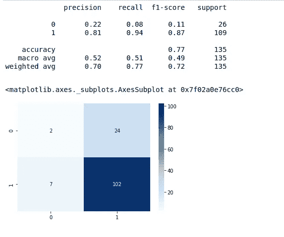

# 情感分析代表研究

> 原文：<https://medium.com/analytics-vidhya/sentiment-analysis-on-behalf-of-the-research-722e55923e2c?source=collection_archive---------20----------------------->


情绪是一种观点或意见，可以表达为一种情绪，也可以表达为对某人或某事的态度。当考虑现实世界中的社会和商业环境时，大多数人公开表达他们的想法和感受，并导致对情绪的分析。情感分析有助于确定客户对企业的满意度。针对在线对话和反馈中的文本、句子和段落进行的情感分析的更多研究已经用于检测极性。在情感分析中，极性描述了情感的方向，并基于句子中表达的情感。

此外，主观性表达个人的感受、观点或信仰。我们可以有几种极性状态，如正、负和中性。

有几种类型的情绪分析你可以遵循。

1.  基于规则的情感分析:由人类创建的定义规则，用于识别主观性或极性。这套规则与计算语言学理论相结合，将负面和正面极化词的数量考虑在内，定义情绪的负面或正面。
2.  自动情感分析:专注于基于机器学习的系统。它作为另一个分类问题被释放，并应用特征提取、训练和预测过程。
3.  混合情感分析:基于规则和自动情感分析的结合。今天大部分的研究都是通过这种技术进行的。

当考虑与情感分析相关的研究领域时，人们更倾向于玩弄情感。因此，他们倾向于分析情感的序列和传播以获得好的结果。基于方面的情感分析也是一种用于识别不同领域观点的方法。

## **基于方面的情感分析**

在当今这个竞争激烈的世界，人们越来越倾向于与技术互动。大多数人通过对特定的地方或事物提供反馈来表达他们的观点、意见或感受。由于互动频繁，很难分析社交媒体或论坛上的所有反馈。在分析情感时，它突出了人们以积极、中立或消极的方式表达观点的所有方面或特征。这就是基于方面的情感分析发挥作用的地方。

*   观点:对某一方面的积极或消极的看法。
*   方面:正在谈论的特定事物或话题。

情感分析和基于方面的情感分析的区别在于，在情感分析中它检测整个文本的情感，在基于方面的情感分析中会考虑不同方面的情感。

在体分析中，通过查看一个句子或段落中所有名词的列表，我们可以对文档有所了解。描述名词的形容词有助于清楚地理解段落。基于方面的分析可以在没有任何标记数据的情况下有效地工作，并且用于主题提取，除非句子在结构或语法上没有错误。

基于方面的情感分析被分解为两个子任务的级联:

*   特征类别检测(ACD)
*   特征类别极性(ACP)

如上所述，在情感分析中将考虑整个文本，而基于方面的情感分析理解整个上下文中具有情感价值的特定部分。这种机制非常适合分析产品评论或 youtube 评论等。所以让我们更深入地研究基于方面的情感分析(ABSA)。

博客的这一部分将解决一些读者可能会质疑基于方面的情感分析的情况。

*   如何从评论或评论中提取方面？
*   *有哪些可以和基于方面的情感分析集成的情感分析器？*
*   *如何结合深度学习模型进行基于方面的情感分析？*
*   基于方面的情感分析的未来。

**识别情绪的方面和极性**

实施例 01:

大多数人通过提供评论或反馈来表达他们对特定产品的看法，这有助于企业变得以客户为中心。以下实验是针对从 Amazon.com 抽取的产品评论进行的。


摘自 Amazon.com 的评论

在特征提取之前，通过使用正则表达式清理收集的数据。名词短语是一个词或一组词，包含名词，充当主语、宾语或介词宾语。所以在这里，名词短语被提取为特征。大多数时候，名词短语是重复的，或者有相同的单词子集。为了克服特征提取中的上述问题，执行冗余修剪和紧凑修剪。常见名词短语或最大常见名词短语中的重要术语可以被选择用于冗余修剪。下面是一些精选的名词短语。


内容的名词短语

在这里，天真的决定被用来寻找最大的普通名词短语作为非冗余特征。执行紧凑修剪的一个简单方法是检查短语中的单词，并查看字典含义是否存在。如果短语中没有字典含义的单词数量超过某个阈值，我们就删除该短语。在那个名词之后，出现频率最高的短语被选为“频繁特征集”。然后对特定特征的句子进行情感分析，得到基于特征的情感得分。对于情感分析，已经使用了文本块库。

基于方面的单词列表和相应的句子:


体貌词表和包含句

在这里，方面是基于名词短语的频率选择的，所以一些单词短语可能没有意义。但是对方面进行情感分析提供了比普通情感分析更多的信息。


方面得分和评论得分

很明显，左边的分数在方面有很大的差异。持正面观点的评论数量差异很大。分数的总数也增加了，因为评论的一个句子可能包含多个频繁特征。


基于坡向分析的点状图

点状图显示了各方面情绪的巨大差异。

示例 02:

作为名词短语，有些人使用复合词在特定的上下文中识别方面。并且还使用 vaderSentiment 进行情感分析。

```
from vaderSentiment.vaderSentiment import SentimentIntensityAnalyzer
import operatoranalyser = SentimentIntensityAnalyzer()
sentiment = []
for i in range(len(toy_rev)):
    score_dict={'pos':0,'neg':0,'neu':0}
    if len(toy_rev['aspect_keywords'][i])!=0: 
        for aspects in toy_rev['aspect_keywords'][i]:
            sent = analyser.polarity_scores(aspects)
            score_dict['neg'] += sent['neg']
            score_dict['pos'] += sent['pos']
        #score_dict['neu'] += sent['neu']
        sentiment.append(max(score_dict.items(), key=operator.itemgetter(1))[0])
    else:
        sentiment.append('NaN')
toy_rev['sentiment'] = sentiment
toy_rev.head()
```

你可以从下面看到提取的相位和极性。


基于复合名词和动词情感库的情感分析

从下面的图表来看，该方法也获得了很好的应用价值。



方面分析的得分值

**建立基于深度学习的方面模型**

已经注释和发布的数据集 Semeval-2016(任务 5)用于开发模型。选择方面类别、情感和评论作为模型方面的特征，同时使用神经网络体系结构模型作为基于方面的分类器。


数据集的特征

为了在向量中编码评论，选择了被称为词袋(BOW)的词嵌入技术。开发的神经网络模型如下所示

```
aspect_model = Sequential()
aspect_model.add(Dense(512, input_shape=(6000,), activation='relu'))
aspect_model.add((Dense(256, activation='relu')))
aspect_model.add((Dense(128, activation='relu')))
aspect_model.add(Dense(12, activation='softmax'))
#compile model
aspect_model.compile(loss='categorical_crossentropy', optimizer='Adam', metrics=['accuracy'])label_encoder = LabelEncoder()
integer_category = label_encoder.fit_transform(reviews_train.aspect_category)
encoded_y = to_categorical(integer_category)
```

提议模型的结果如下所示。


评论的方面类别


评论的情感分数

通过基于句子中的其他单词生成每个单词的表示来识别上下文单词表示。作为上下文表征的特征，预训练双向语言模型为自然语言处理的各个应用领域提供了重要的改进。此外，诸如上下文单词嵌入的高级单词表示技术已经见证了有希望的结果。[来自 Transformer 的双向编码器表示(BERT)](https://ai.googleblog.com/2018/11/open-sourcing-bert-state-of-art-pre.html) 是高级上下文单词嵌入的一个很好的例子。

你可以从下面的 github 库找到三个基于方面的情感分析的例子。

[](https://github.com/isuri97/Aspect-based-sentiment-analysis) [## isuri 97/基于方面的情感分析

### 这个知识库包含三个与基于方面的情感分析相关的样本…

github.com](https://github.com/isuri97/Aspect-based-sentiment-analysis) 

**参考文献**

*   [https://medium.com/@Intellica.AI/基于方面的情感分析-你想知道的一切-1be41572e238](/@Intellica.AI/aspect-based-sentiment-analysis-everything-you-wanted-to-know-1be41572e238) -
*   [https://towards data science . com/fine-grained-sensation-analysis-in-python-part-1-2697 bb 111 ed 4](https://towardsdatascience.com/fine-grained-sentiment-analysis-in-python-part-1-2697bb111ed4)
*   [https://medium . com/southpigalle/how-to-perform-better-情操分析-与 bert-ba127081eda](/southpigalle/how-to-perform-better-sentiment-analysis-with-bert-ba127081eda)
*   [https://towards data science . com/beginners-guide-to-Bert-for-multi-class ification-task-92f 5445 c2d 7 c](https://towardsdatascience.com/beginners-guide-to-bert-for-multi-classification-task-92f5445c2d7c)
*   [https://MC . ai/a-guide-to-simple-text-class ification-with-Bert/](https://mc.ai/a-guide-to-simple-text-classification-with-bert/)

非常感谢你阅读这篇博客。玩情绪分析…下一篇博文再见。干杯！！！！！！