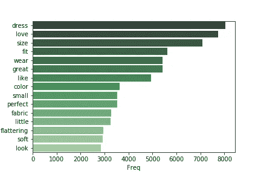
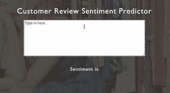

# 顾客评论的情感分析:理解自然语言处理模型

> 原文：<https://medium.com/analytics-vidhya/sentiment-analysis-on-cusomter-review-understanding-nlp-models-4d7e1f0524a?source=collection_archive---------11----------------------->

使用智能手机的女性， [@youxventures](https://unsplash.com/@youxventures)

情感分析有很多行业用例，尤其是数字经济。它可以用来监测趋势，分析产品和市场研究等。用于分析文本的技术被称为自然语言处理(NLP)，它有许多迷人的方面。

该项目旨在:

*   尽可能准确的对客户的情绪进行分类；
*   探索文本挖掘和处理的多种方式，包括 TF-IDF 和用 Word2Vec 进行文本嵌入；
*   了解每个流程的利弊。

## **数据+ EDA**

我们的数据集由来自电子商务服装网站的 23，486 条客户评论组成。除了文本之外，还有其他特征，例如评论者的年龄、项目的类别等。我们选择忽略所有的特性，因为本文只关注 NLP。因此，审查是我们关注的唯一特征。

数据示例

情绪由“评级”决定，评级从 1 到 5，5 是最有利的。我们已将目标变量转换为二进制类别，即评分为 4 和 5 的评论为“积极”，评分为 1 至 3 的评论为“不积极”。

二元变换后的评分分布

观察图表，正面评价比非正面评价多，正面 82%，非正面 18%。换句话说，无为模型通过给出正类的常数预测，可以达到 82%的准确率，这比随机猜测模型(随机猜测是正还是不正)要好得多。记住这一点有助于我们确定模型的基线性能。

在下面的文章中，我将把非正类称为负类，尽管它实际上是中性类和负类的组合。

我们还想了解客户经常使用的词是什么。

正面评价最常用的 15 个词

负面评论最常用的 15 个词

上图显示了正面评论中最常用的词，下图显示了负面评论中最常用的词。这两个图表都是通过删除过于频繁且对文本有干扰作用的单词绘制的，例如“that”、“the”、代词等。

正面评论和负面评论提取的词汇(惊人地)相似。大多数评论谈论的是尺寸、合身程度、材料、面料、颜色等，这些都与服装项目的继承属性有关。也有代表顾客情感的词，如爱和喜欢，并且(令人惊讶地)在这两个类别中都有。请注意，在我们提取单词时，像“no”和“not”这样的单词被删除了。这或许可以解释为什么喜欢和喜欢会出现在负面评价中。我们将在接下来的会议中更好地理解这一现象。

# **方法论概述**

NLP 处理的步骤

像所有数据科学项目一样，也有针对文本数据的特征选择过程。唯一的区别是，我们还需要“提取”特征，因为没有提取，文本就不适合机器学习过程。

我们将重点讨论不同的文本抽取模型的差异，包括词袋、词频—逆文档频率(TF-IDF)和文本嵌入。

对于特征选择，我们将考察三种方法:词汇化、停用词去除和潜在语义分析(LSA)。

逻辑回归，多项式朴素贝叶斯(MNB)，线性支持向量机(线性 SVC)和随机森林模型被用于这个项目。

## **一袋话**

单词袋模型建立在计数的基础上:它返回一个单词计数的矩阵，每一列映射到语料库中出现的一个唯一的单词，每一行映射到每个数据点，在我们的例子中是一个评论。

对于 NLP 初学者来说，这是一个简单易懂的模型。我们使用逻辑回归建立了我们的基线模型和单词袋模型。

预测标签与真实标签:BOW 模型

用我们的基线模型转换和预测了五个简短的评论。该模型得到了 5 个正确中 3 个，根据我们的输入给出了 60%的准确度。它不是很理想，因为它比什么都不做的模型表现得更差。

然而，单词袋模型有一些固有的缺点。特征的数量众多且难以减少。在我们的例子中，我们有超过 11，000 个来自单词包转换的特征。特别是在英语中，同一个词有多种形式。例如“is”“am”“are”本质上是同一个词。这就是为什么我们需要研究词汇化和停用词。

词汇化是一种将单词还原成原始形式的技术。在前面的例子中，“is”“am”“are”可以简化为“be”。停用字词删除旨在删除文本中出现频率过高的字词。您可以将它们视为文本数据的“噪音”。

请注意，处理文本的两种方式都会影响模型的性能。因此，不要把词汇化和停用词作为预处理流水线的一部分，而应该把它们作为调整步骤中的超参数。

在我们的模型中应用了词汇化和停用词去除之后，它并没有显著地提高性能。

## **TF-IDF**

词频逆文档频率(TF-IDF)模型是我们探索的下一个模型。它建立在单词袋模型的基础上，但有所改进。

词频是指一个词在一个文档中出现的频率，而文档频率是指该词在文档总数中出现的次数。转换后的矩阵包含每个单词的术语频率乘以逆对数文档频率的统计。

换句话说，如果一个单词在不同的文档中出现得太频繁，那么 TF-IDF 统计值往往很低。而该模型对出现在不太多文档中但对某些文档仍然重要的适度“罕见”的单词给予更多权重。

我们最好的 TF-IDF 模型是二元模型。我不打算在这里详细说明 n-grams，但你可以谷歌一下感兴趣的。对于那些不熟悉 bigram 的人，你可以把 bigram 理解为两个单词的片段。

预测标签与真实标签:TF-IDF 二元模型

与我们的第一个模型相比，新模型的精确度提高了 20%。与我们的单词袋模型相比，它可以更有效地检测负面评论。然而，我们意识到对于一个双元 TF-IDF 模型，特征的数量是众多的。在我们的例子中使用了 50，000 个特征。

这就是潜在语义分析(LSA)来拯救。LSA 技术背后的思想很简单:它以一些信息损失(“噪声”)为代价，将 TF-IDF 矩阵的有用信息压缩到较低的维度。

然后，我们将 LSA 应用于 TF-IDF 二元模型，等待奇迹发生:

预测标签对真实标签:TF-IDF 二元模型+ LSA 模型

瞧啊。现在，通过简单的逻辑回归，准确率为 100%,特征从超过 50，000 个减少到只有 300 个，不到原始特征数量的 1%。

TF-IDF 结合 LSA 给出了一个相当不错的预测，但我们觉得贪婪，以探索另一个特征提取模型。

## **文本嵌入**

如上所述，LSA 技术保留了重要的信息，同时消除了模型中的“噪声”。另一方面，文本嵌入的方式不同。这项技术将每个单词转换成一个向量。使用 SpaCy 的文本嵌入，它返回文档向量，这些向量是文档中所有单词的平均值。

让我们看看文本嵌入是否可以改进我们的模型:

预测标签与真实标签:文本嵌入模型

新模型对负面评论更敏感，预测精度不如 TF-IDF 模型理想。这一发现有点令人惊讶，因为文本嵌入模型的效果不如 TF-IDF 模型。在阅读了一些参考资料后，我们明白文本嵌入对于像我们这样的简单数据集来说可能太复杂了。对于大数据应用来说，它会工作得更好。

## **结论**

使用我们的测试示例建模结果

应用了 LSA 的 TF-IDF 似乎是我们的赢家模型，我们的测试验证分数也证实了这一点。这对我们的任务是有效的，但结果很难解释。文本嵌入也有同样的问题，这使得模型难以直观地解释。单词袋模型是所有模型中最容易理解的，但在我们的案例中不是一个有效的模型。

使用客户评论数据测试集模拟性能

使用 TF-IDF，我们在该项目中取得的最佳 F1 成绩为 0.931。F1 分数是反映模型性能的一种度量。理想模型的 F1 值为 1，最差模型为 0。

我还制作了一个应用程序，演示了这个模型使用 Flask 和 JavaScript 的能力。

烧瓶应用程序演示

最终选择的模型相当准确地检测了消费者情绪，但仍带有一些噪声。它可以通过进一步的特征处理来改善，或者通过更好的机器学习模型如深度学习模型来改善。

## **#讨论**

现在我们已经教会了计算机阅读人类评论，接下来呢？

希望你喜欢这篇文章。