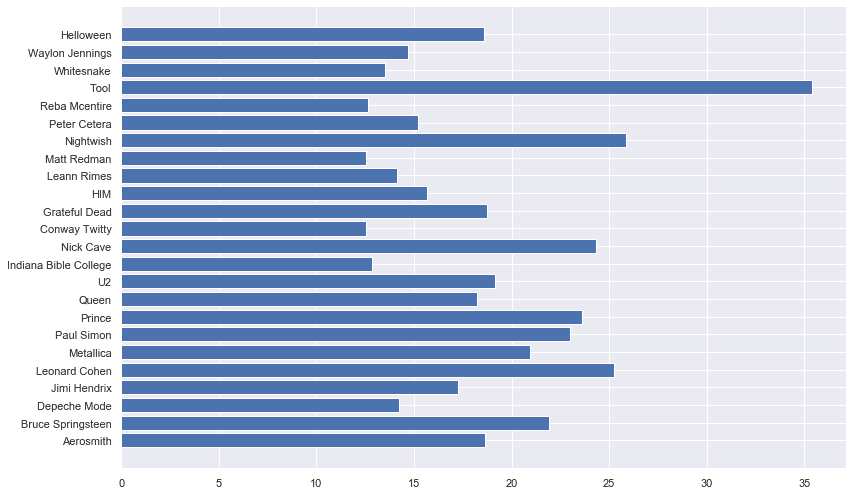
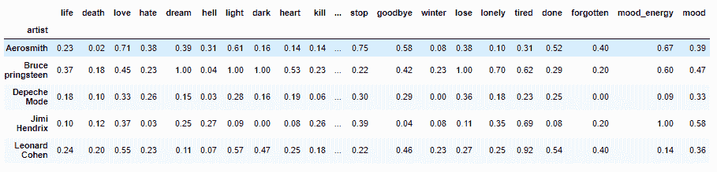
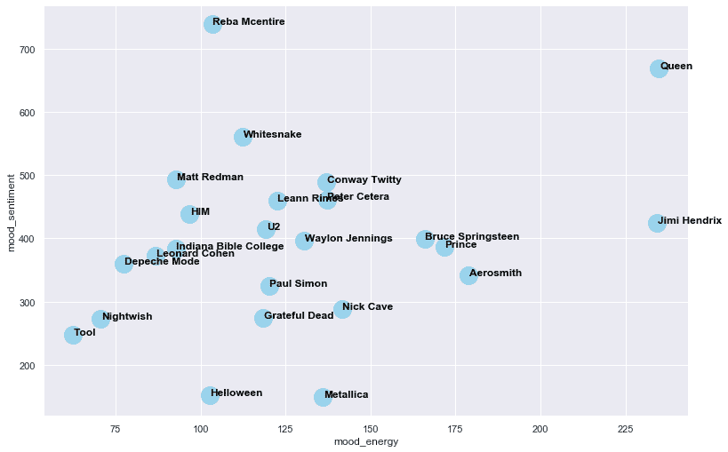

# 从零开始的唱片情感分析

> 原文：<https://medium.com/analytics-vidhya/sentiment-analysis-on-discographies-from-scratch-a877061aa541?source=collection_archive---------31----------------------->


## 我如何对一个歌词数据集进行简单的情感分析，以找出哪个艺术家有什么样的情绪


在这个项目中，我开发了一个基于每个艺术家的词频的情绪得分计算器。更简单地说，它通过将每个艺术家的正面字数除以负面字数来计算情绪得分。我还创建了我的自定义情绪得分，这样我就可以知道我现在应该听哪个艺术家。

我将在这里预处理数据，做一个探索性的数据分析(EDA)，工程特征，并找出哪个艺术家有什么样的心情。

# 数据是什么？

数据取自歌词平台 LyricsFreak。它由 5.7 万首歌词组成，主要面向主流艺术家。为了展示，我选择了 24 位艺术家和他们所有的歌曲。为了避免选择偏差，我添加了不同流派的艺术家，从流行到摇滚到爵士。举几个例子；莉安·瑞姆斯，金属乐队，皇后乐队和保罗·西蒙乐队。

数据预览显示存在哪些列:


# 我们的数据告诉我们的故事

首先，一些文本清理和其他标准的 NLP 预处理是必要的。这些任务包括:

*   正在删除“/n”
*   使用 TfidfVectorizer 做字数和频率
*   将艺术家的所有歌曲分组
*   寻找艺术家的独特作品

例如，史密斯飞船最常见和最独特的字数是:

```
Aerosmith has the most favorite words : ['yeah', 'love', 'got', 'don', 'baby', 'ain’t', 'just', 'oh', 'know', 'gotta']The number of unique words in all songs is: 3181
```

让我们为尼克·凯夫做同样的事情:

```
Nick Cave has the most favorite words : ['lord', 'praise', 'sing', 'jesus', 'glory', 'love', 'heart', 'll', 'song', 'grace']The number of unique words in all songs is: 4176
```

当然，拥有大量唱片目录的艺术家会有更大的独特字数。因此，让我们通过除以歌曲数量来标准化它，并看看哪些乐队在他们的每首歌曲中使用不同的措辞，而哪些乐队在他们的歌曲中使用相同的歌词，如“耶”、“宝贝”和“我们走”。



正如我们所见，与瑞芭·麦肯泰尔和印第安纳圣经学院等乡村艺术家相比，Tool 使用了许多独特的词汇。

所以歌词数据被清理，我们的歌曲被分组到艺术家中。我们准备好计算了。

# 创建一个函数来查找不同类型的情绪

现在，我们将创建一个基本的、有限但准确的情感分析。让我们看看如何:

1.  找到您想要计算的情绪类型

我想计算两种不同的情绪类型，能量和情绪。如果歌曲是正面的，情绪会很高，如果歌曲中有很多负面的话，情绪会很低。能量情绪的计算将遵循类似的模式，如果歌曲包含精力充沛的词，则为高，如果歌曲包含消耗能量的词，则为低。

2.找出哪些单词应该用于计算这些情绪计算。

每次计算我都想出了很多不同的词。

为感悟心情；“生”、“死”、“爱”、“恨”、“梦”、“地狱”、“破碎”和“噩梦”是为这种计算挑选的一些词。

为能量心情；“放手”、“嘿”、“哦”、“嗯”、“是啊”、“完成了”和“忘记了”是我为这次计算挑选的一些词。

3.计算这些词在艺术家整个作品中的总数。

代码:

```
for text in comb_texts:for topic in topics_energy:topic_cnt_energy[i][j] = text.count(topic)j+=1j=0i+=1
```

4.为每个单词创建列，并添加计数。

5.应用情绪和能量型情绪的公式。

对于这个公式，我创建了一个非常基本的除法，用积极或充满活力的词的总和除以消极或令人疲惫的词的总和。这是一个简单的比例，较高的分数表示充满活力或积极的歌曲。

6.创建一个最终的情绪计算，它是从之前的两个情绪中派生出来的

我们最终的数据库如下所示，包含情绪计算、艺术家和字数统计列。我对整个数据集应用了标准化，以使可视化和计算更容易阅读。作为最后一步，我为自己的口味创建了一个定制的情绪计算。其计算方法如下:

```
df['mood'] = df['mood_sentiment'] - df['mood_energy']/2
```

正如你所看到的，我正在寻找一首积极向上的歌曲，但我很累，不想要一首过于响亮或充满活力的歌曲。所以我减去了一半的能量-情绪。生成的数据集将如下所示:



现在到了最重要的视觉部分，我们将视觉化哪些艺术家有什么样的情绪得分。



我们可以看到女王既积极又有活力，而金属和摇滚乐队大多是消极的。令人惊讶的是，情绪-情绪和能量-情绪之间存在微弱的 19%的相关性。

# 确认

我们如何知道我们的模型是否运行良好？当然是通过观察每个情绪类别的最高值。所以让我们开始检查这些。

能量-情绪的最低值是工具和夜愿，它们以较慢的音乐而闻名，包括民谣和长鼓和低音部分。最高值是女王，吉米·亨德里克斯和史密斯飞船。我认为这里不需要解释。

情绪的最低值是 Metallica、Helloween 和 Tool。你能在这里找到模式吗？他们都是金属乐队，我相信你知道金属歌曲的歌词往往是消极的。最积极的艺术家是瑞芭·麦克整个儿、奎因和马特·莱德曼。他们都在歌曲中融入了积极的信息，尽管角度不同。说到 Reba Mcentire，我的定制心情首选竟然是她，所以我知道这周剩下的时间我会听什么。

# 结论

我几乎从零开始创建了一个基本的歌词情感分析。从所选的艺术家样本中，根据所选单词的频率计算出情绪得分。尽管选择的字数在 20 个左右(10 个正面，10 个负面)，但能量-情绪和情绪-情绪得分都显示了合乎逻辑的结果。

我欢迎反馈和建设性的批评。你可以在 [LinkedIn](https://www.linkedin.com/in/nurullah-sirca-2125ba62/) 上找到我。