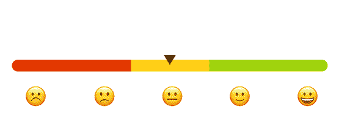
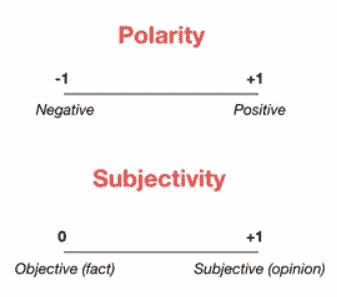
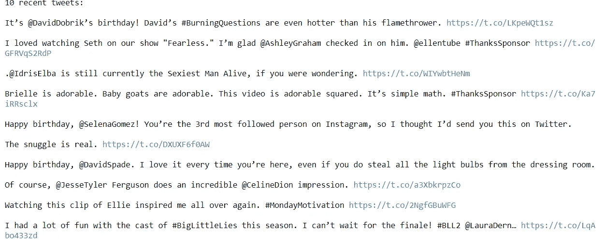
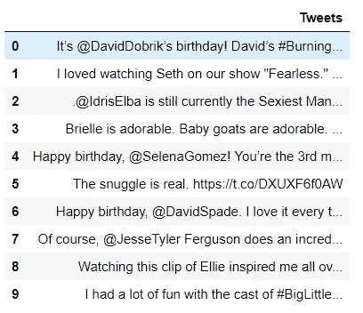
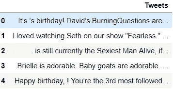
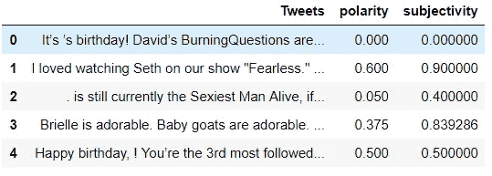
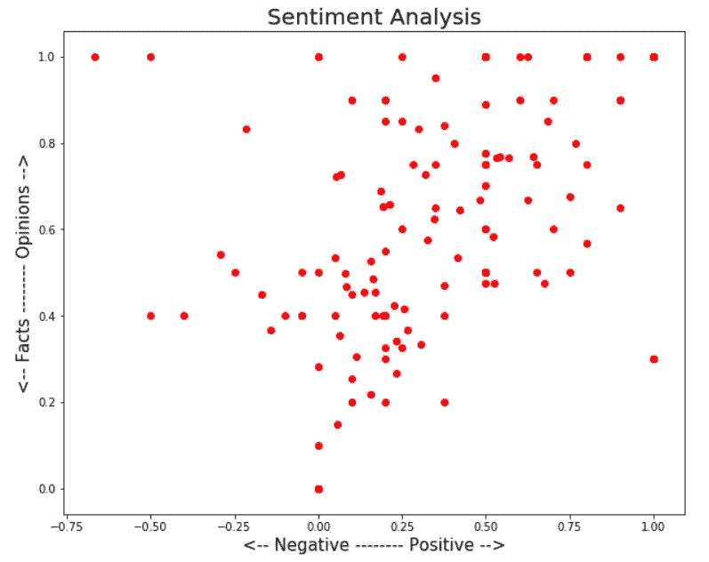
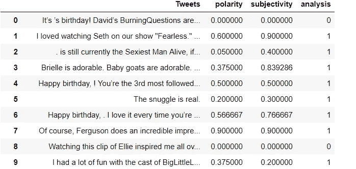
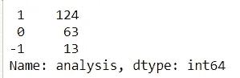
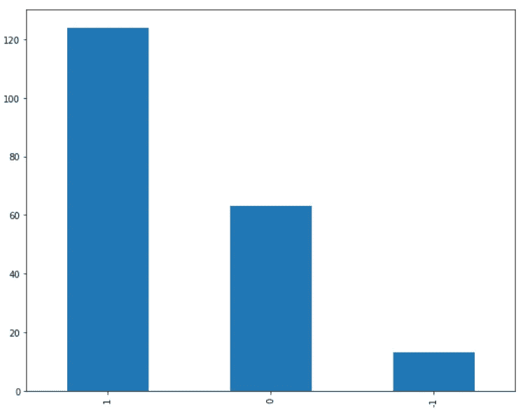

# 使用 TextBlob 对 Ellen 的 DeGeneres 推文进行情感分析

> 原文：<https://medium.com/analytics-vidhya/sentiment-analysis-on-ellens-degeneres-tweets-using-textblob-ff525ea7c30f?source=collection_archive---------0----------------------->


我们以任何一家产品公司为例。公司或其产品的成功直接取决于其客户。如果顾客喜欢他们的产品，那么这个产品就是成功的。如果不是，那么公司肯定需要通过改变来改进它的产品。

> 公司如何知道他们的产品是否成功？

为此，公司需要分析他们的客户，其中一个属性是分析客户的情绪。

## 什么是情感分析？



来源:Hackernoon

这是一个通过计算从一篇文章中识别和分类观点的过程，并检查作者对特定主题或产品的态度是积极的、消极的还是中立的。

情感分析是一个备受关注和发展的热门话题，它有很多实际的应用。在不断增长的互联网上有许多公开的和私有的数据来源。社交媒体、博客、论坛等有大量表达观点的文本。

使用情感分析，非结构化数据可以自动转换为公众对产品、服务、品牌、政治或人们可以表达意见的任何主题的意见的结构化数据。从文本数据中识别情感对于市场分析、公共关系、产品评论、净推广者评分、产品反馈和客户服务等任务非常有用。

## 输入:

文集。它是文本文档的集合，我们希望从这些文本中获得情感。例如，如果文本有 great，那么我们希望将其标记为积极的，但如果我们有一个单词或短语不太好，那么我们希望将其标记为消极的，所以我们希望保持所有原始文本的原始顺序，以便我们可以捕捉情感。

## 文本 Blob:

TextBlob 是一个构建在 nltk 之上的 Python 库。它更易于使用，并提供了一些额外的功能，如基于规则的情感评分。TextBlob 找到所有可以赋予极性和主观性的单词和短语，并对它们进行平均。更多信息可在[文档](https://textblob.readthedocs.io/en/dev/quickstart.html)中找到。

## 输出:

对于每个单词，我们将得到一个情感分数(它们有多积极/消极)和一个主观性分数(它们有多固执己见)



*   **极性**:一个词有多积极或消极。-1 是非常消极的。+1 很正。
*   主观性:一个词有多主观，或者有多固执己见。0 是事实。+1 很有意见。

*在这篇博文中，我们将使用 tweepy 提取 twitter 数据。使用 Python 中的 TextBlob 库对提取的推文进行情感分析*

## 导入必要的库

```
import pandas as pd
import numpy as np
import tweepy # to use Twitter’s API
import textblob as TextBlob # for doing sentimental analysis
import re # regex for cleaning the tweets
```

## 创建 Twitter 应用程序

为了提取推文，我们需要访问我们的 Twitter 帐户并创建一个应用程序。我们可以从[这里](https://developer.twitter.com/en/apps)得到凭证

```
# Twitter Api Credentialsconsumer_key = “Your consmer key”
consumer_secret = “Your consumer secret key”
access_token = “Your acess token”
access_token_secret = “Your access token secret”
```

创建一个访问 Twitter API 的函数

```
def twitter():
    # Creating the authentication object
    auth = tweepy.OAuthHandler(consumer_key, consumer_secret) 
    # Setting your access token and secret
    auth.set_access_token(access_token, access_token_secret) 
    # Creating the API object while passing in auth information
    api = tweepy.API(auth, wait_on_rate_limit = True)  
    return api
```

## 获取推文

我们可以使用上面的 twitter 函数创建一个' tw '对象。我们来分析一下艾伦·德杰尼勒斯的推文。一次计数是指推文的数量。打印最后十条微博。更多关于 Tweepy 的信息可以在[文档](http://docs.tweepy.org/en/latest/)中找到。

```
# Creating tw object
tw = twitter()# Extracting Ellen DeGeneres tweetssearch = tw.user_timeline(screen_name="TheEllenShow", count = 200, lang ="en")#  Printing last 10 tweetsprint("10 recent tweets:\n")
for tweets in search[:10]:
    print(tweets.text + '\n')
```



最近十条推文

## **创建数据帧**

提取推文，现在转换成数据帧

```
# Converting into dataframe (Column name Tweets)df = pd.DataFrame([tweets.text for tweets in search], columns=[‘Tweets’])
df.head(10)
```



在进行情感分析之前，让我们使用一个正则表达式函数来清理推文。创建了一个叫做 clean 的小函数。

```
# Cleaning the tweets
# Creating a function called clean. removing hyperlink, #, RT, [@mentions](http://twitter.com/mentions)def clean(x):
 x = re.sub(r’^RT[\s]+’, ‘’, x)
 x = re.sub(r’https?:\/\/.*[\r\n]*’, ‘’, x)
 x = re.sub(r’#’, ‘’, x)
 x = re.sub(r’@[A-Za-z0–9]+’, ‘’, x) 
 return xdf[‘Tweets’] = df[‘Tweets’].apply(clean)
```



# 情感分析

让我们使用 TextBlob 进行情感分析。找到极性和主观性。计算极性和主观性。

```
polarity = lambda x: TextBlob(x).sentiment.polarity
subjectivity = lambda x: TextBlob(x).sentiment.subjectivitydf[‘polarity’] = df[‘Tweets’].apply(polarity)
df[‘subjectivity’] = df[‘Tweets’].apply(subjectivity)
```



## 形象化

```
# Let’s plot the results
import matplotlib.pyplot as plt
%matplotlib inlineplt.rcParams[‘figure.figsize’] = [10, 8]for index, Tweets in enumerate(df.index):
 x = df.polarity.loc[Tweets]
 y = df.subjectivity.loc[Tweets]
 plt.scatter(x, y, color=’Red’)

plt.title(‘Sentiment Analysis’, fontsize = 20)
plt.xlabel(‘← Negative — — — — — — Positive →’, fontsize=15)
plt.ylabel(‘← Facts — — — — — — — Opinions →’, fontsize=15)plt.show()
```



我们可以看到更多的积极因素，而不是消极因素。让我们计算一下有多少条推文是正面的、负面的和中性的。

```
# Creating function for calculating positive, negative and neutral
# More than 1 --> Positive, equal to 0 --> neutral and less than 0 --> Negativedef ratio(x):
 if x > 0:
 return 1
 elif x == 0:
 return 0
 else:
 return -1df['analysis'] = df['polarity'].apply(ratio)
```



```
df['analysis'].value_counts()
```



```
# Plotting
df[‘analysis’].value_counts().plot(kind = ‘bar’)
plt.show()
```



艾伦·德杰尼勒斯无疑是著名的名人之一，人们更加积极并喜欢她的节目。

上面的情感分析是 TextBlob 使用的一个简单的分析。我们也可以通过在 Twitter 上搜索任何趋势或标签来进行分析。

感谢阅读。请继续学习，并关注更多内容！