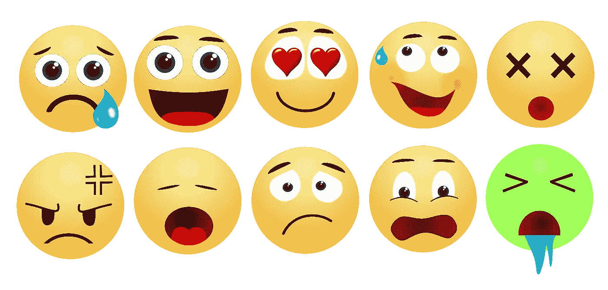
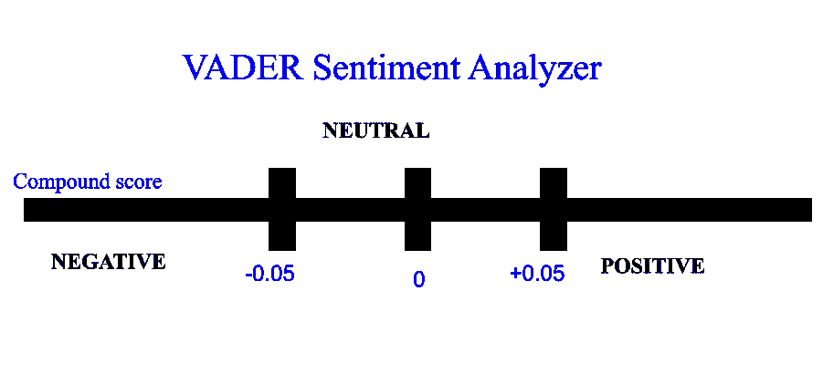
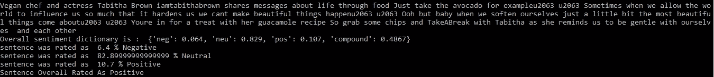
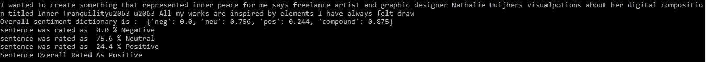

# 不到 80 行代码的 Instagram 标题情感分析。

> 原文：<https://medium.com/analytics-vidhya/sentiment-analysis-on-instagram-captions-in-under-80-lines-of-code-b429c8193a4a?source=collection_archive---------10----------------------->



[来源](https://pixabay.com/images/id-4730689/)

**情感分析**，最成功最知名的自然语言处理技术之一，非常有助于确定作者(文中引用)的情感或观点。这是判断人们情绪和情感的一种强有力的方法。许多企业广泛使用它来识别在线对话中客户对产品、品牌或服务的**情感**，并获得他们各自的反馈。

现在，每个人和他们的狗(不是开玩笑)都有 instagram 账户。twitter 上的情感分析非常普遍，而且目前被广泛使用。但是，Instagram 标题(用户在发布照片时写的文字)是获取可以挖掘和分析的文本数据的一个很好的来源。人们往往更喜欢与他们的心情或精神状态重叠的 instagram 标题。

*如果您只想访问代码，请点击* [*。*](https://github.com/niharika412/Insta_sentiment_analysis/blob/master/insta-sentiment-analysis.py)

# **使用 VADER 的情感分析**

在过去的几年中，已经引入了许多软件包来简化情感分析的实现。有关这些包的更多信息和详细的比较，请查看 neptune.ai 的这篇文章。VADER 就是这样一个例子。

**VADER** (用于**情感**推理的效价感知词典)是一个用于文本**情感分析**的模型，它对情感的极性(正/负)和强度(强度)都很敏感。 **VADER 情感分析**依赖于一个将词汇特征映射到情感强度的字典，称为**情感**分数。这是一种基于词典的算法，这意味着它计算每个词汇特征(单词)的极性。这是天真判断的完美方法，只需要作者的情感。这是非常有效的，甚至提供了词汇的极性得分。

**VADER 算法的一般规则是:**

> *如果极性得分为> 0.05，则该句为正。*
> 
> *如果极性为< 0.05，则该句为否定。*

# **安装 VADER**

VADER 情绪的安装非常简单。最常见的方法是使用 pip 进行安装。

```
> pip install vaderSentiment
```

要验证安装是否成功:

```
**from vaderSentiment.vaderSentiment import SentimentIntensityAnalyzer**
```

如果没有错误，那么你就可以走了！如果不行，就找其他方法。这里，是他们的 [Github 库](https://github.com/cjhutto/vaderSentiment)。

# **刮 Instagram 字幕**


[来源](https://unsplash.com/@benkolde?utm_source=unsplash&amp;utm_medium=referral&amp;utm_content=creditCopyText)

现在，这个过程显然只对公共帐户有效，因为只能看到他们的帐户标题。该过程以如下方式工作:

*   *从用户处获取该人的 instagram 句柄*
*   *使用 Url 打开页面*
*   *定位 instagram 标题*
*   *从页面中抓取最近的 10 个标题。*

这里使用的 python 库是 beautifulsoup。它以从 HTML 或 XML 文件中提取数据而闻名。它可以导航、存储、遍历网页来提取所需的数据。在实际抓取数据之前，检查网页的 html 组件总是一个好主意。

在确定了字段并理解了 HTML 页面的格式之后，下面的代码用于抓取数据:

用于情感分析的 Instagram 标题抓取

# **情感分析**

现在我们有了数据，可以对其进行情感分析。VADER 让这项任务变得相当容易。情感强度分析器对象被初始化，然后可以使用 VADER 可用的 polarity_scores()函数来生成单词的极性得分。

以下函数用于情感分析:

下图使复合分数(极性)更容易理解。



VADER 的工作

# 结果

当代码运行时，该程序从提到的用户名中抓取最近的 10 个 instagram 标题。

任何开放的 instagram 账号都可以选择，这里选择的是 instagram 官方账号“@instagram”。他们往往倾向于写长标题。

该程序抓取最近的字幕并进行分析。这里有一个例子:



结果实施例 1

该算法打印标题和总体情感词典，后面是句子的各个百分比。



结果实施例 2

上面的快照是字幕分析的另一个例子，但比前一个短。尽管如此，还是遵循相同的程序。

在 10 个这样的输出确定了各个字幕的情绪之后，我们可以最终将它们分组，并将正字幕指定为 1，将负字幕指定为 0。如果分组数组中的 1 多于 0，则我们的用户被称为正字幕，反之亦然。

最后，我们在程序执行结束时得到的输出如下:

> 用户处于正极侧(如果整体极性为正)

运筹学

> 用户处于负极侧(如果整体极性为负)

这个帖子只是这个小项目的概述。完整的代码可以在下面找到:

[](https://github.com/niharika412/Insta_sentiment_analysis) [## niharika 412/Insta _ 情操 _ 分析

### 🍂从 instagram 账户中抓取标题，并对其进行情感分析。该项目使用美丽的 Soup…

github.com](https://github.com/niharika412/Insta_sentiment_analysis) 

**进一步范围:**

这个模型是一个非常幼稚的模型。但是，该项目可以进一步扩展，更强大的库如 Spacy 可以用于进一步的分析。它可以用于查找可以从 Instagram 标题中使用的句子中提取的短语或单词，这些句子对应于某些情绪(开心、悲伤等)。