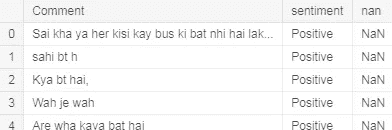
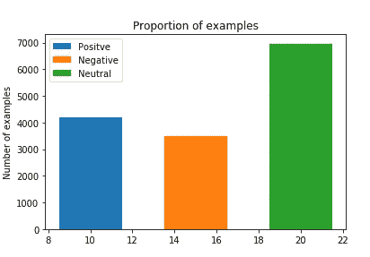
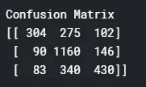
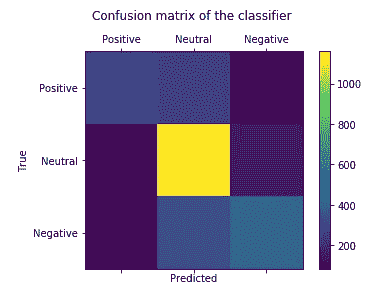

# 基于 python、sklearn 和 nltk 的罗马乌尔都语情感分析

> 原文：<https://medium.com/analytics-vidhya/sentiment-analysis-on-roman-urdu-using-python-sklearn-and-nltk-c3a279ef7748?source=collection_archive---------2----------------------->

大家好。在这篇博文中，我们将讨论如何使用 python、nltk 和 sklearn 对罗马乌尔都语进行情感分析。我们将使用机器学习技术来执行这项任务。我们将对在这里找到的数据集进行分类。

# 步骤 1:导入所有必需的模块

```
*# Importing the libraries*
import numpy as np
import matplotlib.pyplot as plt
import pandas as pd
from sklearn.utils import shuffle
from sklearn.preprocessing import LabelEncoder,OneHotEncoder
*#making corpus or words from comments*
import re
from nltk.stem.porter import PorterStemmer
import nltk
from sklearn.feature_extraction.text import CountVectorizer
from sklearn.model_selection import train_test_split
from sklearn.linear_model import LogisticRegression
from sklearn.metrics import confusion_matrix
from sklearn.metrics import accuracy_score
```

上面我们可以看到，我们已经进口的一切，我们将用于给定的任务是对罗马乌尔都语的情绪分析

# 步骤 2:导入数据集

```
dataset = pd.read_csv('Roman Urdu DataSet.csv')
```

我们已经从数据集创建了熊猫数据框架。csv 文件

# 步骤 3:让我们看看我们的数据集

```
dataset.head()
```



数据集的前五行

这个数据集包含三列，其中两列是有用的，一列是垃圾列，不会在任何地方使用

现在让我们可视化数据集

```
Pos = dataset[dataset['sentiment'] == 'Positive'].shape[0]
Neg = dataset[dataset['sentiment'] == 'Negative'].shape[0]
Neu = dataset[dataset['sentiment'] == 'Neutral'].shape[0]
*# bar plot of the 3 classes*
plt.bar(10,Pos,3, label="Positve")
plt.bar(15,Neg,3, label="Negative")
plt.bar(20,Neu,3, label="Neutral")
plt.legend()
plt.ylabel('Number of examples')
plt.title('Proportion of examples')
plt.show()
```



每个情感类别的文本数量

# 第四步:我们有分类数据形式的 y，我们需要把它转换成定量数据

```
*# label selection*
y=dataset.iloc[:,1].values
labelEnocder_y=LabelEncoder()
y=labelEnocder_y.fit_transform(y)
*# 2 postive 0 negative 1 nuetral*
```

# 步骤 5:清洁

让我们对文本进行一些清理，在下面的代码中，我们只允许使用英文字符，不允许使用特殊字符，所有的文本都被转换成小写，罗马乌尔都语的停用词被删除

```
corpus=[]
stopwords=['ai', 'ayi', 'hy', 'hai', 'main', 'ki', 'tha', 'koi', 'ko', 'sy', 'woh', 'bhi', 'aur', 'wo', 'yeh', 'rha', 'hota', 'ho', 'ga', 'ka', 'le', 'lye', 'kr', 'kar', 'lye', 'liye', 'hotay', 'waisay', 'gya', 'gaya', 'kch', 'ab', 'thy', 'thay', 'houn', 'hain', 'han', 'to', 'is', 'hi', 'jo', 'kya', 'thi', 'se', 'pe', 'phr', 'wala', 'waisay', 'us', 'na', 'ny', 'hun', 'rha', 'raha', 'ja', 'rahay', 'abi', 'uski', 'ne', 'haan', 'acha', 'nai', 'sent', 'photo', 'you', 'kafi', 'gai', 'rhy', 'kuch', 'jata', 'aye', 'ya', 'dono', 'hoa', 'aese', 'de', 'wohi', 'jati', 'jb', 'krta', 'lg', 'rahi', 'hui', 'karna', 'krna', 'gi', 'hova', 'yehi', 'jana', 'jye', 'chal', 'mil', 'tu', 'hum', 'par', 'hay', 'kis', 'sb', 'gy', 'dain', 'krny', 'tou']
for i **in** range(0,14646):
    review = re.sub('[^a-zA-Z]',' ',dataset.iloc[:,0].values[i])
    review=review.lower()
    review=review.split()
    review=[word for word **in** review if **not** word **in** stopwords]
    review=' '.join(review)
    corpus.append(review)
```

现在我们有了语料库或单词，我们需要创建一个词汇表，这是在文本步骤中完成的

# 第六步:创造词汇

```
cv=CountVectorizer(max_features=2500)
x=cv.fit_transform(corpus).toarray()
```

# 步骤 7:将数据集分成训练集和测试集

```
x_train,x_test,y_train,y_test=train_test_split(x,y,test_size=0.20)
```

在上面代码的帮助下，我们将 80%的数据用于训练，20%用于测试

# 步骤 8:创建分类器并在分类器中拟合数据

```
classifier=LogisticRegression(random_state=0,solver='liblinear',multi_class='auto')
classifier.fit(x_train,y_train)
```

我们已经创建了一个逻辑回归分类器，并在其上拟合训练数据

# 步骤 9:执行预测

```
y_pred=classifier.predict(x_test)
```

上面的代码创建了一个预测向量

# 步骤 10:创建混淆矩阵

```
cm=confusion_matrix(y_test,y_pred)
```

该矩阵显示了对每一类标签做出了多少正确和错误的预测



混淆矩阵

# 步骤 11:评估

```
print('Accuracy is **{}** '.format(accuracy_score(y_test, y_pred)))
```

我们对模型的准确性进行了评估，我们能够获得 64.6%的准确性


模型的准确性

# 免费赠送:可视化混淆矩阵

```
labels=['Positive','Neutral','Negative']
fig = plt.figure()
ax = fig.add_subplot(111)
cax = ax.matshow(cm)
plt.title('Confusion matrix of the classifier **\n**')
fig.colorbar(cax)
ax.set_xticklabels([''] + labels)
ax.set_yticklabels([''] + labels)
plt.xlabel('Predicted')
plt.ylabel('True')
plt.show()
```



混乱矩阵图

这就是今天的全部内容，如果你有任何问题，欢迎评论或给我发邮件到 owais.leghari@hotmail.com。我也在 kaggle 上运行了这个内核，你可以看看这里的

**快乐编码❤**