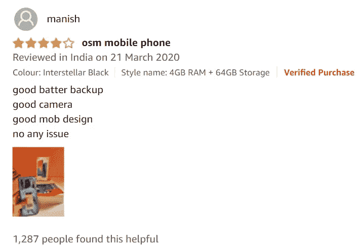
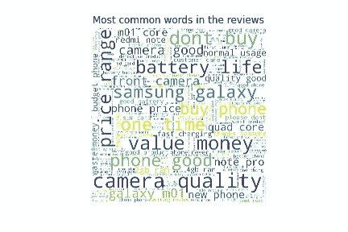
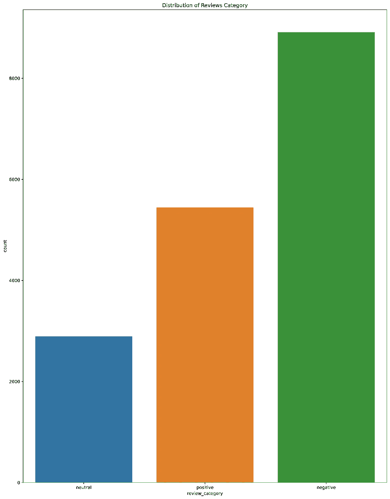
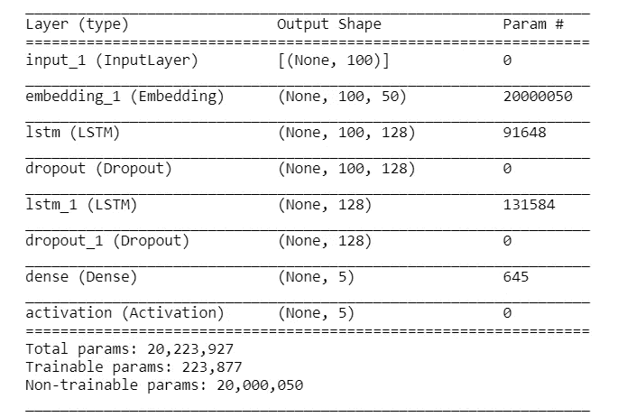
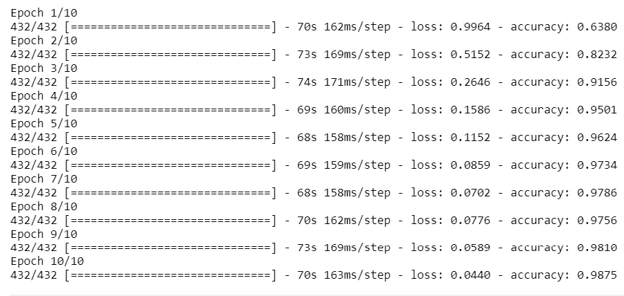
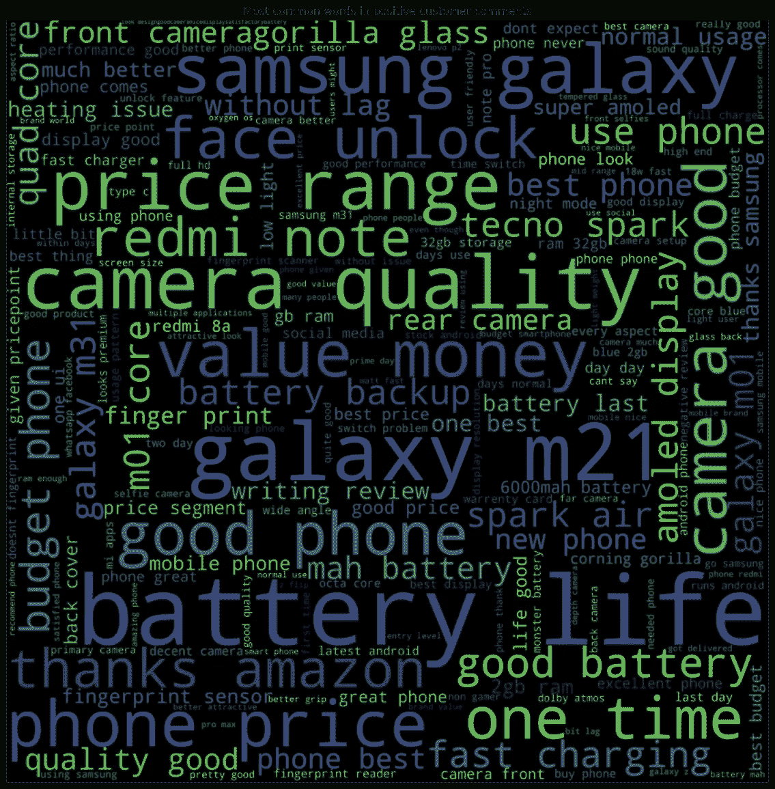
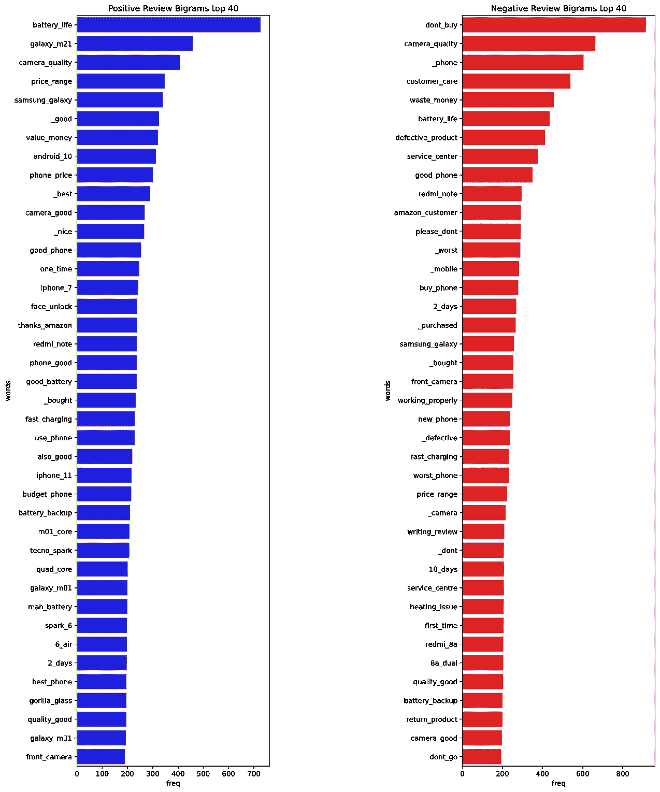

# 智能手机评论的情感分析(LSTM 模型)

> 原文：<https://medium.com/analytics-vidhya/sentiment-analysis-on-smartphones-reviews-431793d8b91a?source=collection_archive---------12----------------------->

我最近学习了 NLP，作为我深度学习课程的一部分。

因此，我决定写一篇关于智能手机评论情感分析的博客，这些评论是从[a*mazon . in*开始的，这对初学者探索 NLP 领域非常有用。](https://www.amazon.in/)

在这篇博客中，我们将使用 LSTM 模型来训练文本，这是一个多对一模型，它输入 2 个或更多的值，输出一个值。

## 内容-

1.  废弃评论
2.  预处理和 EDA
3.  训练 NLP 模型

**使用的技术** - Python、Tensorflow、Seaborn、BeautifulSoup

# **报废审核**

我用过 B [eautifulsoup](https://www.crummy.com/software/BeautifulSoup/bs4/doc/) 刮评论。

**首先，我们必须获得我们想要的所有智能手机的数量。**

[](https://www.nchannel.com/blog/amazon-asin-what-is-an-asin-number/) [## 亚马逊 ASIN:什么是 ASIN 号？

### 亚马逊使用 ASINs 来管理他们不断增长的产品目录。这些独特的产品标识符是一个重要的组成部分…

www.nchannel.com](https://www.nchannel.com/blog/amazon-asin-what-is-an-asin-number/) 

我写了一些帮助函数:

> getAmazonSearch:使用搜索查询和页码返回 HTML 页面
> 
> Searchasin:取一个 asin 号返回产品页面
> 
> SearchReviews:使用所有评论链接返回产品的评论页面

提取 ASIN 数字的函数:

```
data_asin[:5]
output:['B07SDPJ4XJ', 'B089MQ622N', 'B07X4R63DF', 'B07WPVLKPW', 'B086KCCMCP']
```

***然后，通过传递 data-asin 数字，我们将转到产品页面并获得“查看所有评论”链接。***



使用这些“查看所有评论”链接并设置页码**，我们将删除所有评论(手机名称、评论标题、正文、明星)**并将它们保存到 CSV 文件中。

现在，我们完成了报废审查。下一步是预处理和可视化信息。

[https://github . com/msiddhu/sensation-analysis _ on _ phone-reviews/blob/main/reviews-scraping . ipynb](https://github.com/msiddhu/sentiment-analysis_on_phone-reviews/blob/main/reviews-scraping.ipynb)

# 预处理和 EDA

现在，我们必须进行数据清理。

这些数据包含像 ***表情符号、数字、*常用词(是、是、为)、空格**这样的噪音。我们必须清理它们，把所有的句子转换成小写字母，这样训练就容易了。

> 示例:
> 
> **原始数据:**这个价位的三星手机不错。显示良好。相机不牛逼但一般。正常使用情况下，电池可持续使用 1 天。它有所有必要的特征。我花 8999 买了这个。这么好的 10 k 以下的手机，三星这么用了几年。
> 
> **已过滤:**好手机三星价格显示好相机牛逼平均电池续航 1 天正常使用必备功能拿到好手机 10 kas 三星去年

使用这个 filter_text()函数，我们可以清理所有的数据

让我们想象一下文本中哪些单词最常用:



由此我们可以看出，像*电池寿命、物有所值、相机质量、不要购买*这些最常用的词是决定智能手机评级的一些关键[字谜](https://en.wikipedia.org/wiki/Bigram#:~:text=A%20bigram%20or%20digram%20is,%2Dgram%20for%20n%3D2.)。

绘制评分分布图:



收视率分布

评级 1 或 2 —负面

等级 3 —中性

评级 4 或 5 —正面

[https://github . com/msiddhu/opinion-analysis _ on _ phone-reviews/blob/main/preprocess-and-EDA . ipynb](https://github.com/msiddhu/sentiment-analysis_on_phone-reviews/blob/main/preprocess-and-eda.ipynb)

# 为情感分析训练 LSTM 模型

然后下载[手套向量](https://nlp.stanford.edu/projects/glove/)，这些手套向量是在大型文本语料库上预先训练的，并提供单词-单词共现。简单地说，具有相同意思的词或提供相似结论的词具有相似的手套向量。

我们使用的是从 kaggle 下载的 50 维 GloVe vec。

[](https://www.kaggle.com/watts2/glove6b50dtxt) [## glove.6B.50d.txt

### Kaggle 是世界上最大的数据科学社区，拥有强大的工具和资源来帮助您实现您的数据…

www.kaggle.com](https://www.kaggle.com/watts2/glove6b50dtxt) 

准备步骤，

1.  读取 csv 文件
2.  将数据分为训练数据和测试数据。
3.  找到平均值。句子长度。
4.  定义超参数

现在，我们必须创建一个嵌入层来 ***将句子转换成数字向量***

函数***pretrained _ embedding _ layer，sentences _ to _ indices，read_glove_vecs*** 取自 Coursera 的[序列模型教程](https://www.coursera.org/learn/nlp-sequence-models/home/week/3)。

h1_func

> **输出:**
> 
> 善在词汇表中的索引是 164328 到 50030
> 
> 词汇表中的单词是 al-gama

以及**语句 _ 到 _ 索引**功能**、**

> **输入:**
> 
> “手机好”，
> 
> “非常糟糕”
> 
> “无星级”
> 
> **输出:**
> 
> [357266, 283483, 192973,164328.],
> 
> [377946, 65963]
> 
> [262350, 341678, 301038]

使用 keras 构建两层 ***LSTM 模型，这相对于其他框架来说非常容易。***



**文本到索引过程**

1 .转换为 numpy

2 .句子索引

3.填充序列

最后，编译并训练模型:

> model . fit(X _ train _ indexes，Y_train_oh，epochs = epochs，batch_size = batch_size，shuffle=True)



## 测试模型

乘坐火车，测试数据得到预测并打印准确率分数，[科恩卡帕分数](https://scikit-learn.org/stable/modules/generated/sklearn.metrics.cohen_kappa_score.html)。

> **输出:**
> 
> 测试科恩卡帕评分:0.993
> 
> 测试准确度得分:0.986
> 
> 训练科恩卡帕评分:0.996
> 
> 训练准确度得分:0.991

培训和测试已经结束，我们将策划一些积极的评论



正面评价 wordcloud

**常用词:** *手机价格，快充，好手机，续航* **。**

> N *注:*有些词是不应该有的比如“galaxym21，三星 galaxy，红米 note”

## 二元模型

[Bigrams](https://en.wikipedia.org/wiki/Bigram) 会给出一个非常清晰的观点，哪些相邻的词会导致不好或好的评论。



**项目链接:**

[](https://github.com/msiddhu/sentiment-analysis_on_phone-reviews) [## msiddhu/电话情感分析评论

### 基于 LSTM 模型的智能手机评论情感分析。这是从亚马逊网站上搜到的。GitHub 是……

github.com](https://github.com/msiddhu/sentiment-analysis_on_phone-reviews) 

所以，我想你已经明白我的解释了。

如果你对这篇文章有疑问，请随时联系我。

 [## 印度泰伦加纳海德拉巴 CVR 工程学院

### 查看悉达多·马拉迪在世界最大的职业社区 LinkedIn 上的个人资料。悉达多的教育是…

www.linkedin.com](https://www.linkedin.com/in/msiddhu/) [](https://github.com/msiddhu) [## msiddhu -概述

### 本科|机器学习爱好者| Android 应用程序开发人员|对竞争性编程和…

github.com](https://github.com/msiddhu) 

谢谢你