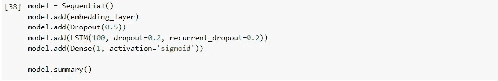

# 情绪分析:发现抑郁症早期迹象的精髓。

> 原文：<https://medium.com/analytics-vidhya/sentiment-analysis-quintessence-in-detecting-early-signs-of-depression-ed032e600fa1?source=collection_archive---------15----------------------->

> *“感情总是很难理解，但却很容易表达，这种表达可以帮助我们了解很多关于心理状态的事情”*

我们的行为和情绪是基于思维过程和精神状态，无论是沮丧、愤怒还是悲伤。我们在讨论中的观点和用词大多数时候是基于我们的情感。

通过分析情绪，人类的许多行为也可以得到理解，在某种程度上可以预测抑郁症的早期迹象。

为了进行情感分析，应该遵循以下步骤:→

因为没有程序的分析就像没有知识的工作

**数据集:-**

数据集取自斯坦福大学 edu 分校发表的研究论文。

1.  它包含 16，000，000 条(160 万条推文)，这些推文是使用 twitter.api 提取的
2.  从 0 到 4 的注释被赋予如下数据(0-负，2-中性，4-正)
3.  文本由所有推文组成。

初始化情感分析过程:→

1.  读取数据

数据中缺少某些列标签

2.定义列

“目标”是最重要的一行，因为我们将根据这些信息来区分积极、消极和中性词。

3)由于我们将处理文本，因此我们不需要行中的其他信息来进行分析→删除不必要的列，仅保留相关信息

现在只能看到目标和文本。

4)定义正负数据并存储在变量中。

5)清理数据，因为它包含特殊字符。

替换“@”

6)移除超链接和数字以及正则表达式

7)通过使用自然语言处理(nltk)使用停用词来移除文本中的(“the”、“a”、“an”、“in”)

8)拆分单词并创建列表

斯特梅尔用于减少词缀，如 loving，loved 等。只爱

9)视觉化单词

10)检查数据集分布

11)建立模型和训练测试(使用词到向量的 gensim 模型)

12)相似的词

13)令牌化器以及培训和测试

通过实施几个常见模型实现准确性

大约 96%的准确率

14)模型实现和预测

15)混淆矩阵

结论:-抑郁症可以通过更多的人重复的负面陈述来判断。

**参考文献:-**

1.  Go，a .，Bhayani，r .和 Huang，l .，2009 年。使用远程监督的推特情感分类。CS224N 项目报告，斯坦福，1(2009)，第 12 页。-[https://www-cs . Stanford . edu/people/Alec MgO/papers/Twitter distant supervision 09 . pdf](https://www-cs.stanford.edu/people/alecmgo/papers/TwitterDistantSupervision09.pdf)
2.  NLTK 停话-[https://pythonspot.com/nltk-stop-words/](https://pythonspot.com/nltk-stop-words/)
3.  马、龙、张，延庆人。(2015).使用 Word2Vec 处理大文本数据。10.1109/big data . 2015.7364114 .—[https://www . research gate . net/publication/291153115 _ Using _ word 2 vec _ to _ process _ big _ text _ data](https://www.researchgate.net/publication/291153115_Using_Word2Vec_to_process_big_text_data)