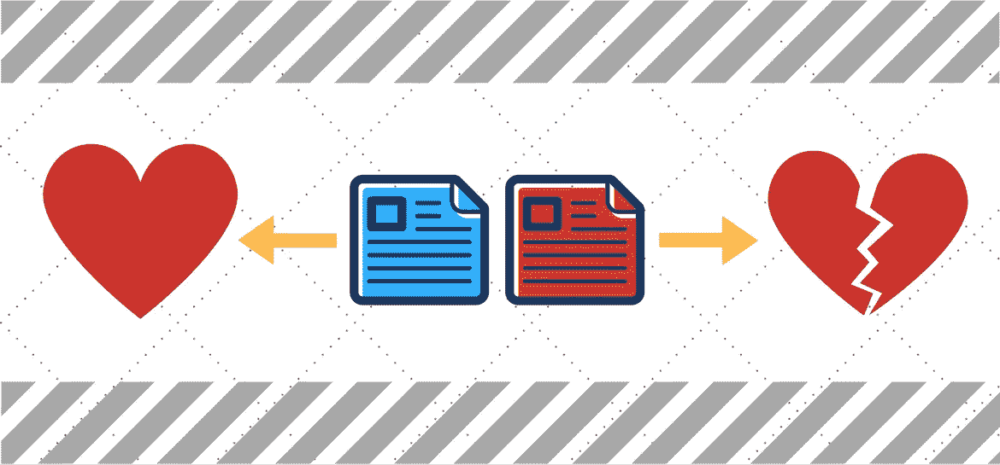
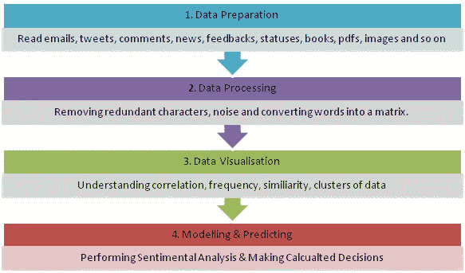
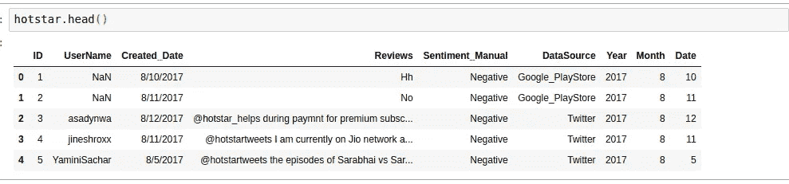
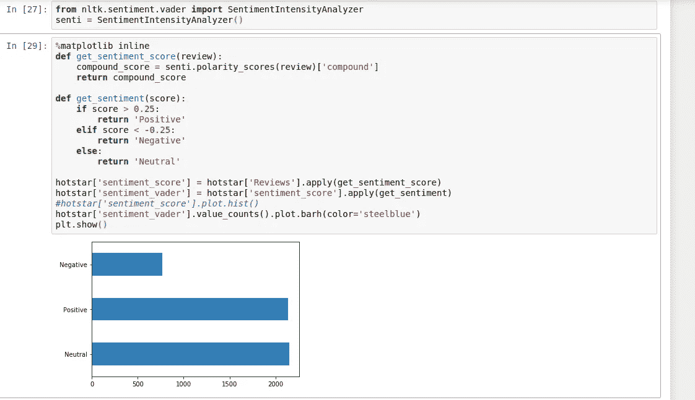
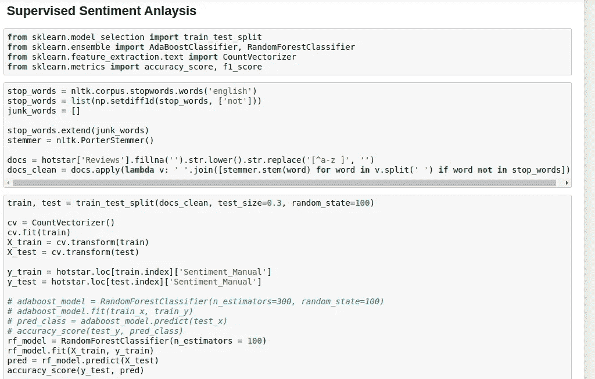

# 使用 NLTK 的情感分析。

> 原文：<https://medium.com/analytics-vidhya/sentiment-analysis-using-nltk-d520f043fc0?source=collection_archive---------10----------------------->

# 简介:

情绪分析顾名思义就是研究情绪的。顾客是否喜欢某个产品；客户是否喜欢特定的服务。总的来说，这完全是关于顾客对产品或服务的看法。

从理论和技术上来说，情感分析是指使用自然语言处理、文本分析、计算语言学和生物计量学来系统地识别、提取、量化和研究有效状态和主观信息。情感分析广泛应用于客户意见材料，如评论和调查回复、在线和社交媒体以及医疗保健材料，应用范围从营销到客户服务再到临床医学。

> 数据科学的整个过程可以归结为一个 5 点原则“DCOVA”。DCOVA 框架帮助您应用统计数据来总结和可视化业务数据，从这些数据中得出结论，对业务活动做出可靠的预测，并根据实际的统计预测做出业务决策。
> 
> d:定义，C:收集，O:组织，V:可视化，A:分析。

从评论、意见和调查中提取见解的过程被世界各地的许多组织广泛采用。它的一些用途是:

1.  一部电影有多好？
2.  新产品进展如何？
3.  即将到来的选举会有什么结果？
4.  在一个趋势性问题或政治问题上，人们有什么看法/人们会站在哪一边？

当人们评论、评论或提供反馈时，文本中的信息是无价的。我们利用这些宝贵的信息，判断评论、评论或反馈是积极的还是消极的。

# **流程:**

1.  数据准备是您收集所需数据的地方。
2.  数据处理是去除噪音和停用词的地方。基本上，您在这一步中清理数据。
3.  数据可视化是基于词频、相似性、聚类等将数据可视化。
4.  现在，我们建立了一个模型，并根据数据预测情绪，即做出经过计算的决策。

> 请参考我即将发表的关于如何从 pdf 和图像中提取数据的文章。

就像在机器学习中，甚至情感分析也有监督和非监督学习。

1.  在监督学习中，我们有一个多句子的训练语料库，已经标记为肯定或否定。我们将基于标记的数据训练我们的模型。
2.  在无监督学习中，我们没有标记为阳性或阴性的数据，而是将数据分组为簇；积极的，消极的，中立的。

> 没有数据，你只是另一个有观点的人

我们先建立一个无监督的模型。

在这个练习中，我有一个关于 hotstar 上真实客户给出的评论的数据集。

图像的概述。

**数据描述:**

用户名:客户的姓名

Created_Date:发布审核的日期。

评论:用户给出的评论。

情感 _ 手动:手动将评论标记为正面或负面。

数据源:评论的来源。

年/月/日:描述它的列名。

我们先建立一个无监督的模型。

为此，我们将从 nltk . perspective . vader 导入一个名为 SentimentIntensityAnalyzer 的包，其中 Vader 代表**价感知词典和情感推理器。**这是一款基于词典和规则的情感分析工具，专门针对情感进行调整。VADER 使用情感词典的组合，情感词典是词汇特征(例如，单词)的列表，这些词汇特征通常根据它们的语义取向被标记为正面或负面。VADER 不仅告诉我们积极和消极的分数，还告诉我们一种情绪有多积极或消极。

然后我们定义了两个函数，get _ invision _ score，其中我们使用一个叫做极性得分的东西来获得情感得分；另一个功能是 get _ perspective，我们将正面、负面和中性的评论聚集在一起，然后绘制它们。

现在，让我们在相同的数据上建立一个监督学习模型。

所以，首先我们需要清理数据。我们通过删除 NaN 值，然后将所有文本转换成小写来实现。然后，删除停用词和除英语以外的所有语言。一旦我们完成了这个，我们就可以开始构建我们的监督情绪分析器了。

我使用了一个 [RandomForestClassifier](/@anirudhpalaparthi/understanding-the-random-forest-algorithm-79b87bdde79a) (转到与单词 [RandomForestClassifier](/@anirudhpalaparthi/understanding-the-random-forest-algorithm-79b87bdde79a) 相关的链接，以了解 [RandomForestClassifier](/@anirudhpalaparthi/understanding-the-random-forest-algorithm-79b87bdde79a) )算法来构建模型。在此之前，我已经使用计数矢量器对所有文本进行了矢量化，然后将数据分为 train 和 test，再分为 X_train、X_test、y_train、y_test。

所以，这就是你如何建立一个监督和非监督的情绪分析仪。

> 数据科学的智慧只能来自失败的实验。

> 希望你在读的时候学到了一些东西，就像我在写的时候学到的一样。

我即将发表的文章:

1.  信息增益。
2.  从 pdf 和图像文件中提取文本。
3.  建立你的第一个神经网络。
4.  主题建模。

如果您对此有任何疑问，请随时联系我；要么在文章上发表私人评论，要么发邮件到我的邮箱 palaparthinbbanirudh@gmail.com。

感谢大家。祝你有美好的一天！