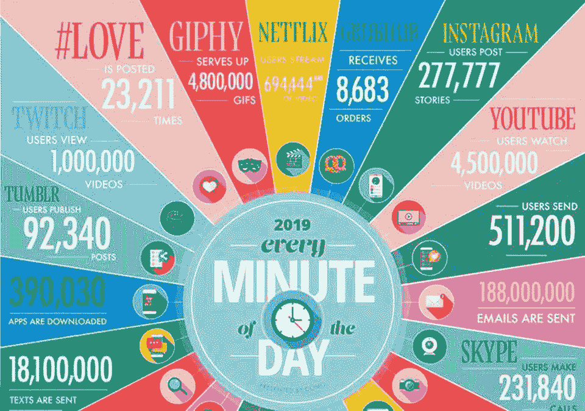
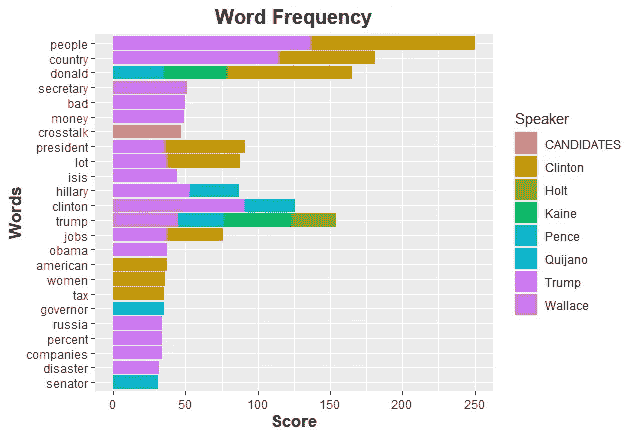
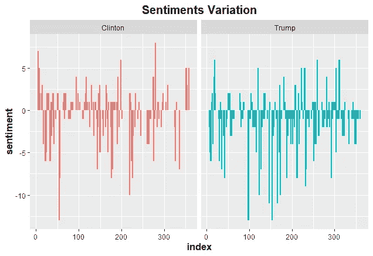
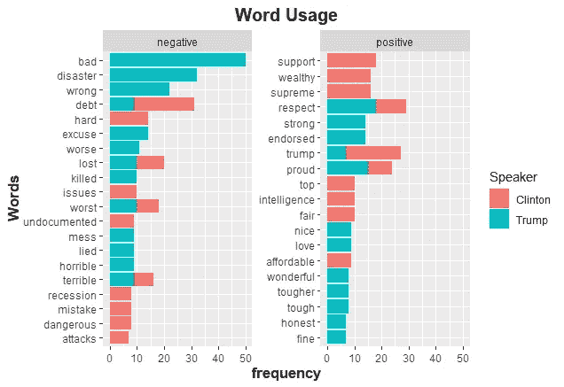
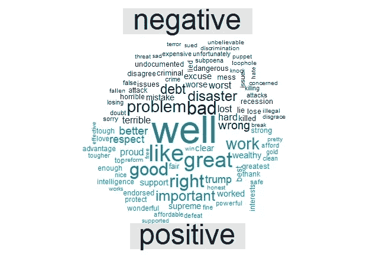

# 使用 R 的情感分析

> 原文：<https://medium.com/analytics-vidhya/sentiment-analysis-using-r-c9af723dc57d?source=collection_archive---------12----------------------->

## 2016 年美国总统辩论的简单情感分析


这是我的第一篇博文，我将亲自动手用 R 编程语言实现情感分析。

在我们深入实践之前， ***什么是情感分析？***

这是一个分析来自 pdf、网页、社交媒体帖子等文本片段的过程。去理解所表达的各种情绪。每天都有数百万条关于数吨主题的文本被发送，仅仅通过阅读每条文本、每条脸书邮报、每条推文，不可能从这些数据中提取可操作的见解。*疯了吧！*



每分钟的数据，多莫

情感分析通过为编程语言开发的算法提供了提取可操作见解的简单方法。对于 python 来说，查看一些为情感分析设计的包[这里](https://elitedatascience.com/python-nlp-libraries)。对于 R 用户，一些包包括:

*   铥
*   感觉分析
*   tidytext
*   昆特达

对于这个分析，我将使用[****tidy text****](https://cran.r-project.org/package=tidytext)**包，因为它很容易与 tidyverse 包一起实现。在这里找到使用的数据[以及 *R 脚本*](https://github.com/simmieyungie/Sentiment-Analysis)**

**安装所需的软件包**

```
**library(tidyverse)
library(tidytext)
library(wordcloud)
library(reshape2)**
```

**第一步是检查辩论中发言者的词频**

```
**debate %>% 
  group_by(Speaker) %>%
  unnest_tokens(word, Text) %>% #Tokenization 
  group_by(Speaker) %>% 
  anti_join(stop_words) %>% #remove stop words
  count(word, sort = T) %>% 
  mutate(word = str_extract(word, "[a-z]+")) %>% 
  na.omit() %>% 
  filter(n > 30) %>% #Extract words with frequencies > 20
  ggplot(., aes(reorder(word, n), n, fill = Speaker)) +
  geom_bar(stat = "identity") +
  coord_flip() +
  ylab("Score") +
  xlab("Words") + ggtitle("Word Frequency") +
  theme(plot.title = element_text(face = "bold", size = 15, hjust = 0.5),
        axis.title.x = element_text(face = "bold", size = 13),
        axis.title.y = element_text(face = "bold", size = 13))**
```

****

**演讲者的词频**

**从上面的图表来看，特朗普和克林顿比任何人都有更多的词频，所以让我们对他们多一点兴趣。让我们来看看在他们演讲的过程中情绪是如何变化的。**

```
**#Get the sentiments Variation
debate %>% 
  filter(Speaker %in% c("Trump","Clinton")) %>% 
  unnest_tokens(word, Text) %>% 
  anti_join(stop_words) %>% 
  inner_join(get_sentiments("bing")) %>% 
  count(Speaker, index = Line, sentiment) %>%
  spread(sentiment, n, fill = 0) %>%
  mutate(sentiment = positive - negative) %>% 
  ggplot(.,aes(index, sentiment, fill = Speaker)) +
           geom_col(show.legend = FALSE, width = 3) +
           facet_wrap(~Speaker, ncol = 18, scales = "free_x") +
  ggtitle("Sentiments Variation") + 
  theme(plot.title = element_text(face = "bold", size = 15, hjust = 0.5),
        axis.title.x = element_text(face = "bold", size = 13),
        axis.title.y = element_text(face = "bold", size = 13))**
```

****

**情绪变化**

**他们似乎都在演讲中使用了相当多的负面词汇，而不是正面词汇，所以让我们来比较一下演讲者对这两个词汇的使用。**

```
**#plot a comparison of postive and negative words used by participant speakers (Trump vs Clinton)
debate %>% 
  filter(Speaker %in% c("Trump","Clinton")) %>% 
  unnest_tokens(word, Text) %>% 
  anti_join(stop_words) %>% 
  inner_join(get_sentiments("bing")) %>% 
  group_by(sentiment, Speaker) %>% 
  count(word) %>% 
  top_n(10) %>% 
  ggplot(., aes(reorder(word, n), n, fill = Speaker)) +
  geom_col(show.legend = T) +
  coord_flip() +
  facet_wrap(~sentiment, scales = "free_y") +
  xlab("Words") +
  ylab("frequency") +
  ggtitle("Word Usage") +
  theme(plot.title = element_text(face = "bold", size = 15, hjust = 0.5),
        axis.title.x = element_text(face = "bold", size = 13),
        axis.title.y = element_text(face = "bold", size = 13))**
```

****

**词汇用法(特朗普 vs 克林顿)**

**最后，让我们用这些单词创建一个**单词云**,将正面和负面形象化**

```
**debate %>% 
  filter(Speaker %in% c("Trump","Clinton")) %>% 
  unnest_tokens(word, Text) %>% 
  mutate(word = gsub("problems", "problem", word)) %>% 
  inner_join(get_sentiments("bing")) %>% 
  count(word, sentiment) %>% 
  acast(word~sentiment, value.var = "n", fill = 0) %>% 
  comparison.cloud(color = c("#1b2a49", "#00909e"),
                 max.words = 100)
# Note the acast function is from the reshape2 package
# Functions such as comparison.cloud() require you to turn the data frame into a matrix with reshape2’s acast()**
```

****

**比较云**

# ****结论****

**现在您已经看到了使用 tidytext 包进行情感分析的基本实现。如果你想获得更多的见解，可以查阅由[朱莉娅·西尔格](http://juliasilge.com/)和[大卫·罗宾森](http://varianceexplained.org/) n 著的《带 R 和的文本挖掘》一书。**