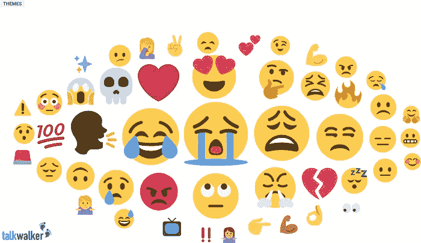
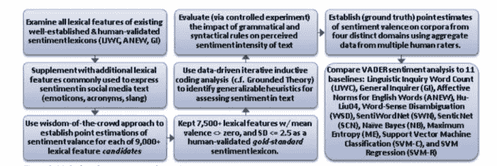
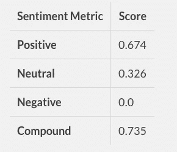
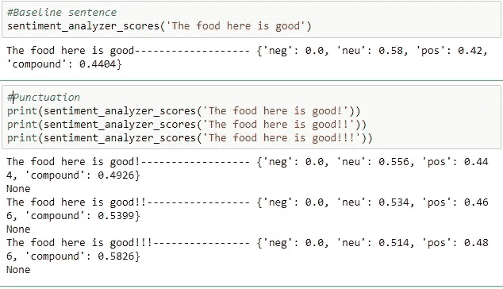
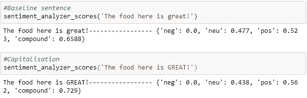
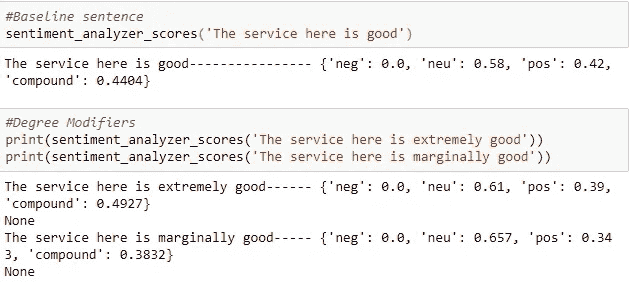
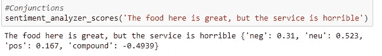

# 使用 Vader 库进行情感分析

> 原文：<https://medium.com/analytics-vidhya/sentiment-analysis-using-the-vader-library-a91a888e4afd?source=collection_archive---------6----------------------->

情绪分析是一个强大的工具，我们可以用它来评估新闻文章的感觉和人们对任何资产类别的看法，以帮助我们或我们的客户决定是否投资该资产。在这篇文章中，我将阐明一个叫做 Vader 的流行情绪分析库是如何工作的。这是维达图书馆的链接:

[https://github.com/cjhutto/vaderSentiment](https://github.com/cjhutto/vaderSentiment)

出于许多原因，2016 年美国总统大选至关重要。除了政治方面，在整个拉票期间，很多注意力都放在了分析的主要用途上。在选举期间，数百万条属于克林顿和特朗普的推特信息点被评估并归类为积极、中立或消极的感觉。评估得出的一些有趣的结果是:

-提到“@realDonaldTrump”的推文比提到“@HillaryClinton”的推文多，这表明大多数推文都是关于特朗普的。
——两个申请者的负面推文都与正面推文相匹配。
-特朗普的正面与负面推文比例高于克林顿。

这是情绪评估带来的力量，在美国大选中这一点非常明显。

# 什么是情感分析？



情感分析或观点挖掘是自然语言处理(NLP)的一个子领域，它试图定义和提取特定文本中的观点。情感分析的目的是基于文本中的计算主观性疗法来评估说话者/作者的态度、感受、评估、态度和感受。

**为什么感情分析如此重要？**

今天，企业非常依赖信息。然而，这些信息中的大部分是来自电子邮件、聊天、社交媒体、调查、日志和记录等来源的非结构化文本。来自推特和脸书的微博内容带来了严峻的挑战，不仅是因为所涉及的数据量，还因为它们用来表达情感的语言类型，即缩写形式、模因和表情符号。

从大量文本信息中筛选既困难又耗时。分析这一切也需要大量的知识和资源。简而言之，这不是一项简单的工作。

情感分析对从业者和研究人员也很有用，特别是在社会学、市场营销、广告、心理学、经济学和政治学等领域，这些领域非常依赖人机交互数据。

情绪分析允许企业通过自动化整个过程来理解信息！因此，他们可以从庞大的非结构化数据集中获得基本想法，而不必手动沉迷其中。

为什么情感分析是一项难以完成的任务？

虽然理论上看起来很容易，但事实上情感分析是一个棘手的课题。对此有许多解释:

——通过文字理解感情，并不总是那么简单。有时，甚至人们也会被误导，所以这就像是对月亮要求笔记本电脑 100%精确一样！一篇文章可以同时包含多种感情。

**例如，“这部电影背后的目的很棒，但它可能会更好，”**

上述短语包括两个极性，即积极和消极。那么我们是如何得出评价是正面还是负面的结论呢？

——在理解比喻辞格上，电脑不太顺手。比喻性语言利用词语来表达一种更复杂的意义或更强烈的影响，这种方式偏离了它们通常被接受的定义。使用明喻、隐喻、夸张等等可以称得上是一种比喻。通过一个实例，让我们更好地理解它。

“对于这部电影，我能说的最好的一点就是它很有趣。”

在这里,“有趣”这个词并不一定表示喜欢的感觉，可能会让算法感到困惑。

在 Twitter 和脸书等社交媒体文本中，大量使用带有情感价值的表情符号和俚语也使文本评估变得困难。例如，一个“:)”表示一个笑脸，通常与正面情绪有关，而另一方面，“:(”表示负面情绪。此外，首字母缩写词，如“LOL”，“OMG”和经常使用的俚语，如“Nah”，“meh”，“giggly”等。也是短语中某种情感的有力指示器。

Vader 代表“化合价感知词典和情感推理器”。这是一个基于词汇和规则的情绪分析工具，专门针对社交媒体中表达的情绪。VADER 利用情感词典的混合作为词汇特征(例如，单词)的列表，这些词汇特征通常根据它们的语义取向被标记为正面或负面。

在处理社交媒体文本、纽约时报社论、电影评论和产品评论时，VADER 被发现相当有效。这是因为 VADER 不仅告诉我们积极和消极的分数，还告诉我们一种感觉有多积极或消极。VADER 的设计师使用亚马逊的机械土耳其人获得他们的大部分分数，完整的信息可以在他们的 Github 页面上找到。



与传统的情感分析技术相比，使用 VADER VADER 有很多好处，包括:

-它在社交媒体文本上运行得非常好，但很容易推广到各种领域

-它不需要任何训练数据，而是从一个可概括的、基于化合价的、人类固化的黄金标准情感词典构建而成。

说够了！现在让我们实际看看 VADER 的评估是如何工作的，图书馆将首先安装。

**安装**

使用 pip 从[ PyPI]进行设置的最简单方法是使用命令行。查看 Github 库的综合解释。

`**> pip install vaderSentiment**`

一旦安装了 VADER，让我们调用`**SentimentIntensityAnalyser**`对象，

```
**from vaderSentiment.vaderSentiment import SentimentIntensityAnalyzeranalyser = SentimentIntensityAnalyzer()**
```

# 工作和评分

现在让我们用 VADER 来检验我们的第一个观点。我们将使用 **polarity_scores()** 方法来获取给定句子的极性指数。

```
def sentiment_analyzer_scores(sentence):
    score = analyser.polarity_scores(sentence)
    print("{:-<40} {}".format(sentence, str(score)))
```

让我们来看看 VADER 在某篇评论中的表现:

```
**sentiment_analyzer_scores("The phone is super cool.")The phone is super cool----------------- {'neg': 0.0, 'neu': 0.326, 'pos': 0.674, 'compound': 0.7351}**
```

以表格形式输入:



*   正、负和中性分数代表属于这些类别的文本的比例。这意味着我们的判决被评定为 67%肯定，33%中立，0%否定。因此所有这些加起来应该是 1。
*   复合得分是一个计算所有[词典评分](https://github.com/cjhutto/vaderSentiment/blob/master/vaderSentiment/vader_lexicon.txt?source=post_page---------------------------)总和的指标，这些评分已在-1(最负面)和+1(最正面)之间标准化。在上面的例子中，和`supercool`的词汇等级分别是`2.9`和`1.3`。复合分数结果是 `0.75` ，表示非常高的正面情绪。


阅读[此处](https://github.com/cjhutto/vaderSentiment?source=post_page---------------------------#about-the-scoring)了解 VADER 评分方法的更多详情。

VADER 主要基于某些关键点来分析情绪:

*   标点符号:感叹号的使用。)，在不修改语义指向的情况下，增加强度的大小。比如“这里的菜不错！”比“这里的食物很好吃”更强烈并且增加了**(！)**，相应增加量级。



*看总体* ***复合得分*** *如何随着感叹号的增加而增加。*

*   **大写:**在存在其他非大写单词的情况下，使用**大写字母**来强调与情感相关的单词，增加情感强度的大小。比如“这里的食物很棒！”传达比“这里的食物很棒！”更强烈的信息



*   **程度修饰语:**也称为强化词，它们通过增加或减少情感强度来影响情感强度。例如，“这里的服务非常好”比“这里的服务很好”更强烈，而“这里的服务勉强好”降低了强度。



*   **连词**:连词“but”的使用标志着情感极性的转变，连词后面的文本情感占主导地位。“这里的食物很棒，但服务很糟糕”让人喜忧参半，后半句决定了总体评分。



*   **前三元组:**通过检查情感丰富的词汇特征前的三元组，我们抓住了近 90%的否定翻转文本极性的情况。否定的句子会是“这里的食物真的没那么好”。

# 处理表情符号、俚语和表情符号。

VADER 在句子中使用表情符号、俚语和首字母缩略词方面表现得非常好。让我们看一看每一个例子。

*   **表情符号**

```
print(sentiment_analyzer_scores('I am 😄 today'))
print(sentiment_analyzer_scores('😊'))
print(sentiment_analyzer_scores('😥'))
print(sentiment_analyzer_scores('☹️'))**#Output**I am 😄 today---------------------------- {'neg': 0.0, 'neu': 0.476, 'pos': 0.524, 'compound': 0.6705}😊--------------------------------------- {'neg': 0.0, 'neu': 0.333, 'pos': 0.667, 'compound': 0.7184}😥--------------------------------------- {'neg': 0.275, 'neu': 0.268, 'pos': 0.456, 'compound': 0.3291}☹️-------------------------------------- {'neg': 0.706, 'neu': 0.294, 'pos': 0.0, 'compound': -0.34}💘--------------------------------------- {'neg': 0.0, 'neu': 1.0, 'pos': 0.0, 'compound': 0.0}
```

*   **俚语**

```
**print(sentiment_analyzer_scores("Today SUX!"))
print(sentiment_analyzer_scores("Today only kinda sux! But I'll get by, lol"))#output**Today SUX!------------------------------ {'neg': 0.779, 'neu': 0.221, 'pos': 0.0, 'compound': -0.5461}Today only kinda sux! But I'll get by, lol {'neg': 0.127, 'neu': 0.556, 'pos': 0.317, 'compound': 0.5249}
```

*   **表情符号**

```
**print(sentiment_analyzer_scores("Make sure you :) or :D today!"))**Make sure you :) or :D today!----------- {'neg': 0.0, 'neu': 0.294, 'pos': 0.706, 'compound': 0.8633}
```

现在，我们已经了解了 Vader 的一般工作原理，请看 GitHub 上的这个例子，通过分析与给定公司股票代码[https://github.com/dineshdaultani/StockPredictions](https://github.com/dineshdaultani/StockPredictions)相关的社交媒体帖子的情绪，了解它如何具体应用于股票价格预测