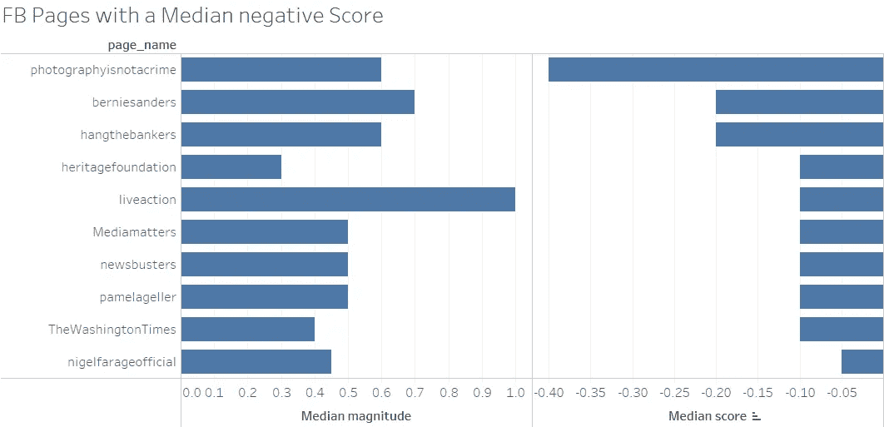
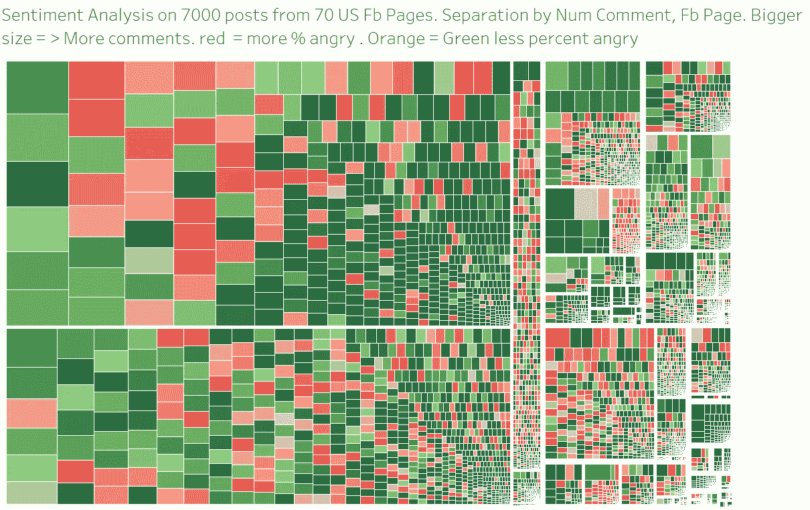

# 情绪分析——我们能从脸书的新闻报道中了解到什么？

> 原文：<https://medium.com/analytics-vidhya/sentiment-analysis-what-can-we-learn-about-what-news-outlets-post-on-facebook-93cb3e7a4c7d?source=collection_archive---------3----------------------->

# 使用我开发的爆发工具，我从 100 个美国顶级页面收集了超过 4 万篇 fb 帖子。

如果你想了解更多关于此次疫情的信息，请点击以下链接:

 [## 使用 FB API 在虚假的病毒故事传播之前检测它们

### 这是 X 部分文章的第一部分。

hackernoon.com](https://hackernoon.com/detecting-fake-viral-stories-before-they-become-viral-using-fb-api-f67a18cd4f0a) 

# 简介:

## (跳过您只想看到结果的这一步)

我决定对一部分数据进行情感分析，看看我们能从一篇帖子产生的参与度以及帖子产生的情感分析分数和幅度中学到什么。

我会假设你不知道情绪分析是什么意思，所以我会明目张胆地从维基百科抄袭，让你跟上进度。

**情感分析**(又称**观点挖掘**)是指利用[自然语言处理](https://en.wikipedia.org/wiki/Natural_language_processing)、[文本分析](https://en.wikipedia.org/wiki/Text_analytics)和[计算语言学](https://en.wikipedia.org/wiki/Computational_linguistics)对源材料中的主观信息进行识别和提取。情感分析广泛应用于评论和社交媒体的各种应用中，从[营销](https://en.wikipedia.org/wiki/Marketing)到[客户服务](https://en.wikipedia.org/wiki/Customer_relationship_management)。

一般来说，情感分析旨在确定说话者或作者对某个主题或文档的整体上下文极性的态度。态度可能是他(她)的判断或评价(参见[评价理论](https://en.wikipedia.org/wiki/Appraisal_theory))、情感状态(也就是说作者写作时的情感状态)，或者是有意的情感交流(也就是说作者希望对读者产生的情感效果)。

为了能够将情绪分析数据与其他数据进行比较，我对 wows、angries、hahas 和 loves 进行了归一化处理，并获得了百分比值。此外，对于每个帖子，我们有这个帖子产生的份额的百分比，与一个帖子产生的平均份额数相比较。

为了这个分析，我删除了不包含文本的帖子。
使用的 SQL 如下所示:

此外，对于所有数据，我将使用**中值**，而不是平均值。这是因为 Google Cloud 有时会给出任意高的量值，所以我们可以有一个量值为 20 的文档，然后平均值会因为这个异常值而高得多。

这对你来说最不重要。，但是如果你想知道中值是什么意思，可以看这个 **< <中值 Vs 均值**视频:

# 我发现了什么？

通过处理谷歌情感分析的数据，我有了一个新的洞察指标，可以用来对病毒帖子和非病毒帖子进行分类。

与一个页面发布的所有其他帖子相比，病毒式帖子的大小或得分是否不同？在这个例子中，我将病毒式帖子定义为分享量是正常页面的 10 倍的帖子。

如果唐纳德·特朗普平均每篇帖子获得 5000 股，这将只标记获得超过 50000 股的帖子。

对于一个较小的页面，每篇文章有 300 个分享，这将只标记有超过 3000 个分享的文章。你可以在这里看到来自 [8000 个 fb 帖子的数据](https://public.tableau.com/profile/publish/SentimentAnalysisoftheViralPostsonFacebook/SentimentAnalysis-Viralposts)

到目前为止，我只关注 fb 反应数据。通过使用那个+谷歌情感分析，我可以更好地理解发帖页面的意图。[你可以在这里玩下图](https://public.tableau.com/profile/baditaflorin#!/vizhome/SentimentAnalysisontopUSFBPagesusingGoogleCloudNaturalLanguageGoogleAPI/Sheet1)

# 情感分析幅度

通过按所有帖子的中值对页面进行排序，我们可以看到 [Robert Reich](https://www.facebook.com/RBReich) 获得的幅度最大，中值为 2.7，中值为 0，其次是撒玛利亚人钱包和葛培理福音派协会主席 Franklin Graham，中值为 2.6，正分为 0.4。

奥利弗·诺斯上校得到了 2.6 的中值，得分为 0

[道恩·强森](https://www.facebook.com/DwayneJohnson/)的中值为 1.9，正分为 0.2

[乌比·戈德堡](https://www.facebook.com/whoopigoldberg/)得到的震级中值为 1.8，正值为 0.6

# 得分中值为负的前 10 页。

我很惊讶地看到伯尼·桑德斯得到了比帕梅拉·盖勒或奈杰尔·法拉奇更大的负分。

FB 页面上的照片并不是犯罪，它排名第一，平均得分为-0.4

其次是**伯尼·桑德斯**，45 个帖子的中值得分为 **-0.2** 。

同样的分数，Hangthebankers FB page 从 49 篇帖子中得到了 **-0.2** 的分数。

传统基金会、LiveAction、Mediamatters、News Busters、Pamela Geller 和《华盛顿时报》得到了-0.1 的负分

> 奈杰尔·法拉奇和唐纳德·川普的得分高于《华盛顿时报》和《伯尼·桑德斯》

他的页面帖子仍然得到-0.05 的负分。

# 对页面类别应用情感分析

应用帖子类别的数据，我们可以看到**电视网**的帖子得分最高，其所有帖子的正中值**得分**为 **0.25** ，中值**幅度**为 **0.5。**

金字塔中第二等次的是**宗教组织**，一个正**分数**的 **0.25** 和一个**震级**的 **0.55** 。

第三，是类别**政府官员**，正**分数**为 **0.2** ，正**震级**为 **1.2**

# 结合谷歌情感分析和脸书反应

因为我们在谈论脸书的帖子，我们也有一个人在每个帖子上留下的情感。利用这一点，我们有一个不同类别的独特指纹。

**宗教组织**得到最多的爱。事实上，96%的反应都是爱。
**电视**网络产生了一种爱与恨的混合体
**电视节目**让人爱，让人难过，让人惊叹。

你可以在网上看到这张[图](http://tabsoft.co/2ibEBCu)

# 是谁在让人生气？

在 facebook 上让人们愤怒的最有效的类别是政党，38%的人在阅读一篇帖子后“变得愤怒”。

对于政党，我们只有一个类别的条目，民主党。如果你知道其他政党的地址，我也可以开始监控他们。让我们更细致地看看非营利组织内部。

每个非营利组织看起来都不一样。有趣的是，对于 FB 页面 Mediamatters，一个页面有 59%的反应是愤怒，谷歌情绪得分显示的得分中位数为-0.1

如果我们去看看其中的一个帖子，我们就能开始明白为什么了。

你可以在这里得到[所有页面的图表](https://public.tableau.com/profile/publish/breakdown_sentiment_analysis/Medianstatspercategory-colorangry)。

# 每页的热门分享文章。

对于每个受监控的页面，我们可以看到热门的共享帖子和情感分析。我们将在最左上方的 BreitBart fb 页面上制作一个特写。颜色代码表示帖子的得分是正(蓝色)还是负(橙色)

# BreitBart Fb 页面热门帖子的情感分析。

说到 BreitBart，我想看看这个页面上个月产生的最成功的帖子是什么，比较每个帖子的平均分享数和每个帖子产生的分享量。颜色表示 google cloud 自然语言 API 为每篇帖子分配的情感分数。

我想看看人们是否会分享更多分数为负的帖子，而不是分数为正的。

绝大多数的帖子似乎都证实了这一点，而蓝色的帖子似乎被错误分类，讽刺等等

[这是布莱巴特页面的图表](https://public.tableau.com/profile/publish/breakdown_sentiment_analysis/BreitBartFbPage-numofsharesperpostcomparedtoaveragenumberofsharesofthePage)

# 对热门评论帖子的情感分析

情绪分数为负的帖子会比情绪分数为正的帖子产生更多评论吗？

分数为负的谷歌情感分析帖子似乎在评论很多的帖子中占主导地位。

我们可以用选择 anry 的用户百分比来看同样的情况。如果我们使用 Tableau 中的默认设置，我们将无法清楚地了解数据。对于脸书反应，人们可以在 5 种不同的反应中选择，很难只有一种反应会被+50%的用户使用。

调整设置，使我们将得到一个黄色，橙色的所有职位，至少有 30%的反应是愤怒。

事实上，如果我们看看福克斯 FB 页面，我们会发现评论数量最多的参与度帖子是那些让一个人生气的帖子。

随着评论数量的下降，对该帖子感到愤怒的人的比例也在下降。

# 让人生气有助于你获得更多评论，但不会获得更多份额。

在大多数情况下，如果你让别人生气，并不意味着你会得到很多股份。

对于某些页面，这是可行的。Fb 页面**共和党人是白痴**当他们让人们愤怒的时候获得了最好的点击率(下图右上角。)

帕梅拉·盖勒是另一个例子。但是后来我看了她的页面，我看到仇恨是她页面的默认状态。

# 《华盛顿时报》上是什么让人们愤怒？

如果我们对文本进行情感分析，我们会发现让人们最愤怒的文本并不符合这种模式。

文本的大小也是如此。

我们看到的是分数和震级之间的相关性，显示在下面的绝对值中。

感谢你阅读这篇文章。我的名字是弗洛林·巴蒂塔，2018 年福布斯 30 under 30 法律与政策类别，2018 年欧洲年度人物，仅次于法国总统马克龙。

我是罗马尼亚最大的公民团体之一“腐败杀戮”的创始人，该团体拥有超过 135，000 人的社区，我们在那里开展公民教育并促进抗议活动的组织。我们促成的最大一次抗议有超过 50 万人走上街头。

Tedx 扬声器

2018 年，我在布加勒斯特创建了一个 300 平方米的[活动家之家](https://www.facebook.com/CasaActivistului)，我们在那里进行公民教育、培训、研讨会、公民黑客马拉松

 [## [视频]活动家之家历史解说(casa activistului istoric)

### 关于活动家之家的罗马尼亚视频](https://drive.google.com/file/d/1hmErUDd2mTpgR6LY2DwCslDAfjdt4I4r/view?usp=sharing) 

过去做过的其他事情:

*   开发一个工具，在**可能的虚假病毒新闻传播之前检测它们。**

 [## 爆发——自动检测虚假病毒新闻。

### 两周前，我在 medium 上发表了这篇文章，内容是关于我们如何使用病毒爆发这一工具来检测虚假的病毒新闻…

hackernoon.com](https://hackernoon.com/the-outbreak-detecting-fake-viral-news-automatically-3acded3a97cb) 

*   **结合脸书的反应和情感分析，创建一个帖子、一个页面的情感指纹**

 [## 使用谷歌情感分析了解脸书的反应

### 如果你不知道什么是情绪分析，你可以在这里阅读 Matt Kiser 写的一篇文章:

medium.com](/google-cloud/understanding-facebook-reactions-using-sentiment-analysis-f17b6e561ff3) 

*   下载罗马尼亚**排名前 12.000 的 FB 页面**的所有公开帖子。到目前为止已经下载了 1900 万个帖子。请看这里的一个用例，[分析抗议趋势。](https://www.slideshare.net/baditaflorin/point-conference-2017-romanian-protests-florin-badita)

 [## Python 导入语句中的命名约定。使用 Github 数据库转储的 BigQuery 冒险。

### 6 月，费利佩·霍法发表了一篇描述谷歌和 GitHub 合作关系的文章，允许你查询…

medium.com](/google-cloud/naming-conventions-in-python-import-statements-a-bigquery-adventure-using-the-github-db-dump-d900159ab680) 

创建开放的图形发布标准

 [## 改变出版世界——创建开放的图表标准

### 通过将这种上下文信息作为元数据添加到一篇文章中，我们将创建一个全球图表…

medium.com](/@baditaflorin/changing-the-world-of-publishing-creating-a-open-graph-standard-7fd3191038c6) 

可用于与数据采集、数据清理、数据可视化、地图相关的远程工作。

)(...)(...)(...)(...)(...)(...)(...)(...)(...)(...)(...)(...)(...)(...)(...)(...)(...)(...)(...)(...)(...)(...)(...)(...)(...)(...)(...)(...)(...)(...)(...)(...)(...)(...)(...)(...)(...)(...)(...)(...)(...)(...)(...)(...)(...)(...)(...)(...)(...)(...)(...)(...)(...)(...)(...)(...)(...)(...)(...)(...)(...)(...)(...)(...)(...)(...)(...)(......(...)(...)(...)(...)(...)(......(...)(...)(...)(...)(...)(...)(...)(...)(...)(...)(...)(...)(...)(...)(...)(...)(...)(...)(...)(...)(...)(...)(...)(...)(...)(