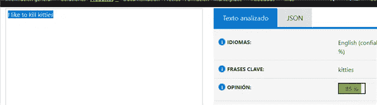
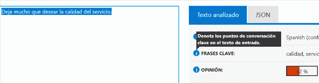

# 用于情感分析的人工智能

> 原文：<https://medium.com/analytics-vidhya/sentiment-analysis-with-artificial-intelligence-89d87b900b99?source=collection_archive---------9----------------------->

## 如果“我喜欢杀小猫”，会是正面的吗？


福斯托·加西亚在 [Unsplash](https://unsplash.com?utm_source=medium&utm_medium=referral) 上拍摄的照片

## 人工智能(AI)服务概述

AI 服务通常处理类似人类的输入(自然语言文本、图像或声音),并返回对这种类似人类的输入的可串行化分析。输出通常是 JSON 流。这不会是一个非常技术性的帖子，但这是关于程序如何管理人工智能服务的一般综述:

我们必须订阅服务，获得 API 密钥和 API URL。有了这些凭证，您的程序就可以访问该服务。

*   以类似人类的输入(自然语言文本)为例。
*   用这个输入组装一个 HTTP 请求到 AI 服务。
*   接收 JSON 响应并处理数据，进行检查或将数据存储在数据库中。
*   最终目的是批量处理这一过程，以分析大量文本。

在这篇帖子里可以看到一个 AI API 调用的例子:[https://community . dynamics . com/nav/b/conceptsindailynavision work/archive/2019/02/17/cognitive-entity-API-services-with-al-did-you-mean](https://community.dynamics.com/nav/b/conceptsindailynavisionwork/archive/2019/02/17/cognitive-entity-api-services-with-al-did-you-mean)。

## 情感分析

情感分析是一种人工智能服务，它从自然语言文本中提取情感状态。所以，输入的是自然文本“我不喜欢喝茶”，返回这个 JSON:

```
{“sentiment”: {“document”: {“score”: -0.562822,“label”: “negative”}}}
```

输出采用以下值之一:负、正或中性。

一个常见的用例是根据用户的意见分析品牌(公司、商品)认知。基本上，我们从作者的角度得到一个观点分析。

## 服务供应商

有公司提供 API 情绪分析服务。这是一个新人(vietas)的个人概述:

微软:我喜欢它的简洁。对开发者非常友好。我们可以在链接[https://azure . Microsoft . com/es-es/services/cognitive-services/text-analytics/](https://azure.microsoft.com/es-es/services/cognitive-services/text-analytics/)中做一个手动演示。

谷歌:我喜欢它非常深入的分析能力，即使是在西班牙语中:获得文体上的细微差别和迂回曲折，相信西班牙语不是一件容易的工作。你在[https://cloud.google.com/natural-language/?hl=es](https://cloud.google.com/natural-language/?hl=es)玩这个

## 情绪分析悖论。棘手的教派

我喜欢用奇怪的文本或图像来测试这些服务，以了解更多关于它的行为。因此，让我们进入微软，键入以下文本:



正输出(意见绿色和 85 %是非常积极的)可能是疯狂的许多人之前谈到这一点，他们觉得这像是一个糟糕的工具性能。这个帖子的想法始于一个被深深震撼的人告诉我这件事。

但我们讨论的是情绪分析，而不是道德或精神分析。这个行为没有好坏之分，它是关于作者的(在这个例子中是疯狂的)感觉，他喜欢做一些事情。我认为在品牌认知处理中，这是正确的分析方法。

如果我们使用情感分析的另一个名字:观点挖掘，这就很有意义了。“观点挖掘”比“情感分析”更准确，也更容易混淆。

## 西班牙微妙的表达

这些服务每天都在改进。如果我用西班牙语键入“Deja mucho que desear la calidad del servicio”，我的意思是“缺乏服务质量”，但这是一种微妙的方式。许多周前，Cognitive 不理解这种拐弯抹角的说法，并把它察觉为积极的意见，集中在“优质服务”的字眼上。

你现在只能相信我，因为现在如果我再次输入这个，它会检测出这是一个负面的观点。所以，我们不断改进它的知识库:



[人工智能](https://community.dynamics.com/nav/b/conceptsindailynavisionwork/archive/tags/Artificial+Intelligence)